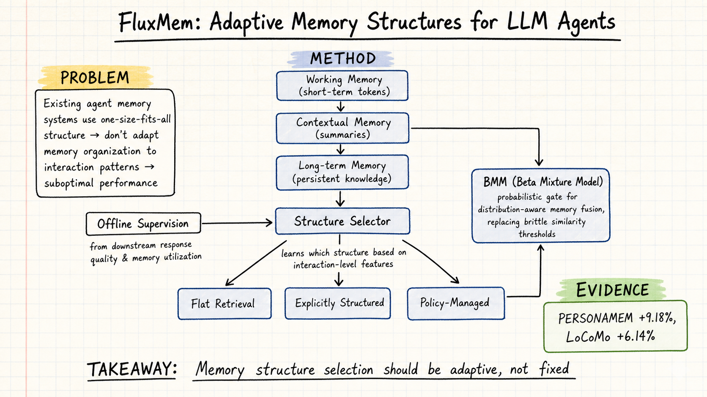

# Agent Memory — 2026-05-16

## 1. Choosing How to Remember: Adaptive Memory Structures for LLM Agents

- **arXiv**: 2602.14038
- **Authors**: Mingfei Lu, Mengjia Wu, Feng Liu, Jiawei Xu, Weikai Li, Haoyang Wang, Zhengdong Hu, Ying Ding, Yizhou Sun, Jie Lu, Yi Zhang
- **Link**: https://arxiv.org/abs/2602.14038

### 這篇在說什麼

目前 LLM agent 的記憶系統有一個根本問題：它們都用同一種記憶結構（one-size-fits-all）。不管對話是簡短的問答還是漫長的多輪交互，不管使用者是在聊閒天還是在做複雜的推理任務，現有系統都給同樣的記憶組織方式。這篇論文提出的 FluxMem 認為：記憶結構的選擇本身應該是一個根據互動特徵自適應決策的過程——就像人類在不同情境下用不同方式記東西一樣。

### 主要貢獻

1. **自適應記憶結構選擇**：FluxMem 不是只提供一種記憶結構，而是配備多種互補的記憶結構（flat retrieval、explicitly structured、policy-managed），並透過學習機制根據互動層級特徵來選擇最適合的結構。這是對現有「固定記憶架構」的根本性挑戰。

2. **三層記憶層級**：引入了 working memory（短期活躍）、contextual memory（摘要整合）、long-term memory（持久存儲）三層架構，取代了傳統的 flat memory store。

3. **Beta Mixture Model 機率閘門**：用 Beta Mixture Model 做分布感知的記憶融合（distribution-aware memory fusion），取代了脆弱的相似度閾值方法。這意味著記憶的合併不再依賴「相似度超過某個閾值就合併」這種硬規則，而是根據記憶的分布特性做更穩健的融合決策。

4. **離線監督學習**：記憶結構選擇的監督信號來自下游回應品質和記憶利用率，不是靠人工標注，而是讓模型自己學到「哪種互動模式適合用哪種記憶結構」。

### 方法 / pipeline

FluxMem 的架構可以分成三個核心模組：

1. **記憶結構池**：提供多種互補的記憶結構，每種有不同的組織方式和檢索策略：
   - Flat retrieval：用相似度搜尋的扁平記憶庫
   - Explicitly structured：有明確連結關係的圖/筆記式記憶
   - Policy-managed：透過高層控制機制（如 RL controller、OS-inspired decay）管理

2. **結構選擇器**：根據互動特徵（例如對話長度、話題轉換頻率、資訊密度等）學習選擇最適合的記憶結構。訓練信號來自兩方面：(a) 下游回應品質（用自動化指標衡量）；(b) 記憶利用率（有多少存入的記憶實際被檢索使用）。

3. **三層記憶層級 + Beta Mixture Model 融合**：
   - Working memory：最近幾輪對話的原始 token
   - Contextual memory：摘要和整合後的中層表示
   - Long-term memory：持久化存儲的知識和經驗
   - 層間融合用 Beta Mixture Model 做機率性決策，而非硬閾值

### 實驗設計

- **Benchmark**：PERSONAMEM 和 LoCoMo，兩個長對話記憶基準測試
- **主要結果**：
  - PERSONAMEM 上平均提升 9.18%
  - LoCoMo 上平均提升 6.14%
- **Baseline**：和固定記憶結構的系統（如 A-MEM、MemoryBank 等）比較
- **Ablation**：需要看完整論文確認每個組件（結構選擇器、三層架構、BMM 融合）的獨立貢獻
- 限制：目前從 abstract 能確認整體架構和兩個 benchmark 的數字，但不同互動模式下結構選擇的具體分佈、ablation 細節、計算成本等需要看完整論文

### かに讀後判斷

這篇是 agent memory 領域一個重要的方向性轉變——從「哪種記憶結構最好」轉向「應該根據情境選擇不同記憶結構」。和之前讀過的 A-MEM（2502.12110，將記憶操作當作工具使用）以及 Agentic Memory（2601.01885，Zettelkasten 式互聯記憶）相比，FluxMem 的獨特之處在於：它不只是設計一種更好的記憶結構，而是讓模型學會「在什麼時候用什麼記憶結構」。

和 A-MEM 的關係：A-MEM 讓 agent 自己決定何時存取/更新記憶，但用的是單一架構；FluxMem 在此基礎上加入了「結構選擇」這個新的決策維度。和 Memory for Autonomous LLM Agents（2603.07670，survey）的關係：survey 中提到的五大機制家族（壓縮、檢索增強、反思、分層虛擬上下文、策略學習管理），FluxMem 實際上跨越了其中多個——它的結構選擇器屬於策略學習管理，三層架構屬於分層，BMM 融合屬於檢索增強。

值得 Morris 點開深讀，優先看：(1) 不同互動模式下結構選擇的分佈圖；(2) BMM 融合 vs. 硬閾值的 ablation；(3) PERSONAMEM 和 LoCoMo 上的具體指標拆解。ICML 2026 投稿中。

