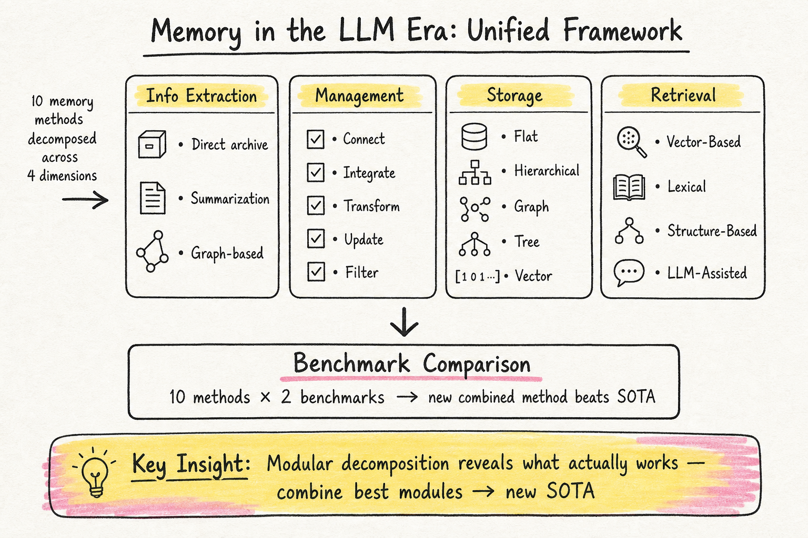

# Agent Memory — 2026-05-17

## 1. Memory in the LLM Era: Modular Architectures and Strategies in a Unified Framework

- **arXiv**: 2604.01707
- **Link**: https://arxiv.org/abs/2604.01707
- **Authors**: Yanchen Wu, Tenghui Lin, Yingli Zhou et al. (CUHK, CUHK-Shenzhen, HITSZ, Huawei Cloud)
- **Venue**: VLDB 2026
- **Date**: v1 2026-04-02, v2 2026-05-01

### 這篇在說什麼

這篇要解決的問題很清楚：agent memory 方法很多（A-MEM、MemGPT、Mem0、MemoryOS、Zep 等等），但一直沒有人在同一個實驗設定下系統性地比較它們。作者提出了一個統一的模組化框架，把所有現有 memory 方法拆解成四個維度——Information Extraction、Management Operations、Storage Structure、Retrieval Mechanism——然後在兩個 benchmark 上做全面比較，還順手設計了一個新方法打過了 SOTA。

這不是一篇只做比較的 paper。它的核心主張是：我們需要理解每個模組各自的貢獻，而不是只看方法的整體效能。這和之前讀過的 2603.07670（Memory for Autonomous LLM Agents survey）的 write–manage–read 框架有異曲同工之處，但本篇更偏工程實作面的拆解與比較。

### 主要貢獻

1. **統一模組化框架**：把十種代表性 agent memory 方法（A-MEM、MemoryBank、MemGPT、Mem0、Mem0g、MemoChat、Zep、MemTree、MemoryOS、MemOS）沿四個維度拆解。Table 1 的分類表非常清晰，一眼就能看出每個方法在每個維度的選擇。
2. **Systematic Benchmark 比較**：在兩個知名 benchmark 上全面比較這些方法的效能和效率，不只是 overall performance，還分析每個模組的角色和效果。
3. **新方法設計**：作為實驗分析的副產品，組合現有方法的模組設計了一個新方法，效能超過 SOTA。
4. **未來方向**：基於比較結果，提出 agent memory 領域的重要開放問題和研究機會。

### 方法 / pipeline

框架拆解四個維度：

1. **Information Extraction**：記憶如何從對話中提取？Direct archive（直接存）、Summarization-based extract（摘要提取）、Graph-based extract（圖譜提取）
2. **Management Operations**：Connect、Integrate、Transform、Update、Filter——記憶之間如何連結、合併、轉換、更新、過濾
3. **Storage Structure**：Flat（平面）、Hierarchical（層次）、Graph（圖）、Tree（樹）、Vector（向量）
4. **Retrieval Mechanism**：Vector-Based、Lexical-Based、Structure-Based、LLM-Assisted

作者的方法是在這個框架內，挑選各維度最好的模組組合成新方法。實驗在兩個 benchmark 上跑所有方法，分析每個模組的邊際貢獻。

### 實驗設計

- **Benchmark**：兩個知名 agent memory benchmark（從 paper 推測是 LOCOMO 和另一個對話式 benchmark）
- **比較對象**：10 種代表性 memory 方法
- **指標**：accuracy、efficiency（token usage、latency 等）
- **分析**：不只是 overall score，還拆解每個模組的貢獻
- **新方法**：組合最佳模組後超過所有現有方法的 SOTA

目前從 abstract 和 HTML 前段能確認到框架設計和十種方法的分類，具體的實驗數據和 ablation 結果需要看全文的 Table 和 Figure。

### かに讀後判斷

**今日推薦點開。** 這篇是目前 agent memory 領域少見的系統性比較工作，而且發表在 VLDB 2026，品質有一定保證。Table 1 的模組分類表本身就值得收藏，可以當作讀任何 agent memory paper 時的參考框架。

和之前讀過的 2603.07670（survey，write–manage–read 框架）比較：
- 2603.07670 側重機制分類和理論框架，視角更宏觀
- 本篇側重實作面的模組拆解和實驗比較，視角更工程

兩篇互補。如果 Morris 只看一篇了解 memory 現狀，本篇的工程拆解可能更實用。

優先看：
- Table 1（方法分類）
- Section 4（實驗比較）
- Section 5（ablation 分析和新方法設計）
- Section 6（開放問題）

---

## 2. How Memory Management Impacts LLM Agents: An Empirical Study of Experience-Following Behavior

- **arXiv**: 2505.16067
- **Link**: https://arxiv.org/abs/2505.16067
- **Authors**: Zidi Xiong, Yuping Lin, Wenya Xie et al. (Harvard, UGA, MSU, UMN)
- **Date**: v1 2025-05-21, v2 2025-10-10

### 這篇在說什麼

這篇做了一件 agent memory 研究中很基本但一直沒人系統做的事：仔細觀察 memory addition 和 deletion 這兩個最基本的操作，到底怎麼影響 agent 的長期行為。作者發現了一個叫「experience-following property」的現象——當任務輸入和記憶庫中某筆記錄的輸入高度相似時，agent 的輸出也會高度相似。這聽起來像是好事（可以重用成功經驗），但作者進一步揭露了兩個問題：error propagation（錯誤記憶會傳播放大）和 misaligned experience replay（看起來正確但實際誤導的記憶）。

### 主要貢獻

1. **Experience-Following Property**：首次系統性量化「輸入相似 → 輸出相似」的現象，證明這不是偶然而是 LLM agent 記憶系統的固有特性。
2. **Error Propagation**：記憶中的錯誤會被後續任務重用，而且不是等量傳播——會放大。一個錯誤的軌跡被加回記憶庫後，會影響後續一系列相關任務。
3. **Misaligned Experience Replay**：某些看似正確的軌跡，作為示範時反而降低表現。這不是單純的「壞記憶壞結果」，而是記憶內容和當前任務之間的對齊問題。
4. **Trajectory Evaluator 的關鍵角色**：提出用未來任務評估結果作為記憶品質的免費標籤，不需要額外的人力標注。

### 方法 / pipeline

研究聚焦在 memory 的兩個基本操作：

- **Memory Addition**：每次 agent 執行完任務後，軌跡是否要加入記憶庫？加什麼品質的軌跡？
- **Memory Deletion**：記憶庫滿了之後，刪哪些記憶？刪除策略如何影響後續表現？

實驗設計是控制性實驗：
- 四種不同的 agent
- 多樣化的任務
- 控制 memory addition 和 deletion 的不同策略
- 觀察長期效能變化

特別關注兩個 challenging condition：
1. **Task Distribution Shift**：任務分佈隨時間改變，agent 需要適應
2. **Memory Resource Constraint**：記憶容量嚴重受限，只能保留最有價值的經驗

### 實驗設計

- **Agent 種類**：四種不同 agent（跨不同任務類型）
- **Memory 操作**：Systematic 操控 addition 和 deletion 策略
- **指標**：task success rate、output similarity（experience-following 的量化）、error propagation rate
- **Ablation**：
  - 比較不同 addition 策略（全加、只加成功的、用 evaluator 過濾）
  - 比較不同 deletion 策略（FIFO、LRU、品質優先）
  - 分析 error propagation 的連鎖效應
  - 分析 misaligned experience replay 的具體案例
- **Challenging Conditions**：Task distribution shift 和 memory resource constraint

### かに讀後判斷

這篇和 2604.01707 的統一框架是互補的：本篇深入兩個最基本的操作（add/delete），而 2604.01707 是跨方法的宏觀比較。Experience-following property 的發現很重要，因為它指出了所有 memory-augmented agent 都會遇到的基本行為模式，不管你用的是哪種 memory 架構。

值得看的部分：
- Figure 1 的 memory management workflow 圖
- Experience-following property 的量化實驗
- Error propagation 的連鎖分析
- Section 討論 trajectory evaluator 作為免費品質標籤

如果 Morris 對 memory 的實際工程影響有興趣，這篇的 addition/deletion 分析比框架比較更接地氣。但如果是想了解 memory 領域全貌，2604.01707 的覆蓋面更廣。