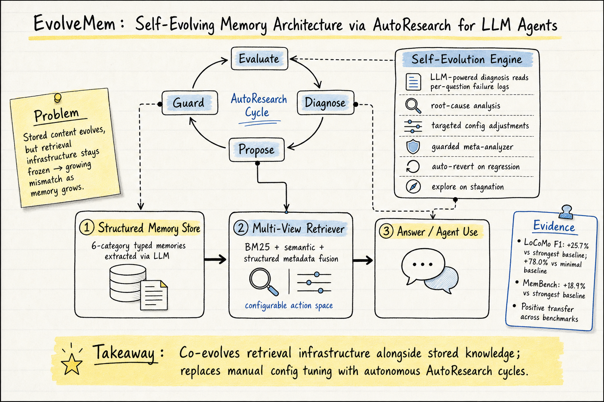

# Agent Memory — 2026-05-21

## 1. EvolveMem: Self-Evolving Memory Architecture via AutoResearch for LLM Agents

- **arXiv / Venue / 類型**: arXiv:2605.13941 / Machine Learning (cs.LG) / arXiv
- **Link**: https://arxiv.org/abs/2605.13941

### 這篇在說什麼

這篇攻擊的是 agent memory 系統一個被忽略的問題：大家都在讓記憶內容演化（存新東西、合併舊東西），但檢索基礎設施（scoring function、fusion 權重、answer generation 策略）在佈署後就凍結了。這造成一個隨時間惡化的 mismatch——記憶從幾十條長到幾百條，不同類型的問題需要完全不同的檢索策略，但系統只能用同一套凍結的設定應付所有場景。

EvolveMem 的核心主張是：真正自適應的記憶系統必須在兩個層次同時演化——儲存的知識和檢索機制本身。它把整個檢索配置暴露為結構化行動空間，用 LLM 驅動的診斷模組讀取每個問題的失敗日誌、識別根本原因、提出配置調整，然後用 guarded meta-analyzer 安全地應用這些調整。這個閉環自演化過程被作者稱為 AutoResearch——系統自主執行「觀察→假設→實驗→驗證」的研究循環，取代手動調參。

### 主要貢獻

1. **首次讓檢索基礎設施自演化**：這是 agent memory 領域第一個明確讓 scoring functions、fusion strategies、answer-generation policies 等檢索參數成為可演化目標的框架。過去的 MemGPT、Mem0、A-MEM、SimpleMem 等系統都只演化記憶內容，檢索策略從頭到尾不變。

2. **AutoResearch 閉環**：Evaluate → Diagnose → Propose → Guard 四步循環。診斷模組不只是看統計數字，而是讀 per-question 的原始結果日誌（raw retrieval results），用 LLM 分析失敗的根本原因，然後提出結構化的配置調整提案。Guard 機制包含 auto-revert-on-regression（退步就自動回滾）和 explore-on-stagnation（停滯就增加探索），確保演化過程穩定收斂。

3. **從最小基線自主發現新配置維度**：起點只有最基本的檢索配置，AutoResearch 過程能自主發現有效的檢索策略，包含原本行動空間中不存在的新配置維度。這說明演化不只在做超參搜索，而是在做架構級的發現。

4. **跨基準的正向遷移**：在 LoCoMo 上演化的配置轉移到 MemBench 上仍然有正面效果，沒有 catastrophic transfer。這表示自演化過程抓到的是通用的檢索原則，不是基準特定的 heuristic。

### 方法 / pipeline

EvolveMem 的架構分三層，由自演化反饋迴路連接：

**第一層 — Structured Memory Store**：六類型記憶（episodic、semantic、preference、project state、working summary、procedural），每條記憶包含自然語言內容、dense embedding、類型標籤和 metadata（重要性、信心度、entity reinforcement score、實體、主題、時間戳）。記憶提取使用 sliding window LLM-based extractor，帶有重試機制、chunk splitting 和覆蓋率驗證。

**第二層 — Retrieval Layer**：Multi-view retriever 融合 BM25（lexical）、semantic（dense embedding）和 structured-metadata search，加上可選的 entity-swap、query decomposition 和 answer verification。關鍵是整個檢索配置（fusion 權重、context budget、answer generation style 等）都是可演化的行動空間。

**第三層 — Self-Evolution Engine**：LLM-powered diagnosis module 讀取 per-question failure logs → 分類根本原因 → 提出結構化配置調整 → guarded meta-analyzer 判定是否應用（退步就回滾，停滯就增加探索）。演化輪次持續直到主 metric 停滯。

整個 AutoResearch 循環：在每個演化輪次，系統先在驗證集上評估當前配置，然後診斷模組分析失敗問題的原始檢索結果，提出調整提案，guard 機制決定接受或回滾。接受的提案會擴充行動空間（被納入永久配置），退步的提案自動回滾。

### 實驗設計

- **Benchmarks**: LoCoMo（長期對話記憶）和 MemBench（記憶檢索品質）
- **Backbone**: GPT-4o（單一 backbone，確認不依賴特定模型）
- **Baselines**: SimpleMem、Mem0、A-MEM 等已發布的最強基線 + minimal baseline（最基本的檢索配置）
- **Metric**: F1 score
- **Main results**: 
  - LoCoMo: EvolveMem 比最強基線高 25.7% relative，比 minimal baseline 高 78.0%（從 30.5% F1 演化到 54.3% at R7）
  - MemBench: 比最強基線高 18.9% relative
  - 跨基準遷移：正向而非 catastrophic
- **Evolution trajectory**: 從 R1 到 R7 逐步收斂，R2 的有害提案被自動回滾
- **Ablation**: 已讀全文確認有 Table 1 的 memory system 比較和 evolution trajectory 圖，但具體每個配置維度的消融需看 Appendix

### かに讀後判斷

★ 今日推薦。這篇是 agent memory 領域一個重要的方向性突破——它不只是「又一個 memory system」，而是把記憶系統從「被動儲存+固定檢索」升級到「內容和檢索同時自演化」。AutoResearch 的設計模式（Evaluate→Diagnose→Propose→Guard）很優雅，而且 auto-revert-on-regression + explore-on-stagnation 的安全機制解決了自演化系統最怕的穩定性問題。

和之前 DailyRead 的 SSGM（2603.11768，記憶演化治理框架）形成互補：SSGM 提出了治理框架和失敗分類，EvolveMem 則把類似的「診斷→調整→防退步」邏輯具體實作為可運行的系統。和 2605.06716（From Storage to Experience survey）的三階段框架（Storage→Reflection→Experience）對照，EvolveMem 大約處在 Reflection→Experience 的過渡地帶，但多了一個別人沒有的維度：檢索機制本身的演化。

深讀時優先看：Figure 1 的 evolution trajectory（看 R2 如何被回滾）、Table 1 的 memory system 比較表、Appendix A 的完整配置行動空間定義、以及跨基準遷移的具體數字。

---

## 2. EvoMemBench: Benchmarking Agent Memory from a Self-Evolving Perspective

- **arXiv / Venue / 類型**: arXiv:2605.18421 / Computation and Language (cs.CL) / arXiv
- **Link**: https://arxiv.org/abs/2605.18421

### 這篇在說什麼

這篇提供了一個評估 agent 記憶的統一基準 EvoMemBench，核心觀點是：agent 記憶應該從「自我演化」的視角來評估，而非只看靜態的儲存/檢索能力。現有基準（LoCoMo、LongMemEval、MemoryAgentBench 等）只覆蓋了部分面向——要嘛只看知識記憶、要嘛只看單 episode、要嘛不開源。EvoMemBench 用兩個軸線組織評估：記憶範圍（in-episode vs. cross-episode）和記憶內容（knowledge-oriented vs. execution-oriented），形成四個設定。

這個基準對 agent memory 研究的價值在於：它提供了第一個同時覆蓋「知識演化 + 執行演化 + episode 內/跨 episode」的統一測試台，而且完全開源。

### 主要貢獻

1. **四象限記憶評估框架**：In-Episode Knowledge Evolution、In-Episode Execution Evolution、Cross-Episode Knowledge Evolution、Cross-Episode Execution Evolution。這個分類法比之前的基準更完整，讓你可以精確定位一個記憶方法在哪個象限強、哪個象限弱。

2. **15 個記憶方法的標準化比較**：包含 retrieval-based（BM25、dense retrieval、hybrid）、long-term memory（MemGPT-style）、procedural memory、long-context baselines 等，全部用相同協議評估。

3. **關鍵發現——long-context baseline 仍然很強**：在許多設定下，單純把整個歷史塞進 context window 的 baseline 和精心設計的記憶系統打平甚至更好。這對整個 agent memory 領域是個重要的現實檢驗。

4. **沒有單一記憶形式通吃**：retrieval-based 方法在知識密集場景最強，procedural/long-term memory 在執行導向場景（當存儲的經驗和任務結構匹配時）更有效。這說明「通用記憶解決方案」還很遠。

### 方法 / pipeline

EvoMemBench 的構建方式：

- **InEp-Know**: 從 MemoryAgentBench 的 Accurate Retrieval 和 Selective Forgetting 子集構建，測試 agent 在單 episode 內更新和修訂資訊的能力。
- **InEp-Exec**: 從 BFCL-Multiturn-LongContext 重構，用 GPT-5-mini 輔助把顯式引用改為隱式引用（迫使 agent 從記憶恢復），並把多動作回合拆成子回合。
- **CrossEp-Know**: 從 CL-Bench 構建，測試跨 episode 的知識積累（domain facts、rule systems、procedures）。
- **CrossEp-Exec**: 包含 CrossEp-Tool（tool use tasks）、CrossEp-Web（WebArena-style tasks）、CrossEp-Emb（embodied environment tasks）三個子基準。

評估協議標準化：所有方法用相同的 LLM backbone、相同的評估指標、相同的 episode 順序。

### 實驗設計

- **Models**: 多個 LLM backbone（具體需看全文確認）
- **Memory methods**: 15 個代表方法 + long-context baselines
- **Metric**: 依任務類型不同（QA 用 F1/EM、tool use 用 action accuracy、web/embodied 用 task completion rate）
- **Main results**: 
  - Long-context baselines 在多個設定下極具競爭力
  - 記憶系統在 context 不足或任務困難時幫助最大
  - Retrieval-based 方法在 knowledge-intensive 設定最強
  - Procedural/long-term memory 在 execution-oriented 設定更有效（當經驗結構匹配時）
  - 沒有任何單一方法在所有設定中一致勝出
- **目前能確認的**: 已讀全文的 Introduction、Section 2-4 的分類框架和基準構建邏輯。Section 5 的實驗結果細節需再讀。

### かに讀後判斷

這篇和今天的 EvolveMem（2605.13941）形成自然的配對：EvolveMem 提出了一個讓記憶檢索自演化的系統，EvoMemBench 則提供了評估這類系統的基準。兩篇一起看，你會看到 agent memory 領域正在從「靜態儲存」走向「自演化」，而評估方法也要跟上這個轉變。

「long-context baseline 仍然很強」這個發現值得注意——它對整個 agent memory 社群是個現實檢驗。如果你的記憶系統不能在 context 不夠長的場景中明顯勝過單純的 long-context，那你可能只是在增加系統複雜度。不列為今日推薦，但作為基準工具很重要。