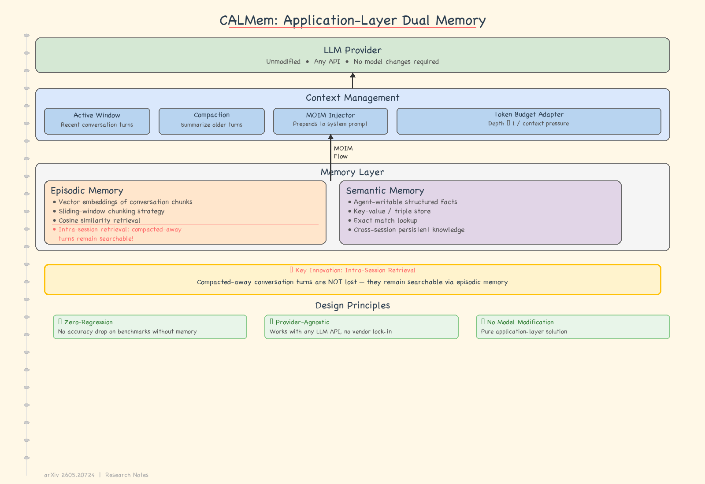

# Agent Memory — 2026-05-23

## 1. CALMem: Application-Layer Dual Memory for Conversational AI

- **arXiv**: 2605.20724
- **Link**: https://arxiv.org/abs/2605.20724
- **Authors**: Rajendra Narayan Jena, Rajan Padmanabhan, Sankar Arumugam (Infosys Limited)
- **已讀來源**: arXiv HTML 全文（Section 1–9 完整讀過，Section 10–11 快速掃過）

### 這篇在說什麼

這篇論文解決的問題是 LLM 對話系統的兩個結構性限制：context window 填滿後 compaction 不可逆地丟失歷史；跨 session 所有記憶歸零。即使百萬 token window（Gemini 2.0 Pro 的 2M tokens）也無法解決——window 再大終究有限，新 session 仍是白紙。現有方案（更大的 window、RAG、MemGPT）各有代價：model modification、provider lock-in、或 delegate 記憶管理給模型自己。

CALMem 的核心主張：把記憶系統建在 application layer，完全不需要改 model、不需要 fine-tune、不需要 special prompt structure。用 Tulving 的 episodic/semantic memory 區分為理論基礎，設計雙記憶體架構——episodic memory（向量搜尋對話歷史）+ semantic memory（結構化事實），透過 MOIM 機制自動注入。特別重要的是 intra-session retrieval：被 compaction 移除的 turn 仍可搜尋，這是既有系統沒做到的。

### 主要貢獻

1. **純 application-layer 雙記憶體架構**：不需要改 model、不需要 fine-tune、不需要 provider-specific infrastructure。對任何 message-based API 的 LLM 都可用。啟用時無 latency overhead，停用時零回歸——degrade 回原本的 LLM 行為。

2. **Token-budget-adaptive injection（MOIM）**：MOIM（Message of Injected Memory）每 turn 自動檢查 context window 剩餘空間，根據空間大小調節注入深度。context 還空時多注入、快滿時少注入，避免記憶注入加速 compaction。這是一個簡潔但重要的 engineering insight。

3. **Intra-session retrieval**：compaction 後的 turn 仍可被向量搜尋找回。現有 RAG-based memory 通常只做 cross-session retrieval，CALMem 補上了當前 session 內 compaction 後的記憶缺口。實作方式簡潔：搜尋時排除仍在 active context 中的 chunk，只返回已被 compacted 的。

4. **Production Rust 實作**：不是 prototype，是在 production 系統中的 Rust codebase 實作。embedding 用 fastembed（ONNX runtime，純 Rust，~3ms/CPU），chunking 用 sliding window（1000 chars / 200 overlap），檢索用 brute-force cosine similarity（適合 ~100K chunks 規模）。

### 方法 / pipeline

CALMem 是三層架構：

1. **LLM Provider Layer**：任何標準 API LLM，unmodified。
2. **Context Management Layer**：管理 active context window、處理 compaction、觸發背景索引、每 turn 執行 MOIM injection。
3. **Memory Layer**：雙子系統——
   - **Episodic Memory**：sliding-window chunking → all-MiniLM-L6-v2 embedding → SQLite + vector index。搜尋時 cosine similarity ≥ 0.4 閾值，top-k=5。
   - **Semantic Memory**：agent-writable structured facts（key-value pairs），用 SQLite 儲存，exact match 檢索。

Indexing pipeline：message commit → tokio::spawn background task → chunk → embed → INSERT OR IGNORE。非阻斷式，資料庫永遠是 source of truth，memory index 是 derived structure。

MOIM injection 流程：每 turn 開始時計算 context headroom → 決定 injection budget → 從兩個 memory subsystem 檢索 → 組裝 MOIM text block → prepend 到 system prompt。模型不自動呼叫 retrieval（不同於 MemGPT），完全是被動接收。

### 實驗設計

這篇是 architecture + design decision paper，不是 benchmark paper。Section 9 描述了 evaluation，但主要是 qualitative analysis 和 design trade-off 討論，而非定量 benchmark 比較。

- **評估方式**：論文描述了在 production 系統中的實際運作特性和觀察到的 trade-offs。
- **缺少的**：沒有與 MemGPT、Mem0、Zep 等系統的 head-to-head benchmark 比較。沒有在標準化的 multi-turn conversation benchmark（如 LOCOMOTIVE 或 LongBench）上跑實驗。沒有人類評估或 A/B test 結果。
- **解讀**：這是合理的——作者明確定位為 architecture description paper 而非 evaluation paper。但讀者需注意，CALMem 的效能主張（「virtually unbounded context」）目前缺乏嚴格定量驗證。

### かに讀後判斷

CALMem 的價值在於工程設計的務實性和 intra-session retrieval 的原創性。作為 architecture paper，它把設計決策講得很清楚（為什麼用 brute-force 不用 ANN、為什麼不用 recursive summarization、為什麼讓模型被動接收記憶而非自己管理），這比提出一個「效果最好」的系統更有長期參考價值。

跟前幾天 DailyRead 的關係：EvolveMem（2605.13941，5/21）讓記憶架構自己演化；Episodic-Semantic Memory（2605.17625，5/22）在科學 agent 上做雙記憶體；CALMem 從 engineering 面切入——純 application layer、不改 model、zero-regression。三者形成有趣的光譜：EvolveMem 是 auto-research 驅動的自適應，Episodic-Semantic 是 domain-specific 的知識管理，CALMem 是 drop-in 通用方案。

值得點開深讀。優先看：Section 5（Semantic Memory 的具體設計，尤其是 agent-writable facts 的格式和寫入時機）、Section 6（MOIM 的 token-budget 計算細節）、Section 9（evaluation 討論的 trade-offs）。如果 Morris 對「application-layer memory 是否足夠」有疑慮，Section 10（limitations）的討論值得細看。

---

## 2. MemRL: Self-Evolving Agents via Runtime Reinforcement Learning on Episodic Memory

- **arXiv**: 2601.03192
- **Link**: https://arxiv.org/abs/2601.03192
- **Authors**: Shengtao Zhang, Jiaqian Wang, Ruiwen Zhou et al.
- **已讀來源**: arXiv abstract + HTML 前段（Section 1–2 完整，其餘快速掃描）

### 這篇在說什麼

MemRL 解決的問題是 AI agent 的 self-evolution：fine-tuning 太貴且容易 catastrophic forgetting，現有 memory-based 方法只做 passive semantic matching（容易檢索到 noise）。MemRL 提出一個非參數方法：用 reinforcement learning 在 episodic memory 上演化，decouple stable reasoning from plastic memory。核心是 Two-Phase Retrieval 機制——先粗篩再精選——用環境反饋過濾 noise、識別高效用策略。

### 主要貢獻

1. **Decouple reasoning from memory**：穩定的推理能力（model weights）不動，可塑的記憶（episodic store）透過 RL 更新。這避免了 fine-tuning 的 catastrophic forgetting 問題。
2. **Two-Phase Retrieval**：第一階段粗篩候選，第二階段用環境反饋（reward signal）評估每個候選的實際效用，只保留高 utility 的經驗。
3. **Runtime self-evolution**：不需 weight update，在 inference 時就能持續改進。

### 方法 / pipeline

MemRL 的 pipeline 是：Agent 執行 task → 結果獲得 reward → episodic memory 更新（加入或調整 entry）→ 下次 task 時 Two-Phase Retrieval 從 memory 選取相關經驗 → 注入 prompt。整個過程不修改 model weights。

Two-Phase Retrieval 的具體設計：Phase 1 用語意相似度粗篩候選經驗；Phase 2 用環境反饋（task success/failure 的 reward）過濾低效用候選。只有通過兩階段的經驗才會被注入 prompt。

### 實驗設計

- **Benchmarks**：HLE、BigCodeBench、ALFWorld、Lifelong Agent Bench——涵蓋 reasoning、coding、interactive、lifelong learning 四個場景。
- **Baselines**：Zero-shot、RAG、及其他 memory-based methods。
- **Main results**：MemRL 在四個 benchmark 上顯著優於 SOTA baselines，確認 stability-plasticity dilemma 可以用 non-parametric approach 有效緩解。
- **已讀來源限制**：具體數字和 ablation study 尚未完整檢查，只從 abstract 和 intro 確認主要結論方向。Full experiment tables 和 ablation 需深讀確認。

### かに讀後判斷

MemRL 跟 EvolveMem（2605.13941）和 CALMem 是三種不同的「讓 agent 記住並改進」路線：EvolveMem 改 retrieval infrastructure 本身，CALMem 改 application-layer 的 context 管理策略，MemRL 用 RL signal 做 episodic memory 的品質篩選。Two-Phase Retrieval 的設計簡潔有效，但依賴環境反饋的可得性——在無法輕易獲得 reward signal 的場景（例如開放式對話）可能受限。

值得快速掃過全文，特別是 Two-Phase Retrieval 的實作細節和 ablation。但如果 Morris 時間有限，可先看 CALMem（工程面更完整），MemRL 的核心 insight（RL on episodic memory）看 abstract + intro 就能掌握。

---

## 3. NEMORI: Adaptive Memory Distillation for LLM Agents

- **arXiv**: 2508.03341
- **Link**: https://arxiv.org/abs/2508.03341
- **Authors**: Jiayan Nan et al.
- **已讀來源**: 僅 abstract 層級快速掃描

### 這篇在說什麼

NEMORI 解決的核心問題是「什麼經驗值得記住？」現有 memory 系統用預定義 heuristic（重要性分數、情感標籤、事實模板）來決定保留什麼，這些 heuristic 編碼了設計者直覺而非從資料學習。NEMORI 提出：用 predictability 判斷經驗的未來價值——如果一段互動的內容是「可預測的」，表示模型已經知道這些，不需要特別記住；「不可預測的」才是值得保留的。

### 主要貢獻

1. **Prediction-error-driven memory distillation**：把「什麼值得記」框架化為 predictability 問題，用 prediction error 當篩選標準。這是 data-driven 的，不需要 heuristic。
2. **兩階段 cascade**：Episodic Memory Integration（把原始互動轉成連貫敘事）→ Semantic Knowledge Distillation（用 prediction error 提取 insights）。
3. **Framework agnostic**：distillation 機制獨立於下游 memory management，可搭配任何 storage/retrieval 策略。

### 方法 / pipeline

NEMORI 分兩個模組：第一個是 Episodic Memory Integration，把原始對話流轉換成連貫的 narrative chunks；第二個是 Semantic Knowledge Distillation，對每個 narrative 計算 prediction error（模型預測 vs. 實際內容的差異），prediction error 高的表示包含新資訊，值得提煉成 semantic knowledge。

### 實驗設計

僅 abstract 層級，確認有 extensive experiments 證明 strong performance、efficiency 和 storage reduction。具體 benchmark、baseline 和數字需深讀確認。

### かに讀後判斷

NEMORI 的 prediction-error-driven memory selection 跟 MemRL 的 reward-driven memory filtering 是不同的 signal 來源：NEMORI 用模型自身的 surprise（內在信號），MemRL 用環境反饋（外在信號）。兩者互補。但只讀到 abstract，無法判斷實驗深度和實際效果。如果 Morris 對「什麼值得記住」的問題感興趣，值得快速掃全文，但不列為今日推薦。