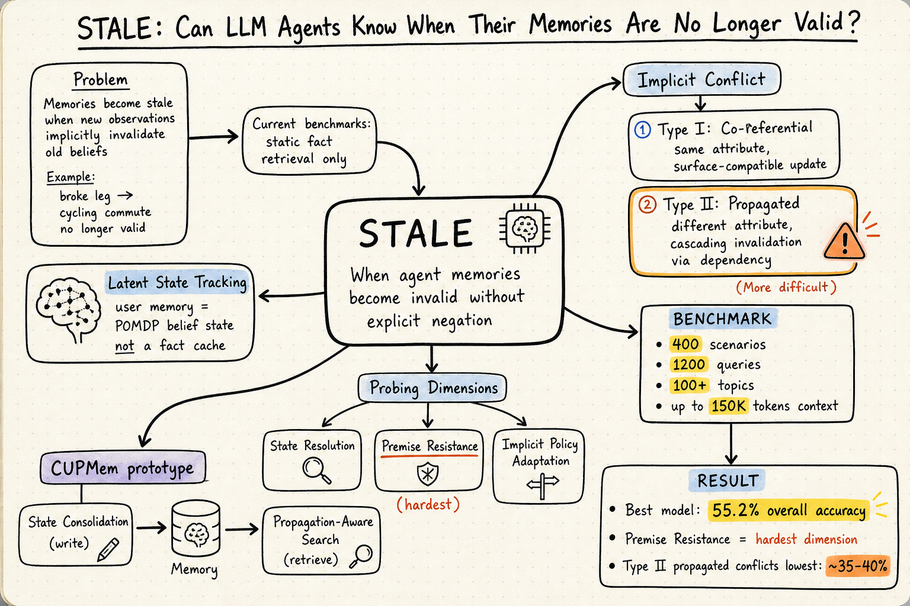

# Agent Memory — 2026-05-24

## 1. STALE: Can LLM Agents Know When Their Memories Are No Longer Valid?

- **arXiv**: 2605.06527
- **Link**: https://arxiv.org/abs/2605.06527
- **Authors**: Hanxiang Chao, Yihan Bai, Rui Sheng, Tianle Li, Yushi Sun (WHU, CUHK, HKUST)

### 這篇在說什麼

現有 LLM agent 的長期記憶研究大多把「記住」等同於「靜態事實檢索」——測試的是 agent 能不能從過去對話中找回特定資訊。但真實使用者狀態會隨時間改變，而這些改變常常不會明說。例如使用者上個月說自己每天騎車上班，這個月說自己摔斷了腿，後者並未直接否定前者，但一個好的助手應該推斷出騎車通勤暫時不適用。作者把這種「新觀察暗中推翻舊記憶」的失敗模式稱為 Implicit Conflict，並提出 STALE（State Tracking And Latent Evaluation）基準來系統化評估。

核心觀點是：對話記憶應被理解為 latent state tracking——像 HMM / POMDP 一樣，每句話只提供對使用者潛在狀態的部分觀察，記憶系統必須維持、修正、傳播這些狀態信念。現有 RAG 以語意相似度為主的檢索，正好無法處理時間上的失效，因為舊的「騎車通勤」記憶在語意上仍然相關。

### 主要貢獻

1. **隱性衝突的形式化定義與分類**：區分 Type I（co-referential，同一屬性的隱性更新，例如換城市居住）與 Type II（propagated，跨屬性的因果連鎖失效，例如受傷影響通勤方式），並以兩條公理（Belief Incompatibility + No Explicit Negation）嚴格定義。
2. **STALE 基準**：400 個專家驗證的衝突情境、1,200 個評估 query、覆蓋超過 100 個日常主題、上下文最長 150K tokens。三維探測框架：State Resolution（辨識舊資訊已過時）、Premise Resistance（拒絕前提已過時的查詢）、Implicit Policy Adaptation（主動以更新狀態調整下游行為）。
3. **CUPMem 原型**：提出 structured state consolidation（寫入時整合相關屬性）與 propagation-aware search（檢索時沿依賴邊擴散），作為 state-aware memory 的初始基線，整體準確率仍只有 55.2%（最佳模型），顯示問題距解決仍遠。

### 方法 / pipeline

- **資料生成管線**：先由 LLM 生成候選情境，再經人工審核與修正。每個情境包含：舊觀察 m_o（支持某信念 v_o(a)）、新觀察 m_n（隱性推翻 v_o(a)），以及三維探測問題。
- **三維評估**：
  - *State Resolution*：給定完整對話歷史，直接詢問屬性的當前值（例如「使用者現在住哪？」）。
  - *Premise Resistance*：查詢本身嵌入過時前提（例如「幫使用者規劃騎車上班路線」），測試模型是否察覺前提已失效。
  - *Implicit Policy Adaptation*：下游任務中不給衝突提示，測試模型是否主動避開過時記憶做出合理建議。
- **CUPMem**：在寫入階段做 state consolidation（辨識並合併同一屬性的衝突觀察）；在檢索階段做 propagation-aware search（沿屬性依賴圖擴散，把相關屬性的更新狀態一併帶入 context）。

### 實驗設計

- 評測對象涵蓋 frontier LLM（GPT-4o、Claude 3.5 Sonnet、Gemini 1.5 Pro 等）與專門記憶框架（MemGPT、RecallM 等）。
- 主要發現：
  - 最佳模型整體準確率僅 55.2%，Type II propagated conflict 的 State Resolution 最低（約 35-40%）。
  - Premise Resistance 是最困難的維度——模型傾向接受查詢中嵌入的過時前提。
  - CUPMem 在 State Resolution 上優於單純 RAG（+8-12%），但在 Policy Adaptation 上仍有大缺口。
- Ablation 分析顯示：去除 state consolidation 或 propagation-aware search 均顯著降低效能，兩者缺一不可。

### かに讀後判斷

STALE 是目前對「記憶失效偵測」最系統化的基準，把一個過去被忽視的失敗模式（隱性衝突）講清楚了。和前幾天讀過的 EvoMemBench（自我演化視角）及 HAGE（RL 驅動加權圖演化）互補：EvoMemBench 關注記憶系統能否隨經驗自我改進，HAGE 關注用 RL 學習記憶圖的演化策略，而 STALE 直接指出一個根本問題——即便記憶系統能寫入與檢索，若不能偵測並傳播狀態失效，整體行為仍會出錯。三篇合在一起剛好構成 agent memory 的「寫入—演化—失效」三角。

值得 Morris 點開深讀，優先看 Section 3（formal definition）和 Table 3（三維評估結果拆解），以及 CUPMem 的寫入時 state consolidation 具體 prompt 設計。

---

## 2. Portable Agent Memory: A Protocol for Provenance-Verified Memory Transfer Across Heterogeneous LLM Agents

- **arXiv**: 2605.11032
- **Link**: https://arxiv.org/abs/2605.11032

### 這篇在說什麼

目前 LLM agent 累積的記憶（偏好、知識、技能、任務狀態）被鎖死在各平台 runtime 裡，切換 provider 就全部丟失。作者提出 Portable Agent Memory——一個開放協議，讓 agent 記憶可以在不同 LLM 系統間序列化、傳輸、重新載入，並保證密碼學完整性。

這個問題很實際：使用者累積了數月的個人化記憶，但無法從 ChatGPT 搬到 Claude 或 Gemini；即使同一平台內，跨 session 的記憶也常常遺失。作者把記憶的可攜性定位為和 MCP（工具存取）及 A2A（agent 間委派）互補的第三層協議。

### 主要貢獻

1. **五元組記憶模型 M=(E,S,P,W,I)**：episodic（事件片段）、semantic（事實知識）、procedural（可重用技能）、working（當前任務狀態）、identity（使用者畫像與偏好），對應認知科學的分類。
2. **Merkle-DAG provenance 結構**：每筆記憶有 BLAKE3 content-addressed hash，整體 DAG 用 Ed25519 簽章，任何竄改都能被偵測。
3. **Capability-based access control**：scoped token 機制，支援選擇性揭露——合作 agent 可以只拿到 semantic memory 的 read+derive 權限，拿不到 export 權限。
4. **Injection-resistant re-hydration pipeline**：七步管線（Verify → Filter → Rank → Compress → Format → Frame → Inject），用 structural framing 防止記憶內容被當成指令執行。

### 方法 / pipeline

- **序列化**：記憶以 JSON-LD 表示，每筆 entry 含 content hash、component tag、timestamp、parent references（形成 DAG）。
- **傳輸**：打包成 artifact，含 DAG root hash 與 Ed25519 簽章。
- **Re-hydration**：
  1. Verify（驗 hash、DAG acyclicity、root signature）
  2. Capability Filter（依 token scope 過濾）
  3. Relevance Ranking（recency × salience × semantic similarity × DAG depth）
  4. Compression（高相關逐字保留、中相關摘要、低相關只留計數）
  5. Model-specific Formatting（JSON key-value 或敘事體）
  6. Injection-resistant Framing（structural delimiters + content escaping + type enforcement）
  7. Inject（放在 system prompt 之後、user content 之前）

### 實驗設計

- Pilot study：在 Claude、GPT-4、Gemini 三個模型間做 cross-model transfer，測量 Transfer Continuity Score（TCS）。
- 結果：有 Portable Agent Memory 的 TCS 為 0.83–0.92，no-memory baseline 為 0.28–0.45。
- 提供完整 Python SDK（54 個通過的測試）。
- **限制**：目前沒有大規模基準比較（只有小規模 pilot），也沒有和 Mem0 / Zep 等既有系統做 apples-to-apples 對比。Injection resistance 的評估主要是概念論述而非紅隊測試。

### かに讀後判斷

Portable Agent Memory 把一個實際且迫切的問題講清楚了——記憶鎖定是 agent 生態系的真實痛點。和 STALE 形成有趣的對照：STALE 問的是「記憶內容何時失效」，Portable Agent Memory 問的是「記憶如何跨系統存活」。但這篇更偏 position paper + protocol design，實驗規模有限。建議 Morris 點開時優先看 Section 3（五元組模型與 capability token 設計）和 Appendix 的 SDK 實作，確認協議的完整性。若 Morris 近期有跨 agent 記憶搬移的實務需求，這篇值得收藏；若純看研究貢獻，STALE 的基準設計更紮實。

---

## 3. BeliefMem: Agent Memory Under Partial Observability

- **arXiv**: 2605.05583
- **Link**: https://arxiv.org/abs/2605.05583

### 這篇在說什麼

現有 agent 記憶系統把每個觀察存成一個確定性結論（例如「API X 失敗」），但觀察本質上是部分且嘈雜的。一旦存成確定結論，agent 就不再考慮替代假說，造成 self-reinforcing error：行動基於錯誤結論 → 新觀察繼續佐證它 → 永遠無法修正。BeliefMem 提出把記憶從「確定結論」改成「機率信念」：每個屬性維持多個候選假說及其機率，用 Noisy-OR 規則隨新觀察更新，檢索時把所有候選帶著機率一起呈現。

### 主要貢獻

1. 把 agent 記憶問題正確框定為 POMDP 下的信念狀態近似——記憶系統是在近似 b_t(s) 而非儲存 ground truth。
2. BeliefMem：每個屬性維護多個 candidate hypotheses，各自帶機率，用 Noisy-OR 更新。
3. 實驗在 LoCoMo（長期對話）與 ALFWorld（具身互動）上均優於現有記憶方法，即使記憶庫大小受限。

### 方法 / pipeline

- **寫入**：觀察進來後，用 LLM 提取涉及的屬性與候選假說，每個假說給初始機率。若屬性已有記憶，用 Noisy-OR merge 新舊觀察的證據。
- **更新**：新觀察支持某假說時，其機率上升；不支持時下降。Noisy-OR 的好處是獨立證據可以疊加。
- **檢索**：查詢相關屬性時，回傳所有候選假說及其機率，讓 agent 看到完整的信念分布。
- **行動**：agent 可以依機率做決策（高機率假說主導行動，低機率假說仍保持可見供探索）。

### 實驗設計

- LoCoMo benchmark：長期對話任務，BeliefMem 在不同記憶庫大小下平均表現最好，尤其在記憶庫受限（50 entries）時仍維持高表現。
- ALFWorld：具身環境互動，同樣優於 Reflexion、MemGPT 等 baseline。
- Ablation：去除機率更新（退回確定性）效能明顯下降；去除多候選（只保留最高機率）也下降。
- Adversarial 實驗：在觀察含噪聲或刻意誤導時，BeliefMem 的自我修正能力顯著優於確定性記憶。

### かに讀後判斷

BeliefMem 和 STALE 直接對話：STALE 問的是「記憶何時失效」，BeliefMem 問的是「記憶為何一開始就不該存成確定結論」。兩者都指向同一個核心問題——agent 記憶需要表達不確定性。但 BeliefMem 的 POMDP 框架更根本，而 STALE 的評估更全面（三維探測、Type I/II 分類）。如果 Morris 對 agent 記憶有持續興趣，建議先深讀 STALE（評估框架更成熟），再讀 BeliefMem（方法創新），兩篇合在一起看會很有收穫。

---

## 4. Remembering More, Risking More: Longitudinal Safety Risks in Memory-Equipped LLM Agents

- **arXiv**: 2605.17830
- **Link**: https://arxiv.org/abs/2605.17830

### 這篇在說什麼

現有 agent 安全評估只看單一任務內的安全行為，但實際部署中 agent 會在長期互動中累積記憶，早期任務的記憶可能影響後續無關任務的安全性。作者稱此為 temporal memory contamination，並提出 trigger-probe 評估協議：在不同長度的只讀記憶前綴下，用固定探針集測量安全違規率，搭配 NullMemory 反事實基線來辨識記憶引起的違規。

### 主要貢獻

1. 把 agent 記憶安全從「單一狀態快照」重新框定為「縱向屬性」——安全不是某一刻的狀態，而是隨記憶累積而變化的趨勢。
2. Trigger-probe 協議 + NullMemory 基線，可分離記憶內容效應與對話長度效應。
3. 跨三種部署情境（記錄、備忘、表單、郵件）、八種記憶架構、以及 OpenClaw 等真實 agent 平台的實驗，發現記憶啟用時安全違規率穩定超過 NullMemory 基線，且隨記憶長度增加而上升。
4. 順序隨機化實驗顯示效應主要來自記憶內容累積而非遭遇順序。
5. 提出基於檢索狀態的記憶誘發風險診斷監測器，在生成前即可高召回率偵測。

### 方法 / pipeline

- **Trigger-probe protocol**：固定探針集，在不同記憶前綴長度下測量安全違規率。NullMemory 基線（無記憶）用來辨識哪些違規是記憶引起的。
- **事件分解**：把每個記憶事件拆成結構化成分（誰、什麼、何時、何地），使得記憶誘發風險可以在檢索階段（生成前）就偵測。
- **順序隨機化**：打亂記憶遭遇順序，測試效應是否來自順序或內容量。

### 實驗設計

- 三種部署情境：醫療記錄、辦公備忘、個人表單+郵件。
- 八種記憶架構：包含 MemGPT、Mem0、Zep、MemoryBank 等。
- 額外在 OpenClaw 上用原生記憶機制測試。
- 主要發現：有記憶的 agent 在所有架構和情境下安全違規率均超過 NullMemory 基線，且隨記憶前綴增長而單調上升。內容累積是主要驅動力。

### かに讀後判斷

這篇和 STALE 一起讀很有價值：STALE 從「記憶失效」角度看記憶錯誤，這篇從「記憶汙染安全」角度看記憶風險。兩者都指出記憶系統需要更好的狀態管理機制。不過這篇更偏安全評估而非方法貢獻——提出的 trigger-probe 協議是評估工具而非解法。建議 Morris 點開時優先看 Figure 3（違規率隨記憶長度上升的趨勢圖）和 Table 2（各架構的違規率比較），若對 agent 安全有興趣值得收藏。

**（僅 abstract 層級快速掃描，未讀全文 PDF；實驗細節與方法管線以全文為準）**