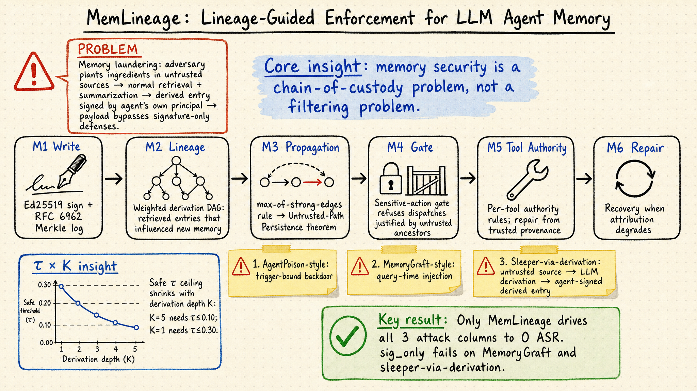

# Agent Memory — 2026-05-25

## 1. MemLineage: Lineage-Guided Enforcement for LLM Agent Memory

- **arXiv**: 2605.14421
- **Link**: https://arxiv.org/abs/2605.14421
- **Authors**: Ciyan Ouyang, Rui Hou (State Key Lab of Cyberspace Security Defense, IIE CAS)

### 這篇在說什麼

LLM agent 的長期記憶是能力基盤，但也越來越是攻擊面。之前的防禦有三條線：簽名驗證（per-entry Ed25519）只能證明誰寫了什麼，不能追溯內容從哪來；IFC 強制存取控制（像 Fides）在規劃時標記但不跨 LLM 推導步驟持久化；RAG 過濾器（RAGPart / RAGMask）在召回面操作但無法區分「良性摘要」和「被洗白的惡意 payload」。MemLineage 的核心洞察是：記憶安全不是過濾問題，是監管鏈（chain-of-custody）問題。一個耐心的攻擊者不需要在記憶裡直接植入惡意字串——她可以在不可信來源中埋入元件，等 agent 的正常檢索和摘要迴圈把這些元件組合成一段看似良性的衍生記憶，再由 agent 自己的主體金鑰簽名提交。這段衍生記憶從簽名層看完全合法，但溯源回看，它的祖先鏈中包含外部不可信內容。

MemLineage 把每條記憶條目附上兩層元資料：密碼學溯源（RFC 6962 Merkle log + per-principal Ed25519 簽名）和加權衍生 DAG（記錄哪幾條已召回的記憶影響了這條新記憶的生成）。一個 max-of-strong-edges 傳播規則保證：只要有一條從外部祖先到當前條目的路徑上所有邊的權重都超過閾值 τ，這條記憶就繼承 untrusted 標籤，敏感操作閘門會拒絕以它為依據的請求。

### 主要貢獻

1. **Lineage-stress memory laundering workload**：一個三階段工作負載，操作化了「記憶洗錢」的硬案例——不可信內容透過 LLM 推導被轉化為看似良性的 agent 自寫條目。這不只是重述已知攻擊，而是提供了一個可重現的分離器，區分簽名層防禦、粗粒度污染標記和溯源感知防禦。

2. **六模組 MemLineage 設計**：圍繞單一記憶存儲的六個模組——寫入時簽名 + Merkle 包含、衍生時加權溯源 DAG、召回時 lineage 標記傳播、敏感操作閘門、工具參數權限檢查、以及溯源退化時的修復路徑。Untrusted-Path Persistence 定理（Theorem 1）形式化了 max-of-strong-edges 傳播規則的安全保證。

3. **三種歸因演算法 + τ×K 掃描**：uniform-weight、secondary-LLM judge（帶 prompt-injection 防護）、white-box attention。量化了歸因召回 r_K 隨推導鏈深度 K 的退化，展示了單次 τ 測量會遺漏的安全邊界：K=5 需要 τ≤0.10，而 K=1 只需要 τ≤0.30。

4. **端到端可重現評估**：所有確定性 artifact（ASR 矩陣、τ×K 消融、效用基線、恢復 POC）都是 byte-equal CI-verified。Codex-backed AgentDojo 橋接顯示：在故意脆弱的 tool-output 配置下，no-defence 和 signature-only 基線在所有六個 banking pair 上失敗（6/6），而所有 MemLineage 配置將嚴格 AgentDojo ASR 降至 0/6。

### 方法 / pipeline

MemLineage 的六個模組：

1. **M1（Write）**：新條目寫入時，用 Ed25519 私鑰簽名，簽名和條目一起提交到 RFC 6962 Merkle log，保證寫入不可否認。
2. **M2（Lineage）**：每條新記憶記錄其衍生來源——在生成過程中，LLM 被要求標注它從哪些已召回記憶中提取了資訊。這形成一個有向無環圖（DAG）。
3. **M3（Propagation）**：max-of-strong-edges 規則：從外部祖先沿 DAG 邊傳播 trust 標籤，如果路徑上每一條邊的歸因權重都 ≥ τ，則鏈末端繼承 untrusted 標籤。
4. **M4（Gate）**：敏感操作閘門。當一個操作的理由（justification）來自 untrusted 祖先，閘門拒絕該操作。
5. **M5（Tool Authority）**：工具參數的細粒度權限檢查。如果工具參數來自不可信來源但可信來源提供了授權的替代值，可以進行修復。
6. **M6（Repair）**：當溯源退化（歸因邊權重低於閾值）導致誤判時，提供從可信來源修復參數的路徑。

攻擊家族：
- AgentPoison-style：trigger-bound backdoor 記憶
- MemoryGraft-style：查詢時注入
- Sleeper-via-derivation：透過 LLM 推導洗錢的三階段攻擊（不可信來源 → LLM 摘要 → agent 自簽衍生記憶）

### 實驗設計

- **機制隔離 harness**：確定性，不依賴 LLM API 呼叫，三個防禦 cell × 三個攻擊家族的 ASR 矩陣。no_defense 全部失敗；sig_only 關閉 AgentPoison 列但失敗於 MemoryGraft 和 sleeper-via-derivation；MemLineage 三列全部歸零。
- **τ×K 消融**：在退化 judge 排程下掃描 τ 和 K 的交互作用。關鍵發現：安全閾值 τ 隨推導深度 K 急劇收縮，部署時 K=5 需要 τ≤0.10。
- **效用基線**：MemLineage 的每次操作延遲是亞毫秒級，遠低於 LLM 呼叫的雜訊基線。
- **AgentDojo 橋接**：用 Codex 在 AgentDojo banking 場景上測試，故意使用脆弱的 tool-output 配置。結果：no_defence 和 sig_only 在所有六個 banking pair 上 ASR=100%，MemLineage 在所有 pair 上 ASR=0%。

### かに讀後判斷

MemLineage 是 agent memory 安全領域近期最紮實的系統設計論文之一。它正確地把問題從「過濾壞內容」重新框架為「監管鏈」，而且攻擊模型非常到位——sleeper-via-derivation 是現有防禦都擋不住的案例。τ×K 消融的發現（單次 τ 測量不夠，需要考慮推導深度）有直接的部署意義。

和 5/24 的 STALE（隱性衝突記憶失效）對比：STALE 說的是「記憶內容過時但系統不知道」，MemLineage 說的是「記憶內容被洗白但系統不追蹤」。兩者都是記憶狀態的問題，但一個是時效性問題，一個是安全性問題。和 5/24 的 Portable Agent Memory（Merkle-DAG + capability token + injection-resistant re-hydration）也有對話：兩者都用 Merkle 結構，但 Portable Agent Memory 側重跨系統傳輸，MemLineage 側重單系統內的溯源安全。

深讀優先看 Section 3（六模組設計和傳播規則）、Section 5.3（sleeper-via-derivation workload）、Section 6（τ×K 消融結果）和 Theorem 1 的形式化證明。

**推薦等級：今日推薦點開**

---

## 2. GroupMemBench: Benchmarking LLM Agent Memory in Multi-Party Conversations

- **arXiv**: 2605.14498
- **Link**: https://arxiv.org/abs/2605.14498
- **Authors**: Jingbo Yang et al.

### 這篇在說什麼

現有 LLM agent 記憶基準幾乎全都假設單用戶對話場景——一個人跟一個 agent 聊天，記憶系統只需要追蹤一個人的偏好和事實。但實際部署中，agent 經常在群組、頻道、工作空間中服務多個用戶，這帶來三個單用戶基準完全無法測量的問題：（1）群體動態——多人對話不是多個一對一聊天的拼接，群體互動會產生新資訊；（2）說話者信念追蹤——「誰說了什麼」不只是對話內容的附屬資訊，而是記憶結構的核心；（3）受眾適應語言——同一個人對不同人說話的方式不同，記憶系統需要捕捉這種角色差異。

GroupMemBench 用圖結構化合成管線生成多人對話，每條訊息都以 per-user 人格和目標受眾為條件。然後用對抗性查詢管線在六個類別上生成問題（多跳推理、知識更新、詞彙歧義、用戶隱含推理、時間推理、棄權），每個問題綁定到特定提問者。

### 主要貢獻

1. **多人對話記憶基準**：首個系統化測試群體記憶的基準，覆蓋群體動態、說話者信念追蹤和受眾適應語言三個現有基準完全遺漏的面向。

2. **圖結構化合成管線**：不只是拼接一對一對話，而是用圖結構控制回覆模式、以 per-user 人格和目標受眾為條件生成訊息，產生真正有多人群體動態的對話。

3. **對抗性查詢管線**：六類查詢，每個綁定到特定提問者，迭代搜尋最具挑戰性的真實問題。

4. **令人警醒的基準結果**：最強記憶系統只有 46.0% 平均準確率，知識更新 27.1%，詞彙歧義 37.7%。BM25 基線在多數指標上匹配或超過 agent 記憶系統——說明現有記憶攝取過程抹去了群體記憶依賴的結構和詞彙特徵。

### 方法 / pipeline

- **對話生成**：圖結構化合成。控制回覆結構（誰回覆誰、多少輪），以 per-user 人格和目標受眾為條件。不是拼接一對一對話，而是模擬真正的多人群聊動態。
- **查詢生成**：對抗性搜尋。六類問題（multi-hop reasoning, knowledge update, term ambiguity, user-implicit reasoning, temporal reasoning, abstention），每個問題綁定到特定提問者身份。
- **基準系統**：BM25、RAG with vector DB、以及多個現有 agent 記憶系統（MemoryBank, A-Mem, etc.）。

### 實驗設計

- 基準結果：最強系統 46.0% 平均準確率
- 知識更新類別：27.1%（最難類別）
- 詞彙歧義類別：37.7%
- BM25 基線在多數類別上匹配或超過 agent 記憶系統
- 目前從 abstract 能確認到的數據是以上這些，詳細的 per-system 分解、消融實驗需要在全文中確認。

### かに讀後判斷

GroupMemBench 直接戳中了現有記憶基準的盲區——單用戶假設。BM25 超過專用記憶系統這個結果非常打臉，說明目前的記憶攝取流程（摘要、向量化）把群體對話的結構和語境資訊都抹掉了。和 5/24 的 STALE 互補：STALE 測的是「記憶過時了但系統不知道」，GroupMemBench 測的是「記憶系統根本沒有架構去處理多人語境」。

不過目前只有 abstract 層級的資訊（HTML 不提供），需要看全文才能確認對話生成的品質控制、基準系統的具體配置和 per-system 分解。標記為「僅 abstract 層級快速掃描」。

---

## 3. State Contamination in Memory-Augmented LLM Agents

- **arXiv**: 2605.16746
- **Link**: https://arxiv.org/abs/2605.16746
- **Authors**: Yian Wang, Agam Goyal, Yuen Chen, Hari Sundaram (UIUC)

### 這篇在說什麼

當 LLM agent 把對話摘要存入長期記憶，這個摘要步驟可以變成一個「洗錢」通道：有毒的原始對話被壓縮成一段看似無害的摘要（toxicity classifier 評分低於閾值），但摘要保留了對抗性框架或衝突結構，影響後續生成。作者稱之為「memory laundering」——有毒影響透過摘要壓縮被洗白，但行為效應仍然存在。

核心洞察是：安全不只在於模型輸出是否通過毒性檢測，還在於 agent 存了什麼、之後重用了什麼。作者用配對反事實多 agent 推滾（paired counterfactual multi-agent rollouts）展示：有毒來源的記憶摘要可以維持在毒性閾值以下，但仍然比匹配的中性基線增加下游毒性。他們提出 Sub-threshold Propagation Gap (SPG) 指標來量化這種「分類器認為安全但行為上仍有影響」的隱性傳播。

### 主要貢獻

1. **Memory laundering 的識別和實證描述**：有毒對話被摘要後，毒性分數降至閾值以下，但框架和衝突結構被保留，持續影響後續生成。這是一個之前未被識別的安全失敗模式。

2. **Sub-threshold Propagation Gap (SPG)**：配對反事實指標，量化在分類器認為安全的記憶狀態下，有毒 vs. 中性條件的下游行為差異。

3. **三通道傳播分析**：transcript backflow（原始對話直接影響）、memory laundering（壓縮記憶的隱性影響）、parametric bias（模型自身的毒性放大）。三個通道是獨立的，需要分別干預。

4. **干預位置的關鍵性**：在有毒性內容被摘要之前進行淨化，可以大幅減少隱性傳播間隙；但如果只在摘要完成後才淨化，洗白後的影響可能已經無法恢復。這對防禦設計有直接意義：在壓縮前淨化 > 在壓縮後淨化。

### 方法 / pipeline

- **配對反事實推滾**：對每個種子 s，生成兩個多 agent 對話圖：一個以有毒 A1 回應為條件，一個以中性 A1 回應為條件。所有其他組件保持不變。
- **三通道模型**：(i) Transcript backflow：有毒內容直接在對話歷史中回流；(ii) Memory laundering：有毒內容被壓縮為摘要，分類器評分低但影響仍在；(iii) Parametric bias：模型自身的毒性放大。
- **干預框架**：三路組合——DPO（減少參數偏見）、transcript control（在讀取時淨化原始對話）、memory control（在摘要前淨化）。
- **評估**：200 個配對種子，6 種配置（no defense, DPO only, transcript control only, memory control only, transcript + memory control, full system）。

### 實驗設計

- 配對反事實設計，200 個種子
- 有毒 vs. 中性條件的下游毒性差異（Δμ）
- SPG：在分類器安全閾值以下的記憶狀態中，有毒 vs. 中性條件的下行為差異
- 95th percentile toxicity (P95_tox) 作為尾部毒性指標
- 關鍵發現：
  - Transcript backflow 是主要驅動因子，但 memory laundering 是隱性通道
  - 在摘要前淨化可以有效關閉 laundering 通道；在摘要後淨化則太晚
  - 三路組合（DPO + transcript control + memory control）是最好的防禦

### かに讀後判斷

State Contamination 和 MemLineage 是同一週出現的兩篇互補論文：MemLineage 從溯源（provenance）角度解決「不可信內容的影響如何透過衍生鏈傳播」，State Contamination 從摘要壓縮角度解決「毒性如何透過摘要洗白後隱性傳播」。兩者的核心觀察其實是同一個硬案例的不同面向：記憶的安全問題不是「有沒有壞字串」的問題，而是「狀態如何演化、影響如何傳播」的問題。

但 State Contamination 的設定比 MemLineage 更簡單——它只考慮毒性傳播，不考慮複雜的跨 session 衍生鏈。它的 SPG 指標是實用的，可以直接嵌入現有的毒性監控管線。干預位置的分析（摘要前 vs. 摘要後淨化）有直接的工程意義。

深讀優先看 Section 3（三通道模型的形式化）和 Section 4（干預框架和實驗結果）。和 MemLineage 比較時注意兩者對「記憶安全」的威脅模型差異：MemLineage 假設耐心的攻擊者，State Contamination 假設對話中的毒性自然擴散。

---

## 4. DimMem: Dimensional Structuring for Efficient Long-Term Agent Memory

- **arXiv**: 2605.15759
- **Link**: https://arxiv.org/abs/2605.15759
- **Authors**: Wentao Qiu et al.
- **Code**: https://github.com/ChowRunFa/DimMem

### 這篇在說什麼

現有 LLM agent 記憶系統面臨保真度-效率權衡：原始對話歷史太貴，扁平事實或摘要又丟失了精確召回需要的結構。DimMem 的核心想法是把每條記憶表示為一個原子化、型別化、自包含的單元，帶有顯式欄位（時間、地點、原因、目的、關鍵詞），讓檢索、更新和召回可以按維度精確操作，而不需要在 context 中存儲完整歷史。

### 主要貢獻

1. **維度結構化記憶表示**：每條記憶是一個帶顯式欄位的原子單元（time, location, reason, purpose, keywords），暴露了維度感知檢索需要的結構，同時不需要存儲完整對話歷史。

2. **維度感知檢索和更新**：利用顯式欄位做維度匹配的檢索和增量更新，而不是語意相似度的模糊匹配。

3. **可學習的維度提取**：微調 Qwen3-4B 做 DimMem schema 的記憶提取器，在 LoCoMo-10 和 LongMemEval-S 上超越用 GPT-4.1-mini 的 LightMem，顯示維度結構化比大模型 + 扁平結構更有效。

4. **效率提升**：在 LoCoMo 上降低 24% per-query token 成本，同時提升準確率。

### 方法 / pipeline

- **記憶提取**：從對話中提取維度結構化記憶單元，每個單元包含 time, location, reason, purpose, keywords 等欄位。
- **維度感知檢索**：查詢時按維度匹配而非純語意相似度，提高召回精確度。
- **增量更新**：新資訊可以按維度合併到現有記憶單元，而不需要重跑完整摘要。
- **小模型提取器**：微調 Qwen3-4B 做 DimMem schema 的提取，在兩個基準上達到或超過更大模型的效果。

### 實驗設計

- LoCoMo-10：81.43% 準確率（超越現有輕量記憶系統）
- LongMemEval-S：78.20% 準確率
- Per-query token 成本降低 24%（LoCoMo）
- 小模型提取器（Qwen3-4B）超越 GPT-4.1-mini + LightMem
- 目前從 abstract 和 web search 摘要能確認以上數據，詳細的消融實驗和 per-dimension 分解需要看全文確認。標記為「僅 abstract 層級快速掃描」。

### かに讀後判斷

DimMem 是記憶表示設計方向的一個務實提案——把扁平的摘要/事實列表改成帶顯式維度的結構化單元。這個想法和 5/24 的 BeliefMem（把記憶從確定結論改成機率信念）是同一波「記憶表示需要更精細的結構」趨勢的一部分，但走的路不同：BeliefMem 側重信念更新的概率框架，DimMem 側重檢索和更新的維度匹配。

不過，DimMem 目前只測了單用戶場景，和 GroupMemBench 指出的多人場景問題沒有交集。另外，維度結構化依賴 schema 設計的好壞——如果 schema 遺漏了重要維度（比如說話者身份、受眾），就會遇到 GroupMemBench 指出的問題。深讀時可以關注 DimMem 的 schema 是否能擴展到多人場景。