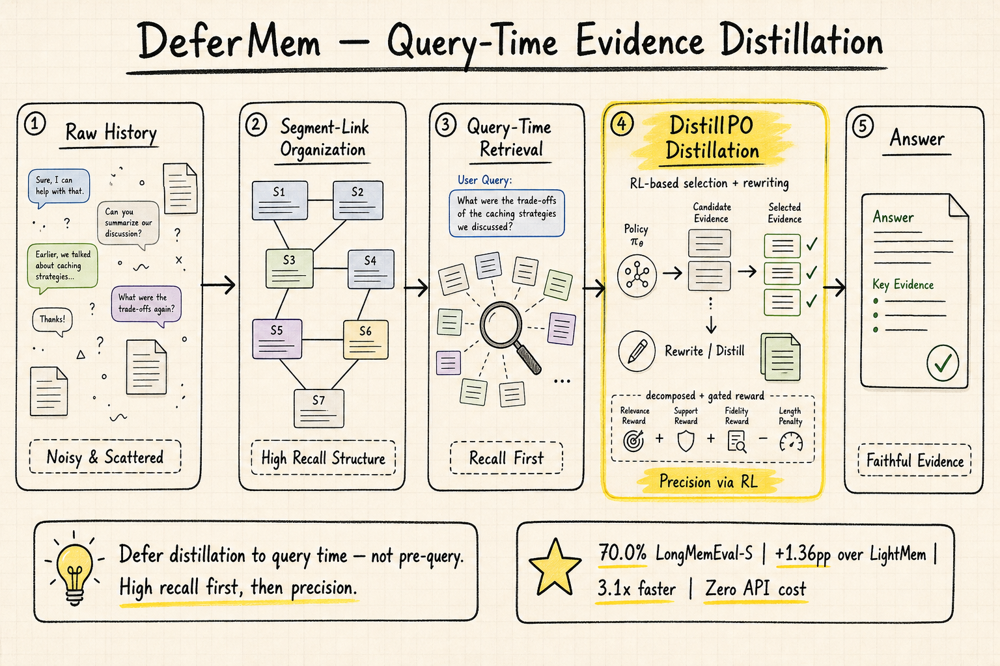

# Agent Memory — 2026-05-26

## 1. DeferMem: Query-Time Evidence Distillation via Reinforcement Learning for Long-Term Memory QA

- **arXiv**: 2605.22411
- **Link**: https://arxiv.org/abs/2605.22411
- **Authors**: Jianing Yin, Tan Tang (Zhejiang University)
- **Submitted**: 2026-05-21

### 這篇在說什麼

LLM agent 的長期記憶問答有一個核心瓶頸：答案所需的證據散落在長對話歷史中，混在大量無關內容裡。現有記憶系統在 query 到來之前就處理記憶（壓縮、更新、遺忘），然後在 query time 用相似度檢索——但相似度不等於回答有用性，檢索出來的候選往往太粗糙，留下大量噪音讓下游 answerer 自己去篩。

DeferMem 的核心洞察是：**延遲蒸餾到 query time**。不要在不知道 query 的時候就決定什麼重要，而是保留原始對話歷史，在 query 到來時再做高召回檢索 + RL 訓練的蒸餾器，把噪音候選蒸餾成精確的、query-conditioned 的證據。

這和 DailyRead 之前追蹤的記憶系統形成清晰對比：SimpleMem（2601.02553）提前壓縮、Mem0 在寫入時管理、A-MEM 用 Zettelkasten 連結——DeferMem 明確反對這種 pre-query 處理，認為它丟失了後來可能重要的細節。

### 主要貢獻

1. **DeferMem 框架**：將長期記憶 QA 解耦為高召回候選檢索 + query-conditioned 證據蒸餾兩階段。不做 pre-query 壓縮，保留原始歷史，在 query time 才蒸餾。
2. **Segment-Link 結構**：輕量級的原始歷史組織方式——把對話切成 segments，用 segment links 連接相關片段，檢索時先用 embedding similarity 找起始 segments，再沿 links 擴展，保證高召回。
3. **DistillPO 演算法**：將 post-retrieval 證據蒸餾建模為結構化行動（message selection + evidence rewriting），用 RL 優化。Decomposed-and-gated reward pipeline 從 validity 到 quality 逐步閘控，structure-aligned advantage assignment 把每個 reward 訊號歸屬到負責的輸出 span。
4. **效率和成本**：在 LoCoMo 和 LongMemEval-S 上達到最高 QA accuracy + 最快 runtime + 零商業 API token cost（記憶操作部分）。

### 方法 / pipeline

DeferMem 的完整流程：

**階段 1：Segment-Link 組織**
- 原始對話歷史被切成 segments（固定長度或語義邊界）。
- Segment links 連接時間相鄰和語義相關的 segments。
- 不做壓縮、不做摘要——保留原始內容。

**階段 2：Query-Time 高召回檢索**
- Query 到來時，用 embedding similarity 檢索起始 segments。
- 沿 segment links 擴展，收集相關 segments 的完整內容。
- 結果是一個高召回但高噪音的候選集。

**階段 3：DistillPO 蒸餾**
- Memory distiller（小型 LM）把候選集蒸餾為一組精確的、self-contained 的、query-conditioned 的證據。
- 結構化行動：先選出有用 messages（message selection），再改寫為精確證據（evidence rewriting）。
- RL 訓練用 decomposed-and-gated reward：validity → relevance → quality，每個 reward 閘控下一個，task-level correctness 最早曝光。Structure-aligned advantage assignment 確保每個 reward 歸屬到正確的輸出 span。

### 實驗設計

- **基準**：LoCoMo 和 LongMemEval-S 兩個長期記憶 QA 基準。
- **比較對象**：多種強基線，包括 LightMem、MemGPT、A-MEM 等。
- **主要結果**：
  - DeferMem 在 LoCoMo 上達到最高 QA accuracy。
  - LongMemEval-S 上 70.0% accuracy，比 LightMem 高 1.36 pp。
  - Runtime 比 LightMem 快 3.1 倍。
  - 記憶操作零商業 API token cost（因為蒸餾器是本地小型 LM）。
- **消融分析**：移除 segment links 降低召回、移除 DistillPO（改用 supervised 蒸餾）降低 accuracy、移除 decomposed reward 降低蒸餾品質。

從全文 HTML 可確認方法細節、實驗設計和主要結果。

### かに讀後判斷

DeferMem 是近期 agent memory 領域最有趣的一篇，因為它挑戰了幾乎所有主流記憶系統的基本假設——在 query 前處理記憶。Segment-Link 結構很輕量，但解決了壓縮丟資訊的問題；DistillPO 的 decomposed reward 設計讓 RL 訓練有了精細的回饋訊號，而不是只有最終 answer correctness 這一個粗粒度 reward。

和 2605.20926（MemConflict）的對話也很有趣：MemConflict 說記憶系統在衝突資訊下容易犯錯，DeferMem 的高召回策略理論上會引入更多衝突候選，但 DistillPO 的蒸餾步驟可能正是在解決這個問題——不是在寫入時決定誰對誰錯，而是在 query time 根據 query 條件蒸餾出最相關的證據。

值得深讀的部分：Section 3 的 DeferMem 形式化（特別是 segment-link 的定義和檢索策略）、DistillPO 的 reward pipeline 設計（Figure 3）、LoCoMo 和 LongMemEval-S 上的詳細 per-category 結果。**今日推薦點開。**

---

## 2. MemConflict: Evaluating Long-Term Memory Systems Under Memory Conflicts

- **arXiv**: 2605.20926
- **Link**: https://arxiv.org/abs/2605.20926
- **Authors**: Zhen Tao, Jinxiang Zhao, Peng Liu, Dinghao Xi, Yanfang Chen, Wei Xu, Zhiyu Li
- **Submitted**: 2026-05-20

### 這篇在說什麼

長期記憶系統的核心挑戰不只是「記住」，而是「在衝突中記住對的」。使用者資訊會隨時間演變（dynamic conflict）、會被錯誤資訊覆蓋（static conflict）、會有條件適用性（conditional conflict）。現有評估多只看最終答案正確率，不區分這些衝突類型，也不分析記憶系統是否正確檢索和排名了有效的記憶候選。

MemConflict 把記憶有效性重新框架為「fitness-for-use」問題：一條記憶候選只有在時間上有效、事實上正確、情境上適用時，才對當前 query 有用。它形式化了三種衝突類型（dynamic/static/conditional），構建了可控的多輪對話基準，並提供黑箱和白箱兩層評估。

### 主要貢獻

1. **三種記憶衝突類型**：dynamic（新狀態覆蓋舊狀態）、static（錯誤陳述不應覆蓋穩定事實）、conditional（不同條件下的偏好都有效但只適用於特定情境）。
2. **可控基準建構**：從結構化使用者 profile 生成多輪對話歷史，跨 session 引入衝突，注入語義相似干擾項，創造候選競爭。
3. **雙層評估協議**：黑箱（最終答案正確率）+ 白箱（記憶檢索和排名分析），區分「找不到正確記憶」和「找到了但沒用好」兩種失敗。
4. **六個系統的診斷性發現**：不同系統在不同衝突類型上有不同強弱，答案正確率常與記憶檢索排名不一致。

### 方法 / pipeline

基準建構流程：
1. 從結構化使用者 profile（人口統計、偏好、生活事件等）生成多輪對話歷史。
2. 跨 session 引入三類衝突：dynamic（用戶搬家、換工作）、static（他人陳述與用戶自述矛盾）、conditional（不同情境下偏好不同）。
3. 注入語義相似干擾項，讓多條候選記憶競爭同一個 query 的檢索。
4. 每個 query 的 ground truth 標註哪條記憶是「有效」的（time-valid, fact-correct, context-applicable）。

評估協議：
- 黑箱：最終答案是否正確。
- 白箱：系統是否檢索到正確的記憶候選？是否把有效候選排在前面？還是正確答案來自錯誤的推理？

### 實驗設計

- **六個記憶系統**：代表性系統（具體型號需見 PDF）。
- **三種衝突類型 × 四種難度變體**：history 長度、干擾項數量、query 顯式性、conflict distance。
- **主要發現**：
  - 答案正確率與記憶檢索排名經常不一致——系統可能找到正確記憶但排名靠後，或答案正確但基於錯誤記憶。
  - 更長的歷史、更多干擾項、更隱式的 query、更大的 conflict distance 都降低效能。
  - Dynamic conflict 最容易處理（時間資訊可用），conditional conflict 最難。
  - 失敗分析：多數錯誤來自 missing supporting memories 和 ineffective use of retrieved memories。

從全文 HTML 可確認框架設計、衝突類型定義、評估協議和主要發現。

### かに讀後判斷

MemConflict 填補了一個重要的評估缺口。之前的 LongMemEval、EvoMemBench、GroupMemBench 主要測試記憶的 recall 和 updating，但沒有系統性地測試衝突情境下的記憶有效性判斷。三種衝突類型的分類（dynamic/static/conditional）很清晰，讓人可以精確地說「這個系統在哪種衝突下會失敗」。

和 DeferMem 的對話：DeferMem 的高召回策略可能引入更多衝突候選，但它的 DistillPO 蒸餾步驟正是在 query time 做衝突解決。MemConflict 的基準可以用來測試 DeferMem 在衝突情境下的表現——這是一個很有價值的交叉驗證。

和 2605.16746（State Contamination）的對話：State Contamination 說記憶壓縮會「洗白」有毒內容但行為影響仍在，MemConflict 的 static conflict 類型正是在測試類似問題——系統能否在矛盾資訊中保留正確的。

值得深讀的部分：Section 4 的實驗結果（六個系統在各衝突類型上的表現）、sensitivity analysis（history 長度、干擾項數量等的影響）、failure analysis 的具體案例。