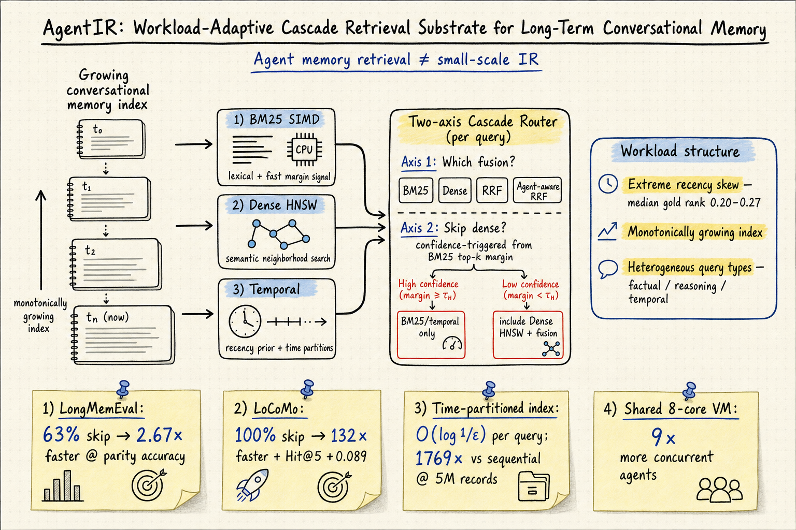

# Agent Memory — 2026-05-27

## 1. AgentIR: A Workload-Adaptive Cascade Retrieval Substrate for Long-Term Conversational Memory

- **arXiv**: 2605.25092
- **Link**: https://arxiv.org/abs/2605.25092
- **Authors**: Zhiyuan Zhang, Haiyue Zhang, Shahin Nazarian (University of Southern California)
- **Submitted**: 2026-05-20

### 這篇在說什麼

Agent memory 的 retrieval 是一個被低估的系統問題。現有記憶系統（MemGPT、Mem0 等）把 agent 的歷史記錄丟進 Elasticsearch 或向量資料庫，用通用 IR 引擎服務查詢——但 agent memory 的 workload 和 web search 完全不同：索引在查詢流中持續增長（P1）、查詢類型在單一 session 內劇烈變化（P2）、每次 retrieval 的延遲預算被 agent 的 reasoning loop 限制在 sub-10ms（P3）。Lucene、FAISS、PISA 都是為靜態索引和穩定查詢分佈設計的，沒有利用 agent memory 的結構特性。

AgentIR 的核心論點是：agent memory 不是「小規模 IR」，而是一個有獨特結構的 distinct workload regime。它的三個結構特性——極端時間偏斜（recency skew）、單調增長的索引、異質查詢類型——可以被一個專門設計的 retrieval substrate 利用，達到比通用 IR 系統好幾個數量級的效率，同時維持或超越品質。

### 主要貢獻

1. **Workload-adaptive cascade routing**：AgentIR 不在 deploy time 固定 fusion 策略，而是在 query time 根據 BM25 top-k margin 做二維決策——(i) 用哪種 fusion（BM25 / Dense / RRF / agent-aware RRF），(ii) 是否花 dense channel 的 52ms 預算。在 LongMemEval 上跳過 63% dense queries（2.67× 加速，品質持平）；在 LoCoMo 上自動調到 100% skip（132× 加速，Hit@5 還提升 0.089）。

2. **Sub-linear retrieval via time-partitioned index**：在 exponential recency skew 下，時間分區索引的每次查詢工作量是 O(log(1/ε))，而非 O(N)。1234× 的 corpus growth（4K → 5M）只造成 3.6× 延遲增長。在 5M records 下比 sequential scan 快 1769×，p50 latency < 100μs。

3. **正確性保證與三個 BM25/GPU bug 修復**：作者發現並修復了三個「靜默回歸 nDCG@10 達 6–8×」的正確性陷阱——BM25 term frequency 的 IDF 計算、GPU kernel 的 float32 精度、以及一個 posting list 截斷問題。修復後 CPU 和 GPU 在所有八個可放入單 A100 的 BEIR 資料集上 nDCG@10 差異 ≤ 0.0002。

### 方法 / pipeline

AgentIR 的架構是三個 channel 並行執行在一個 CSR substrate 上：

**Channel 1：SIMD-vectorized BM25（CPU, ~0.4ms）**
- Posting list 用 SIMD 指令加速 term-at-a-time 評分。
- MaxScore pruning 跳過不可能進 top-k 的 documents。
- 支援 role / session / agent metadata 的硬約束過濾。

**Channel 2：Dense HNSW（CPU, ~52ms）**
- BGE-small 的 embedding + HNSW 近似最近鄰搜尋。
- 這是最慢的 channel，也是 cascade router 決定是否啟動的對象。

**Channel 3：Time-partitioned temporal index**
- 索引按時間分區，利用 agent memory 的 exponential recency skew。
- 查詢時從最近的分區開始搜尋，找到足夠好的結果就停止。
- 理論保證：在 recency bias 下，每次查詢的期望工作量是 O(log(1/ε))。

**Fusion：Agent-aware RRF**
- 標準 RRF（Reciprocal Rank Fusion）融合 sparse 和 dense rank。
- 加上 additive recency bonus（α · e^{-Δt/τ}）和 importance weight（β · w_d）。
- Session 和 role 過濾作為 hard constraints 在 scoring 前應用。

**Cascade Router**
- 從 BM25 top-k 的 margin（Δ = s₁ - s₂）判斷信心。
- 信心夠高 → 跳過 dense channel，直接回傳 BM25 結果（~0.9ms）。
- 信心不夠 → 啟動 dense channel + RRF + recency fusion（~53ms）。
- 閾值 τ_c 可以用少量標記部署查詢自動校準，支援 per-qtype 閾值。

### 實驗設計

- **主要基準**：LongMemEval（n=500）和 LoCoMo（n=1,982）兩個長期記憶 QA 基準。這兩個基準的 query type 分佈不同，正好展示 workload-adaptive 的價值。
- **比較對象**：Pyserini 8T（Lucene）、PISA-1T BlockMax-WAND、SPLADE++、BGE-M3、以及多種 fusion 配置。
- **主要結果**：
  - LongMemEval：cascade 跳過 63% dense queries，2.67× 加速，paired bootstrap p ≥ 0.88（兩個 LLM judge 都同意品質持平）。Per-qtype 閾值在 5-fold CV 下達到 5.76× 加速。
  - LoCoMo：BM25 alone 已是最強單系統，cascade 自動調到 100% skip，132× 加速 + Hit@5 提升 0.089。
  - BEIR 9 資料集（最多 8.8M docs）：品質持平下 10× geo-mean speedup over Pyserini 8T，11× over PISA-1T BlockMax-WAND。A100 上 1.8–39× over Pyserini 8T。
  - 共享 8-core VM 上 concurrent agents 從 ~154 提升到 ~1,400（9×）。
- **消融分析**：作者測試了時間分區、cascade 閾值、recency bonus 參數、dense channel 預算的影響。每個元件都有對應的實驗支持。

從全文 HTML 可確認方法細節、定理證明、實驗設計和所有主要結果。

### かに讀後判斷

AgentIR 是 DailyRead 追蹤的 agent memory 領域裡，最硬核的 systems paper。它不提出新的 memory representation（不像 DeferMem 的 Segment-Link 或 MemOS 的記憶作業系統），而是專注在 retrieval substrate 的效率問題——這個問題在大多數 memory paper 裡被一句「我們用 FAISS/Elasticsearch」帶過，但 AgentIR 用實驗證明這裡有數量級的改善空間。

和昨天追蹤的 DeferMem（2605.22411）形成有趣的對比：DeferMem 在 query time 做 RL-based 蒸餾，AgentIR 在 query time 做 cascade routing；前者是「怎麼把檢索結果變好」，後者是「怎麼把檢索本身變快」。兩者其實互補——DeferMem 的 segment-link 檢索可以換成 AgentIR 的 substrate，而 AgentIR 的 fusion 結果可以作為 DeferMem distiller 的輸入。

也和之前追蹤的 MemReranker（2605.06132，今天也收錄）互補：MemReranker 解決 reranker 本身的推理能力不足問題，AgentIR 解決整個 retrieval pipeline 的延遲和效率問題。理想架構是 AgentIR 做第一階段的高效檢索，MemReranker 做第二階段的推理感知重排序。

值得深讀的部分：Section 4 的三個最佳化（SIMD BM25 + MaxScore、時間分區索引的定理證明、GPU two-kernel pipeline）、Section 5.9 的 cascade router 實驗（特別是 per-qtype 閾值的 5-fold CV 結果）、Section 6 的正確性修復（三個 bug 的詳細描述和修復前後的 nDCG 差異）。**今日推薦點開。**

---

## 2. MemReranker: Reasoning-Aware Reranking for Agent Memory Retrieval

- **arXiv**: 2605.06132
- **Link**: https://arxiv.org/abs/2605.06132
- **Authors**: Mengyuan Zhang, Jingyi Kang, Ding Chen, Jiajun Shen, Bo Tang, Xuanhe Zhou, Feiyu Xiong, Zhiyu Li (MemTensor, China Telecom Research Institute, Shanghai Jiao Tong University)
- **Submitted**: 2026-05-07, v2 2026-05-14

### 這篇在說什麼

Agent memory 系統的 retrieve-then-rerank pipeline 有一個被低估的問題：generic reranker（如 BGE-Reranker）靠語義相似度排序，但「語義相關 ≠ 包含答案」。這在記憶場景特別嚴重——大量對話片段在表面語義上和 query 高度相關，卻不包含回答問題所需的關鍵資訊。MemReranker 把這個問題拆成三個具體症狀：(1) relevance score 校準失敗（分數極度左偏，幾乎全擠在接近 0，無法設定有效閾值）、(2) 面對時間約束和因果推理等複雜查詢時排名崩潰、(3) 無法利用對話上下文做語義消歧（同一個 "Apple" 在手機對話和水果對話中意思完全不同）。

核心問題：能不能把大參數 LLM reranker 的推理能力蒸餾到適合生產部署的小模型（0.6B / 4B）中，同時針對記憶場景做特殊增強？

### 主要貢獻

1. **MemReranker 模型家族（0.6B / 4B）**：基於 Qwen3-Reranker，通過多階段 LLM 知識蒸餾訓練。0.6B 版本在記憶檢索基準上大幅超越 BGE-Reranker，並匹敵開源 4B/8B 模型和 GPT-4o-mini；4B 版本達到 0.737 MAP，多個指標與 Gemini-3-Flash 持平，推理延遲僅為大模型的 10–20%。

2. **Elo / Bradley-Terry 校準評分系統**：解決 reranker 分數校準問題。Multi-teacher pairwise comparison 生成校準後的 soft labels，BCE pointwise distillation 建立分佈良好的分數，InfoNCE contrastive learning 增強 hard sample 區分能力。五級評分系統讓分數從「全擠在 0 附近」變成有區分度的分佈。

3. **記憶場景專用資料工程 pipeline**：包括歷史蒸餾、hard negative 生成、instruction augmentation，讓模型學習 coreference resolution 和 topic drift modeling。

### 方法 / pipeline

**多階段蒸餾流程**：
1. **Multi-teacher pairwise comparison**：多個大模型 teacher 對候選記憶片段做 pairwise 比較，生成 calibrated soft labels（用 Elo / Bradley-Terry 模型校準）。
2. **BCE pointwise distillation**：用校準後的 soft labels 做二元交叉熵訓練，建立 well-distributed 的 relevance score 分佈。
3. **InfoNCE contrastive learning**：在 hard negatives 上做對比學習，增強模型區分語義相關但不含答案的候選的能力。

**資料工程**：
- 通用語料 + 記憶場景專用的多輪對話資料
- 記憶資料覆蓋三種推理需求：時間約束（「兩週前討論的」）、因果推理（「為什麼決定用 A 而不是 B」）、coreference resolution（對話中的代詞消解）
- Hard negative mining：語義相似但不包含答案的片段
- Instruction augmentation：加入對話上下文作為 instruction，讓模型能做語義消歧

### 實驗設計

- **主要基準**：LOCOMO（長期對話記憶檢索基準）
- **比較對象**：BGE-Reranker、開源 4B/8B reranker、GPT-4o-mini、Gemini-3-Flash
- **主要結果**：
  - MemReranker-0.6B 大幅超越 BGE-Reranker，匹敵 4B/8B 開源模型和 GPT-4o-mini
  - MemReranker-4B 達到 0.737 MAP，多個指標與 Gemini-3-Flash 持平
  - 推理延遲 ~200ms，僅為大模型的 10–20%
  - 在金融和醫療垂直領域基準上保持與主流大參數 reranker 相當的泛化能力
- **消融分析**：每個蒸餾階段的貢獻、hard negative 的影響、instruction augmentation 的效果

從全文 HTML 已確認方法細節、實驗設計和主要結果。部分消融實驗細節（特別是 per-category 的 LOCOMO 分析）需要看 PDF 原文。

### かに讀後判斷

MemReranker 和今天推薦的 AgentIR 形成完美的互補：AgentIR 解決「怎麼快速從百萬記憶中檢索」，MemReranker 解決「怎麼在檢索結果中精確排序」。理想的 agent memory retrieval pipeline 是 AgentIR 做 stage-1 cascade retrieval（sub-ms 到 ~50ms），MemReranker 做 stage-2 reasoning-aware reranking（~200ms），兩者加起來仍然比用大模型做 end-to-end 檢索快得多。

和昨天追蹤的 DeferMem 也有關聯：DeferMem 的 DistillPO 可以看作是在 reranking 之後再做一步 query-conditioned 蒸餾，把排序好的候選進一步精煉成 self-contained 證據。所以完整 pipeline 是：AgentIR → MemReranker → DeferMem DistillPO，三層遞進。

MemReranker 的校準評分系統是值得注意的工程貢獻——把 reranker 分數從無意義的左偏分佈變成有區分度的五級評分，這在生產系統中非常重要，因為你需要閾值來決定「哪些記憶夠相關、可以直接用」vs「哪些需要再確認」。這是 DailyRead 之前追蹤的記憶系統都沒有解決的問題。

值得深讀的部分：Elo/Bradley-Terry 校準的具體實現、LOCOMO 上的 per-category 分析、金融和醫療基準上的泛化實驗。

---

## 3. SkillRet: A Large-Scale Benchmark for Skill Retrieval in LLM Agents

- **arXiv**: 2605.05726
- **Link**: https://arxiv.org/abs/2605.05726
- **Authors**: Youngeun Kim et al.
- **Submitted**: 2026-05-07

### 這篇在說什麼

當 LLM agent 的技能庫越來越大時，「選對技能」本身就是一個檢索問題。使用者不再能靠名字呼叫技能，系統需要從數千甚至數萬個技能中找到最適合當前請求的那個。但這個 skill retrieval 問題幾乎沒有被系統性地研究過——現有 benchmark 規模太小，也沒有在真實大規模技能庫上的評估。

SkillRet 填補這個空白：17,810 個公開 agent skills、63,259 個訓練樣本、4,997 個評估查詢（與技能池不重疊）。它的兩級分類法（6 大類 18 子類）提供了結構化的語義標籤，讓研究者可以分析不同檢索策略在不同類型技能上的表現。

### 主要貢獻

1. **SkillRet benchmark**：目前最大規模的 skill retrieval 基準，包含 17,810 個技能、結構化語義標籤、disjoint 評估集。
2. **系統性評估**：跨多種 retriever（sparse、dense、hybrid）的全面評估，發現 off-the-shelf 模型在大規模技能庫上表現遠不如預期。
3. **Task-specific fine-tuning 的重要性**：在 SkillRet 上微調後，NDCG@10 比最強 prior retriever 提升 +13.1，比最強 off-the-shelf retriever 提升 +16.9。分析顯示這些增益來自模型更好地聚焦在長且噪音的 query 中的技能相關信號。

### 方法 / pipeline

- **技能收集**：從公開 agent 技能生態系統收集 17,810 個技能，每個技能包含名稱、描述、參數規格、返回值描述。
- **分類法**：6 大類（資訊檢索、資料處理、通訊、創作、系統管理、其他）、18 子類的兩級語義標籤。
- **查詢生成**：4,997 個評估查詢，與技能池 disjoint，確保不會因為訓練集出現過類似技能而作弊。
- **評估指標**：NDCG@10、Recall@k、MRR 等標準 IR 指標。

### 實驗設計

- **評估的模型**：BM25、各種 dense retriever（包括 BGE-M3、E5 等）、hybrid 方法。
- **主要發現**：
  - Off-the-shelf 模型在大規模技能庫上 struggle：隨著技能數量增加，檢索性能急劇下降。
  - Task-specific fine-tuning 在 SkillRet 上大幅提升性能。
  - 增益主要來自模型更好地從長且噪音的 query 中提取技能相關信號。
- 目前只能從 abstract 確認主要結果，詳細的 per-category 分析和消融實驗需要看全文 PDF。

### かに讀後判斷

SkillRet 和 AgentIR 形成有趣的對比：SkillRet 解決的是「從技能庫中選擇技能」的檢索問題，這是 agent memory retrieval 的一個特例——技能描述是結構化的、技能庫是相對靜態的、query 是一次性的。而 AgentIR 解決的是「從長期記憶中檢索對話片段」，記憶是持續增長的、片段是非結構化的、查詢類型是異質的。

SkillRet 的 benchmark 設計對 DailyRead 追蹤的 harness engineering 也有參考價值：它提供了一個結構化的技能檢索評估協議，可以用來評估 agent 的技能選擇能力。但目前的分析深度受限於只能看到 abstract 和 landing page，無法確認詳細的實驗設計和消融分析。標記為「僅 abstract 層級快速掃描」。