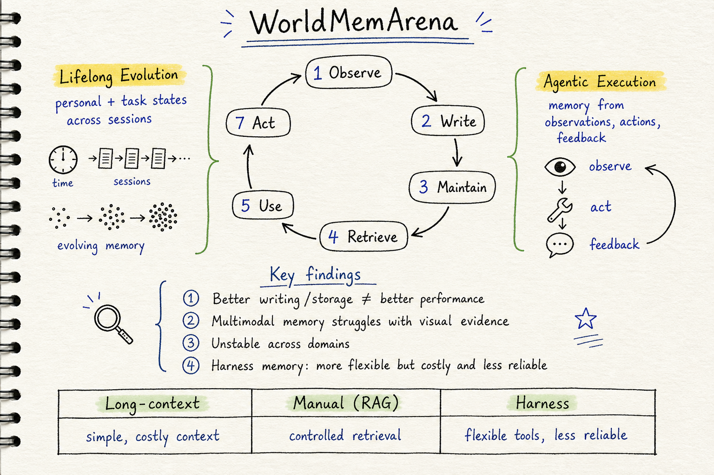

# Agent Memory — 2026-05-31

## 1. WorldMemArena: Evaluating Multimodal Agent Memory Through Action–World Interaction

- **arXiv**: 2605.29341
- **Link**: https://arxiv.org/abs/2605.29341
- **Authors**: Chengzhi Liu, Yuzhe Yang, Sophia Xiao Pu, Yepeng Liu, Lin Long, Yichen Guo, Nuo Chen, Zhaotian Weng, Elena Kochkina, Simerjot Kaur, Charese Smiley, Xiaomo Liu, James Zou, Sheng Liu, Yuheng Bu, Songyou Peng, Xin Eric Wang (UCSB, Google, Stanford 等)
- **全文讀取**: arXiv HTML 全文前段 ✓（abstract, introduction, related works, problem formulation 均已讀取）

### 這篇在說什麼

現有的 agent memory benchmark 有三個根本問題：(i) 它們主要測量 **recall over static dialogue**——測的是「你記不記得之前說過什麼」而不是「你能不能用過去經驗指引未來行動」；(ii) 它們把 memory 評估壓成 **單一的 end-of-task accuracy**，讓你無法定位失敗到底發生在 write / maintain / retrieve / use 哪個階段；(iii) 它們把視覺觀察 **降級成文字描述**，迴避了真正的 multimodal memory 問題。

WorldMemArena 的核心重構是：把 multimodal agent memory 定義為一個 **Action–World Interaction Loop**，memory 不是靜態快照，而是一個有可觀測四階段生命週期的過程——Write（從觀察中提取未來有用的證據）、Maintain（隨世界演變更新記憶）、Retrieve（在決策時找到正確證據）、Use（將檢索到的證據忠實用於回應或行動）。

這補的洞很重要：隨著 OpenClaw、Codex 等 agent harness 讓 agent 自己撰寫和管理記憶，我們需要一個能公平比較 hand-designed pipelines 和 self-managing alternatives 的評估框架，而現有 benchmark 做不到。

### 主要貢獻

1. **Action–World Interaction Loop + 四階段生命週期**：把 memory 評估從 recall-only 重構為可診斷的四階段（Write / Maintain / Retrieve / Use），讓你能定位「memory 到底在哪裡壞了」。

2. **WorldMemArena benchmark**：400 個 multi-session multimodal tasks，涵蓋兩個互補 regime：
   - **Lifelong Evolution**：跨 session 演變的個人狀態和任務狀態，測試持續追蹤和更新能力
   - **Agentic Execution**：從真實 agent 軌跡中的觀察、行動、反饋提取可重用證據

3. **Gold annotations**：每個 session 都有標註的 gold memory points、state updates、distractors 和 evidence chains，支援 stage-level diagnosis。

4. **首次 head-to-head 比較**：long-context agents vs. manually designed (RAG + external memory) vs. harness-based memory agents。結果發現：
   - 更好的 writing/storage 不保證更好的 performance——關鍵是能不能在 answer time 正確使用
   - Multimodal memory 仍是重大瓶頸，尤其在複雜視覺推理任務
   - 系統跨 domain 不穩定，在真實 agentic 軌跡上顯著退化
   - Harness memory 更靈活但更昂貴且更不可靠

### 方法 / pipeline

WorldMemArena 的數學表述很清晰：

每個 instance 是一個 long-horizon agent-world interaction process。在 step t，世界有 latent state z_t，agent 收到 observation o_t = Ω(z_t)，基於 observation 和當前 memory state m_t 選擇 action a_t = π(o_t, m_t)，環境回傳 feedback f_t。完整軌跡 τ = (x; η_1, ..., η_T) 被分割成多個 sessions。

四階段生命週期：
- **Write**: Δ_s = Write(m_{s-1}, τ^{(s)})，從當前 session 中選擇性保留未來有用的證據
- **Maintain**: m_s = Maintain(m_{s-1}, Δ_s)，整合新寫入的資訊到既有記憶，支援修訂和合併
- **Retrieve**: R_{s,q} = Retrieve(m_s, q)，根據查詢取出相關證據
- **Use**: ŷ_{s,q} = Answer(q, R_{s,q})，用檢索到的證擭產生回應

Table 1 是 WorldMemArena 和 LoCoMo、LongMemEval、MemoryBench 等 benchmark 的詳細比較——WorldMemArena 是唯一同時涵蓋 Write / Update / Retrieve / Use 四個生命週期階段的。

### 實驗設計

- **400 multi-session multimodal tasks**：Lifelong Evolution + Agentic Execution 兩個 regime
- **Gold annotations**：memory points、state updates、distractors、evidence chains
- **三類 memory paradigm 比較**：
  - Long-context（把所有東西放在 context window 裡）
  - Manually designed（RAG + external memory systems）
  - Harness-based（agent 自己管理記憶）
- **四個核心發現**：
  1. Better memory writing/storage ≠ better performance
  2. Multimodal memory 仍是瓶頸（尤其視覺推理）
  3. 跨 domain 不穩定，在 agentic 軌跡上退化
  4. Harness memory 更靈活但成本高且不可靠
- 從全文確認：Table 1 的 benchmark comparison 和 Figure 2 的現有 benchmark 批評圖都很有資訊量

### かに讀後判斷

WorldMemArena 在 agent memory 領域的位置很重要——它是第一個把 memory 評估從「最終 QA accuracy」拆解成「四階段診斷」的 multimodal benchmark，而且直接回應了 harness-based memory agents 的崛起。和 5/30 的 MemGym（memory-isolated scoring）互補：MemGym 聚焦在「分離 memory 效果和 reasoning 能力」，WorldMemArena 聚焦在「拆解 memory 生命週期的每個階段」。

值得深讀的部分：
- Section 3 的 formalization（Action-World Interaction Loop 的數學表述）
- Table 1（和現有 benchmark 的比較）
- Figure 2（現有 benchmark 的三個問題視覺化）
- Section 4 的三類 paradigm 比較結果
- 400 tasks 的具體任務分佈和 annotation 設計

**今日推薦點開**。

## 2. StructMemEval: Evaluating Memory Structure in LLM Agents

- **arXiv**: 2602.11243 (v2, updated 2026-05-22)
- **Link**: https://arxiv.org/abs/2602.11243
- **Authors**: Alina Shutova, Alexandra Olenia, Ivan Vinogradov, Anton Sinitsin (HSE, Yandex, YSDA, NES)
- **全文讀取**: arXiv HTML 全文前段 ✓（abstract, introduction, background, StructMemEval 設計均已讀取）

### 這篇在說什麼

現有的 memory benchmark（LoCoMo、LongMemEval）主要測的是 **fact retention**——單跳查詢、多跳查詢、時間性更新。但最近的研究（EMem、EMem-G）顯示，簡單的 retrieval-augmented LLM 就能在這些 benchmark 上超越複雜的 memory architectures。這意味著這些 benchmark 沒有測到 memory 真正需要複雜架構的能力。

StructMemEval 補的洞是：memory 的核心價值不只是「記住事實」，而是「組織知識」。人類用 ledger、tree、to-do list、index 等結構來組織知識，如果一個問題需要知識組織，簡單的 message retrieval 就會在某個規模後失效，但更靈活的 agentic memory 可能成功——前提是 LLM 能識別出需要什麼結構。

### 主要貢獻

1. **StructMemEval benchmark**：51 個 scenarios，≥200 個 additional tasks，專注測試知識組織能力而非事實記憶。涵蓋 transaction ledgers、family trees、corporate hierarchies、state tracking、user preferences 等。

2. **結構-能力分離設計**：每個 task 在「有正確結構時很簡單，沒有結構時幾乎不可能」的原則下設計，把 memory organization 和其他 LLM 能力解耦。

3. **Failure mode 分析**：systematic 分析 memory agents 在 StructMemEval 上的失敗模式——incorrect structures、memory hallucinations、record duplication 等。

4. **Prompt hint 效果**：memory agents 在被提示如何組織記憶時能可靠解決問題，但沒有提示時常常無法識別需要的結構——LLM 能解決抽象演算法問題，但在「野生」情境下無法識別同樣的結構模式。

### 方法 / pipeline

StructMemEval 的核心設計原則是 **implementation-agnostic**：只評估最終答案，不評估內部結構，但設計問題使得解決它們需要特定形式的知識組織。

六大結構類型：
- **Tree-structured problems**：family trees、corporate hierarchies——需要維護層級知識，包括隱含關係推導（如「C 是 B 的妻子」→「C 是 A 的 parent」）
- **State tracking problems**：從間接觀察追蹤狀態變化（如「門開了」vs「門被打開了」vs「門還開著」）
- **Transaction ledgers**：財務結算、餘額追蹤
- **To-do lists**：優先級排序、依賴關係
- **Index/search structures**：倒排索引、分類索引
- **Aggregations**：running statistics、moving averages

### 實驗設計

- **51 main scenarios + ≥200 additional tasks**
- **比較對象**：retrieval-augmented LLM（EMem baseline）vs. memory agents（MemGPT、A-Mem 等）
- **核心發現**：
  - 簡單 RAG 在需要結構的問題上超過一定規模後失效
  - Memory agents 在被提示結構時可靠解決
  - 沒有提示時 LLM 常常無法識別需要的結構
- **從全文確認**：Figure 1 展示了 tree / state tracking / ledger 三種結構的例子，直觀說明了為什麼結構很重要

### かに讀後判斷

StructMemEval 和今天的 WorldMemArena 從不同角度切入同一個問題——WorldMemArena 問「memory 生命週期的哪個階段壞了」，StructMemEval 問「memory 系統能不能組織知識而不只是記住事實」。兩者互補。

StructMemEval 的核心洞見「LLM 能解決抽象演算法問題但無法在野生情境識別同樣的結構」對 memory agent 設計很重要——這暗示了自動結構識別（而非依賴提示）是未來的重要方向。

值得深讀的部分：
- Section 3 的六大結構類型設計
- Figure 1 的結構例子
- Section 4 的 failure mode 分析
- 被提示 vs. 未被提示的 performance 差距

建議 Morris 有空時看全文的 failure mode 分析部分。不作為今日推薦（和 WorldMemArena 相比，StructMemEval 的 v2 更新在 5/22，新鮮度稍低，且 WorldMemArena 的 multimodal 和 harness 比較更直接相關）。

## 3. MedMemoryBench: Benchmarking Agent Memory in Personalized Healthcare

- **arXiv**: 2605.11814
- **Link**: https://arxiv.org/abs/2605.11814
- **Authors**: Yihao Wang, Haoran Xu, Renjie Gu, et al. (螞蟻集團、浙江大學等)
- **全文讀取**: ⚠️ 僅 abstract 層級（arXiv HTML 不可用）

### 這篇在說什麼

個人化醫療 agent 的部署需要異常精確、安全、能長期臨床追蹤的記憶機制。但現有 benchmark 主要聚焦日常開放域對話，無法捕捉真實醫療應用的高風險複雜性。MedMemoryBench 由一個服務數千萬活躍用戶的業界領先健康管理 agent 的生產需求驅動，開發了 human-agent collaborative pipeline 來合成高度逼真的長期醫療軌跡，基於臨床接地的合成患者原型。產出約 2,000 個 sessions、16,000 個 interaction turns。

更重要的是，MedMemoryBench 首創「evaluate-while-constructing」streaming assessment protocol，精確反映生產環境中的動態記憶積累。並系統性研究了 **memory saturation** 現象——持續的資訊流入反而降低檢索和推理穩健性。

### 主要貢獻

1. **MedMemoryBench**：~2,000 sessions、~16,000 turns、expert-validated 的醫療 memory benchmark。

2. **Streaming assessment protocol**：evaluate-while-constructing，反映動態記憶積累。

3. **Memory saturation 研究**：系統性揭示持續資訊流入如何降低檢索和推理。

4. **主流架構瓶頸揭示**：在複雜醫療推理和噪音抗性方面有嚴重瓶頸。

### 方法 / pipeline

目前只能從 abstract 確認：human-agent collaborative pipeline 合成醫療軌跡，基於臨床接地的合成患者原型。具體的 pipeline 細節、memory saturation 的定義和測量方式、baseline 比較都需要全文確認。

### 實驗設計

- ~2,000 sessions, ~16,000 turns
- Expert-validated
- Streaming assessment protocol
- Memory saturation 現象的系統性研究
- 主流 memory 架構在醫療場景的瓶頸分析
- 具體 metric 和 baseline 比較結果需要全文確認

### かに讀後判斷

MedMemoryBench 在 agent memory 領域開了一個重要新方向——醫療場景的 memory evaluation。和今天的 WorldMemArena（multimodal agent memory）和 StructMemEval（知識組織）不同，MedMemoryBench 聚焦在一個高風險、有真實生產需求的垂直領域。memory saturation 的研究特別有趣——它直接挑戰了「更多記憶 = 更好表現」的直覺。

不過目前只讀到 abstract，無法確認 streaming assessment protocol 的具體設計和 memory saturation 的實驗細節。建議 Morris 點開 PDF 看 evaluate-while-constructing 的設計和 saturation 實驗。不作為今日推薦（僅 abstract）。