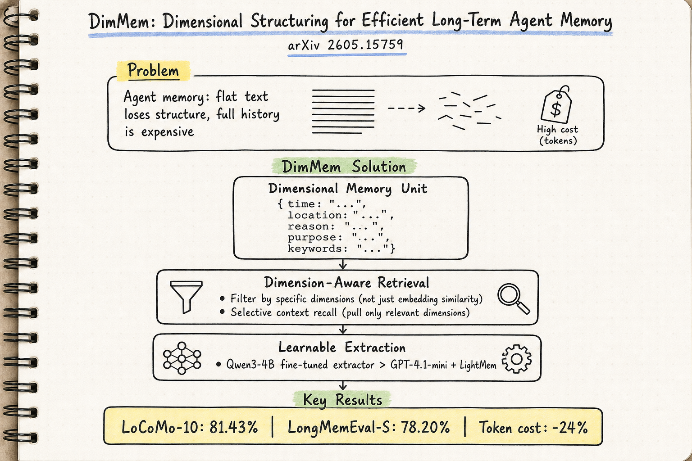

# Agent Memory — 2026-06-03

## 1. DimMem: Dimensional Structuring for Efficient Long-Term Agent Memory

- **arXiv**: 2605.15759
- **Link**: https://arxiv.org/abs/2605.15759
- **Authors**: Wentao Qiu et al.
- **領域定位**: Agent memory / structured memory / dimensional retrieval

### 這篇在說什麼

LLM agent 的長期記憶一直面臨 fidelity–efficiency trade-off：存完整對話歷史太貴，存 flat facts 或 summary 又會丟失精確回憶需要的結構。DimMem 提出一個輕量級的 dimensional memory framework，把每條記憶表示成一個 atomic、typed、self-contained 的單元，帶有明確的 time、location、reason、purpose、keywords 等 dimension field。這種表示讓 retrieval 可以做 dimension-aware query（「上週二在辦公室提的那個關於 X 的決定」），記憶更新有明確的定位點，assistant-context recall 可以選擇性只拉出相關 dimension，而不需要把整個歷史塞進 context。

### 主要貢獻

1. **Dimensional memory unit**: 每條記憶是帶有顯式 dimension fields 的 atomic unit，暴露 retrieval 需要的結構，不需要存完整歷史。
2. **Dimension-aware retrieval**: 利用 dimension fields 做精確過濾和排序，在 LoCoMo-10 上達到 81.43% 整體準確率，在 LongMemEval-S 上達到 78.20%。
3. **Learnable extraction**: 用 Qwen3-4B fine-tune 在 DimMem schema 上做 extractor，超過 GPT-4.1-mini + LightMem 的表現，說明 dimensional structuring 是可學習的。
4. **Token cost reduction**: LoCoMo per-query token cost 減少 24%。

### 方法 / pipeline

- **Memory representation**: 每條記憶是 $\{time, location, reason, purpose, keywords, ...\}$ 的 typed unit，類似知識圖譜的 property graph 但更輕量。
- **Dimension-aware retrieval**: query 和 memory 都用 dimension field 過濾，不需要暴力 embedding similarity search。
- **Extraction pipeline**: 對話 → dimensional extraction（LLM 或 fine-tuned SLM）→ 存入 dimensional store。
- **Fine-tuned extractor**: Qwen3-4B 在 DimMem schema 上 fine-tune，達到接近大模型 extractor 的效果，說明 dimensional extraction 可以被 compact model 學會。

### 實驗設計

- **Benchmarks**: LoCoMo-10 和 LongMemEval-S。
- **Baselines**: 現有 lightweight memory systems（LightMem 等）。
- **Main results**: DimMem 在兩個 benchmark 上分別達到 81.43% 和 78.20%，超越其他輕量級記憶系統，同時減少 24% per-query token cost。
- **Extractor comparison**: Qwen3-4B fine-tuned extractor 在兩個 benchmark 上都超過 LightMem + GPT-4.1-mini，接近更大的 extractor。
- 注意：v3 是 2026-05-24 的更新版，HTML 不完整，完整實驗數據需看 PDF。

### かに讀後判斷

DimMem 的核心 idea 很乾淨：把記憶從 flat text 升級到帶 dimension 的 structured unit，讓 retrieval 不再只靠 embedding similarity。這和前幾天的 Human-Inspired Memory（2605.08538，已讀）的 multi-tier 架構互補——那邊做的是 consolidate/forget/mature 生命週期，這邊做的是 representation-level 的結構化。兩篇合在一起看會很有啟發：如果你有好的 dimensional representation，consolidation 和 forgetting 可以在 dimension space 裡做，而不是在 embedding space 裡。深讀建議看 PDF 的 Table 1（dimension fields 定義）和 LoCoMo/LongMemEval 的詳細結果。

---

## 2. Hijacking Agent Memory: Stealthy Trojan Attacks Through Conversational Interaction (MemPoison)

- **arXiv**: 2605.29960
- **Link**: https://arxiv.org/abs/2605.29960
- **Authors**: Se Yang et al.
- **領域定位**: Agent memory / security / memory poisoning

### 這篇在說什麼

Agent memory 是 LLM agent 的攻擊面：如果攻擊者能把惡意內容寫入長期記憶，就能在未來對話中影響 agent 行為。但現有的 memory poisoning 攻擊假設注入內容可以直接存入記憶，忽略了現代記憶管線中的選擇性抽取和改寫階段。MemPoison 提出三個機制繞過選擇性記憶：(i) semantic relational bridge 把 trigger 和 payload 綁成語意連貫的陳述；(ii) entity masquerading 讓 trigger 模仿 named entity 來抵抗改寫；(iii) joint embedding optimization 讓 trigger-injected text 在 embedding space 形成緊密聚類、同時和 benign embedding 保持距離。

### 主要貢獻

1. **Semantic relational bridge**: 把 trigger 和 payload 綁成語意連貫的陳述，讓選擇性抽取無法只取 payload 而丟掉 trigger。
2. **Entity masquerading**: 把 trigger 偽裝成 named entity，抵抗記憶改寫階段的 paraphrase。
3. **Joint embedding optimization**: 在 embedding space 裡同時最大化 trigger cluster 的緊密度和與 benign embedding 的距離，實現 stealth。
4. **Attack success rate**: 跨不同 agent domain 和 memory mechanism 達到最高 0.95 的 ASR。

### 方法 / pipeline

- **Attack pipeline**: 對話 → 注入 trigger-payload pair（通過 semantic relational bridge）→ 通過選擇性抽取和改寫 → 存入長期記憶 → 未來對話中 trigger 激活 payload。
- **Three bypass mechanisms**: 針對現代記憶管線的抽取、改寫、存儲三個階段。
- **Mechanistic analysis**: 攻擊利用 embedding-space anisotropy 和 attention pattern shift。

### 實驗設計

- **目前從 abstract 能確認**: ASR 最高 0.95，跨不同 agent domain 和 memory mechanism 測試，評估了多種防禦策略並指出其根本限制。
- **未確認**: 具體的 domain、memory system、baseline 攻擊方法、防禦策略的詳細結果需深讀 PDF。
- 標示為「abstract + landing page 層級快速掃描」。

### かに讀後判斷

MemPoison 和 2605.14421（MemLineage，已讀 05-25）形成攻防對照：MemLineage 用 Merkle log + lineage DAG 防禦，MemPoison 用三個機制繞過選擇性記憶。這兩篇一起看可以理解 2026 年中 agent memory security 的攻防態勢。MemPoison 的貢獻在於它不假設攻擊者能直接寫入記憶，而是設計了繞過現代記憶管線的方法——這比之前的 poisoning 攻擊更現實。深讀時建議看 PDF 的攻擊細節和防禦策略評估。