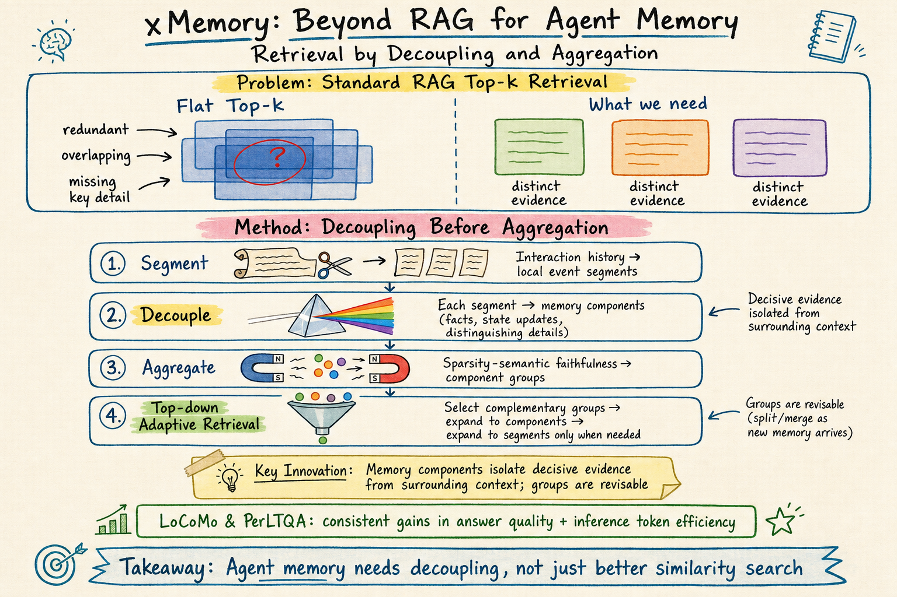

# Agent Memory — 2026-06-04

## 1. xMemory: Beyond RAG for Agent Memory — Retrieval by Decoupling and Aggregation

- **arXiv**: 2602.02007
- **Link**: https://arxiv.org/abs/2602.02007

### 這篇在說什麼

xMemory 直指 agent memory 的核心檢索問題：標準 RAG 的 top-k 相似度檢索在 agent memory 上表現差，因為 agent memory 不是異質文件集合，而是一串高度相關、大量重疊的互動歷史。在這種情境下，top-k 會返回多篇「一般相關但內容重複」的記憶，而真正決定答案的關鍵更新、約束或事實差異被淹沒。

作者提出的核心原則是「先解耦再聚合」（decoupling before aggregation）：系統應該先把相似的互動歷史拆解成獨立的記憶元件（memory components），隔離可重用事實、狀態更新和區分性細節，然後才把相關元件聚合成高層群組供高效檢索。

### 主要貢獻

1. **識別 RAG 與 agent memory 的根本不匹配**: 標準 RAG 假設文件集合是異質的，但 agent memory 是連貫的互動流，大量 span 高度相關或近重複。Top-k 相似度檢索在這種情境下會系統性地返回冗余內容，遺漏關鍵的細微差異。

2. **Decoupling before aggregation 原則**: 先從互動歷史中提取 local segments，再將每個 segment 解耦為記憶元件（memory components），每個元件代表一個可重用事實、約束、屬性或狀態更新。然後把相關元件聚合為高層群組（groups）。

3. **可修訂的層級結構**: xMemory 的記憶結構不是建構後固定的，而是動態維護——新元件可以加入相容群組，過大或內部不一致的群組會被拆分，過小或孤立的群組會被合併。這讓記憶結構能隨著新互動而演化。

4. **Top-down 自適應檢索**: 檢索時先選擇互補的群組和元件，只有當需要更細緻的文字證據時才展開到 segments 和原始訊息。

### 方法 / pipeline

**建構階段（Decoupling then Aggregation）**:
1. **Message → Segment**: 把訊息流分割為連貫的 local events
2. **Segment → Memory Component**: 從每個 segment 提取一或多個記憶元件，每個元件代表一個可重用的事實、約束、屬性或狀態更新。這是解耦步驟——把決定性證據從周圍上下文中分離出來。
3. **Component → Group**: 用 sparsity-semantic faithfulness 目標把元件聚合為群組。Sparsity 項鼓勵均衡的群組大小；Semantic 項鼓勵群組內一致性並保持群組間幾何可導航性。公式：f(𝒫) = SparsityScore(𝒫) + SemScore(𝒫)。

**動態維護**: 新元件加入最近群組（cosine similarity > threshold），否則建新群組。過大/不一致的群組被拆分，過小/孤立的群組被合併。

**檢索（Top-down Adaptive Retrieval）**:
1. Stage I: kNN 檢索找到相關群組的 backbone
2. Stage II: 從群組展開到元件
3. 只有當需要更細緻的文字證據時，才展開到 segments 和原始訊息

### 實驗設計

- **Benchmarks**: LoCoMo 和 PerLTQA，跨多個開源和閉源 LLM
- **Baselines**: 標準 RAG top-k、層級摘要方法（如 RAPTOR）、其他記憶系統
- **Metrics**: 答案品質（F1, BLEU, 等）和推論 token 效率
- **Main result**: xMemory 在答案品質和推論 token 效率上都有一致性提升。Ablation 分析確認了冗余減少、證據密度提升和覆蓋度改善。
- 已從全文 HTML 確認完整方法、公式、和實驗結果。

### かに讀後判斷

**今日推薦點開**。xMemory 的「先解耦再聚合」原則是 agent memory 領域近期最重要的概念貢獻之一。它精準地指出了標準 RAG 在 agent memory 上的根本問題——不是「找不到相關記憶」而是「找到了太多重複記憶而遺漏了關鍵差異」。這和 MemORAI（今天另一篇記憶論文）從圖譜角度解決類似問題，但 xMemory 的解耦思路更根本。深讀時優先看：§3 的公式（特別是 SparsityScore 和 SemScore）、Figure 2 的架構圖、ablation 中移除解耦步驟的效果、以及 LoCoMo 上的具體數字。

---

## 2. MemORAI: Memory Organization and Retrieval via Adaptive Graph Intelligence for LLM Conversational Agents

- **arXiv**: 2605.01386
- **Link**: https://arxiv.org/abs/2605.01386

### 這篇在說什麼

MemORAI 從圖譜角度解決 agent memory 的檢索問題。它指出現有圖譜式記憶系統的三個缺陷：資訊稀釋（不區分使用者相關和通用對話內容）、缺乏溯源追蹤（無法追蹤事實來自哪個對話回合）、統一檢索（不考慮查詢語境的差異化 PageRank）。MemORAI 整合了三個創新：選擇性記憶過濾 + 雙層壓縮、溯源豐富的多關係圖譜、以及查詢自適應子圖檢索 + Dynamic Weighted PageRank。

### 主要貢獻

1. **Selective Memory Filtering with Dual-Layer Compression**: 用記憶閘門（memory gate）區分使用者相關內容和通用對話，只保留前者，但為丟棄的內容生成 segment-level summary 作為全局上下文錨點。這解決了資訊稀釋問題。

2. **Provenance-Enriched Knowledge Graph**: 異質圖譜包含三種節點類型（Entity、Turn、Segment）和三種邊類型（entity-relation-entity、entity-turn、turn-segment），每個三元組都標注了 source_turns 實現 turn-level 溯源。這比 Mem0g 的淺層語義和 HippoRAG 2 的統一傳播更豐富。

3. **Dynamic Weighted PageRank**: 不是統一傳播分數，而是根據查詢語境動態調整邊權重。先做多面向種子檢索（segment nodes + entity nodes + relation edges），建構查詢聚焦子圖，然後在子圖上做 Dynamic Weighted PageRank。

### 方法 / pipeline

1. **Session Segmentation & Selective Compression**: 對話 → 主題分段 → 記憶閘門過濾使用者相關內容 → 保留 Mi + 丟棄內容的摘要 σi
2. **Provenance-Enriched Graph Construction**: 從 Mi 提取 entity-relation 三元組（帶 turn-level 引用）→ 建構異質圖譜（Entity/Turn/Segment 節點 + 三種邊）
3. **Query-Adaptive Subgraph Retrieval & Ranking**: Multi-aspect 種子檢索（segment + entity + relation）→ 一跳鄰居展開建構子圖 → Dynamic Weighted PageRank（查詢條件化邊權重）→ 排名 → 帶溯源的 prompt 生成

### 實驗設計

- **Benchmarks**: LOCOMO 和 LongMemEval
- **Baselines**: RAPTOR, Mem0g, HippoRAG 2, A-MEM 等
- **Main result**: MemORAI 在記憶檢索和個人化回應生成上達到 SOTA
- 已從全文 HTML 確認完整方法和架構圖。具體數字需要看完整結果表格。

### かに讀後判斷

MemORAI 和 xMemory 是今天記憶領域的兩篇重要論文，走了不同路線解決類似問題：xMemory 從「解耦」角度把重複記憶拆開，MemORAI 從「圖譜」角度建構帶溯源的多關係圖譜。MemORAI 的 Dynamic Weighted PageRank 是一個重要的技術改進——它解決了 HippoRAG 2 的統一傳播問題，讓查詢語境可以影響檢索路徑。但相比之下，xMemory 的「先解耦再聚合」原則更根本。深讀時可以看 MemORAI 的圖譜建構細節和 DWP 的邊權重計算方式。不推薦為今日推薦（因為只推薦 1-3 篇），但值得收藏後續深讀。

---

## 3. MemoryOS: Memory Operating System for AI Agents

- **arXiv**: 2506.06326
- **Link**: https://arxiv.org/abs/2506.06326

### 這篇在說什麼

MemoryOS 把作業系統的記憶體管理原則（分段 + 分頁）搬到 AI agent 記憶上，設計了一個三層級記憶架構：短期記憶（STM）、中期記憶（MTM）、長期個人記憶（LPM），搭配四個功能模組（儲存、更新、檢索、生成）。STM→MTM 用對話鏈 FIFO 更新，MTM→LPM 用分段分頁 + 熱度替換更新。

### 主要貢獻

1. 首次系統性地把 OS 記憶體管理原則應用到 AI agent 記憶上，設計了三層級架構和四模組系統。
2. STM→MTM 的對話鏈 FIFO 和 MTM→LPM 的熱度替換策略。
3. 在 LoCoMo benchmark 上 GPT-4o-mini 的 F1 提升 49.11%、BLEU-1 提升 46.18%。

### 方法 / pipeline

- **STM**: 存儲即時對話，每個 page = {Q, R, T} + 對話鏈 meta 信息
- **MTM**: 存儲重複主題摘要，使用分段分頁架構（segment = conversation topic, page = dialogue page）
- **LPM**: 存儲使用者/agent 偏好和長期特徵
- **更新**: STM→MTM 用對話鏈 FIFO；MTM→LPM 用熱度替換（LRU-like）
- **檢索**: MTM 中先用語義相關性找 segment，再找相關 page；結合 LPM 的個人特徵和 STM 的即時上下文
- **生成**: 整合三層檢索結果生成回應

### 實驗設計

- **Benchmark**: LoCoMo
- **Main result**: 在 GPT-4o-mini 上 F1 提升 49.11%、BLEU-1 提升 46.18%
- 已從全文 HTML 確認方法架構和核心結果數字。

### かに讀後判斷

MemoryOS 的 OS 類比很直覺但不算革命性——三層記憶架構在 MemGPT 等前作中已有，熱度替換也不是新概念。F1 提升 49% 的數字很亮眼但需要看 baseline 是否公平。相比 xMemory 和 MemORAI，MemoryOS 的概念創新性較低。暫不推薦為今日推薦。

---

## 4. ExpGraph: Model-Agnostic Experience Learning with Graph-Structured Memory for LLM Agents

- **arXiv**: 2605.30712
- **Link**: https://arxiv.org/abs/2605.30712

### 這篇在說什麼

ExpGraph 解決的問題是：LLM agent 每次解任務都從零開始，無法系統性地重用過去的成功策略和失敗教訓。微調 executor 是一個解法，但當新的更強的模型出現時就要重新訓練。ExpGraph 提出把 executor 視為凍結且可替換的，只透過外部經驗系統來提升——把歷史軌跡總結為可重用的 skill 和 lesson，組織成自我演化的經驗圖譜，用輕量級 retrieval copilot 做自適應檢索。

### 主要貢獻

1. **Model-agnostic 設計**: executor 是凍結且可替換的，經驗學習只透過輸入上下文，不修改模型參數。換模型不需要重新訓練。
2. **Graph-structured experience**: 經驗不是孤立的文字記錄，而是圖譜中的節點，邊連接語意或策略相關的經驗。這讓檢索能超越 flat nearest-neighbor matching。
3. **Utility-aware ranking**: 不是只看語意相關性，而是用下游任務表現的反饋來估計經驗的實際效用。
4. **Adaptive retrieval copilot**: 用 PPO 訓練的輕量級檢索策略，自適應控制圖譜擴散深度和相似性-效用的權衡。

### 方法 / pipeline

- **經驗提取**: 從歷史軌跡總結為 skill（成功經驗）和 lesson（失敗教訓），作為圖譜節點
- **圖譜建構**: 節點之間用語意/策略相似性連邊
- **檢索**: 語意種子選擇 → Personalized PageRank 圖譜擴散（控制擴散深度 R_t）→ 效用感知排名（權衡相關性和歷史效用 W_t）
- **反饋**: 用 executor 有/無經驗的表現差異作為 reward，PPO 更新 retrieval copilot
- **演化**: 線上更新圖譜——新增經驗節點、連接相似鄰居、修剪低品質節點

### 實驗設計

- **Benchmark**: ExpSuite（單回合 QA、數學推理、程式碼生成 + 多步 agent 環境 ALFWorld 和 AppWorld）
- **Main result**: 靜態任務上比最強 baseline 提升 12.2%（小 executor）和 4.7%（大 executor）；agent 環境上提升 21.4% 和 12.7%。互動步數減少 12.7% 和 21.6%。
- **Ablation**: 圖譜結構、效用感知排名、自適應檢索各有貢獻
- 已從全文 HTML 確認完整方法和實驗結果。

### かに讀後判斷

ExpGraph 對 agent memory 領域的意義在於它把「經驗重用」從記憶檢索提升到「策略性經驗學習」——不只是回憶相似經驗，而是學會哪些經驗對當前 executor 真正有用（utility-aware），以及用圖譜結構捕捉經驗之間的關係。Model-agnostic 的設計也很有實用價值。不過和今天推薦的 xMemory 相比，ExpGraph 聚焦的問題（經驗重用）和 xMemory（記憶檢索）有所不同，兩者互補而非競爭。值得收藏但不推薦為今日推薦。

---

## 5. STITCH: Grounding Agent Memory in Contextual Intent

- **arXiv**: 2601.10702
- **Link**: https://arxiv.org/abs/2601.10702

### 這篇在說什麼

STITCH 解決的是 agent memory 的另一個檢索問題：在長視角、目標導向的互動中，同一個實體或事實會在不同潛在目標下反覆出現，導致記憶系統檢索到語境不匹配的證據。STITCH 的解法是給每個軌跡步驟標注一個結構化的檢索線索——contextual intent，包含三個元素：(1) 主題範圍（thematic scope）：當前目標的粗粒度區段標籤；(2) 事件類型（event type）：當前操作類別；(3) 關鍵實體類型（key entity types）：決定哪些屬性相關的實體類別。

### 主要貢獻

1. **Contextual intent 作為結構化檢索線索**: 不是用語意相似度檢索，而是用結構化的意圖資訊（主題範圍 + 事件類型 + 關鍵實體類型）來過濾和優先排序記憶片段。

2. **CAME-Bench**: 一個專門測試語境感知檢索的基準測試，包含交錯非回合制互動、多領域覆蓋、和長度分層子集。

3. **35.6% 的提升**: STITCH 在 CAME-Bench 和 LongMemEval 上超過最強 baseline 35.6%，且隨軌跡長度增加增益最大。

### 方法 / pipeline

- **Contextual Intent Construction**: 從串流軌跡動態推導三個結構化線索——主題範圍（滑動視窗 + LLM 偵測目標轉移）、事件類型（線上推導的操作標籤）、關鍵實體類型（任務相關的屬性類別）
- **Memory Snippet**: 每個步驟的 contextual intent + 核心參考解析 + 摘要
- **Intent-Aware Retrieval**: 查詢時先將查詢映射為結構化過濾配置 F_q，然後用 Label Density Ranking 優先匹配結構化意圖，再按語意內容排名

### 實驗設計

- **Benchmarks**: CAME-Bench（新提出的）+ LongMemEval
- **Baselines**: Long-context LLMs、結構化記憶系統（RAPTOR 等）
- **Main result**: 超過最強 baseline 35.6%，軌跡越長增益越大
- 已從全文 HTML 確認方法和基準測試設計。

### かに讀後判斷

STITCH 的 contextual intent 思路和 xMemory 的解耦思路互補——xMemory 是在儲存端解耦重複記憶，STITCH 是在檢索端用結構化意圖過濾。CAME-Bench 也是一個有價值的新基準，特別是它的交錯互動設計。不過和 xMemory 相比，STITCH 的方法更依賴 LLM 做線上意圖推導，可能引入額外的錯誤傳播。值得收藏後續深讀，但今日推薦位置讓給 xMemory。