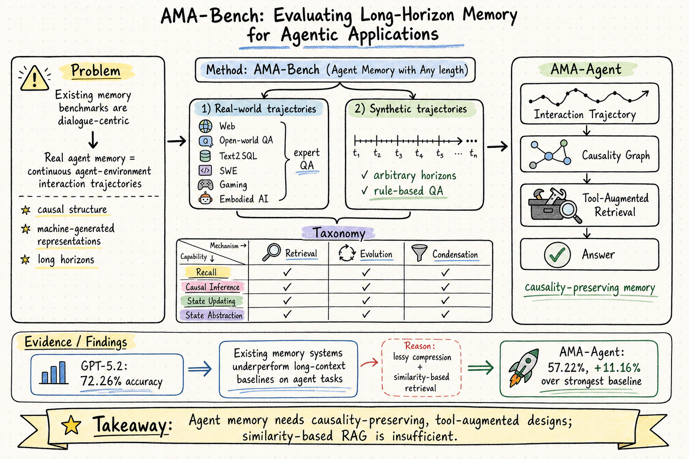

# Agent Memory — 2026-06-05

## 1. AMA-Bench: Evaluating Long-Horizon Memory for Agentic Applications ★ 今日推薦點開

- **arXiv**: 2602.22769
- **Link**: https://arxiv.org/abs/2602.22769
- **Authors**: Yujie Zhao, Boqin Yuan, Junbo Huang, Haocheng Yuan, Zhongming Yu, Haozhou Xu, Lanxiang Hu, Abhilash Shankarampeta, Zimeng Huang, Wentao Ni, Yuandong Tian, Jishen Zhao
- **Venue**: ICML 2026
- **Date**: 2026-02-26 (v4: 2026-05-27)

### 這篇在說什麼

現有的 agent memory 評估基準幾乎全是對話導向的——多輪聊天、長文件閱讀——但真實的 agent memory 是連續的 agent-environment 交互軌跡，包含狀態、動作、觀測和工具輸出，且具有因果結構和機器生成的客觀資訊。AMA-Bench（Agent Memory with Any length）是第一個專為 agent memory 設計的基準，包含真實和合成兩個子集。真實子集來自六個代表性 agent 域（Web、open-world QA、Text2SQL、SWE、Gaming、Embodied AI），附帶 expert-curated QA；合成子集可程式化地擴展到任意長度，附帶 rule-based QA。作者系統性地發現：現有 memory 系統在 AMA-Bench 上的表現不如 long-context baseline，原因是 lossy compression 和 similarity-based retrieval 無法捕捉 agent 軌跡中的因果和客觀資訊。為此，作者提出 AMA-Agent，基於 causality graph + tool-augmented retrieval，在 AMA-Bench 上達到 57.22%，超過最強 baseline 11.16%。

### 主要貢獻

1. **AMA-Bench 是第一個專為 agent memory 設計的基準**，有別於之前所有對話導向的 memory benchmark（LoCoMo, LongMemEval, MemoryAgentBench 等）。它捕捉了 agent memory 的三個獨特性：機器生成的多元符號表示（ASCII, JSON, code blocks）、因果結構（每個動作引發環境狀態轉換）、稀疏客觀資訊（無閒聊填充）。
2. **四維能力分類**：Recall（時序和序列資訊）、Causal Inference（動作前置條件和狀態依賴）、State Updating（狀態更新追蹤）、State Abstraction（冗餘過濾和關鍵資訊提取）。這四個維度覆蓋了 retrieval / evolution / condensation 三個機制。
3. **關鍵發現**：現有 memory 系統在 agent task 上不如 long-context baseline，因為 lossy compression 和 similarity retrieval 累積誤差。GPT-5.2 也只有 72.26% 準確率。
4. **AMA-Agent**：用 Causality Graph 保留因果和客觀資訊，用 Tool-Augmented Retrieval（graph node search + keyword search）取代 similarity-only retrieval。57.22% 超過最強 baseline 11.16%。

### 方法 / pipeline

**Benchmark 建構**：
- 真實子集：從 6 個 agent 域收集 trajectory，每個域使用 SOTA agent framework 或 expert trajectory 生成交互日誌，然後由 expert 標注 QA pairs。共 2496 個 QA pairs。
- 合成子集：程式化地生成環境後端，包含 explicit latent states 和 transitions，渲染機器生成的 observations 形成 trajectories，自動生成 rule-based QA。可以擴展到任意長度。

**Memory 系統形式化**：將 memory 系統定義為兩個階段——Build: H → M_mem（將 trajectory 映射到外部 memory state）和 Retrieve: M_mem × q → c（從 memory 中檢索相關 context）。Agent policy π(a|q, c)。

**AMA-Agent 設計**：
- **Causality Graph**：從 trajectory 中提取 action-observation 因果鏈，保留客觀資訊（數值、狀態變化、前置條件）。不做 lossy summarization。
- **Tool-Augmented Retrieval**：結合 graph node search（在 causality graph 上搜尋相關節點）和 keyword-based search，取代純 similarity retrieval。

### 實驗設計

- **基準比較**：在 AMA-Bench 上評比 long-context baseline（直接把 trajectory 放進 context window）、多種 memory 系統（MemGPT, MemoryBank, MemoRAG, MEM1, Mem-α, Mem0, SimpleMem 等）。
- **主要結果**：GPT-5.2 + long-context 達到 72.26%。所有 memory system 在 agent task 上的表現都不如 long-context，證明現有 compression + similarity retrieval 在 agent 場景下有根本缺陷。
- **AMA-Agent**：57.22%，超過最強 baseline（MemGPT 或 SimpleMem，約 46%）11.16%。
- **分析**：作者進一步分析了為什麼 similarity retrieval 失敗——agent 軌跡中的機器生成表示和因果結構使得 embedding similarity 無法正確匹配相關記憶。Causality graph 保留了這些結構，因此大幅提升。
- **合成子集的擴展性**：可以程式化地生成任意長度的 trajectory + QA，用於壓力測試 memory 系統在極長 horizon 下的表現。

### かに讀後判斷

這篇填補了 agent memory 評估的重要缺口。之前 Morris 看過的 MemoryArena (2602.16313, 2026-05-11) 聚焦在 multi-session interdependent tasks，而 AMA-Bench 更聚焦在 memory 本身的因果和客觀資訊保持能力。兩篇互補：MemoryArena 測的是「跨 session 的記憶依賴」，AMA-Bench 測的是「單 trajectory 內的因果推理和狀態追蹤」。AMA-Agent 的 causality graph 設計跟 Morris 之前深讀的 Memory for Autonomous LLM Agents (2603.07670) 中提到的「causal graph memory reasoning」方向一致，但 AMA-Bench 提供了更具體的 benchmark 和定量結果。深讀時優先看：Section 3 的 problem formulation 和能力分類、Table 1 的 benchmark 比較、Section 4 的主要實驗結果、Figure 2 的模型在各 task family 的表現、以及 AMA-Agent 的 causality graph 建構細節。

---

## 2. Rethinking Memory Mechanisms of Foundation Agents in the Second Half: A Survey

- **arXiv**: 2602.06052
- **Link**: https://arxiv.org/abs/2602.06052
- **Authors**: Wei-Chieh Huang, Weizhi Zhang, Yueqing Liang, Yuanchen Bei, Yankai Chen, Tao Feng, ... (50+ authors), Kai Shu
- **Date**: 2026-01-14 (v3: 2026-02-10)

### 這篇在說什麼

這篇大型 survey（50+ 作者）提出一個統一的 agent memory 框架，沿三個維度組織記憶：memory substrate（內部 vs. 外部）、cognitive mechanism（episodic, semantic, sensory, working, procedural）、memory subject（agent-centric vs. user-centric）。核心論點是：AI 研究正在從「model innovation over benchmark scores」轉向「problem definition and real-world evaluation」，記憶是填補這個 utility gap 的關鍵——agent 在長期、動態、使用者依賴的環境中面臨 context explosion，必須持續累積、管理和選擇性重用大量資訊。Survey 覆蓋了 200+ 篇論文，分析了不同 agent topology 下的 memory instantiation 和操作，以及記憶操作的 learning policies，最後回顧了評估基準和指標。

### 主要貢獻

1. **三維統一框架**：substrate × mechanism × subject 的分類法把現有 agent memory 工作放在同一個座標系裡，方便比較和發現缺口。
2. **從「第二半場」的視角切入**：不再只是追求 model 能力，而是聚焦在記憶如何讓 agent 在真實環境中持續運作。這跟 AMA-Bench 的問題意識一致。
3. **大規模文獻覆蓋**：200+ 篇論文，涵蓋了大部分 2025-2026 年的 agent memory 工作（AgeMem, MemBench, Memo, MemoryArena, SimpleMem 等），是一個很好的參考索引。

### 方法 / pipeline

Survey 類型，無實驗 pipeline。作者做了系統性的文獻收集和分類，按三維框架組織。由於只讀到 abstract 層級，無法確認分類的具體細節和每個子類別的覆蓋品質。

### 實驗設計

無實驗。Survey 類型。從 abstract 可以確認有 evaluation benchmarks 和 metrics 的回顧，但具體的比較表格和定量分析需要讀全文才能確認。

### かに讀後判斷

這篇是 agent memory 領域目前最全面的 survey 之一，覆蓋面比之前讀過的 Memory for Autonomous LLM Agents (2603.07670) 更廣，特別是在 procedural memory 和 user-centric memory 的討論上。三維框架（substrate × mechanism × subject）提供了很好的導航地圖。不過作為 survey，它的價值在於索引和定位，而非提出新方法。如果 Morris 想要一個 agent memory 領域的全景圖，這篇和 Memory for Autonomous LLM Agents 互補；但如果要看新方法或新 benchmark，AMA-Bench 更值得深讀。由於只讀到 abstract，標記為一般收錄。

---

## 3. Toward Efficient Agents: Memory, Tool Learning, and Planning

- **arXiv**: 2601.14192
- **Link**: https://arxiv.org/abs/2601.14192
- **Authors**: Xiaofang Yang, Lijun Li, Heng Zhou, Tong Zhu, Xiaoye Qu, Yuchen Fan, Qianshan Wei, Rui Ye, Li Kang, Yiran Qin, Zhiqiang Kou, Daizong Liu, Qi Li, Ning Ding, Siheng Chen, Jing Shao
- **Date**: 2026-01-20

### 這篇在說什麼

這篇 survey 聚焦在 agent 的效率問題，從 memory、tool learning、planning 三個核心組件切入，考慮 latency、tokens、steps 等成本。核心論點是：agent 效率可以從兩個互補角度衡量——固定成本下的效能比較、或固定效能下的成本比較（Pareto frontier）。作者回顧了各組件的效率導向方法，包括 context compression and management（memory）、RL rewards for minimizing tool invocation（tool learning）、controlled search mechanisms（planning），並整理了效率導向的 benchmark 和 evaluation protocols。

### 主要貢獻

1. 首次系統性地從效率角度統一回顧 memory、tool learning、planning 三個 agent 組件，而非分開討論。
2. 提出效率的雙重定義：固定成本下的效能 vs. 固定效能下的成本，以及 Pareto frontier 視角。
3. 整理了各組件的效率導向 benchmark 和 evaluation protocols。

### 方法 / pipeline

Survey 類型，無實驗 pipeline。35 頁，200+ 參考文獻。由於只讀到 abstract 層級，目前確認了框架和方法分類，但無法確認各組件的具體方法細節和定量比較。

### 實驗設計

無實驗。Survey 類型。整理了 benchmark 和 metrics，但具體比較需要全文確認。

### かに讀後判斷

這篇 survey 跟 Rethinking Memory Mechanisms 有部分重疊（memory 部分），但視角不同：後者聚焦在 memory 的分類和機制，這篇聚焦在 efficiency trade-off。跟 AMA-Bench 的關係：AMA-Bench 測的是 memory 的正確性（causal recall, state updating），而這篇討論的是 memory 的效率（壓縮成本、retrieval latency）。兩者互補。如果 Morris 對 agent 效率有興趣（特別是 OpenClaw 的 token 使用量），這篇提供了很好的索引。但由於只讀到 abstract，標記為一般收錄，暫不列為今日推薦。

---

*今日 agent memory 領域的重點是 AMA-Bench，它是第一個專為 agent memory 設計的基準，且提供了因果圖 + 工具增強檢索的新方法。Rethinking Memory Mechanisms 和 Toward Efficient Agents 是兩篇大型 survey，提供文獻索引價值，但由於只讀到 abstract 層級，暫不列為今日推薦。*