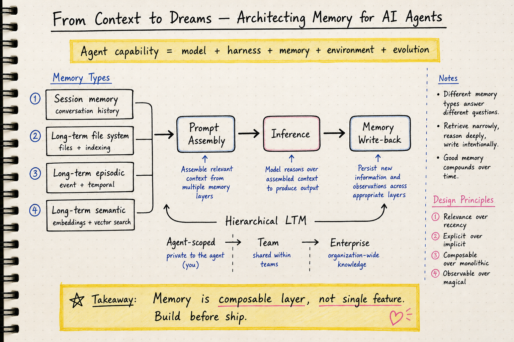

# Agent Memory — 2026-06-06

## 1. From Context to Dreams: Architecting Memory for AI Agents (Red Hat Emerging Technologies Blog)

- **Link**: https://next.redhat.com/2026/06/01/from-context-to-dreams-architecting-memory-for-ai-agents/
- **作者**: Red Hat Emerging Technologies 團隊
- **類型**: Blog / engineering article
- **日期**: 2026-06-01

### 這篇在說什麼

這篇是 Red Hat Emerging Technologies 的長文，系統性討論 AI agent memory 的架構設計。出發點是「LLM 有金魚記憶」——每次對話都從頭開始，而 agent memory 系統是比 context engineering 和 RAG 更根本的解決方案。文章的核心論點可以用一條公式概括：Agent capability ≠ just model weights; Agent capability = model + harness + memory + environment + evolution。一個好的 harness + memory 可以讓中小模型打敗缺乏這些系統的大模型。

### 主要貢獻

1. **記憶分類體系**：Session memory（對話歷史）、Long-term file system memory（檔案系統形式的持久記憶）、Long-term episodic memory（以事件和時間序列結構的持久記憶）、Long-term semantic memory（用 embedding 做語義搜尋的持久記憶）。這不是純學術分類，而是從實際部署場景出發的工程分類。

2. **E2E 架構圖**：提出了一個多 agent 系統中記憶基礎設施的端到端架構，包含 prompt assembly（session memory + RAG + LTM + enterprise data）、inference、memory write-back、hierarchical LTM（agent-scoped → shared/team → enterprise）、以及背景記憶維護與「做夢」（dreaming）機制。

3. **開源生態盤點**：詳細介紹了 Mem0（自動提取 + 搜尋的跨 session 記憶層）、OpenClaw（file-based 記憶 + MEMORY.md + dreaming pipeline）、Claude Code / Codex / Letta / Mastra（coding agent 的記憶架構）、以及 Karpathy LLM-Wiki 生態系（Graphify、Graphiti 等圖資料庫方案）。

4. **訓練 vs. 生產的 harness 差異延伸到記憶**：記憶系統在研究環境（探索面，鼓勵廣泛嘗試）和生產環境（約束面，deny-by-default + audit）的設計邏輯完全不同。

### 方法 / pipeline

這篇是 engineering blog 而非研究論文，所以「方法」對應的是架構設計決策：

- **Prompt assembly 流程**：每個 model 有自己的 prompt assembler，從 session memory、RAG (VectorDB/GraphDB)、long-term memories (file system + semantic)、enterprise datastores 四個來源組裝 context。
- **Memory write-back**：inference 之後把新記憶寫回 LTM。可以是被動的（攔截 query-response flow）或主動的（agent 用 memory tool/skill 明確寫入）。
- **Hierarchical LTM**：agent-scoped → team-scoped → enterprise-scoped，三層架構。新成員加入團隊可以立即取用團隊的部落知識，個體知識被吸收進 team memory 後減少了人員流動的知識損失。
- **Dreaming pipeline**：背景持續處理，去重、淘汰過時記憶、形成新關聯、推導新知識。類似人類睡眠的記憶鞏固機制。

### 實驗設計

這是工程文章，沒有 formal experiments。但有幾個有價值的實務觀察和 benchmark 引用：

- Mem0 在 LoCoMo benchmark 上有良好結果（連結到 Mem0 部落格）
- Letta Code 在 Opus 4.5 上 59.1% vs. Claude Code 41.6%（因為 Letta 有記憶層，benchmark 獎勵記憶）
- 引用了 Stanford Meta-Harness paper、CMU Externalization paper、Karpathy LLM-Wiki 等研究
- 有提到 Red Hat 自己在做 OpenClaw + Mem0 的整合實驗，但結果還沒發佈

### かに讀後判斷

這篇是目前看過最系統性的 agent memory 工程綜述文章之一。比起純學術論文，它更貼近實際部署場景。幾個值得 Morris 留意的點：

1. **Agent capability = model + harness + memory + environment + evolution** 這條公式和 DailyRead 之前追的 harness engineering 主線直接呼應。Memory 不只是 RAG，它是 harness 裡面一個 load-bearing 的子系統。
2. **Hierarchical LTM 的「enterprise mind」概念**：agent-scoped → team → enterprise 三層記憶架構，這是之前 DailyRead 沒有特別提到的方向。如果 agent memory 要從個人工具走向組織工具，這三層是必須的。
3. **Dreaming 機制的工程化**：Anthropic 的 Memory and Dreaming product、OpenClaw 的 dreaming pipeline、Mem0 的 background curation——這些都在把「記憶鞏固」從概念變成工程。
4. **和之前 DailyRead 提到的 Governing Evolving Memory (2603.11768) 互補**：那篇聚焦在風險和治理，這篇聚焦在架構和實作。

**建議深讀優先看**：E2E 架構圖、memory type 分類表、Mem0 和 OpenClaw 的整合示範、以及 Hierarchical LTM 的設計討論。

---

## 2. Governing Evolving Memory in LLM Agents: Risks, Mechanisms, and the SSGM Framework

- **arXiv**: 2603.11768
- **類型**: arXiv preprint
- **狀態**: 已在 2026-05-20 DailyRead 提及；今日不重複收錄

此篇已在先前的 agent-memory domain note 中收錄。今日 Red Hat 的架構文章在「風險與治理」維度上和此篇互補，但 SSGM 本身不是新內容，不做重複筆記。

---

今日無其他高品質 agent memory 新 paper 候選。Red Hat 這篇工程文章是目前最值得注意的內容。