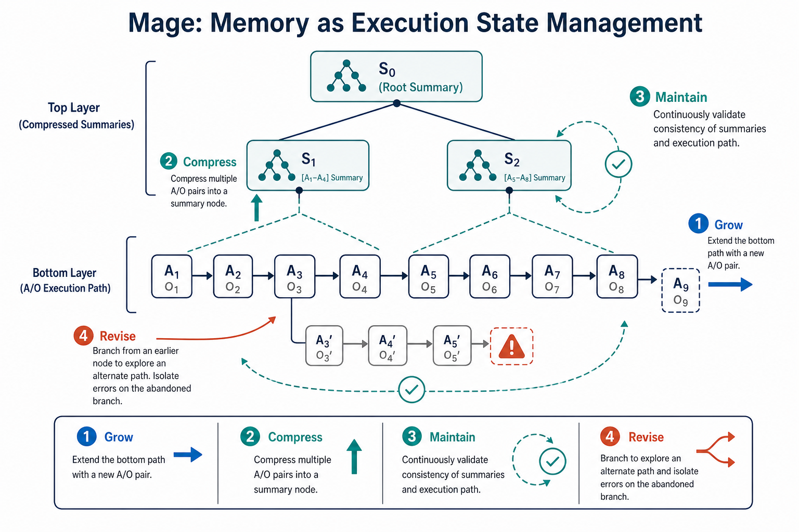

# Agent Memory — 2026-06-07

## 1. Beyond Semantic Organization: Memory as Execution State Management for Long-Horizon Agents (Mage)

- **arXiv**: 2606.06090
- **Link**: https://arxiv.org/abs/2606.06090
- **Authors**: Yaoqi Chen, Haibin Lai, Yuru Feng, Chuyu Han, Qianxi Zhang, Baotong Lu, Menghao Li, Xinjiang Wang, Zhirui Wang, Shusen Xu, Zengzhong Li, Zewen Jin, Hao Wu, Cheng Li, Qi Chen（USTC + Microsoft）

### 這篇在說什麼

現有的 agent memory 系統用語意相似度來組織和檢索記憶，但這在長視角、決策互相依賴的任務中會造成兩個核心問題：（1）狀態碎片化——語意檢索會把同一條決策鏈的上下文打散，導致 agent 無法重建完整的執行狀態；（2）錯誤污染——語意相似的記憶會把正確和錯誤的軌跡混在同一個 relevance space 裡，錯誤的步驟會被一起檢索出來影響後續推理。Mage 把記憶從「語意驅動的檢索池」重新定義為「執行狀態管理器」：用兩層樹狀結構記錄軌跡，根到當前節點的路徑就是完整的執行狀態，壓縮後的子目標摘要保留在頂層，原始步驟保留在底層，錯誤路徑被隔離到獨立分支。

### 主要貢獻

1. **執行狀態樹**：把 agent 的互動歷史組織成兩層樹——底層記錄原始 action-observation pairs，頂層存子目標摘要。根到當前節點的路徑保證了完整的執行狀態，而非語意拼湊的碎片。
2. **四個耦合操作**：Grow（延伸軌跡）、Compress（摘要完成的子目標）、Maintain（驗證摘要的正確性）、Revise（回溯到目標邊界並開新分支）。這四個操作構成閉環的狀態管理，而非單純的存取。
3. **錯誤隔離**：Revise 操作將錯誤段排除在活躍路徑之外，保留錯誤邊界之前的有效進度。這是語意檢索系統做不到的——它們無法區分正確和錯誤的軌跡片段。
4. **實驗結果**：在 MemoryArena 上，Mage 比所有 baseline 提升 7.8–20.4 pp 的成功率，同時減少 55.1% 的 token 消耗。這意味著它同時改善了效果和效率。

### 方法 / pipeline

Mage 的核心架構：

1. **兩層狀態樹**：
   - 底層（raw trace）：每個節點是一個 action-observation pair，按執行順序排列
   - 頂層（compressed summaries）：在子目標或決策邊界處，Grow 操作累積的原始軌跡被 Compress 操作摘要為壓縮狀態
   - 當前執行狀態 𝒮 = 壓縮摘要 𝒞 + 近期原始軌跡 ℛ + 來自先前分支的執行提示 ℋ

2. **四個操作**：
   - **Grow**：每步行動後，將新的 action-observation pair 附加到底層樹
   - **Compress**：在子目標邊界，將累積的原始軌跡摘要為頂層摘要節點
   - **Maintain**：驗證每個新摘要的正確性和完整性，捕捉遺漏資訊或執行錯誤
   - **Revise**：當 Maintain 偵測到錯誤時，回溯到目標邊界，開始新分支，將錯誤段隔離

3. **認知科學對應**：作者明確將四個操作對應到認知機制——Hierarchical chunking（Botvinick 2009）、Error monitoring（Yeung 2004）、Selective correction（Duncan 2001）。這不是隱喻，而是結構對應。

### 實驗設計

- **基準**：MemoryArena（He et al., 2026）——一個測試長視角 agent 記憶的基準，任務包含購物、旅行等需要跨步驟依賴的場景
- **Baselines**：Long-context（全歷史放入 context）、Mem0、HippoRAG、MemoryOS、SimpleMem、A-Mem 等
- **主要結果**：
  - 成功率提升 7.8–20.4 pp over baselines
  - Token 消耗減少 55.1%（相對 long-context）
  - 圖示顯示 Mage 在 task performance vs. token cost 的 Pareto front 上佔據左上角
- **案例研究**：Figure 2 展示了 baseline 的具體失敗模式——HippoRAG 檢索到不相關的產品資訊（狀態碎片化），SimpleMem 混合正確和錯誤的軌跡（錯誤污染），而 Mage 保持完整的執行狀態並選擇相容的選項

### かに讀後判斷

這篇是本日 agent memory 領域最重要的論文，也是今天三篇推薦點開之一。Mage 的核心洞察——記憶應該是執行狀態管理而非語意檢索——直接回應了昨天 Red Hat 架構文章中提到但沒有解決的問題：如何讓 agent 在長視角任務中維持連貫的狀態。Mage 用樹狀結構和四個操作給出了一個非常具體且可實作的方案。

跟昨天 Red Hat 文章的關係：Red Hat 的三層 LTM 架構（episodic / semantic / procedural）是靜態組織，Mage 的兩層狀態樹 + 四個操作是動態管理。兩者互補——你可以把 Red Hat 的三層記憶放在 Mage 的樹狀結構裡面，讓摘要、驗證和修訂有了具體的操作語義。

跟今天其他 memory 論文的關係：
- MRAgent（2606.06036）用 Cue-Tag-Content graph 做主動重建，但仍然是語意驅動的檢索。Mage 直接挑戰了語意組織的前提。
- MemGate（2606.06054）處理的是記憶的信任問題（語意相似但上下文不當的記憶不該被檢索），這和 Mage 的錯誤隔離是互補的面向。
- Orchestrating Cognitive Memory（2606.04120，Meta）用 RL 訓練記憶管理策略，但仍然是語意組織 + RL 優化的框架，而非從執行狀態出發的重新設計。

建議深讀：Section 3（Mage 的四個操作和認知對應）、Figure 2（案例研究）、Table 1（認知機制對應）、以及 MemoryArena 的完整結果表。

---

## 2. Beyond Similarity: Trustworthy Memory Search for Personal AI Agents (MemGate)

- **arXiv**: 2606.06054
- **Link**: https://arxiv.org/abs/2606.06054
- **Authors**: Jiawen Zhang, Kejia Chen, Jiachen Ma, Yangfan Hu, Lipeng He, Yechao Zhang, Jian Liu, Xiaohu Yang, Tianwei Zhang, Ruoxi Jia（浙大 + 新加坡國立 + 多所機構）

### 這篇在說什麼

個人 AI agent 的長期記憶系統目前都用語意相似度來檢索記憶，但語意相似不等於上下文適當——一個語意相關但來自錯誤領域的記憶會導致跨領域洩漏、迎合效應（sycophancy）、工具調用偏移、甚至記憶注入式越獄。MemGate 把記憶檢索重新定義為「信任邊界」問題：記憶不應該無條件地進入 context，而應該通過一個 task-conditioned 的 admission 閘門。MemGate 是一個只有 9M 參數、35.1MB 的輕量級 plug-in，插入在向量檢索和 LLM context 之間，用 query-conditioned neural gate 對候選記憶做動態遮罩，將語意檢索升級為 task-conditioned memory admission。

### 主要貢獻

1. **記憶檢索作為信任邊界**：系統性地定義和測量了四種記憶引發的信任問題——跨領域洩漏、迎合效應、工具調用偏移、記憶注入越獄——在 A-Mem、Mem0、MemOS 和 OpenClaw 四個記憶框架上。
2. **MemGate**：輕量級 neural gate plug-in，在語意檢索後對候選記憶做 query-conditioned 遮罩，不需要修改 backbone LLM、重寫記憶資料庫、或額外的 LLM judge。
3. **雙重威脅模型**：區分良性過度個人化（cross-domain leakage、sycophancy、tool-call drift）和惡意記憶操縱（planted contextual memories → jailbreak），分別測量。
4. **實驗結果**：在 GPT-4o-mini 上，跨領域洩漏從 27.0% 降到 3.5%，jailbreak ASR 從 16.8% 降到 4.4%，同時 LoCoMo F1 從 38.9 提升到 40.8。在 Gemini-3-Pro 和 Claude-Sonnet-4.6 上也有泛化效果。

### 方法 / pipeline

MemGate 的架構：

1. **位置**：插入在向量檢索（top-k 候選）和 LLM context 組裝之間
2. **操作**：
   - 向量檢索產生 top-k 候選記憶
   - MemGate 接收 query 和每個候選記憶的 embedding
   - 對每個候選記憶的 embedding 做動態遮罩：保留與任務相關的維度，衰減與任務無關或有害的維度
   - 遮罩後的記憶 embedding 與 query 一起進入 LLM
3. **訓練**：在凍結的 sentence embedding 上訓練，使用對比學習目標——任務相關的記憶維度被保留，無關維度被衰減
4. **形式化**：定義了 contextual admissibility indicator 𝒜(m, xq)，當記憶 m 語意相關但上下文不適當時 𝒜 = 0，這是語意檢索的 admissibility gap

### 實驗設計

- **框架**：A-Mem、Mem0、MemOS + OpenClaw
- **良性過度個人化測量**：
  - Cross-domain leakage：私醫療記憶洩漏到工作場景
  - Sycophancy：迎合用戶偏見而非客觀回答
  - Tool-call drift：性格記憶影響安全相關的工具參數
  - 引入記憶後 tool-call drift failure rate 從 5.1% 飆升到 >50%，sycophancy 翻倍
- **惡意記憶操縱**：植入看似無害的上下文記憶，使後續有害請求被重新框架為「上下文合理」
  - Memory-free baseline ASR 3.1% → memory-enabled ~20%
- **MemGate 效果**：
  - Cross-domain leakage: 27.0% → 3.5%（GPT-4o-mini）
  - Jailbreak ASR: 16.8% → 4.4%
  - LoCoMo F1: 38.9 → 40.8（同時改善效用和安全）

### かに讀後判斷

MemGate 處理的是 agent memory 的一個很少被系統性討論的面向——記憶的安全性和信任問題。Mage 解決的是記憶的狀態完整性，MemGate 解決的是記憶的上下文適當性。兩者互補：Mage 確保你讀到的是正確的執行路徑，MemGate 確保你讀到的記憶在當前任務中是適當的。

特別值得注意的是 OpenClaw 被列入測試框架——這是少數直接測試 OpenClaw 記憶系統安全性的論文。tool-call drift 的發現（從 5.1% 到 >50%）對所有做 tool-use agent 的人都是一個重要警示：記憶中的性格偏好會悄悄影響工具調用的參數。

建議深讀：Section 2.3（記憶引發信任問題的形式化定義）、Figure 2（四種攻擊的示意）、Table of cross-framework comparison。

---

## 3. Memory is Reconstructed, Not Retrieved: Graph Memory for LLM Agents (MRAgent)

- **arXiv**: 2606.06036
- **Link**: https://arxiv.org/abs/2606.06036
- **Authors**: Ji-shuo 等（GitHub: Ji-shuo/MRAgent）

### 這篇在說什麼

MRAgent 認為現有的記憶系統（包括語意檢索和圖譜檢索）都是「被動檢索」——查詢→候選→top-k 或 N-hop expansion——無法根據推理過程中發現的中間證據動態調整檢索路徑。作者從認知神經科學的記憶重建理論出發，提出「主動重建」範式：記憶存取應該是一個多步驟的推理過程，LLM 根據累積的證據逐步探索和修剪檢索路徑。MRAgent 用 Cue–Tag–Content 異質圖來組織記憶，tag 作為語意橋樑連接細粒度的 cue 和具體的記憶內容，讓 LLM 先選擇相關的 tag 再檢索內容，避免組合爆炸。

### 主要貢獻

1. **主動記憶重建範式**：將記憶檢索從一次性操作重新定義為多步驟推理過程，LLM 可以根據中間證據調整檢索策略。
2. **Cue–Tag–Content 異質圖**：用 tag 作為中間聯想結構，讓 LLM 在進入具體內容前先評估檢索路徑的相關性，避免盲目擴展。
3. **理論分析**：證明主動檢索策略嚴格比被動檢索更具表達力（expressiveness）。
4. **多粒度記憶層**：episodic layer（事件記憶）、semantic layer（穩定知識）、abstraction layer（主題摘要），支持不同層次的推理。
5. **實驗結果**：在 LoCoMo 和 LongMemEval 上比 baselines 提升高達 23%，同時大幅減少 token 和 runtime cost。

### 方法 / pipeline

MRAgent 的架構分為兩個部分：

1. **記憶構建**：
   - 從對話中提取 episodic units、semantic units、和 topic nodes
   - 每個 episodic unit 提取 cues（細粒度關鍵詞）和 tags（聯想標籤）
   - 形成 Cue–Tag–Episode 關係三元組
   - Semantic layer 存儲穩定的知識和偏好
   - Abstraction layer 存儲跨事件的主題摘要

2. **主動重建過程**：
   - 給定查詢，先提取 cue
   - LLM 選擇相關的 tag（而非直接檢索內容）
   - 根據選中的 tag 檢索對應的內容
   - 根據累積證據，LLM 決定是否繼續探索或停止
   - 這是一個迭代的 beam search 過程，而非一次性的 top-k

### 實驗設計

- **基準**：LoCoMo、LongMemEval
- **Baselines**：MemoryBank、Mem0、A-Mem、Zep 等
- **主要結果**：比 baselines 提升高達 23%，同時減少 token 和 runtime cost
- **限制**：HTML 中段被截斷，無法確認完整的實驗表格、具體數值和消融實驗的細節

### かに讀後判斷

MRAgent 的核心洞察——記憶檢索應該是主動重建而非被動檢索——跟 Mage 的洞察（記憶應該是執行狀態管理而非語意檢索）是互補的。MRAgent 處理的是記憶的檢索策略（如何找到正確的記憶），Mage 處理的是記憶的組織策略（如何確保找到的記憶是正確的執行路徑）。

不過 MRAgent 仍然是基於語意組織的——它的 Cue-Tag-Content 圖仍然是語意關聯的結構，只是加了主動推理來選擇檢索路徑。這跟 Mage 的樹狀執行狀態結構有根本的不同。在長視角依賴決策的任務中，Mage 的路徑完整性可能比 MRAgent 的聯想檢索更關鍵。

建議深讀：Section 2（被動檢索的限制分析）、Section 4（主動重建的定義和理論分析）、LoCoMo 和 LongMemEval 的完整結果表。

---

## 4. Orchestrating Cognitive Memory for Conversational Agents（Meta）

- **arXiv**: 2606.04120
- **Link**: https://arxiv.org/abs/2606.04120
- **Authors**: Xinyuan Zhang, Hongda Jiang, Shiun-Zu Kuo, Hyokun Yun, Ejaz Ahmed, Shereen Oraby, Ziyun Li, Sanat Sharma, Ann Lee, Ahmed Aly, Anuj Kumar, Raffay Hamid, Xin Luna Dong（Meta Reality Labs）

### 這篇在說什麼

對話式 agent 作為終身伴侶需要持久記憶，但簡單擴大 context window 或用 RL 訓練記憶管理都面臨嚴重的 credit assignment 瓶頸——當最終回答出錯時，你無法判斷是記憶寫入錯了、記憶檢索錯了、還是生成本身錯了。這篇提出 Ψ-method（方法名在 HTML 中被 LaTeX 宏遮蔽，從上下文推斷），用認知科學的三層記憶架構（factual snapshot / preferences / working memory）加上三個互補的角色（selective attention / consolidation / cue-driven recall），通過 stage-wise process reward 和 reward-decomposed contrastive refinement 來端到端訓練一個統一的記憶管理模型。

### 主要貢獻

1. **認知啟發的記憶架構**：三個記憶庫——factual bank F̄（客觀事實）、preference bank P̄（主觀偏好）、working memory W̄（近期重要內容）——加上三個角色：saliency filter、memBooster、memUtilizer。
2. **Stage-wise process reward**：R1（回應品質，乘法閘門確保正確性優先於個人化）、R2（記憶品質，不對稱懲罰——糟糕的記憶比遺漏更糟）、R3（利用率 + 過濾品質），分別監督不同角色。
3. **Reward-decomposed contrastive refinement**：在 GRPO rollout 內部，用角色特定的偏好對（而非單一的 total reward）來訓練每個角色，解決 multi-stage pipeline 的 credit assignment 問題。
4. **LoCoMo-P13n benchmark**：在 LoCoMo 基礎上新增個人化查詢評估，9B 模型超過 SOTA 10.2% 的端到端準確率，Good Personalization rate 提升 23.5 個百分點。

### 方法 / pipeline

1. **離線階段**（記憶建構）：
   - Saliency Filter：判斷每個對話 turn 是否值得記錄
   - memBooster：處理值得記錄的 turn，更新 F̄、P̄、W̄
   - 記憶更新是增量的，不是每次重建

2. **運行時階段**（記憶利用）：
   - memUtilizer：從三個記憶庫中找到與當前查詢相關的記憶，組合成 query-adapted profile
   - 凍結的生成 LLM πgen 根據查詢和記憶 profile 產生最終回應

3. **RL 訓練**：
   - R1（乘法閘門）：正確性 α × (1 + λp × 個人化 p)，確保個人化只在答案正確時才有價值
   - R2（不對稱懲罰）：糟糕記憶的懲罰是良好記憶獎勵的 3 倍，鼓勵保守寫入
   - R3（利用率 + 過濾品質）：分別評估記憶利用和過濾品質
   - Contrastive refinement：用角色特定的偏好對（例如只用 R2 來選 booster 的 winner/loser）來解決 GRPO 的 credit assignment 問題

### 實驗設計

- **基準**：LoCoMo-P13n（新提出的個人化評估基準）+ 原始 LoCoMo
- **模型**：9B 參數的統一策略模型
- **主要結果**：
  - 端到端準確率超過 SOTA 10.2%
  - Good Personalization rate 提升 23.5 pp
  - 記憶引發的失敗減少 1/3
- **Error analysis**：Figure 1 顯示記憶錯誤佔了 52%（MemGAS），是最大的失敗來源

### かに讀後判斷

這篇跟 Mage 和 MemGate 形成了有趣的三角對照：
- **Mage** 從狀態完整性出發，用樹狀結構隔離錯誤
- **MemGate** 從信任邊界出發，用 neural gate 過濾不當記憶
- **Ψ-method** 從 credit assignment 出發，用 RL 的分解獎勵來訓練更好的記憶管理

三者的核心問題都是「如何讓正確的記憶在正確的時候影響正確的決策」，但切入角度完全不同。Mage 是結構性的（改變記憶的組織方式），MemGate 是過濾性的（不改組織，加閘門），Ψ-method 是訓練性的（用 RL 學會更好的記憶管理策略）。

不過 Ψ-method 的三層架構和獎勵設計有一個潛在問題：它假設記憶可以被清晰地分為事實、偏好和近期內容，但在實際長對話中，這三者的邊界可能很模糊。另外，9B 模型的結果是否能 scaling 到更大的模型還需要驗證。

建議深讀：Section 3.3（Stage-wise process reward 的定義）、Section 3.4（Reward-decomposed contrastive learning）、Figure 1（Error attribution 的分解）。

---

## 5. Agent Memory: Characterization and System Implications of Stateful Long-Horizon Workloads

- **arXiv**: 2606.06448
- **Link**: https://arxiv.org/abs/2606.06448
- **Authors**: Yasmine Omri, Ziyu Gan, Zachary Broveak, Robin Geens, Zexue He, Alex Pentland, Marian Verhelst, Tsachy Weissman, Thierry Tambe（Stanford + 多所機構）

### 這篇在說什麼

這是第一篇從系統角度系統性分析 agent memory 的論文。過去的記憶基準只看下游準確率，但不同記憶系統的設計選擇會大幅且不對稱地重新分配成本——一個壓縮歷史為原子事實的系統在查詢時省了 prompt 長度，但在建構時付了數量級更多的 LLM prefill 成本；一個圖譜記憶改善了關聯檢索，但成倍增加了 embedding 流量和儲存空間。這些成本在準確率指標中是看不到的，但在部署規模上卻是決定性的。

### 主要貢獻

1. **四軸記憶系統分類**：Construction、Storage、Retrieval、Mutability 四個維度的分類法，將十個代表性系統分為四個範式——long-context、flat RAG、structure-augmented RAG、agentic control flow。
2. **Phase-aware profiling harness**：追蹤 token、模型呼叫、GPU 利用率和延遲，分別歸因到建構、檢索和生成三個階段。
3. **系統特性分析**：建構成本形狀、能力閾值、攤銷結構、新鮮度排程、足跡增長、檢索尾行為。
4. **10 條系統建議**：涵蓋建構排程、能力地板、查詢量攤銷、新鮮度-延遲 trade-off、fleet-scale 管理等。

### 方法 / pipeline

論文將 agent memory 的執行分解為七個階段：ingestion → memory construction → storage → retrieval → prompt assembly → generation → maintenance。

十個系統跨四個範式：
- **I: Long-context**（long_context）
- **II: Flat RAG**（BM25, EmbedRAG）
- **III.a: Structure-augmented RAG, append-only**（GraphRAG, HippoRAG v2）
- **III.b: Structure-augmented RAG, consolidating**（Mem0, SimpleMem）
- **IV: Agentic control flow**（A-Mem, Letta, MIRIX）

每個系統的 construction pipeline、agent database、retrieval pipeline、mutability 都被系統性記錄和比較。

### 實驗設計

- **基準**：MemoryAgentBench (MAB)，特別是 LongMemEval_S_* 設定（5 個 sample，每個 ~360K token 歷史，60 個查詢）
- **標準化**：同一個生成 LLM 和 embedding 模型，保留每個系統的原生執行模型
- **關鍵發現**（從已讀部分推斷）：
  - 建構成本差異巨大：agentic control flow 系統的 LLM 呼叫次數比 flat RAG 多數量級
  - 攔銷結構不同：有些系統的建構成本可以被大量查詢攤銷，有些不行
  - 圖譜記憶增加了 embedding 流量和儲存空間
  - Long-context 在短歷史下表現好但不可擴展
  - 具體的數值需要看完整全文

### かに讀後判斷

這篇是 agent memory 社群需要很久的系統性基準研究。過去大家只比下游準確率，但這篇指出不同記憶範式的成本結構差異大到不能忽視。對做 agent infra 的人來說，Table 1（十個系統的分類和特性）是一個非常有用的 reference。

跟今天其他論文的關係：這篇是系統層的分析，而 Mage、MRAgent、Ψ-method、MemGate 都是演算法層的創新。系統層的分析告訴我們演算法創新在實際部署時會面臨什麼成本 trade-off——例如 Mage 的壓縮和維護操作會增加建構成本，但減少查詢時的 token 消耗；MemGate 增加了一個小的推理步驟，但可能被攤銷到大量查詢中。

不過目前只讀到 HTML 前段，完整的實驗結果和 10 條建議的具體內容需要看完整全文。建議深讀 Table 1、建構成本的完整比較、以及 10 條系統建議。

---

## 6. Learning to Retrieve: Dual-Level Long-Term Memory for Text-to-SQL Agents (MERIT)

- **arXiv**: 2606.00547
- **Link**: https://arxiv.org/abs/2606.00547
- **Authors**: Yibo Wang, Nikki Lijing Kuang, Philip S. Yu, Zhewei Yao, Yuxiong He（UIC + Snowflake AI Research）

### 這篇在說什麼

互動式 text-to-SQL agent 需要長期記憶來重用過去經驗，但現有的靜態檢索方法（語意相似度）不優化下游效用，而動態方法主要在 episode 層級檢索且用稀疏的終端獎勵訓練。MERIT 提出雙層記憶：episode-level 提供全局策略指導，turn-level 提供局部決策支援，兩層都用 RL 學習檢索策略。Turn-level 還用 Process Reward Model (PRM) 提供密集獎勵，解決中間步驟的 credit assignment 問題。

### 主要貢獻

1. **雙層記憶架構**：episode-level memory（完整軌跡 + 洞察）和 turn-level memory（緊湊的 state-action-observation snippets），分別服務全局規劃和局部決策。
2. **學習檢索策略**：兩層都用 embedding candidate generation + RL-learned selector，而非固定相似度。
3. **PRM for turn-level**：用 Process Reward Model 為 turn-level 檢索提供密集結構化獎勵，解決 sparse terminal reward 的 credit assignment 問題。
4. **跨基準遷移**：在 BIRD-Interact 上訓練，在 Spider2-Snow 上正面遷移且不需 benchmark-specific tuning。

### 方法 / pipeline

- **Episode-level memory**：每個完成的 episode 存為 (request embedding, full trajectory + insights + constraints)，用 RL 學習 selector
- **Turn-level memory**：每個 turn 存為 (state signature embedding, abstracted action + observation snippet + execution status label)，state signature 用粗略描述而非完整狀態
- **兩階段檢索**：先 embedding 檢索候選，再用 RL-trained selector 選擇子集
- **Episode-level selector**：用 PPO 以終端正確性獎勵訓練
- **Turn-level selector**：用 PRM 提供密集獎勵訓練

### 實驗設計

- **基準**：BIRD-Interact（in-domain）+ Spider2-Snow（遷移）
- **結果**：MERIT 在成功率上優於 no-memory、static-retrieval 和 dynamic-retrieval baselines，同時減少平均互動輪次
- **遷移**：在 Spider2-Snow 上有正面遷移效果，不需 benchmark-specific tuning
- **限制**：HTML 中段被截斷，完整的 ablation 和具體數值需要看完整全文

### かに讀後判斷

MERIT 的雙層設計是對「記憶檢索應該在哪個時間尺度上服務決策」這個問題的一個具體回答。Episode-level memory 服務於「開始前的全局規劃」，turn-level memory 服務於「進行中的局部調整」——這跟 Mage 的「壓縮摘要 + 近期原始軌跡」設計有異曲同工之處，只是 MERIT 用的是 RL 學習的 selector 而非結構化的狀態路徑。

不過 MERIT 的場景是 text-to-SQL（相對結構化的互動環境），而 Mage 針對的是更開放的長視角任務。在 text-to-SQL 中，state signature 比較容易定義（SQL 模式、查詢狀態），但在更開放的環境中，state signature 的定義就困難得多。

這篇對 agent memory 社群的貢獻是：它展示了學習式檢索策略（而非固定相似度）的好處，以及 episode-level 和 turn-level 雙層設計的實用價值。但它的適用範圍可能受限於 text-to-SQL 這個相對結構化的場景。

建議深讀：Section 5（方法架構）、Figure 2（雙層記憶概覽）、PRM 的訓練細節和遷移實驗。

---

*本日 agent memory 領域收錄六篇。Mage（2606.06090）為今日推薦點開，MemGate（2606.06054）和 MRAgent（2606.06036）為重要收錄。Ψ-method（2606.04120）、Agent Memory Systems Characterization（2606.06448）和 MERIT（2606.00547）為一般收錄。*