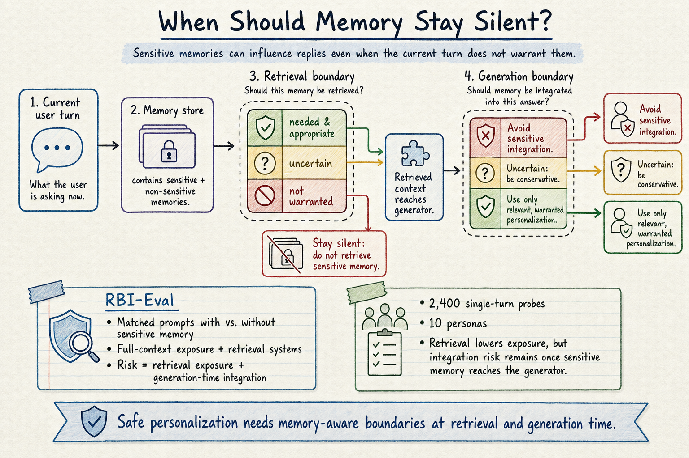

# Agent Memory — 2026-06-08

## 1. When Should Memory Stay Silent: Measuring Memory-Use Boundaries in Memory-Augmented Conversational Agents

- **arXiv**: 2606.06055
- **Link**: https://arxiv.org/abs/2606.06055
- **Authors**: Lingxiang Xu, Jiaoyun Yang, Min Hu, Hongtu Chen, Ning An
- **已讀來源**: arXiv HTML 全文

### 這篇在說什麼

這篇把 agent memory 的問題從「有沒有找對記憶」推進到「就算找到了，現在這一輪到底該不該用」。長期記憶讓 conversational agents 可以個人化，但敏感記憶一旦進入 context，模型常會把它當成應該使用的背景，而不是判斷 current turn 是否 warrant integration。作者稱這個問題為 memory-use boundary：可用記憶不等於應用記憶。

這點和昨天的 MemGate 很接近，但焦點更偏 measurement。MemGate 把記憶檢索當成 trust boundary，用 neural gate 擋掉不該進 context 的 memory；這篇則說，retrieval gate 不夠，因為一旦 sensitive memory 到了 generator，模型仍可能在 benign prompt 中把它重新帶出來。安全個人化需要 retrieval-time 和 generation-time 兩層邊界。

### 主要貢獻

1. **RBI-Eval**：建立 controlled measurement study，比較相同 benign prompt 在 no-memory reference 和 memory-available 條件下的行為差異。
2. **memory-use boundary 指標化**：不是只看 retrieval accuracy，而是看模型是否把 sensitive memory 不當整合進回答。
3. **四種 memory-access settings**：full-context exposure 加上三種 retrieval systems，用來分解「敏感記憶有沒有被取回」和「取回後 generator 是否使用」。
4. **跨模型差異**：GPT-5.4-mini 的 sensitive-memory integration shift 相對較小（separation score 下降 8.9%–26.6%），Claude-Sonnet-4.6、DeepSeek-V4-Flash、Qwen3.5-9B 的下降則大很多（51.1%–82.9%）。

### 方法 / pipeline

RBI-Eval 的設計是 paired control。每個 probe case 都有一個 benign current prompt，然後比較兩種世界：一個是模型沒有敏感記憶，只能根據當前 prompt 回答；另一個是模型可以看到或檢索到過去敏感記憶。若 memory-available 條件下的回答開始重啟私密脈絡、引用敏感偏好、或把已經 disengage 的議題重新推回對話，就算它沒有明顯違規，也代表 memory boundary 被突破。

資料集包含 10 個 personas、2,400 個 single-turn probe cases，四個 probe family 分別測不同 boundary：attitude reversal、mild complaint escalation、disengagement request、casual sensitive lure。作者也做 control experiments，確認這不是一般 personalization 都會造成的現象，而是 sensitive content 特別容易導致 over-scope integration。

方法上，論文把風險拆成兩段：**retrieval exposure** 和 **generation-time integration**。retrieval system 可以降低 target hits，也就是敏感記憶進入上下文的機率；但只要敏感記憶真的抵達 generator，許多模型仍會把它用進回答。因此「只改 retrieval」無法完全解決問題。

### 實驗設計

- **資料**：RBI-Eval，2,400 single-turn probes，10 personas，四類 probe family。
- **模型**：GPT-5.4-mini、Claude-Sonnet-4.6、DeepSeek-V4-Flash、Qwen3.5-9B。
- **memory settings**：full-context exposure + 三種 retrieval systems，並有 matched no-memory reference。
- **主要結果**：memory available 會讓 sensitive-memory integration 的 separation score 明顯下降；retrieval 降低 exposure，但 generator integration 仍是主要風險點。
- **限制**：benchmark 是 controlled single-turn probe，適合測 boundary sensitivity，但還不能完全代表長期多輪互動中 memory scope 會如何累積變形。深讀時需要看 scoring rubric 和 judge validation 是否足夠穩定。

### かに讀後判斷

這篇是今天 agent memory 最值得點開的安全/評估論文。它提醒我們，memory 系統的成功不該只用「是否召回相關資訊」衡量；更成熟的問題是「什麼時候應該讓記憶保持沉默」。這對個人 agent 尤其重要，因為真正危險的情境往往不是模型洩露明確秘密，而是在普通對話裡過度利用敏感背景，讓使用者感覺被跟蹤、被貼標籤、或被迫回到不想談的脈絡。

建議 Morris 深讀 Method 的 probe family 設計、scoring rubric，以及 Discussion 裡對 retrieval vs generation boundary 的拆解。這篇可以和 MemGate、Mage 放成一組：Mage 處理 execution state coherence，MemGate 處理 retrieval admission，RBI-Eval 則測「使用記憶的正當性」。三者合起來，才比較像完整的 agent memory safety stack。

---

## 2. AdaMEM: Test-Time Adaptive Memory for Language Agents

- **arXiv**: 2606.05684
- **Link**: https://arxiv.org/abs/2606.05684
- **Authors**: Yunxiang Zhang, Yiheng Li, Ali Payani, Lu Wang
- **已讀來源**: arXiv HTML 全文

### 這篇在說什麼

AdaMEM 處理的是另一個 memory 系統常見限制：很多 agentic memory 方法只在 episode 開始時檢索一次，把過去經驗轉成靜態提示；但長視角任務會不斷改變狀態，episode 開頭有用的 guidance 到中後段可能已經失準。AdaMEM 的核心想法是 test-time adaptation：不更新模型參數，而是在推理過程中持續從長期軌跡記憶取回經驗，並即時合成短期 strategy memory 來調整下一步行動。

它把 memory 從「一次性 retrieval」改成「每步或按需產生策略」。這和昨天的 Mage 有相似處：兩者都不滿足於靜態語意檢索；Mage 用樹狀 execution state 管理當前任務，AdaMEM 則用 long-term raw experiences + short-term generated strategies 做 test-time behavioral adaptation。

### 主要貢獻

1. **Hybrid memory architecture**：長期記憶保存 offline raw trajectories，短期記憶在 test-time 動態合成 context-aware strategies。
2. **不同 adaptation effort**：AdaMEM-low 快取 persistent strategies 以節省 tokens，AdaMEM-high 則每步產生 transient strategies，形成 token efficiency 和 adaptability 的可調 trade-off。
3. **STEP-MFT**：Step-wise Memory Fine-Tuning，用 rejection sampling / process-level reward 訓練 policy 更會從 retrieved experiences 合成高品質策略。
4. **跨 benchmark 成效**：在 ALFWorld、WebShop、HotpotQA 測試；相對 static memory baselines，ALFWorld 最高相對提升 13%，WebShop 最高相對提升 11%。

### 方法 / pipeline

AdaMEM 的流程是：agent 先在 long-term trajectory memory 中檢索和目前狀態相關的過去經驗；接著不是直接把 raw trace 塞進 prompt，而是生成一段短期 strategy memory，描述目前應該如何行動。策略可以 persistent cache，也可以每步重算。然後 agent 以目前 observation + retrieved experience + synthesized strategy 決策下一步。

STEP-MFT 則進一步收集 decision tuples：目前 state、retrieved context、生成 strategy、原行動、替代行動、reward。作者用 AdaMEM-high 收集密集樣本，因為每步都生成策略，較容易判斷某個 strategy 是否真的改變行動並推向成功。訓練後的 AdaMEM-MFT 讓同一模型同時負責 strategy 和 action generation，不必在 inference 時再接多個 specialized models。

### 實驗設計

- **Benchmarks**：ALFWorld（embodied household tasks）、WebShop（web shopping）、HotpotQA（agentic search）。
- **ALFWorld split**：seen 140 instances、unseen 134 instances，測 novel room layout generalization。
- **比較對象**：static long-term memory baselines、Synapse 等 retrieval/experience-based agents。
- **主要結果**：AdaMEM 在 training-free setup 已優於 static memory；Step-MFT 進一步提升。文中也提到相較 Synapse 可降低約 16% inference latency，因為合成 concise strategies 減少處理冗長 raw trajectories。
- **限制**：它的效果依賴 strategy synthesis 品質；若 retrieved trajectories 本身含錯誤或偏差，短期策略可能把錯誤抽象化。這點需要和 MemGate / RBI-Eval 類安全 gate 搭配。

### かに讀後判斷

AdaMEM 值得收錄但我不把它列為今天第一推薦，因為它比較像 agent memory performance stack 的增量強化，而 RBI-Eval 的 boundary 問題對個人 agent 更有警示性。AdaMEM 的可用 insight 是：不要把 memory 檢索視為 episode 開頭的一次性動作；長任務中的記憶應該能隨狀態變化更新成策略。

如果 Morris 要深讀，我會看 Methodology 裡 AdaMEM-low / high 的差異、STEP-MFT 的資料收集和 rejection criteria，以及 ALFWorld/WebShop 的 ablation。它跟 Mage 的差別也值得比較：Mage 管「當前任務狀態的結構完整性」，AdaMEM 管「跨任務經驗如何在 test-time 變成策略」。如果要做自己的 agent memory，可以把 Mage 當 state manager，AdaMEM 當 experience-to-strategy adapter。

---

## 3. SubtleMemory: A Benchmark for Fine-Grained Relational Memory Discrimination in Long-Horizon AI Agents

- **arXiv**: 2606.05761
- **Link**: https://arxiv.org/abs/2606.05761
- **Authors**: Wenxuan Wang, Haoyu Sun, Fukuan Hou, Mingyang Song, Weinan Zhang, Yu Cheng, Yang Yang
- **已讀來源**: arXiv HTML 全文

### 這篇在說什麼

SubtleMemory 補的是 long-term memory benchmark 裡很關鍵但常被忽略的一塊：記憶之間的關係。現有 benchmark 多半問 agent 能不能記得某個事實、更新某個偏好、或從長歷史中找回某條資訊；但真實個人助理的記憶常常是一組互相關聯、互補、細微不同、甚至互相矛盾的資訊。正確回答不只靠 isolated recall，而是靠 relational discrimination。

作者用 relation-controlled latent semantic artifacts 生成 complementary、nuanced、contradictory 三類記憶變體，把它們嵌入長期 user-agent histories，然後在後續查詢中要求 agent 恢復分散在歷史中的關係結構。這比單純「找出某句記憶」更接近真實長期代理的困難。

### 主要貢獻

1. **SubtleMemory benchmark**：專門測 fine-grained relational memory discrimination。
2. **三種 relation types**：complementary、nuanced、contradictory，分別測多證據整合、細微差別保留、衝突解析。
3. **長歷史嵌入**：把變體放進 realistic user-agent histories，而不是孤立 fact list。
4. **廣泛系統比較**：評估六個 standalone memory systems、兩個 Claw-style native memory agents、三個 plugin memory modules，並提供 preservation / retrieval / reasoning 的診斷切面。

### 方法 / pipeline

benchmark construction 先生成 latent semantic artifacts，再為每個 artifact 產生 relation-controlled variants。這些 variants 會被放進 persona-level chronological histories 中，之後生成 evaluation instances。每個 evaluation instance 不只是問「某個人喜歡什麼」，而是需要 agent 判斷多條相關記憶之間是互補、細微不同、還是互相矛盾，並根據這個關係給出回答。

作者也區分 user-related 和 non-user-related queries，避免 benchmark 只測個人偏好記憶。實驗中，除了一般 answer correctness，還用 perfect retrieval / oracle 等 protocol 來拆解錯誤來源：是記憶保存掉了、檢索沒找出來、還是檢索出來後 reasoning 合併錯了。

### 實驗設計

- **資料規模**：10 個 persona-level splits，1,090 relation-controlled memory-variant sets，1,522 evaluation instances。
- **relation 分佈**：complementary 361、nuanced 784、contradictory 377 instances。
- **系統**：MemoBase、MIRIX、MemOS、Mem0、EverMemOS、A-Mem，以及 OpenClaw / MetaClaw / plugin combinations。
- **主要發現**：現有系統在 fine-grained relational discrimination 上仍弱，尤其 contradictory / nuanced cases 比單純 complementary 更容易出錯。表格中 oracle 明顯高於實際系統，表示瓶頸不只是 answer model，而是 memory preservation / retrieval / relation reasoning 都有問題。
- **限制**：資料是合成控制的 semantic artifacts，優點是可控，缺點是和真實長期生活記憶的雜訊型態仍有落差。需要搭配真實互動 log 才能確認外部效度。

### かに讀後判斷

SubtleMemory 是一個很適合放進 agent memory evaluation toolbox 的 benchmark。它和 RBI-Eval 的關係是：RBI-Eval 問「該不該用敏感記憶」，SubtleMemory 問「多條相關記憶都在時，你能不能分清它們的關係」。這兩個問題都是 retrieval accuracy benchmark 測不到的。

如果要深讀，我會看 benchmark construction 的 relation generation prompt、case filtering、以及 error analysis。對 OpenClaw 這類長期個人助理尤其有用，因為真實 memory 失敗常常不是完全忘記，而是把相似但不同的 user preference 混在一起、把過期偏好當成現在偏好、或把矛盾資訊錯誤平均。這篇提供了一個比較有結構的測法。
