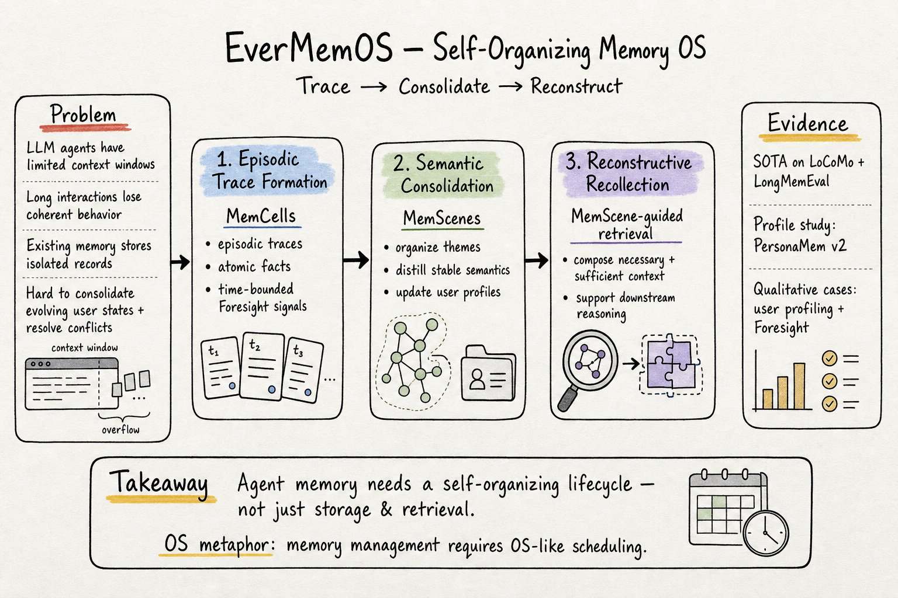

# Agent Memory — 2026-06-14

## 1. EverMemOS: A Self-Organizing Memory Operating System for Structured Long-Horizon Reasoning

- **arXiv**: 2601.02163
- **Link**: https://arxiv.org/abs/2601.02163
- **Authors**: Chuanrui Hu, Xingze Gao, Zuyi Zhou, Dannong Xu, Yi Bai, Xintong Li, Hui Zhang, Tong Li, Chong Zhang, Lidong Bing, Yafeng Deng
- **類型**: arXiv preprint (cs.AI, cs.CL), 16 pages, 7 figures, 12 tables, 有開源代碼

### 這篇在說什麼

LLM agent 在長期互動中會「忘事」——不是因為模型不聰明，而是因為 context window 有限，記憶系統又不夠好。現有的記憶系統大多只做兩件事：存記錄、檢索片段。但人類記憶不是這樣運作的——我們有遺忘曲線、有語義整合、有回憶時的重建過程。EverMemOS 借用了認知科學的 engram（記憶痕跡）概念，設計了一個三階段的自組織記憶作業系統：Episodic Trace Formation（把對話流轉成記憶單元）→ Semantic Consolidation（把記憶單元整合成語義場景）→ Reconstructive Recollection（用語義場景引導的 agentic retrieval 組織出推理所需的 context）。

關鍵創新不在於單獨哪個階段，而在於三個階段形成一個完整的生命週期——記憶會自我組織、自我整合、自我重組，而不是靜態地存取。

### 主要貢獻

1. **記憶生命週期框架**：借用認知科學的 engram 概念，把 agent 記憶從「存取」模型轉為「形成→整合→重建」的生命週期模型。這不是增量改良，而是概念重構——記憶不是靜態的資料庫，而是一個會演化、整合、重組的作業系統。

2. **MemCell 設計**：Episodic Trace Formation 把對話流轉成三層結構——episodic traces（保留原始對話脈絡）、atomic facts（高效檢索的原子事實）、time-bounded Foresight signals（時間限定的前瞻信號）。Foresight 是一個有意思的設計——不只是回顧過去，還預測未來可能需要的資訊。

3. **MemScene 語義整合**：把相關的 MemCells 組織成主題場景（MemScenes），提煉穩定的語義結構，更新 user profile。這解決了「孤立事實無法支持深度推理」的問題——相關事實被整合成連貫的語義圖景。

4. **MemScene-guided Agentic Retrieval**：不是簡單的向量相似度檢索，而是用 MemScene 引導的 agentic retrieval——根據下游推理需求，主動組織出必要且充分的 context。

5. **SOTA 性能**：在 LoCoMo 和 LongMemEval 上達到 SOTA，並有 PersonaMem v2 的 profile 研究和定性 case study。

### 方法 / pipeline

EverMemOS 的三階段流程：

**階段一：Episodic Trace Formation**
- 對話流（dialogue streams）進入後，被轉換為 MemCells
- MemCell 包含三層：episodic trace（保留原始對話片段的完整脈絡）、atomic facts（抽取的原子事實，用於高效檢索）、time-bounded Foresight signals（基於對話內容預測未來可能需要的資訊，帶時間戳）
- Foresight signals 是一個重要創新——它讓記憶系統不只是被動回顧，而是主動預期

**階段二：Semantic Consolidation**
- MemCells 被組織成主題 MemScenes——把相關的記憶單元聚合成連貫的語義場景
- MemScenes 提煉穩定的語義結構（人物關係、偏好、事件因果鏈）
- 同時更新 user profile——這是一個持續演化的過程，不是一次性抽取
- 解決的核心問題：孤立的事實無法支持深度推理，需要語義整合

**階段三：Reconstructive Recollection**
- 不是被動檢索（向量相似度），而是主動重建
- 用 MemScene 引導的 agentic retrieval：根據下游推理的需求，決定需要哪些 MemScene、哪些 atomic facts、哪些 episodic traces
- 組織出「必要且充分」的 context——不多不少，剛好夠推理用
- 這解決了 context window 有限的問題：不是塞越多越好，而是精確地提供推理所需的最小 context

### 實驗設計

- **基準**：LoCoMo（長對話記憶）和 LongMemEval（記憶增強推理）
- **結果**：在兩個基準上都達到 SOTA
- **額外評估**：PersonaMem v2 的 profile 研究（用戶畫像品質）、定性 case study（展示聊天導向的能力如用戶畫像和 Foresight）
- **有開源代碼**：https://github.com/EverMind-AI/EverMemOS

目前從 abstract 能確認上述資訊。全文 HTML 不可用（LaTeX 格式轉換失敗），需要讀 PDF 才能確認 MemCell 的具體結構、MemScene 的聚合演算法、和 Foresight signals 的實作細節。

### かに讀後判斷

EverMemOS 的核心洞察——「記憶需要自組織生命週期」——和 agent memory 領域最近的趨勢高度吻合。和之前看過的幾篇對照：

- **vs. TriMem (2605.19952)**：TriMem 是三層共存（raw dialogue / atomic facts / synthesized profiles），EverMemOS 也是多層次（episodic traces / atomic facts / Foresight + MemScenes / profiles），但 EverMemOS 更強調動態演化——記憶不只是存起來，而是持續整合和重組。
- **vs. True Memory (2605.04897)**：True Memory 說「storage is not memory」，EverMemOS 就是這句話的系統化實作——它把記憶從「存取」變成了「形成→整合→重建」的 OS 級管理。
- **vs. EvolveMem (2605.13941)**：EvolveMem 強調記憶的終身演進，EverMemOS 的 Semantic Consolidation 階段也在做類似的事，但 EverMemOS 多了一個 Foresight 維度和 MemScene 的語義場景組織。

Foresight signals 是一個值得深讀的設計——如果記憶系統不只回顧過去，還能預期未來需要什麼，這對長期互動的 agent 來說意義重大。

**→ 今日推薦點開**

## 2. EvolMem: A Cognitive-Driven Benchmark for Multi-Session Dialogue Memory

- **arXiv**: 2601.03543
- **Link**: https://arxiv.org/abs/2601.03543
- **Authors**: Ye Shen et al.
- **類型**: arXiv preprint (cs.CL), 14 pages, 7 figures, 8 tables

### 這篇在說什麼

現有的多輪對話記憶基準（如 LoCoMo、LongMemEval）大多只測試記憶的「能不能記住」，但忽略了認知心理學中記憶的多維度特性——聲明性記憶（declarative）和非聲明性記憶（non-declarative）需要不同的評估方式。EvolMem 從認知心理學出發，設計了一個系統性的多維度記憶基準，並用混合數據合成框架（topic-initiated generation + narrative-inspired transformations）來構建可控複雜度的多輪對話。

### 主要貢獻

1. **認知驅動的記憶基準**：從認知心理學出發，把記憶分為 declarative（semantic + episodic）和 non-declarative（procedural + priming），每個維度再細分為多個精細能力。
2. **混合數據合成框架**：topic-initiated generation 確保話題覆蓋度，narrative-inspired transformations 確保對話的自然性和連貫性，並附帶樣本特定的評估指南。
3. **No free lunch**：沒有一個 LLM 在所有記憶維度上穩定優於其他模型。Agent 記憶機制不一定能提升 LLM 能力，且常有顯著的效率限制。

### 方法 / pipeline

- 基於認知心理學的多維度記憶分類框架
- 混合數據合成：topic-initiated generation（主題驅動生成）+ narrative-inspired transformations（敘事風格轉換）
- 每個測試樣本附帶特定的評估指南，指導如何判斷記憶是否正確
- 有開源代碼：https://github.com/shenye7436/EvolMem

### 實驗設計

從 abstract 能確認：在多個 LLM 和 agent 系統上評估，發現沒有一致贏家。Agent 記憶機制不一定能提升表現，且有明顯效率限制。

**僅 abstract 層級快速掃描**——方法細節、具體實驗數字、和多維度評估的 breakdown 需讀全文確認。

### かに讀後判斷

EvolMem 的認知心理學視角和 EverMemOS 的 engram 生命週期概念形成對話——兩者都從認知科學出發，但一個做基準、一個做系統。EvolMem 的「no free lunch」發現也印證了 EverMemOS 的動機：簡單的記憶機制（加個 RAG、存個對話歷史）不夠，需要更精細的設計。

不過 EvolMem 已經被 check_paper_seen.py 標記為 NOT_SEEN，但標題和我們之前看過的 EvolveMem (2605.13941) 相似——注意這是不同的論文，EvolMem 是基準、EvolveMem 是記憶系統。

**僅 abstract 層級快速掃描**——需要讀全文才能評估基準設計的品質和實驗的嚴謹度。