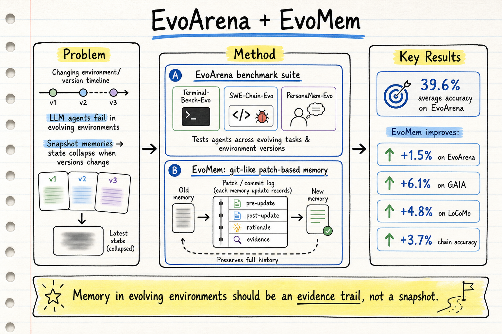
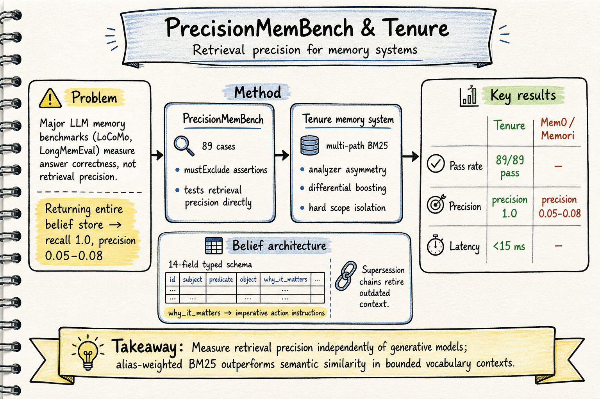

# Agent Memory — 2026-06-15

## 1. EvoArena: Tracking Memory Evolution for Robust LLM Agents in Dynamic Environments

- **arXiv**: 2606.13681
- **Link**: https://arxiv.org/abs/2606.13681
- **Project**: https://aiden0526.github.io/EvoArena/
- **Code**: https://github.com/Aiden0526/EvoArena
- **Dataset**: https://huggingface.co/collections/Aiden0526/evoarena
- **Authors**: Jundong Xu, Qingchuan Li, Jiaying Wu, Yihuai Lan, Shuyue Stella Li, Huichi Zhou, Bowen Jiang, Lei Wang, Jun Wang, Anh Tuan Luu, Caiming Xiong, Hae Won Park, Bryan Hooi, Zhiyuan Hu (NUS, SMU, UW, UCL, UPenn, NTU, Recursive, MIT)
- **類型**: arXiv preprint, 有開源代碼和數據集

### 這篇在說什麼

絕大多數 agent 評測基準假設環境是靜態的——API 不變、規則不變、用戶偏好不變。但真實部署環境一直在演化：軟體升版、工作流變更、用戶偏好漂移。一個可靠的 agent 必須知道什麼變了、什麼還有效、在當前版本下該怎麼行動。

EvoArena 的核心洞察是：現有的記憶系統都把記憶當成「最新狀態」——新資訊覆蓋舊資訊。但在演化環境中，這導致「狀態坍縮」：一個工作流權限更新可能覆蓋掉仍然適用於舊版本或不同組織的規則，agent 既失去了舊行為也失去了理解舊行為為什麼有效的脈絡。

EvoMem 的解法很優雅：用 git-like 的 patch 機制記錄記憶演化——每個 patch 保存更新前的記憶、更新後的記憶、更新理由和觸發脈絡的證據。這讓記憶演化可追溯：agent 可以檢查什麼變了、為什麼變、哪些證據支持這個更新。

### 主要貢獻

1. **EvoArena 基準套件**：三個領域的演化環境基準——Terminal-Bench-Evo（終端工作流演化）、SWE-Chain-Evo（軟體演化）、PersonaMem-Evo（用戶偏好演化）。每個基準把靜態環境變成版本鏈，測試 agent 在環境持續演化下的適應能力。

2. **EvoMem 記憶範式**：git-like 的 patch-based 記憶。每個 patch 記錄 (pre-update memory, post-update memory, update rationale, supporting evidence)。預設從最新記憶檢索，需要時追溯相關 patch。這讓記憶演化成為可追溯的證據鏈。

3. **版本鏈評測**：不只測單步準確率，還測「chain-level accuracy」——agent 必須連續完成一系列相關演化子任務才算成功。平均準確率 39.6%，說明當前 agent 在演化環境中嚴重退化。

4. **跨基準泛化**：EvoMem 在 EvoArena 上提升 1.5%，在 GAIA 上提升 6.1%，在 LoCoMo 上提升 4.8%，chain-level accuracy 提升 3.7%。

### 方法 / pipeline

**EvoArena 的建構流程**（以 Terminal-Bench-Evo 為例）：

1. **Workflow-state analysis**：從原始任務提取結構化狀態（目標、環境、檔案、依賴、介面、驗證規則），區分什麼應該穩定（用戶目標）、什麼可以演化（路徑、指令、套件版本）。

2. **Evolution-plan design**：設計一連串更新，保留目標但改變操作流程。更新分類涵蓋 I/O 協議變更、CLI/API 變更、依賴/工具鏈更新、工作區重構、語義/策略變更。

3. **Inherited version realization**：版本 t 從版本 t-1 的已實現環境出發，繼承之前所有的路徑、依賴、權限、介面、驗證變更。這讓版本鏈成為連貫的工作流歷史，而非獨立變體的集合。

4. **Quality control & oracle validation**：每個版本必須可執行、內部一致、可被參考解決方案通過驗證。

**EvoMem 的設計**：

核心概念是把記憶更新當成證據，而非覆蓋。EvoMem 在標準記憶系統上增加一個 append-only patch history：

- **Patch 結構**：pre-update memory（更新前的記憶狀態）、post-update memory（更新後的狀態）、update rationale（為什麼更新）、supporting evidence（來自觸發脈絡的證據）
- **檢索策略**：預設從最新記憶檢索；當查詢依賴被覆蓋的狀態、衝突證據或舊版本時，選擇性追溯相關 patch
- **設計原則**：記憶是演化歷史，不是快照。保持最新狀態和之前狀態、更新理由、支持證據的連結

### 實驗設計

- **EvoArena 三個子基準**：
  - Terminal-Bench-Evo：從 Terminal-Bench 擴展的演化終端工作流
  - SWE-Chain-Evo：從 SWE-bench 擴展的演化軟體工程鏈
  - PersonaMem-Evo：從 PersonaMem 擴展的演化用戶偏好
- **核心發現**：
  - 當前 agent 在 EvoArena 上平均準確率僅 39.6%
  - EvoMem 提升 EvoArena 平均 1.5%、chain-level 3.7%
  - EvoMem 在標準基準上也有泛化效果：GAIA +6.1%、LoCoMo +4.8%
  - 在 PersonaMem-Evo 上，EvoMem 在時間軌跡和多模式合成問題上提升更大
  - 機制分析顯示 EvoMem 改善了記憶中的證據捕獲，更好地保存完整的演化環境狀態
- 全文 HTML 已閱讀前半部分（§1–§3），後續實驗和附錄需讀 PDF 確認

### かに讀後判斷

**→ 今日推薦點開**

EvoArena + EvoMem 是本週 agent memory 領域最重要的論文之一。它的核心貢獻不是又一個記憶系統，而是一個根本性的洞察：**記憶在演化環境中不應該是最新狀態的快照，而應該是帶有完整脈絡的演化歷史**。

和之前看過的記憶系統對照：

- **vs. EverMemOS（2601.02163，昨天）**：EverMemOS 的三階段生命週期（Trace → Consolidation → Recollection）強調記憶的自組織和語義整合；EvoMem 強調記憶的版本追蹤和演化可追溯性。兩者互補——EverMemOS 管的是「記憶如何整合」，EvoMem 管的是「記憶如何演化」。

- **vs. TriMem（2605.19952）**：TriMem 是三層共存（raw dialogue / atomic facts / synthesized profiles）；EvoMem 的 patch 機制更像是 git history——每次更新都是一個 commit，帶有完整的 diff 和 commit message。

- **vs. Mem0 / LangChain Memory**：這些系統把記憶當成「最新狀態」，新資訊覆蓋舊資訊。EvoArena 的實驗證明了這種設計在演化環境中的嚴重失敗。

EvoMem 的 git-like 設計非常優雅，但一個潛在問題是 patch history 的增長——長期運行的 agent 可能積累大量 patch，檢索效率可能成為瓶頸。論文沒有詳細討論這個問題。

深讀時優先看：§4 EvoMem 的完整演算法、§5 實驗結果（特別是 chain-level accuracy 的分解和 PersonaMem-Evo 的分析）、Appendix 的版本鏈建構細節。

## 2. PrecisionMemBench & Tenure: Structured Belief State and the First Precision-Aware Benchmark for LLM Memory Retrieval

- **arXiv**: 2605.11325
- **Link**: https://arxiv.org/abs/2605.11325
- **Authors**: (single author / small team)
- **類型**: arXiv preprint, May 2026

### 這篇在說什麼

這篇問了一個簡單但致命的問題：所有主流 LLM 記憶基準（LoCoMo、LongMemEval 等）測的是「模型答案對不對」，而不是「記憶系統檢索對不對」。一個返回整個信念庫的系統可以達到 recall 1.0，在答案品質評估上表現良好——但這不是記憶檢索好，這是生成模型在噪音中找答案的能力好。把生成模型剝掉，直接把檢索結果送給分類器或規則引擎，當前系統立刻失敗。

Tenure 的核心論點是：在用戶自創術語的語境下（比如同一個開發者的個人知識庫），alias-weighted BM25 的檢索精度結構性地優於語義相似度搜尋。這不是實驗巧合，而是命名實體解析的邏輯結果——用戶自己給信念命名的術語，就是檢索時會用的術語。

### 主要貢獻

1. **PrecisionMemBench**：89 個測試案例的記憶檢索精度基準，測量檢索精度（而非答案品質），獨立於任何生成模型。案例涵蓋別名解析、範圍消歧、取代鏈排除、模糊匹配、跨用戶隔離、預算驅逐、排序穩定性、和多輪主題漂移下的噪音隔離。每個案例帶有 `mustExclude` 斷言和 `shouldOnlyInclude` 約束——噪音是硬失敗，不是看不見的推理成本。

2. **信念架構（Belief Architecture）**：14 欄位的 typed belief schema，包含 5 種信念類型（preference/decision/entity/open_question/relation）、4 種知識狀態（active/inferred/exploratory/superseded）、typed provenance、和 `why_it_matters` 欄位。`why_it_matters` 把信念從聲明式記錄（「Uses TypeScript with strict mode」）變成命令式指令（「Shapes all code examples toward TypeScript with strict mode and no implicit any」）——模型收到指令後不需要額外推理就能行動。

3. **Tenure 記憶系統**：multi-path BM25 + index-search analyzer asymmetry + differential boosting + hard scope isolation。在 PrecisionMemBench 上 89/89 通過，平均精度 1.0，檢索延遲 < 15ms。相比之下，Mem0 和 Memori 的檢索精度在 0.05–0.08，比裸向量基線還差。

4. **取代鏈（Supersession）**：過時信念不刪除而是標記為 superseded，保留完整的取代歷史。這讓系統能區分「我們從未有過這個信念」和「我們有過這個信念但已經超越了它」。

### 方法 / pipeline

**信念架構**的核心是 `why_it_matters` 欄位：
- 聲明式：「Uses TypeScript with strict mode」→ 模型還要推理怎麼應用
- 命令式：「Shapes all code examples toward TypeScript with strict mode and no implicit any」→ 模型直接行動，不需要額外推理
- 這個區別是結構性的：提取時模型有完整對話脈絡和推理鏈，能寫出正確的 `why_it_matters`；使用時脈絡丟失，模型必須從碎片重建推理——這正是當前系統失敗的地方。

**Tenure 的檢索設計**：
- **Multi-path BM25**：多條索引路徑，每條用不同的 analyzer（query 端和 index 端可以不同）
- **Analyzer asymmetry**：索引端用完整 analyzer（別名擴展、詞幹還原），查詢端用簡單 analyzer
- **Differential boosting**：別名匹配的權重高於一般詞匹配
- **Hard scope isolation**：信念的 scope 是硬過濾器——不在 scope 內的信念結構性地不存在，不是概率性壓低

**取代鏈和 compaction 架構**：
- `superseded_by` 欄位連接被取代的信念和取代它的信念
- Superseded 信念保留但永不注入任何 session
- Alias enrichment flywheel：新信念的別名會回填到相關信念的別名列表
- 這防止了「context rot」——噪音隨時間累積的問題

### 實驗設計

- **PrecisionMemBench**：89 個案例，帶有硬約束（`mustExclude`、`shouldOnlyInclude`）
- **主要結果**：
  - Tenure: 89/89 pass, mean precision 1.0, < 15ms latency
  - Mem0: mean precision 0.05–0.08, ingestion cost 98–897 seconds, zero active retrieval passes
  - Memori: similar low precision
  - 這些系統比它們底層的裸向量基線還差
- **多輪主題漂移**：其他系統讓語義質量跨 turn 洩漏，導致重入時的高漂移分數
- **延遲**：Hindsight 單 turn < 700ms 但平均每 session turn > 2700ms，p95 > 6000ms
- 全文 HTML 已閱讀 §1–§4（方法），§5–§6（實驗）需讀 PDF 確認完整數據

### かに讀後判斷

**→ 今日推薦點開**

這篇的論證風格非常尖銳，幾乎是在整個記憶系統領域面前說「你們量錯了東西」。核心指控是：LoCoMo 和 LongMemEval 測的是生成模型的噪音容忍度，不是記憶系統的檢索品質。如果把生成模型剝掉，所有主流系統的檢索精度都是災難性的。

和之前看過的記憶系統對照：

- **vs. EverMemOS（2601.02163）**：EverMemOS 的 MemScene-guided Agentic Retrieval 是語義導向的，Tenure 認為語義相似度在領域內無法區分相關和無關信念。Tenure 的 BM25 + scope isolation 在精度上是另一條路。
- **vs. EvoMem（今天另一篇）**：EvoMem 關注記憶演化（版本追蹤），Tenure 關注記憶檢索精度（別名匹配 + 範圍隔離）。兩者互補——EvoMem 解決「記憶如何演化」，Tenure 解決「記憶如何精確檢索」。
- **vs. A-MEM**：A-MEM 的 Zettelkasten 演化機制沒有取代鏈，Tenure 認為這會導致 context rot。Tenure 的取代鏈保證過時信念不會被注入，同時保留完整歷史。

Tenure 的 BM25-first 設計有一個明確的限制：它假設用戶會用自己命名過的術語來檢索。這在單用戶或小團隊的開發者場景下很合理，但在多用戶或跨領域場景下可能需要語義檢索的輔助。

深讀時優先看：§4 Retrieval Design 的完整論證（特別是 precision-first argument）、§6 PrecisionMemBench 的 89 個案例分解、§5 Tenure 的完整實驗結果和和 Mem0/Memori 的對比。

