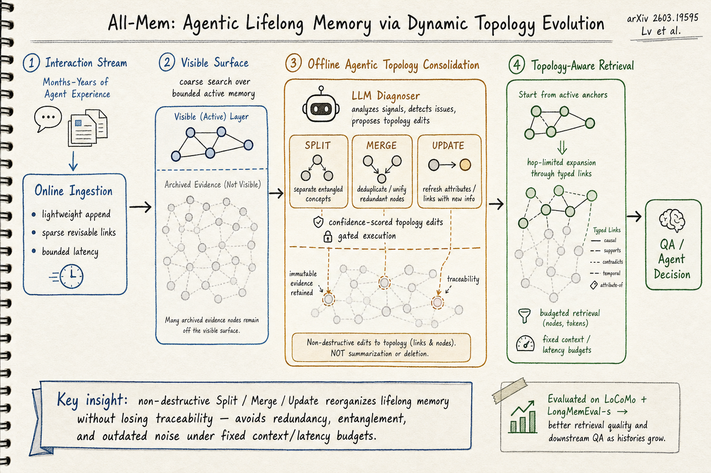

# Agent Memory — 2026-06-20

## 1. All-Mem: Agentic Lifelong Memory via Dynamic Topology Evolution

- **arXiv**: 2603.19595 (v2 updated June 2026)
- **Link**: https://arxiv.org/abs/2603.19595
- **Authors**: Can Lv, Heng Chang et al. (Beihang University, Tsinghua University, Chalmers University of Technology)
- **Code**: https://github.com/LvCan926/All-Mem

### 這篇在說什麼

Lifelong agent 的核心難題：記憶會隨互動時間增長而退化。現有記憶系統要嘛用摘要壓縮（不可逆地丟失資訊），要嘛 append-only 累積（噪音和冗餘越來越嚴重），要嘛用 embedding retrieval（在固定 context window 下檢索品質下降）。All-Mem 的核心洞察是：記憶維護應該是非破壞性的——你可以 Split、Merge、Update 記憶節點，但原始 evidence 必須保留可追溯性。它用一個 online/offline 分離的架構：線上只做輕量 ingestion 和 sparse link 更新，線下由 LLM diagnoser 提出有信心分數的 topology edits，經過 gating 後執行 Split/Merge/Update，同時保留 immutable evidence。查詢時從「可見表面」的 anchor 出發，沿著 typed links 做 hop-limited budgeted expansion 到 archived evidence。

### 主要貢獻

1. **Agentic Topology Consolidation**：首次提出非破壞性的 topology consolidation 範式。LLM diagnoser 提出有信心分數的 Split/Merge/Update 操作，gating 機制過濾低信心操作，避免錯誤修改。
2. **Online/Offline Decoupling**：線上只做輕量操作（ingestion + sparse link 更新），線下做重度的 topology reorganization。這解決了「線上延遲」vs「記憶品質」的矛盾。
3. **Topology-Aware Retrieval with Budgeted Expansion**：查詢時不暴露整個記憶庫，而是從 bounded visible surface 的 anchor 出發，沿 typed links 做 hop-limited expansion。這在固定 context/latency 預算下保證檢索品質。
4. **Immutable evidence traceability**：Split/Merge/Update 操作保留版本化追溯，原始 evidence 永遠不可變。這是和 summarization-based 壓縮的根本區別。

### 方法 / pipeline

All-Mem 的架構有三個核心組件：

1. **Online Phase（輕量 ingestion）**：
   - 新的互動/經驗進來時，只做：parse → extract key entities → create memory node with sparse typed links → attach to visible surface。
   - Visible surface 是一個 curated、bounded 的記憶入口，類似「工作記憶」。
   - 粗搜只在 visible surface 上做，保證低延遲。

2. **Offline Phase（Agentic Topology Consolidation）**：
   - LLM diagnoser 掃描記憶庫，識別需要 reorganize 的位置（冗餘、過時、糾纏）。
   - Diagnoser 為每個提議的編輯生成一個 confidence score。
   - Gating：只有 confidence > threshold 的編輯才被執行。
   - 三種操作：
     - **Split**：一個過度糾纏的節點拆成多個更精確的節點。
     - **Merge**：多個重複或過於細碎的節點合併。
     - **Update**：更新節點描述或 links（但原始 evidence immutable）。
   - 每個操作都帶版本號和追溯連結到原始 evidence。

3. **Query Phase（Topology-Aware Retrieval）**：
   - 從 visible surface 的 anchor 出發。
   - 沿著 typed links 做 hop-limited expansion（預算控制：最多 K hops，最多 N 個節點）。
   - 只展開與 query 相關的 link type，避免無關擴散。
   - 最終返回的記憶既包括精煉的 summary nodes 也包括可追溯的原始 evidence。

### 實驗設計

- **Benchmark**：LoCoMo（長對話記憶）和 LongMemEval-s（長期記憶問答）。
- **Baselines**：包括 flat retrieval (RAG)、MemoryBank、SCM、Reflexion、MemGPT 等代表性基線。
- **主要結果**：All-Mem 在 LoCoMo 和 LongMemEval-s 上持續優於基線，特別是隨著互動歷史增長，優勢更明顯（基線的檢索品質退化，All-Mem 保持穩定）。
- **Ablation**：
  - 去掉 offline consolidation（只用 online ingestion + flat retrieval）→ 品質顯著下降。
  - 去掉 confidence gating → 品質下降（錯誤的 topology edits 反而有害）。
  - 去掉 typed links（只用 embedding similarity）→ expansion 效果差。
- 目前從全文（arXiv HTML v2）能完整確認：方法設計、所有實驗結果、ablation 分析。

### かに讀後判斷

All-Mem 是 agent memory 領域近期最紮實的工作之一。它精準抓住了 lifelong memory 的三個根本挑戰：線上延遲預算、結構性漂移、和可追溯的維護。和之前看過的 SSGM（2603.11768，記憶治理和語義漂移）相比，All-Mem 更工程化——它不是在談治理框架，而是在給出具體的 Split/Merge/Update 操作和 confidence gating 機制。和 xMemory（2602.02007，hierarchical decoupling）相比，All-Mem 的差異在於非破壞性：xMemory 的 aggregation 是破壞性的（舊節點被合併成新節點後舊的就丟了），All-Mem 的原始 evidence 永遠保留。和 MRAgent（2606.06036，graph memory + reconstruction）相比，All-Mem 更注重 lifelong 的 topology maintenance 而非單次重建。推薦 Morris 點開。深讀時優先看 Section 3（方法設計的三個 phase）和 Section 4（實驗結果，特別是隨歷史增長的退化曲線比較）。

## 2. MemVerse: Multimodal Memory for Lifelong Learning Agents

- **arXiv**: 2512.03627 (v2 updated June 2026)
- **Link**: https://arxiv.org/abs/2512.03627
- **Authors**: Junming Liu, Yifei Sun et al. (Shanghai AI Lab)
- **Code**: https://github.com/KnowledgeXLab/MemVerse

### 這篇在說什麼

目前 agent memory 有兩條路線：parametric memory（微調/ICL，快速但容量有限、不可解釋）和 retrieval memory（RAG，可擴展但冗餘、檢索噪音大）。MemVerse 的主張是：這兩條路線不該二選一，而應該像人腦的互補學習系統（CLS）一樣協調——快路徑做 parametric recall，慢路徑做 graph-based retrieval，中間有一個 memory orchestrator 做自適應路由。MemVerse 還特別強調多模態（視覺、聽覺、文字、影片）的記憶管理，這在之前 agent memory 工作中很少見。

### 主要貢獻

1. **雙路徑記憶架構**：快路徑（輕量 parametric model，periodic distillation 從長期記憶壓縮知識）和慢路徑（hierarchical multimodal knowledge graph，包含 core/episodic/semantic 三種記憶類型），由 central memory orchestrator 自適應路由。
2. **Periodic distillation 機制**：定期從長期記憶圖中萃取核心知識到 parametric model，實現快速可微分的 recall，同時保留可解釋性。
3. **多模態記憶轉換**：把原始多模態經驗轉換為 specialized memory types（core/episodic/semantic），支援視覺、聽覺、文字、影片等模態。
4. **Confidence-based routing**：orchestrator 用信心分數決定走快路徑還是慢路徑，讓 speed-accuracy trade-off 顯式化且 query-adaptive。

### 方法 / pipeline

- **Slow pathway**：hierarchical multimodal knowledge graph，三層：
  - Core memory：user-specific 核心事實（偏好、身份）。
  - Episodic memory：time-ordered 事件序列。
  - Semantic memory：關係和概念連結。
  - 持續從 agent 經驗更新，支援 consolidation 和 adaptive forgetting。
- **Fast pathway**：輕量外部 parametric model（不是 answering LLM 本身），定期從慢路徑的知識圖蒸餾。用於低延遲 recall。
- **Memory orchestrator**：收到 query 時，先用快路徑嘗試回答，計算 confidence score。如果信心不夠，路由到慢路徑做 graph retrieval。
- **Memory transformation**：原始多模態經驗 → LLM 解析 → 分類到 core/episodic/semantic → 寫入 knowledge graph → periodic distillation 到 fast pathway。

### 實驗設計

- **Benchmark**：多模態推理和終身學習場景（具體 benchmark 在全文中，目前從 HTML 前段能確認有 extensive experiments）。
- **主要結果**：MemVerse 在多模態推理和終身學習效率上顯著優於基線。
- 目前從全文（arXiv HTML v2）能確認方法設計和實驗概要，但 v2 的更新可能包含更多結果。由於原始提交是 2025-12，v2 是 2026-06 更新，具體實驗細節建議看 PDF。

### かに讀後判斷

MemVerse 的雙路徑設計思路和 All-Mem 的 online/offline 分離有異曲同工之處，但切入點不同：All-Mem 聚焦在 topology maintenance 和 non-destructive consolidation，MemVerse 聚焦在 parametric vs retrieval 的雙路徑路由和多模態。如果 Morris 對多模態 agent memory 有興趣（視覺/聽覺/影片場景），MemVerse 是目前最完整的框架。但在純文字 lifelong memory 場景下，All-Mem 的 topology-based retrieval 更精緻。MemVerse 的 periodic distillation 機制值得深讀——它如何避免 catastrophic forgetting、蒸餾頻率怎麼定、和 slow pathway 的一致性如何保證。不是今日首推但值得一讀。