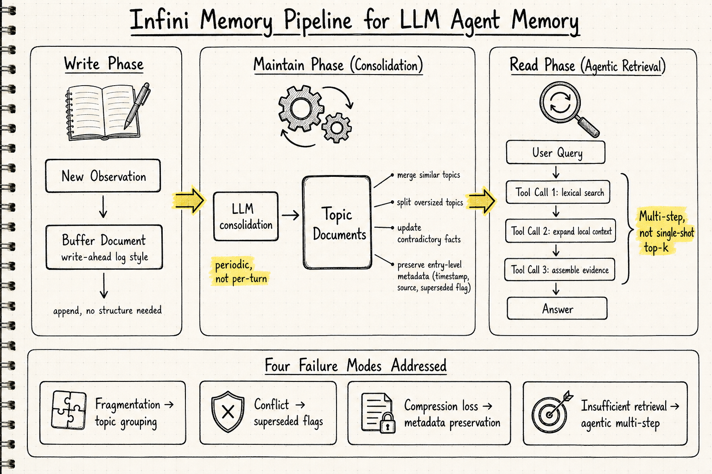
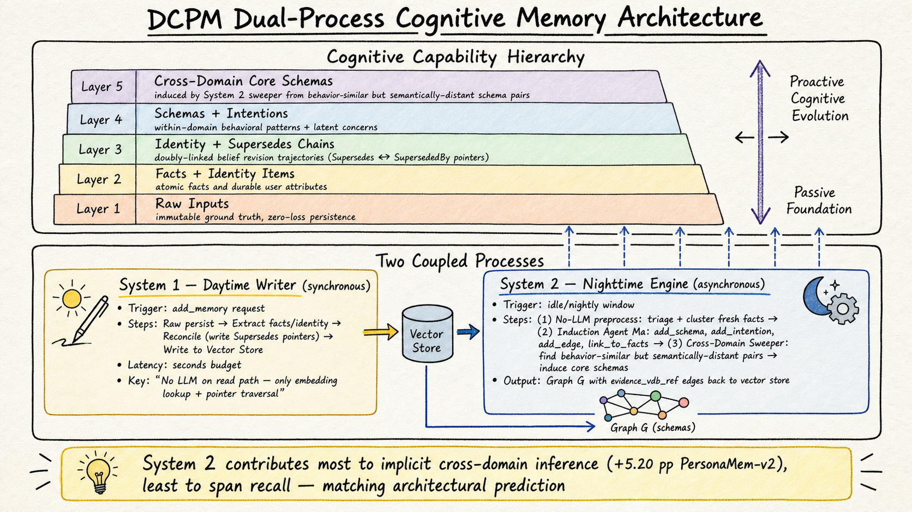

# Agent Memory — 2026-06-22

## 1. Infini Memory: Maintainable Topic Documents for Long-Term LLM Agent Memory

- **arXiv**: 2606.10677
- **Link**: https://arxiv.org/abs/2606.10677
- **Code**: https://github.com/infinigence/Infini-Memory
- **Authors**: Suozhao Ji, Baodong Wu*, Zehao Wang, Lei Xia, Qingping Li, Ruisong Wang, Wenbo Ding, Zhenhua Zhu, Boxun Li, Guohao Dai, Yu Wang* (Infinigence AI / Tsinghua / SJTU)

### 這篇在說什麼

長期運行的 LLM agent 需要一個能跨 session 追蹤事實變化、提供相關證據的持久記憶系統。現有做法——無論是把觀察存成孤立紀錄、壓縮摘要、或向量索引片段——都面臨四個反覆出現的失敗模式：（1）memory fragmentation（同一人/事/任務的相關證據散落在多筆紀錄中）、（2）memory conflict（新舊事實並存卻不和解）、（3）compression loss（摘要丟失時序與來源線索）、（4）insufficient retrieval（單次 top-k 向量檢索只回傳片段而非完整推理所需的局部脈絡）。

Infini Memory 的核心主張是：把 agent 的外部記憶當作一份「可維護的 topic-structured 文件庫」，而非零散的 retrieve-and-inject 索引。每個 topic document 是一個語意單元，收集相關證據、保留 entry-level metadata（時間戳、來源）、並隨時間修訂內容。這樣做的目的是讓記憶的寫入、維護、讀取三個操作不再被壓縮成單純的「存進向量庫 → 查詢時撈回來」，而是一個有生命週期管理的結構。

### 主要貢獻

1. **Document-based persistent memory 架構**：將外部記憶表示為 topic-structured documents，新觀察先寫入 buffer document，再定期 consolidate（rewrite / split / merge）到 topic documents。這讓記憶系統不必依賴向量或圖資料庫，可以用 lexical indexing 做檢索。
2. **Agentic retrieval 策略**：查詞時不是單次向量檢索，而是讓 LLM agent 透過 multi-step tool calls 迭代地搜尋、擴展局部脈絡、組裝答案所需的證據。這補足了「insufficient retrieval」問題——單次 top-k 永遠不夠，需要 agent 自己判斷何時證據已足夠。
3. **Buffered writing + periodic consolidation 的寫入/維護分離**：頻繁的寫入（每次對話追加到 buffer）和低頻的結構重整（合併相近 topic、修訂矛盾事實）分開處理，類似 database 的 WAL + compaction，但用 LLM 做重整。

### 方法 / Pipeline

Infini Memory 的架構分三層：

- **Write 階段**：新觀察先 append 到一個 buffer document（類似 write-ahead log）。Buffer 不要求立即結構化，保證零丟失。
- **Maintain 階段（Consolidation）**：定期觸發，LLM 讀取 buffer 內容，決定哪些觀察屬於同一個 topic、是否需要合併到現有 topic document、是否需要 split 過大的 topic、是否需要 update 矛盾事實。Consolidation 從 buffer 清除已處理的條目，並維護 topic document 內的 entry-level metadata（時間戳、來源、是否被 superseded）。
- **Read 階段（Agentic Retrieval）**：Agent 收到查詢後，透過 tool call 介面迭代搜尋——先做 lexical match 找到相關 topic document，再在 document 內用 expand 局部脈絡，最後組裝回答。不是單次 retrieval step，而是 multi-step 的 search → expand → assemble 循環。

重點設計決策：topic document 是純文本（plain text with metadata markers），而非知識圖譜或向量嵌入。檢索靠 lexical indexing（BM25-like），不用向量庫。這讓系統更簡單、更容易除錯，但也可能犧牲語意檢索的 recall。

### 實驗設計

- **Benchmark**: MemoryAgentBench（一個 multi-session、multi-turn 的長期記憶 benchmark，測 agent 在跨 session 追蹤事實變化、回答需要多筆證據組合的問題時的表現）。
- **Main result**: Infini Memory 的 agentic retrieval 變體在 MemoryAgentBench 達到 **64.7% overall score**。
- **Ablations**: 作者分解了 topic-structured maintenance 和 agentic retrieval 的各自貢獻——兩者互補：topic document 維護解決 fragmentation 和 conflict，agentic retrieval 解決 insufficient retrieval。
- **已讀來源**: arXiv HTML 全文（Sections 1–2.1 及 abstract 完整讀取；Sections 2 之後的方法細節、完整實驗表格、ablation 數據需要看 PDF 確認）。

### かに讀後判斷

Infini Memory 是 agent memory 領域近期最明確地把「記憶維護」當作核心問題的 paper。它和 DCPM（同日另一篇）形成有趣的對照：Infini Memory 用 document + lexical indexing 的「文件庫」隱喻，DCPM 用 vector store + graph + supersedes chains 的「認知層級」隱喻。兩者都同意單純 retrieve-and-inject 不夠，但解法不同——Infini Memory 偏工程務實（plain text、BM25、LLM consolidation），DCPM 偏理論驅動（dual-process theory、cognitive hierarchy、supersedes chains）。

值得 Morris 點開深讀。優先看 Section 3（Agentic Retrieval 的具體 tool call 設計）、Section 4（MemoryAgentBench 的完整結果與 ablation）、以及 Figure 2（system architecture）。另外值得比對 MemGPT、HippoRAG-v2、MemoryBank 在同 benchmark 上的數據。

---

## 2. DCPM: Memory Beyond Recall — A Dual-Process Cognitive Memory System for Self-Evolving LLM Agents

- **arXiv**: 2606.09483
- **Link**: https://arxiv.org/abs/2606.09483
- **Authors**: Tianxiang Fei, Mingyang Song, Mao Zheng, Xiang Yu (Tencent, Large Language Model Department)

### 這篇在說什麼

這篇論文的核心洞察是：長期 agent memory 不只是「在對的時間 retrieve 到對的段落」，更涉及信念修訂（belief revision）、跨領域抽象（cross-domain abstraction）、和因果耦合（causal coupling）。現有系統把這三件事壓縮成單一檢索面，丟失了信念演化的中間狀態、使得 topically distant 的查詢無法檢索到相關證據、也無法歸納跨領域的行為模式。

DCPM 從雙歷程理論（dual-process theory）和心智理論（Theory-of-Mind）出發，把 agent 記憶組織成一個認知能力層級（cognitive capability hierarchy）：從底層的被動基礎（raw inputs + atomic facts）、到中層的結構化記憶（identity items + supersedes chains）、再到頂層的主動認知演化（schemas + intentions + cross-domain core schemas）。這個層級不是實作細節，而是架構級的區分：System 1（同步白天寫入器）處理中低層，System 2（非同步夜晚引擎）處理高層。

### 主要貢獻

1. **Cognitive capability hierarchy**：把 agent 記憶從「被動儲存」到「主動認知演化」分成五層（raw inputs → facts + identity → supersedes chains → schemas + intentions → cross-domain core schemas），每層對應不同的認知能力，而非只是不同的資料結構。
2. **Supersedes chains（雙向鏈結信念修訂軌跡）**：System 1 寫入時，若新觀察與舊信念矛盾，不只覆蓋舊值，而是寫入雙向指標（Supersedes / SupersededBy），形成一條信念演化鏈。讀取時只需 embedding lookup + pointer traversal，不需 LLM。
3. **Asynchronous System 2 夜間引擎**：在離線時段，（a）叢聚新事實、歸納行為 schema 與潛在意圖、寫入 graph 𝒢；（b）cross-domain sweeper 尋找「行為相似但語意距離遠」的 schema pairs，歸納出更高層的 core schema。這讓 agent 能發現「用戶在健身和理財兩個領域展現了相同的延遲滿足偏好」這類跨領域模式。

### 方法 / Pipeline

DCPM 的架構是兩個耦合行程跑在同一個 shared store 上：

- **System 1 — Daytime Writer（同步）**：
  - 觸發：每次 `add_memory` 請求時即時執行，延遲預算幾秒。
  - 步驟：(1) Raw persist（不可變地保存原始輸入到 vector store）；(2) Extraction LLM 提取 atomic facts + identity items；(3) Reconciliation（比對新舊事實，若矛盾則寫入 Supersedes/SupersededBy 雙向指標）；(4) Write to vector store。
  - 讀取路徑只走 embedding lookup + pointer traversal，不調用 LLM。

- **System 2 — Nighttime Engine（非同步）**：
  - 觸發：閒置或夜間批次。
  - 步驟：(1) No-LLM preprocess 分類與叢聚新事實；(2) Induction agent M_a 用四個工具（add_schema, add_intention, add_edge, link_to_facts）在 graph 𝒢 上寫入 schema / intention / 結構邊；(3) Cross-domain sweeper 尋找行為相似但語意距離遠的 schema pairs，歸納 core schema。
  - 關鍵設計：System 2 的輸出（graph nodes/edges）都帶有 evidence_vdb_ref 指回 vector store 中的支撐事實。

### 實驗設計

- **Benchmarks**: LongMemEval, PersonaMem, PersonaMem-v2
- **Main results**: 
  - System 2 啟用後，在需要 implicit cross-session inference 的 PersonaMem-v2 上提升最多 **+5.20 pp**。
  - 在 span recall 類型任務上 System 2 幾乎不貢獻——這完全符合架構預測（System 2 是歸納引擎，不是 recall 引擎）。
  - DCPMlite（只有 System 1）在事實回憶上已經很強；DCPMfull（加上 System 2）在跨領域推理上額外增益。
- **Ablation**: 在 PersonaMem-v2 上做了 stage-wise ablation（raw only → +facts → +identity → +supersedes → +schemas → +intentions → +core schemas），逐步驗證每個認知層級的貢獻。
- **已讀來源**: arXiv HTML 全文（Sections 1–2.2 完整讀取；Section 2.3 之後的 System 2 詳細 pseudocode、Section 3 完整實驗結果需要 PDF 確認）。

### かに讀後判斷

DCPM 是目前 agent memory 領域中理論框架最完整的 paper。它不只是提出一個新系統，而是用認知科學的雙歷程理論來組織整個記憶架構——這讓它有很強的解釋力：System 2 應該在哪裡有用、哪裡不該有用，都有可檢驗的預測，而且實驗確實驗證了這些預測。

與 Infini Memory 的對照很值得深讀：Infini Memory 偏「文件管理」隱喻（topic documents、buffer/consolidation、lexical indexing），DCPM 偏「認知架構」隱喻（capability hierarchy、supersedes chains、nighttime induction）。兩者互補而非互斥——可以想像一個系統用 Infini Memory 的 document structure 做 low-level organization，用 DCPM 的 dual-process 做 high-level schema induction。

值得 Morris 點開深讀。優先看 Section 2.3（System 2 的四個工具和 cross-domain sweeper）、Section 3.4（System 2 的 ablation 驗證雙歷程預測）、和 Algorithms 1–2（pseudocode）。

