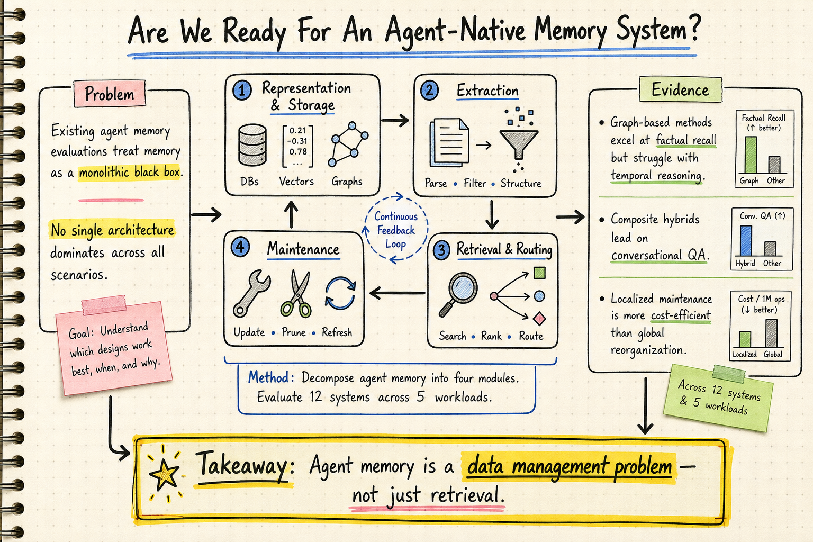

# Agent Memory — 2026-06-26

## 1. Are We Ready For An Agent-Native Memory System?

- **arXiv**: 2606.24775
- **Link**: https://arxiv.org/abs/2606.24775
- **Authors**: OpenDataBox team (多機構)
- **Code**: https://github.com/OpenDataBox/MemoryData

### 這篇在說什麼

Agent memory 近兩年從簡單的 RAG 演進成具備持久儲存、擷取、更新、整合與生命週期治理的資料管理系統，但既有評估仍把它當黑盒子，只用 end-to-end task success（F1、BLEU）來衡量，完全忽略系統層面的成本、架構取捨、動態更新穩健性等問題。這篇論文從 data management 視角出發，把 agent memory 拆解成四個核心模組，系統性地評估 12 個代表性系統 + 2 個 baseline，橫跨 5 個 workload / 11 個 dataset，揭示「沒有任何單一架構能在所有場景稱霸」這個核心洞見。

這篇填補的缺口是：既有 benchmark（LoCoMo、LongMemEval 等）要麼只測 chatbot QA，要麼只看 retrieval accuracy，從來沒有人把 memory 當成一個完整的 data management system 來做 module-level 的診斷與橫比。

### 主要貢獻

1. **四模組分解框架**：把 agent memory 拆成 Memory Representation & Storage、Extraction、Retrieval & Routing、Maintenance 四個層，每一層都有結構化分類（從 token-level sequence 到 heterogeneous composite，從 schema-constrained extraction 到 raw concatenation 等）。這是目前最完整的 agent memory taxonomy。

2. **跨場景統一評估**：在同一 testbed 下統一 time-overhead traces，評估 12 個系統橫跨 conversational QA、single-hop factual recall、temporal reasoning、dynamic update robustness、long-horizon stability 五個 workload。沒有一個系統能在所有場景拿下最佳。

3. **Fine-grained ablation**：對每個模組做 controlled variant 實驗，量化各層對 representation fidelity、retrieval precision、update correctness、long-horizon stability 的影響。例如：compression/summarization/fact extraction 每加一層就丟一些資訊；LLM-based extraction 提升 precision 但傷害 multi-hop reasoning；conservative consolidation 是最穩的 maintenance 策略。

4. **Cost-performance trade-off 量化**：高度結構化的系統（graph-based、composite hybrid）在 index construction time 和 query latency 上比 lightweight stores 慢幾個數量級，但 accuracy 未必成比例提升。Localized maintenance 比 global reorganization 更 cost-efficient。

### 方法 / pipeline

框架把 memory 系統分成四個模組：

- **Representation & Storage (ℛ)**：logical representation（token-level sequence / graph & tree / heterogeneous composite）× physical storage（transient in-context / specialized single-engine / heterogeneous multi-engine）。例如 MemOS 用 MemCube 做 heterogeneous composite + vector+graph DB；Mem0 用 discrete facts + vector DB；Letta 用 context tiers + relational DB。

- **Extraction (𝒮)**：raw concatenation / schema-free extraction / schema-constrained extraction（triplet、JSON attributes、semantic parser）。每加一層 abstraction 都會丟失 evidence。

- **Retrieval & Routing (𝒬)**：native attention-based / semantic-based / topological subgraph traversal / autonomous agentic routing / multi-stage hybrid execution。顯式 query planning + balanced hybrid search 最大化 contextual relevance。

- **Maintenance (𝒰)**：capacity-driven physical eviction / timestamp-based multi-versioning / LLM-driven semantic consolidation（turn-triggered / on-the-fly synthesis）。Conservative consolidation（只在必要時整合）比 aggressive 模式更穩定。

實驗設計：統一 testbed，每個系統跑 5 個 benchmark workloads（conversational QA、single-hop factual、multi-hop temporal、dynamic update、long-horizon），每個 workload 用 2–3 個 LLM backbone（GPT-4o、Claude、Qwen 等）做 cross-model robustness 檢驗。

### 實驗設計

- **Datasets**：LoCoMo（conversational QA）、LongMemEval（factual recall）、AMA-Bench（agentic trajectory QA）、MemoryAgentBench（dynamic update）、ALFWorld / MA-Shop / MA-Travel（long-horizon agentic tasks）。
- **Baselines**：12 個 memory 系統（MemoChat、Mem0、MEM1、MemAgent、MemTree、Zep、Mem0g、Cognee、LightMem、SimpleMem、MemOS、MemoryOS、A-MEM、Letta）+ 2 個 reference baseline（long-context raw、no-memory）。
- **Metrics**：Qwen3-32B LLM-judge score（避免 F1 對 long-form answer 的誤評）、token cost、query latency、index build time。
- **Main results**：
  - RQ1（task effectiveness）：Composite hybrid 系統在 conversational QA 領先；graph-based 在 single-hop factual recall 最強但在 temporal reasoning 掙扎；no single architecture dominates。
  - RQ2（retrieval fidelity）：Explicit query planning + balanced hybrid search 最大化 contextual relevance；但 temporal distance 增加 → retrieval accuracy 下降。
  - RQ3（dynamic update robustness）：Graph-based 最穩；append-only + fact extraction 在 targeted overwrite 掙扎；缺乏 lifecycle management → "hallucinations of the past"。
  - RQ4（long-horizon stability）：Append-only memory stores 在 evidence 隨時間距離增加時 catastrophic degradation；raw long-context retrieval 反而比大部分 memory-backed approaches 好。
  - RQ5（operational cost）：高度結構化系統 latency 高幾個數量級但 accuracy 沒有成比例提升。

### かに讀後判斷

這篇是 agent memory 領域目前最完整的系統性評估。和前幾天追的 2606.04315（Cross-Scenario Generality of Agentic Memory）相比，那篇專注在「cross-scenario generality」且提出 AutoMEM harness，這篇則是從 data management 視角做全景橫比，把每一層的 trade-off 量化出來。兩篇互補：2606.04315 說「agent harness 自己管 memory 比被動 pipeline 好」，2606.24775 說「即便你選了某種 memory 架構，每層的設計決策都有可量化的代價」。

值得 Morris 深讀的重點：
- Table 1 的 taxonomy 是目前最完整的 agent memory 分類，可直接拿來做自己系統的設計 checklist。
- RQ4 的 long-horizon stability 結論很反直覺：raw long-context 比 memory-backed 更穩 → 目前 memory 系統的 consolidation 機制會摧毀 chronological cues。
- Section 5 的 fine-grained ablation 是精華：每層 ablation 的影響都量化了，對選型很實用。

---

## 2. Governed Shared Memory for Multi-Agent LLM Systems

- **arXiv**: 2606.24535
- **Link**: https://arxiv.org/abs/2606.24535
- **Authors**: Yanki Margalit, Nurit Cohen-Inger, Erni Avram, Ran Taig, Oded Margalit (Caura.ai / Ben-Gurion University)

### 這篇在說什麼

當 AI 系統從單一 agent 演進成 fleet of cooperating agents，memory 就不再是「retrieval problem」而是「governed distributed-systems problem」。這篇正式定義 fleet-memory problem：多 agent 共享記憶體時，誰能看什麼、矛盾事實如何解決、provenance 怎麼追蹤、跨 agent boundary 怎麼安全傳播——這些都是 distributed systems 問題，不是 retrieval 問題。

這篇補的洞是：既有 agent memory 研究（MemGPT/Letta、Mem0、Zep、A-MEM 等）都假設 single-agent、append-only、unconstrained access，一旦多 agent 共享 memory，這些假設就崩潰。

### 主要貢獻

1. **Fleet-memory formalization**：把多 agent 共享記憶體建模為 F = (A, M, G, P, T)，其中 A 是 agent 集合、M 是 shared memory substrate、G 是 governance & policy layer、P 是 provenance metadata、T 是 temporal ordering & supersession semantics。這是第一次把多 agent memory 用 distributed systems 的 vocabulary 正式建模。

2. **四個 failure modes**：Unauthorized leakage（agent 拿到不该看的 memory）、Stale propagation（更新沒同步到其他 agent）、Contradiction persistence（矛盾事實同時可 retrieve）、Provenance collapse（無法追溯到寫入者）。每個都對應一個 distributed systems 問題。

3. **MemClaw 實作 + ArgusFleet 評估 harness**：MemClaw 是 production multi-tenant memory service（REST API），ArgusFleet 是 reproducible harness，沿四個 governance dimension 做 live evaluation。這是第一個對 running production system 做 memory governance measurement 的工作。

4. **兩個 production-relevant bug**：(a) GET-by-id 的 sub-tenant scope enforcement 有 gap（tenant isolation OK，但 agent-scoped credential 可以繞過 sub-tenant scope），已在研究期間修復；(b) Synchronous near-duplicate gate 會在 asynchronous contradiction detector 觀察到之前就 reject 掉矛盾寫入，造成 pipeline-ordering 問題。

### 方法 / pipeline

- **MemClaw architecture**：Scoped retrieval（agent ⊑ fleet ⊑ tenant 的三層 scope）、Temporal supersession（寫入新事實 → 舊版標記 non-active）、Provenance tracking（每個 memory 都有 writer identity、timestamp、derivation chain）、Policy-governed propagation（記憶體跨 agent boundary 的傳播由 policy control）。

- **ArgusFleet**：四個實驗對應四個 governance dimension：
  - Leakage probe：測 scope enforcement，是否會 cross-fleet 洩漏。
  - Contradiction probe：測 temporal supersession，寫入矛盾事實後舊版是否被標記 non-active。
  - Provenance walk：測 derivation chain，50 條 depth-4 chain 是否都能正確追溯 writer identity。
  - Propagation measurement：測 authorized visibility latency 和 cross-fleet leakage。

### 實驗設計

- **Provenance**：50 條 depth-4 derivation chain，全部正確重建 writer identity，per-hop latency < 1 second。
- **Propagation**：High intra-fleet visibility，無 observed cross-fleet leakage。Under strong write mode，write-to-visible latency ≈ 1 search round-trip（而非 batched probe 暗示的數十秒）。
- **Bug 1**（已修復）：GET-by-id path 只檢查 tenant projection，不檢查 fleet/agent scope → sub-tenant scope enforcement gap。
- **Bug 2**（design issue）：Synchronous near-duplicate gate 在 contradiction detector 觀察前就 reject 矛盾寫入 → pipeline ordering interaction。
- **Negative results 是核心貢獻**：這不是在比 baseline，而是在量測一個 production service 的 governance correctness，negative results（bug 1 和 bug 2）才是論文最有價值的部分。

### かに讀後判斷

這篇和 2606.24775（"Are We Ready"）形成對比：那篇說「memory 是 data management problem」，這篇進一步說「multi-agent memory 是 distributed systems problem」。對 Morris 來說，如果你在做 multi-agent memory 系統，這篇的四個 failure modes 和 formal model 是重要的設計參考。

值得深讀的重點：
- §3 的 F = (A, M, G, P, T) formalization 和 scope-soundness invariant（Inv-Scope）。
- §4 的四個 failure modes 是直接可用的 threat model。
- §9.1 的 GET-by-id scope gap 是一個經典的 confused deputy 問題，對所有做 multi-tenant memory 的系統都有警示意義。
- ArgusFleet harness 可以直接拿來測自己的 memory governance correctness。

---

## 3. Exploring Cross-Scenario Generality of Agentic Memory Systems: Diagnostics and a Strong Baseline

- **arXiv**: 2606.04315
- **Link**: https://arxiv.org/abs/2606.04315
- **Authors**: Zhikai Chen, Jialiang Gu2, Junyu Yin2, Xianxu Long, Shenglai Zeng, Xiaoze Liu, Kai Guo, Keren Zhou, Jiliang Tang (MSU / George Mason / Purdue)

### 這篇在說什麼

既有 memory system 大多為單一場景調校（multi-session chat 或單一 trajectory format），缺乏跨場景泛化證據。這篇在五個場景（single-turn QA、multi-session chat、agentic-trajectory QA、memory stress test、long-horizon agentic task）上評估八個 memory system + 一個 agent harness（DCI-Lite），發現 harness 自行管理 flat text-file storage 的效果最好。核心洞見：memory 效能的關鍵不在被動 pipeline 背後的 store，而在讓 agent 主動控制 storage 和 retrieval。

### 主要貢獻

1. **Cross-scenario evaluation**：五個 task families × 八個 memory systems + 一個 agent harness，同時追蹤 token cost 和 latency。

2. **Two failure modes 診斷**：(a) Representation-level failure：build-time schema 丟失 step- 和 action-level evidence；(b) Retrieval-level failure：passive retrieval 無法 surface store 中還保留的 evidence。PlugMem 保留了 98% 的 answer information，但 passive retrieval 就是拿不到。

3. **AutoMEM**：一個 agentic memory harness，讓 LLM 透過 tool calls 自己管理 memory，在 LoCoMo 上比原 harness 提升 49.6%，overall ranking 提升 24.4%。

### 方法 / pipeline

- DCI-Lite（baseline harness）：agent 透過 grep 和 read 指令自己管理 flat text files，不做 build-time indexing。LLM 先看問題，再決定要讀哪些 slice，把 schema commitment 從 build-time 推遲到 query-time。
- AutoMEM：在 DCI-Lite 基礎上加 memory tool-calling interface，讓 agent 用 write/query/consolidate 等 tool calls 管理記憶。
- 對比方法：Long-context、Mem0、A-MEM、HippoRAG、PlugMem、AMA-Agent 等八個。

### 實驗設計

- **Benchmarks**：LoCoMo（multi-session chat）、HotpotQA（single-hop QA）、AMA-Bench（agentic trajectory QA）、Memory stress test、ALFWorld / MA-Shop / MA-Travel（long-horizon）。
- **Key result**：DCI-Lite 在 cross-task ranking 最好，不是因為它最強（在單一任務上 HippoRAG 可能更好），而是因為它不 commit to build-time schema → 跨場景最穩。
- **Amortization analysis**：Index-based methods 只有在 query 數量足以攤平 build cost 時才划算。DCI-Lite 的 near-zero build cost 讓它在少量 query 時明顯優勢。

### かに讀後判斷

這篇和 2606.24775（"Are We Ready"）是同一期的姊妹篇思考：「Are We Ready」從 data management 視角做全景橫比，這篇從 cross-scenario generality 視角做診斷。兩篇的核心洞見一致：被動 pipeline 的 memory 系統有根本限制，agent 需要主動控制 storage 和 retrieval。

值得深讀的重點：
- Table 5 的三個 controlled probes（predicate complexity、corpus-window regime、schema expressiveness）是理解 DCI 為何泛化最好的關鍵。
- AutoMEM 的 49.6% LoCoMo 提升和 24.4% overall ranking 提升是實用參考。
- 和 2606.24775 的 RQ4（raw long-context > memory-backed on temporal queries）結合看：目前 memory consolidation 的方式會摧毀 chronological information → 需要更好的 lifecycle management。

---

## 4. Useful Memories Become Faulty When Continuously Updated by LLMs

- **arXiv**: 2605.12978
- **Link**: https://arxiv.org/abs/2605.12978
- **Authors**: Dylan Zhang et al.
- **類型**: 僅 abstract 層級快速掃描（HTML 版本不可用，全文未取得）

### 這篇在說什麼

Consolidated memory（LLM 把過去 trajectory 改寫成 textual memory bank 並持續更新）看似能讓 agent 自我改進，但這篇發現：consolidated memories 常常是 faulty 的，即使源自 useful experience。效用先升後降，甚至跌到比 no-memory baseline 還差。更驚人的是：即使從 ground-truth solutions 整合，GPT-5.4 在 54% 的 ARC-AGI 問題上表現退步。作者把問題追溯到 consolidation 步驟：同一 trajectories 在不同 update schedule 下產出品質差異很大的 memories。Episodic-only control（只保留 raw trajectories）反而和 consolidators 打平。在 ARC-AGI Stream 環境中，保留 raw episodes 的 agent 準確率是 forced-consolidation 的兩倍。

### 主要貢獻

1. **Consolidation regression 現象**：系統性展示「consolidated memories 可能比沒有 memory 還差」。
2. **歸因到 consolidation step**：同一 trajectories、不同 update schedule → 品質差異巨大 → 問題出在整合本身而非原始經驗。
3. **Episodic management 的競爭力**：只保留 raw episodes → 準確率 double forced-consolidation。

### 方法 / pipeline

目前只能從 abstract 確認：ARC-AGI Stream 環境，暴露 Retain / Delete / Consolidate 三個動作，agent 可以自己決定管理策略。

### 實驗設計

目前只能確認：GPT-5.4 + ARC-AGI problems、consolidated vs. episodic-only、不同 update schedule 的 controlled comparison。具體 dataset size、metric、ablation 細節需要看全文。

### かに讀後判斷

這篇和 2606.24775 的 RQ4（long-horizon stability 結論：raw long-context > memory-backed）呼應：兩者都指向「目前 LLM-based memory consolidation 會破壞重要資訊」這個問題。差異是這篇更尖銳地指出 consolidation 本身可能是禍首。Morris 如果在做 agent memory，這篇的建議很實用：把 raw episodes 當 first-class evidence、明確 gate consolidation 而非每次互動後自動觸發。

**目前只能從 abstract 確認的內容**：consolidation regression 現象、GPT-5.4 的 54% failure rate、episodic-only doubling accuracy。**需要看全文才能確認的**：ARC-AGI Stream 環境的細節、不同 update schedule 的 controlled comparison 設計、episodic management 的 auto regime 的具體策略。