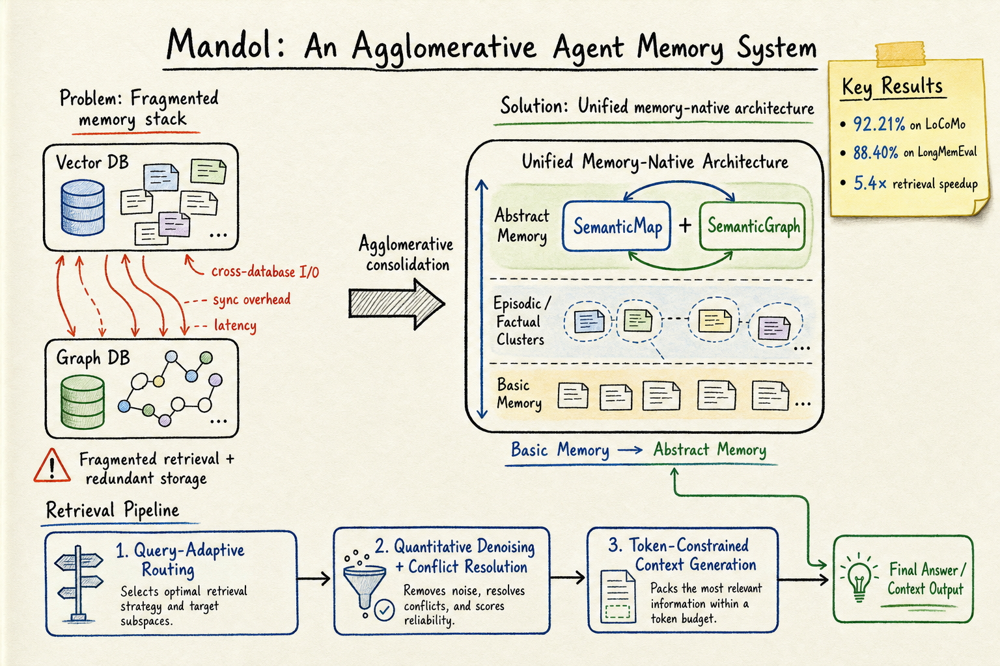

# Agent Memory — 2026-07-02

## 1. Mandol: An Agglomerative Agent Memory System for Long-Term Conversations

- **arXiv**: 2606.29778
- **Link**: https://arxiv.org/abs/2606.29778
- **GitHub**: https://github.com/AgentCombo/Mandol
- **Authors**: Yuhan Zhang, Zhiyuan Guo, Ziheng Zeng, Wei Wang, Wentao Wu, Lijie Xu (ISCAS, Microsoft Research)
- **Submitted**: 2026-06-29

### 這篇在說什麼

長期對話 agent 需要跨 session 記住和查詢多類型、高相關性的資訊，但現有 memory 系統有三大問題：(1) 異構式 vector + graph DB 導致記憶碎片化和高 I/O latency；(2) RAG-style retrieval 容易引入噪聲、漏掉相關線索、缺乏 token budget 控制；(3) 沒有統一的記憶表示模型。Mandol 把這三件事一次解決：統一表示、統一儲存、定量查詢。

這篇的核心洞察是「agglomerative」——不是讓記憶碎片散落在不同 DB，而是把基本記憶聚合成高層抽象記憶，兩層都用結構化語意圖表示，並用一個統一的 in-memory data structure（SemanticMap + SemanticGraph）原生融合 key-value、vector、graph 三種結構。

### 主要貢獻

1. **Hierarchical memory model**：Basic Memory Layer（原始記憶單元、空間、顯式/隱式關係）+ Abstract Memory Layer（episodic memory 事件鏈、semantic memory 實體圖、emotional memory 用戶偏好），兩層都用結構化語意圖統一表示。Abstract layer 中的記憶維持到 basic layer 的可追蹤連結，確保 evidence grounding。

2. **Agglomerative Semantic Data Structure（SemanticMap + SemanticGraph）**：原生融合 key-value、vector、graph 結構，提供統一的 hybrid retrieval operators，消除 cross-database I/O。這不是簡單地把向量庫和圖庫放在一起，而是設計了一個統一的 in-memory data structure 來原生存取。

3. **Quantitative Query Mechanism**：Query-adaptive routing（根據查詢意圖動態選擇記憶來源）→ Quantitative denoising + conflict resolution（移除噪聲和矛盾資訊）→ Token-constrained context generation（在 token 預算內聯合優化相關性和多樣性），整個 retrieval 過程不涉及 LLM。

4. **SOTA accuracy + 5.4x/4.8x speedup**：LoCoMo 92.21%、LongMemEval 88.40%，同時在 10 QPS 下 Search latency 降低 5.4x、Insert latency 降低 4.8x，在消費級硬體上也能維持低延遲。

### 方法 / pipeline

Mandol 的系統架構分三層：

**Memory Representation Layer**：
- Basic Memory：記憶單元（memory unit）、記憶空間（memory space）、顯式和隱式關係
- Abstract Memory：自動從 basic memories 聚合出 episodic memory（事件鏈）、semantic memory（實體圖）、emotional memory（用戶偏好），每個抽象記憶都有 traceable links 回到原始 basic memories

**Storage Layer**：
- SemanticMap：融合 key-value 和 vector 結構
- SemanticGraph：融合 graph 和 vector 結構
- 兩者聯合提供 atomic hybrid retrieval operators（同時做 keyword match、vector similarity、graph traversal）
- 底層連接 persistent database 做 cold/long-term storage

**Query Layer**：
- Query-adaptive routing：分析查詢意圖，動態選擇相關記憶來源（keyword, vector, graph, 或混合）
- Quantitative denoising & conflict resolution：從不同來源移除噪聲和矛盾資訊
- Token-constrained context generation：在 token 預算內聯合優化 relevance 和 diversity，不呼叫 LLM

### 實驗設計

- **Benchmarks**：LoCoMo 和 LongMemEval 兩個廣泛使用的長期對話基準
- **Baselines**：Mem0, Zep, MemU (NevaMind), MemOS, EverMemOS 等代表性開源記憶系統
- **Metrics**：accuracy（多種 query type）、latency（Search/Add、不同 QPS）、consumer-grade vs. server 硬體
- **Main results**：
  - LoCoMo: Mandol 92.21%（最佳整體 accuracy）
  - LongMemEval: Mandol 88.40%（最佳整體 accuracy）
  - 10 QPS 下 Search latency 5.4x speedup、Add latency 4.8x speedup
  - Consumer-grade 硬體上仍維持低延遲

目前從 HTML 全文能確認完整的方法和實驗設計。詳細的 ablation 和每個 query type 的 breakdown 需要進一步看 Table。

### かに讀後判斷

Mandol 是 agent memory 領域近期最完整的系統設計之一。它的核心貢獻是「統一」——不是簡單的工程整合，而是在表示、儲存、查詢三個層面都做了統一設計。幾個值得注意的點：

1. **和 RaMem (2606.22844, 今日同時收錄) 互補**：RaMem 診斷了 context collapse 問題並提出 contextual reinstatement；Mandol 則從系統層面解決碎片化和 I/O 問題。兩者可以結合。

2. **和 DynamicMem (2606.22877, 今日同時收錄) 的對話**：DynamicMem 暴露了 memory 系統在長時間跨度上的 degradation pattern（profile reconstruction 隨時間衰減但 service task 不會），Mandol 在 LoCoMo 和 LongMemEval 上的表現是否能在 DynamicMem 的 15 個月跨度和 multi-app 設定上維持，是值得追蹤的問題。

3. **不涉及 LLM 的 retrieval 是重要設計決策**：避免了 LLM-in-the-loop 的 latency 和 cost，但也可能限制了對需要推理的查詢的處理能力。

4. **和之前讀過的 Mem0, Zep, MemOS 直接比較**：Mandol 在兩個基準上都超過了這些系統，這是實質性的進步。

**今日推薦點開**。深讀時優先看：Table 的 per-query-type breakdown、ablation（移除 agglomerative data structure 或 quantitative query 的效果）、和 consumer-grade 硬體上的 latency 數字。

---

## 2. RaMem: Contextual Reinstatement for Long-term Agentic Memory

- **arXiv**: 2606.22844
- **Link**: https://arxiv.org/abs/2606.22844
- **GitHub**: https://github.com/weiyang930/RaMem-Release
- **Authors**: Wei Yang, Bryce Kan, Shixuan Li, Li Li, Yuehan Qin, Jiate Li, Paul Bogdan, Jesse Thomason (USC)
- **Submitted**: 2026-06-22

### 這篇在說什麼

長期記憶系統讓 agent 可以儲存和檢索過去的經驗，但 retrieval 本身不保證取回的記憶是當前查詢的有效證據。當經驗被壓縮成可重用片段時，來自不同情境的記憶可能看起來同樣相關——因為它們涉及相同的實體或用戶狀態。RaMem 稱這個失敗模式為 **context collapse**：記憶失去了判斷它們是否能作為當前查詢有效證據所需的周圍上下文。

這是一個精準的診斷：不是 retrieval miss，而是 evidence misidentification——agent 取回了和查詢相關但屬於錯誤上下文的記憶。

### 主要貢獻

1. **識別 context collapse 作為長期 agent memory 的核心失敗模式**：記憶可以看起來相關但在上下文中無效。形式化為 contextual evidence identification 問題。

2. **RaMem 四階段框架**：
   - (i) **Evidence Anchoring**：把每個記憶錨定到原始情境條件（event time, mention time, session span, participants）
   - (ii) **Recall Condition Induction**：從查詢推導出 recall conditions——需要什麼樣的證據條件
   - (iii) **Validity-Aware Retrieval**：用這些條件優先選擇 context-compatible 的記憶，同時保留 content-relevant candidates 作為 fallback
   - (iv) **Context-Preserved Synthesis**：把選中記憶的結構化上下文保留給生成器

3. **穩定的 F1 提升**：在長期記憶基準上，RaMem 在多個 backbone 上平均 F1 提升超過 10%。

### 方法 / pipeline

RaMem 的核心概念是讓取回的記憶碎片變成 **contextually verifiable evidence**：

**Episodic Memory Anchoring**：每個記憶 $m_i = (x_i, e_i)$ 包含 content field 和 episodic context field。Context field 記錄 event time（事件發生時間）、mention time（被提及的時間）、session span（在哪個 session 觀察到）、participants、location、entities、topic description。關鍵區分：event time ≠ session time，因為用戶可能在之後的 session 討論更早的事件。

**Recall Condition Induction**：把查詢 $q$ 分解為 information need $r_q$ 和 contextual recall frame $c_q$。Recall frame 記錄 grounded time range、participants、locations、entities、topic hints。這讓系統區分「需要什麼資訊」和「什麼樣的證據是有效的」。

**Validity-Aware Retrieval**：用 recall conditions 優先選擇 context-compatible 的記憶，但保留 content-relevant candidates 作為 fallback。不是簡單的 relevance scoring，而是 validity filtering。

**Context-Preserved Synthesis**：把選中記憶的結構化上下文一起傳給生成器，而不是只傳 content。

### 實驗設計

- **Benchmarks**：長期記憶基準（具體名稱需看全文 Table）
- **Baselines**：多個強記憶系統 baseline
- **Metrics**：answer quality（F1）、ground-truth memory retrieval、context-budget efficiency
- **Main results**：
  - 平均 F1 提升超過 10%
  - 在 context-confusable subset 上，SimpleMem 經常把 context-invalid 的記憶推到 rank 1
  - RaMem 的 validity-aware retrieval 有效減少了這種 evidence misidentification

目前從 HTML 全文能確認方法框架和主要結果。具體的 per-benchmark breakdown、ablation（移除每個 stage 的效果）、和與 Mandol 等系統的直接比較需要看全文。

### かに讀後判斷

RaMem 提出了一個精準且重要的問題診斷。context collapse 不是 retrieval noise，而是 evidence misidentification——這個區分很重要，因為它意味著更好的 vector similarity 或更多的 retrieval 不能解決問題，需要的是 validity-aware 的 retrieval。

1. **和 Mandol 互補**：Mandol 解決的是系統層面的碎片化和 I/O 問題，RaMem 解決的是 retrieval 層面的 context validity 問題。兩者可以疊加。

2. **和之前讀過的 Supersede (2606.27472) 的 memory-update gap 相關**：Supersede 診斷的是 bounded memory 在 fact supersession 上的 accuracy 下降；RaMem 診斷的是 context collapse。兩個問題在長期記憶中可能同時出現。

3. **Evidence anchoring 的 event time vs. session time 區分很實用**：這在用戶跨 session 討論過去事件時特別重要，是很多記憶系統忽略的。

深讀時優先看：per-benchmark F1 數字、每個 stage 的 ablation、context-confusable subset 的詳細分析。

---

## 3. DynamicMem: A Long-Horizon Memory Benchmark in Real-World Settings

- **arXiv**: 2606.22877
- **Link**: https://arxiv.org/abs/2606.22877
- **Website**: https://wenyaxie023.github.io/DynamicMem/
- **Authors**: Wenya Xie, Shengming Zhou, Zelin Li, Pouya Parsa, Shuang Zhou, Xinheng Ding, Chinmay Arvind, Guanchu Wang, Vladimir Braverman, Ali Payani, Yantao Zheng, Zirui Liu (UMN, UNC Charlotte, JHU, Cisco, Adobe)
- **Submitted**: 2026-06-22

### 這篇在說什麼

LLM agent 越來越多地扮演個人助理角色，需要跨月記住用戶的屬性（attributes）、習慣（habits）、偏好（preferences），並且在用戶的工作、作息、品味變化時更新這些記憶。但現有 benchmark 用短而簡化的互動來評估這個「記憶」能力，錯失了三個真實行為的核心特性：(1) 用戶 profile 是異構的——attributes、habits、preferences 在不同時間尺度上演化；(2) 變化不是隨機的，而是由外部上下文（季節、生活事件）驅動的；(3) 證據很少直接陳述，而是散佈在不同 app 的許多小行為中，記憶系統需要從分佈式的行為痕跡中推斷。

DynamicMem 建構了每人 15 個月、平均 2.2M tokens、1,772 個 grounded events 的合成軌跡，橫跨 16 個 app。用戶的 profile 從不直接給出——每個 attribute、habit、preference 都必須從散佈在不同 app 的微弱信號中推斷。

### 主要貢獻

1. **Trajectory-level, cross-app evidence**：不是把多個 session 的對話拼接，而是生成有因果連結的 event chains——一個用戶意圖在多個 app 中展開，每個 log entry 都依賴於當前 app 狀態和同一 chain 中更早的步驟。

2. **Multi-timescale user modeling**：把用戶 profile 分解為三個具有不同動態的類別——attributes（離散事實，隨生活事件改變）、habits（中期例行，適應上下文）、preferences（長期傾向，逐漸漂移），每個類別有專門的 task pair。

3. **Causally grounded, coupled profile evolution**：profile 的每次變化都有外部原因（季節、重大事件、環境改變），一個原因通常同時推動多個面向的變化。

4. **Checkpoint-based evaluation**：在五個季度檢查點評估，暴露 performance 如何隨歷史長度增長而變化。

5. **三個關鍵發現**：
   - Profile reconstruction accuracy 隨歷史增長衰減，但 service task accuracy 保持平穩——儘管兩者使用同一個記憶
   - 沒有任何系統能同時保持不變的事實和更新已改變的事實；錯誤集中在 preferences 和 exact entity naming
   - 超過 93% 的失敗來自記憶 retrieval 而非 answer model——改善空間在記憶本身

### 方法 / pipeline

DynamicMem 的合成 pipeline 分三個 stage：

**Stage 1: Multi-timescale user profile construction**：
- Static base profile（人口統計、社經地位、人格特質）
- Dynamic profile 跨 6 個生活領域（工作與教育、家庭與親密關係、社交與社區、健康與自我照顧、財務與物質生活、休閒與媒體）
- 每個領域下分 attributes、habits、preferences 三類，各有不同的動態模式
- 五個季度檢查點，每個 checkpoint 觸發 state transitions

**Stage 2: Intent-conditioned event chain generation**：
- 把 profile state 轉成 coherent multi-step intents
- 每個 intent 展開為跨 app 的事件鏈

**Stage 3: State-consistent multi-app log generation**：
- 16 個 app（e-commerce, fitness, social platforms 等）
- 每個 app 有 66 個 API
- 狀態一致的互動 logs，確保實體引用在 app 內和跨 app 都一致

### 實驗設計

- **Scale**：每人平均 2.2M tokens、1,772 grounded events、17,715 總事件、1,837 個演變中的 attribute/habit/preference items、383 個因果 state transitions、4,994 個 fine-grained scoring points
- **Tasks**：State Completion（重建 profile category）和 Personalized Service（根據 profile 執行任務），各 attribute/habit/preference 有專門的 task pair
- **Baselines**：5 個代表性記憶系統
- **Evaluation**：5 個季度檢查點，追蹤 performance 隨歷史長度的變化

三個關鍵發現已在主要貢獻中列出。特別值得注意的是第三點——93%+ 的失敗來自 retrieval 而非 generation，這意味著改善空間主要在記憶系統本身。

### かに讀後判斷

DynamicMem 是目前最細粒度的長時間跨度記憶 benchmark。它的核心創新是「profile 不是給的，是推斷的」加上「異構時間尺度」加上「因果驅動的變化」。這對 agent memory 的評估有實質性推進。

1. **和 RaMem 互相驗證**：RaMem 的 context collapse 問題在 DynamicMem 的設定中可能更加嚴重——因為證據散佈在不同 app 中，同一個 preference 可能有多個看似相關但屬於不同時間點的記憶片段。

2. **和之前讀過的 Supersede (2606.27472) 的 memory-update gap 直接對應**：DynamicMem 明確測量了「保持不變的事實 vs. 更新已改變的事實」的張力，這正是 Supersede 診斷的 fact supersession 問題。

3. **對 Mandol 的壓力測**：Mandol 在 LoCoMo 和 LongMemEval 上表現很好，但這兩個 benchmark 的時間跨度和異構性都不如 DynamicMem。Mandol 的 agglomerative memory 是否能在 15 個月的跨 app 設定上維持表現，是開放問題。

深讀時優先看：per-checkpoint 的 accuracy 曲線、per-category（attribute/habit/preference）的錯誤分析、和每個 baseline 的 detailed comparison。