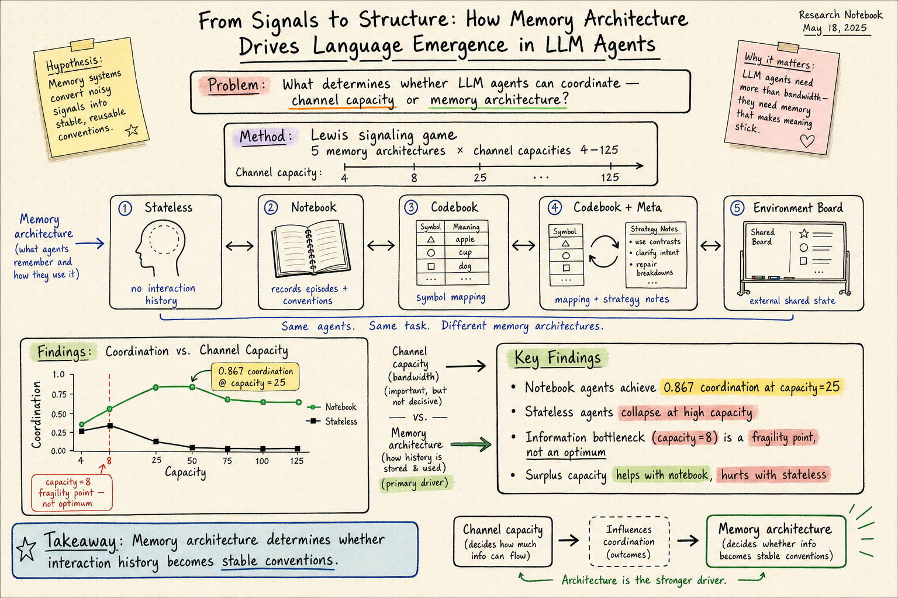

# Agent Memory — 2026-07-17

## 1. From Signals to Structure: How Memory Architecture Drives Language Emergence in LLM Agents

- **arXiv**: 2607.00233
- **Link**: https://arxiv.org/abs/2607.00233
- **Authors**: Yashar Talebirad, Eden Redman, Ali Parsaee, Osmar R. Zaïane
- **Affiliations**: Alberta Machine Intelligence Institute (Amii), University of Alberta; Network for Applied Technology
- **Venue**: ALIFE 2026
- **Submitted**: 2026-06-30

### 這篇在說什麼

兩個 LLM agent 在沒有任何預先約定語意的情況下，能不能從零發明一套共享語言？這是 Lewis signaling game 的經典設定：sender 看到目標物件，發出一個受限的符號訊息；receiver 收到訊息後猜目標。這篇研究的核心問題不是「channel capacity 夠不夠」，而是「memory architecture 決定 agent 能不能把互動歷史轉化為穩定的慣例」。實驗用了五種 memory architecture，跨多個 channel capacity 設定，發現有持續私人筆記本（persistent private notebook）的 agent 能善用多餘的 channel capacity，達到最高穩定協調率（capacity=25 時 0.867±0.023）；而無狀態 agent 在中等 capacity 後反而退化——vocabulary 增長超過 rolling window 能追蹤的範圍。這篇的貢獻不只是「memory 對 emergent communication 重要」，而是用控制實驗證明了 memory architecture 比 channel capacity 更能預測協調成功率。

### 主要貢獻

1. **記憶架構比通道容量更重要**：在五種 memory architecture 中，notebook 條件的表現最好且最穩定，而 channel capacity 的效果取決於記憶架構——同樣的 capacity，在不同記憶架構下表現完全不同。
2. **information bottleneck 不是最佳點**：理論預測 capacity=8（等於物件數）是最優，但實驗中 capacity=8 反而是脆弱點；surplus capacity 通常更好，特別是對有 notebook 的 agent。
3. **Stateless agent 的高容量崩潰**：無狀態 agent 在中等 capacity 時達到峰值，之後隨著 vocabulary 增長而退化——rolling context window 追不上膨脹的 code space。
4. **Notebook 的外部化效果**：持續筆記本把學到的慣例外部化，讓 agent 不需要每回合重新推導 code，這是 notebook 條件能善用 surplus capacity 的關鍵。

### 方法 / pipeline

- **遊戲設定**：Lewis signaling game，200 回合。
  - Agent A（sender）觀察 4 個候選物件（從 8 個物件池中抽樣），以及 1 個目標物件。
  - Agent A 發出長度 L 的符號訊息，從詞彙 V 中選擇。
  - Agent B（receiver）看到同樣 4 個候選和訊息，猜目標。
  - 每回合結束後兩個 agent 都收到回饋（正確/錯誤、真實目標）。
  - 隨機準確率 0.25（4 選 1）。

- **五種 Memory Architecture**（所有條件共享 rolling window of last 20 interactions）：
  1. **Stateless**：只有 rolling window，沒有額外記憶。
  2. **Notebook**：持續私人筆記本（≤150 字），每回合重寫。
  3. **Codebook**：固定 10 格的 slot list，每回合做一次結構化操作（append / edit / none）。
  4. **Codebook + Meta**：codebook 加一條持續 meta-note 字串。
  5. **Environment Board**：公開慣例表，由環境從成功回合的統計編譯，兩個 agent 都可讀但不可編輯。

- **Channel Capacity**：|V|^L，掃過 |V|∈{2,3,4,5}, L∈{2,3}，得到 {4,8,9,16,25,27,64,125}。

- **模型**：gpt-5.4-mini（temperature=1.0）。

### 實驗設計

- **Study 1**：固定 channel（capacity=25），比較五種 memory architecture。
- **Study 2**：掃 channel capacity 從 4 到 125，看每種記憶架構的表現曲線。
- **Study 3**：分離 consolidation（筆記本的穩定化效果）和 history length（rolling window 長度）。
- **主要結果**：
  - Notebook 條件在 capacity=25 達到 0.867±0.023，最高且最穩定。
  - Stateless agent 在 capacity 超過中等值後退化（高容量崩潰）。
  - Capacity=8（information bottleneck 預測的最優點）實際上是脆弱點。
  - Notebook 能善用 surplus capacity，因為外部化慣例讓 agent 不需要重新推導。
- **限制**：只用了一種 LLM（gpt-5.4-mini）；物件空間很小（8 個物件、3 個二元特徵）；遊戲設定是高度簡化的 Lewis signaling game，和真實多 agent 系統的記憶需求有距離。
- 已讀來源：arXiv HTML 全文前段（約 15000 字），涵蓋完整的 introduction、experimental setup、memory architecture 定義和部分結果；後段完整結果和討論需 PDF 確認。

### かに讀後判斷

這篇直接站在 agent memory 和 emergent communication 的交叉點——它證明了記憶架構不只影響 agent 的效率，而是決定了語言能不能從互動中浮現。對 agent memory 領域的啟示是：設計記憶系統時，externalization（把慣例寫下來）比單純增加 context window 更重要。這和之前讀過的 Agentopia（2606.07513，長期社會模擬中的記憶與學習）形成有趣對比：Agentopia 用 life reward 做 rejection sampling 來增強 LLM，這篇則是在最基本的 signaling game 層面證明記憶架構的決定性角色。Morris 如果對 agent memory 的基礎機制有興趣，這篇值得深讀。深讀優先看 Figure 3-5（各記憶架構在不同 capacity 下的表現曲線）和 Study 3 的 consolidation 分離實驗。

