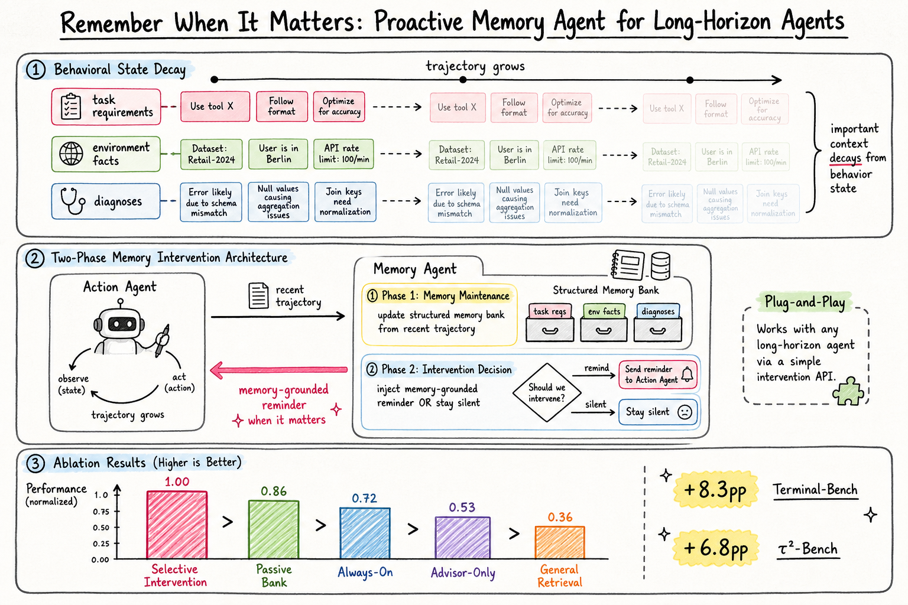

# Agent Memory — 2026-07-18

## 1. Remember When It Matters: Proactive Memory Agent for Long-Horizon Agents

- **arXiv**: 2607.08716
- **Link**: https://arxiv.org/abs/2607.08716
- **Authors**: Lizhu Zhang, Yuhang Zhou, Mingyi Wang, Bo Peng, Serena Li, Xiangjun Fan, Zhuokai Zhao (Meta AI)
- **Submitted**: 2026-07-09

### 這篇在說什麼

Long-horizon agent 的核心失敗模式不是「找不到資訊」，而是「決策相關的資訊在軌跡中逐漸失去影響力」。作者把這個失敗模式命名為「behavioral state decay」：task requirements、environment facts、prior attempts、diagnoses、open subgoals 這些本應影響未來決策的資訊，隨著軌跡增長，要麼被推出 context window，要麼雖然還在 context 裡卻不再可靠地影響 agent 的下一步行為。這是一個比「忘記」更根本的問題——你可能沒忘，但行為已經退化了。

對此，作者提出記憶不應只是被動存取（我需要的時候去查），而應是主動介入（記憶系統決定何時該提醒 agent）。一個獨立的 memory agent 在固定間隔運行，更新結構化 memory bank，然後決定是否注入一個 memory-grounded reminder 到 action agent 的下一個 call，或者保持沉默。這是 plug-and-play 的——不需要修改 action agent。

### 主要貢獻

1. **定義 behavioral state decay**：明確命名並刻畫了 long-horizon agent 的核心失敗模式——不是資訊不存在，而是資訊不再可靠地影響決策。這比「lost in the middle」或「context overflow」更精確，因為它區分了「可以儲存/檢索」和「應該介入控制」。
2. **Two-phase memory intervention architecture**：記憶維護（更新結構化 memory bank）和介入決策（是否注入提醒）分離。Memory agent 不是每步都說話——它選擇性介入。
3. **Empirical validation across two benchmarks**：Terminal-Bench 2.0（+8.3pp）和 τ²-Bench（+6.8pp），對更強的 action agent（Opus 4.6）也有 +2.4pp 和 +2.5pp 的提升。
4. **Ablation 完整性**：Selective intervention > passive bank exposure > always-on injection > advisor-only guidance > general retrieval。這組消融實驗清楚證明「選擇性介入」是關鍵，不是「有記憶就好」。
5. **Open-weight memory policy**：用 Qwen3.5-27B 在 SETA 上 SFT + GRPO 訓練，驗證 reward 改善且 partial transfer 到 Terminal-Bench。

### 方法 / pipeline

- **Architecture**：Memory agent 與 action agent 並行運行。
  - Action agent：不修改的 frontier LLM（Claude Sonnet 4.5 / Opus 4.6）。
  - Memory agent：在固定間隔（每 N 步）被喚醒，執行兩個 phase：
    1. **Memory maintenance**：從 recent trajectory 更新結構化 memory bank（task requirements、environment facts、failed attempts、diagnoses、open subgoals）。
    2. **Intervention decision**：決定是否注入一個 concise reminder 到 action agent 的下一個 call。如果決定不介入，則保持沉默（不在 action agent 的 context 中加入任何東西）。
- **Key design**：Memory agent 的輸出不是「廣泛的戰略建議」，而是「memory-grounded reminder」——一個具體的、從 memory bank 中提取的、應該在此刻影響行為的資訊片段。
- **Plug-and-play**：不需要修改 action agent。Memory agent 只是在 action agent 的 context 中插入或不插入一段文字。

### 實驗設計

- **Benchmarks**：
  - Terminal-Bench 2.0：autonomous command-line execution。
  - τ²-Bench：interactive tool-use under domain-specific rules。
- **Main results**：
  - Claude Sonnet 4.5 + Memory (Opus 4.6)：Terminal-Bench 37.6% → 45.9%（+8.3pp）；τ²-Bench 55.0% → 61.8%（+6.8pp）。
  - Claude Opus 4.6 + Memory (Opus 4.6)：Terminal-Bench 仍有 +2.4pp；τ²-Bench 仍有 +2.5pp。提升不會因為更強的 action agent 而消失。
- **Ablation（全在同一 action agent 上）**：
  - Selective intervention（完整方法）
  - Passive bank exposure（把 memory bank 放在 context 但不主動提醒）：比 selective intervention 差。
  - Always-on injection（每次都注入 memory）：增加 latency 和 token consumption，可能 distract agent。
  - Advisor-only guidance（不限制在 memory-grounded reminder，而是給廣泛戰略建議）：比 selective intervention 差。
  - General retrieval（每步都做 retrieval）：最差。
- **Open-weight policy**：Qwen3.5-27B SFT + GRPO on SETA，validation reward 改善，partial transfer 到 Terminal-Bench。
- 已讀來源：arXiv HTML 全文約 12000 字，涵蓋完整 abstract、introduction、related work 和部分 method；後段實驗表格和 ablation 數字需 PDF 確認。

### かに讀後判斷

這篇是 agent memory 領域今年最重要的論文之一，因為它精確命名了一個大家隱約感受到但沒有清楚界定的問題——behavioral state decay。它不是在說「agent 忘了」（那是 retrieval 的問題），而是在說「agent 的行為不再被它已經知道的資訊所影響」（這是 intervention 的問題）。這個區分很重要，因為它意味著單純加大 context window 或加強 retrieval 不能解決問題——你需要一個獨立的機制來決定「什麼時候應該主動提醒」。

對照今天的 PM-Bench（2607.12385），那篇是在測 LLM 是否能執行前瞻性記憶（在正確的時刻做延遲的意圖），這篇是在提供一個解決方案（記憶 agent 選擇性介入）。兩篇形成問題-解決方案的配對。

跟之前 2607.00233（From Signals to Structure）和 2606.24322 等記憶架構工作相比，這篇的獨特貢獻是把記憶從「被動儲存/檢索」重新框架為「主動介入」。對 Morris 來說，如果你在設計 long-horizon agent，這篇的 ablation 結果非常實用：永遠注入不如選擇性介入，advisor 不如 memory-grounded reminder，被動暴露不如主動提醒。深讀優先看 Figure 2（architecture diagram）、Table 2（main results）和 Table 3（ablation comparisons）。

## 2. PM-Bench: Evaluating Prospective Memory in LLM Agents

- **arXiv**: 2607.12385
- **Link**: https://arxiv.org/abs/2607.12385
- **Authors**: Genglin Liu, Saadia Gabriel (UCLA)
- **Submitted**: 2026-07
- **Code**: https://github.com/genglinliu/PMBench.git

### 這篇在說什麼

前瞻性記憶（prospective memory）是認知科學中一個經典概念：記得在未來的某個時刻或事件觸發時執行一個延遲的意圖。這跟回溯性記憶（retrospective memory）不同——你不只是要「記住」這件事，你還要在正確的時刻「做到」這件事，同時你正在做別的事。這篇把認知科學的 Virtual Week 典範改編為 LLM agent 的 benchmark（PM-Bench），在模擬的七天行程中，agent 必須持續進行當前任務，同時判斷是否有延遲的意圖到期需要執行。

核心發現：即使是最好的模型（GPT-5.4），在 PM-Bench 上也只有 65.1% F1。更重要的是，沒有任何單一策略能跨模型主導——更主動的策略抓到更多 due task 但也增加 false alarm，更保守的策略保持 precision 但 under-act。這不是「忘了」的問題，而是「什麼時候該做」的校準問題。

### 主要貢獻

1. **PM-Bench benchmark**：第一個專門評估 LLM agent 前瞻性記憶的 benchmark，改編自認知科學的 Virtual Week 典範。包含 event-based tasks、time-based tasks、cross-day obligations、rescheduling/cancellations、invisible state channels。
2. **Scalable solvability validation**：提供合成場景框架，支持可擴展的正確性驗證。
3. **Comprehensive evaluation protocol**：結合 task performance、fine-grained execution error analysis、monitoring-cost accounting。
4. **跨模型和配置的系統性比較**：八個 SOTA LLM 在八個 agent 配置下的結果，揭示 proactive monitoring 的校準困難。

### 方法 / pipeline

- **Virtual Week paradigm**：Agent 在模擬七天中執行日常活動（ongoing task），同時需要判斷是否有延遲的意圖需要在此刻執行。
- **Task types**：
  - Event-based：當特定事件發生時執行（如「遇到藥局時買藥」）。
  - Time-based：在特定時間執行（如「下午 5 點打電話」）。
  - Cross-day：跨越多天的義務。
  - Rescheduling/cancellations：意圖的動態更新。
  - Invisible state channels：需要主動監控的環境變化。
- **Agent configurations**：單一 agent 和多 agent 策略的組合。

### 實驗設計

- **Models**：八個 SOTA LLM（包含 GPT-5.4）。
- **Configurations**：八種 agent 配置（單 agent、多 agent、不同 prompting strategies）。
- **Main results**：
  - 最好的 GPT-5.4 agent 只有 65.1% F1。
  - 更主動的策略提高 recall 但降低 precision（更多 false alarm）。
  - 更保守的策略保持 precision 但 miss 更多 due task。
  - 沒有單一策略跨所有模型主導。
  - Proactive monitoring（主動監控）是主要瓶頸。
- 已讀來源：arXiv HTML 全文約 12000 字，涵蓋完整 abstract、introduction 和部分 related work；實驗細節和 scoring protocol 需 PDF 確認。

### かに讀後判斷

這篇跟今天的 2607.08716（Proactive Memory Agent）形成完美配對。PM-Bench 測的是問題，Proactive Memory Agent 給的是方案。PM-Bench 說「agent 在前瞻性記憶上很差」，Proactive Memory Agent 說「我加了一個選擇性介入的記憶 agent」。但值得注意的是，Proactive Memory Agent 是在 Terminal-Bench 和 τ²-Bench 上測的，不是在 PM-Bench 上——所以這兩篇還沒有直接對話，但概念上是連貫的。

PM-Bench 的核心洞察是「prospective memory 的困難不在記住，而在校準」——這跟 Proactive Memory Agent 的發現一致：always-on injection（過度主動）不如 selective intervention。對 Morris 來說，這兩篇一起看最有價值：PM-Bench 提供了評估框架，Proactive Memory Agent 提供了干預方法，但兩者都指向同一個結論——記憶系統的核心問題不是儲存或檢索，而是「什麼時候該介入」。深讀優先看 Figure 1（PM-Bench overview）、Table 2（cross-model comparison）和 Section 4.3（error analysis）。