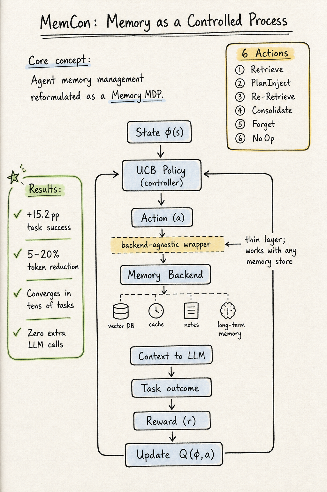

# Agent Memory — 2026-07-19

## 1. MemCon: Memory as a Controlled Process

- **arXiv**: 2607.13591
- **Link**: https://arxiv.org/abs/2607.13591
- **Authors**: Eric Hanchen Jiang*, Zhi Zhang*, Yuchen Wu, Levina Li, Dong Liu, Xiao Liang, Rui Sun, Yubei Li, Edward Sun, Haozheng Luo, Zhaolu Kang, Aylin Caliskan, Kai-Wei Chang, Ying Nian Wu (UCLA, UW, Northwestern)
- **Submitted**: 2026-07
- **Code**: https://github.com/ericjiang18/MemCon/

### 這篇在說什麼

幾乎所有現有的 LLM agent 記憶系統——不管是 graph-structured、reflection-based、skill library 還是 latent-token memory——都用固定的 heuristic 來存取記憶：固定 top-k、固定 hop depth、固定 query template、固定 consolidation schedule。MemCon 認為這個「靜態 pipeline」視角是 agent 記憶的核心瓶頸。因為最優的記憶行為是 context-dependent 的：早期任務記憶稀疏，應該少 retrieve；重複出現的目標類型應該重用計畫而非 generic nearest-neighbor；卡住的 agent 應該用不同 query re-retrieve；長串任務流需要 consolidation 和 forgetting 來維持記憶可用性。沒有任何固定 heuristic 能同時滿足這四個需求。

MemCon 把記憶操作重新框架為 Memory MDP：狀態是 task progress + memory status 的 compact representation，動作是六種記憶操作（Retrieve、PlanInject、Re-Retrieve、Consolidate、Forget、NoOp）加上參數（top_k、insight_k、hop），獎勵是任務成功/失敗的 binary signal 加上效率 bonus。控制器是 lightweight tabular UCB contextual bandit，不需要 pretraining、不需要額外 LLM call，在數十個任務內收斂。

### 主要貢獻

1. **Memory MDP formulation**：把 agent 記憶管理正式框架為 sequential decision problem。狀態空間 fuses task-progress（goal type、step phase、is_stuck、objects held、locations）和 memory-status（mem_size、plan_available、learning_phase），離散化為幾百個 hashable keys。動作空間是六種記憶操作加參數。這是第一個把「何時、何量、如何 retrieve」一起學習的框架。
2. **Backend-agnostic wrapper**：MemCon 不是新的記憶儲存，而是一個薄 wrapper，攔截任何現有 memory backend 的 retrieve 和 store 介面，決定如何呼叫它們。同一個 wrapper 可以套用在 flat vector store、skill library、summarization memory、latent-token memory、graph-structured memory 上。
3. **Zero extra LLM calls**：記憶控制是毫秒級的 table lookup，不是第二次 LLM invocation。這跟 MemGPT 形成鮮明對比——MemGPT 用 LLM 當記憶控制器，每個記憶操作都需要額外 LLM call。
4. **6 benchmarks × 3 agent frameworks × 3 LLM backbones × 9 baselines**：MemCon 在 ALFWorld 上達到 67.9%（GPT-4.1-mini / Lobster，所有 10 個 memory 中最高），相對 no-memory baseline 有 5–30+ point gain，同時減少 5–20% token consumption。

### 方法 / pipeline

- **Memory MDP**：狀態 s = (s_task, s_mem)，其中 s_task = (goal_type, step_phase, is_stuck, objects_held, locations)，s_mem = (mem_size, plan_available, learning_phase)。離散化為 compact key ϕ(s)，每個 benchmark 只有幾百個 distinct states。
- **六種動作**：
  1. **Retrieve**：從 backend 取 top_k items + insight_k derived rules，搜尋深度 hop。
  2. **PlanInject**：如果有可用的 distilled success plan，直接 prepend 到 context。這是把重複目標類型的成功經驗蒸餾為 generalized plan，而非 generic nearest-neighbor retrieval。
  3. **Re-Retrieve**：用 alternative-approach query suffix 重新 retrieve，用於逃脫重複動作迴圈。
  4. **Consolidate**：呼叫 backend 的 maintenance hook（如合併 derived rules），如果 backend 不支援則 silent no-op。
  5. **Forget**：prune 或 evict 過時記憶。
  6. **NoOp**：跳過本次記憶存取。
- **UCB policy**：at = argmax_a [Q(ϕ(st), a) + c√(ln N(ϕ(st)) / Na(ϕ(st)))]。Unvisited actions 得到 ∞ bonus，強制每個 state 至少嘗試所有 action 一次。Warm-start priors break ties among ∞ bonuses。
- **Reward**：r(τi) = r_succ · 𝟙[success] + λ · max(0, 1 - Ti/Tmax) - r_fail · 𝟙[failure]。成功且更高效的軌跡得到更大 credit，失敗得到 negative feedback。
- **Online learning**：Reverse-discounted credit assignment，每個 task 完成後更新所有 visited (ϕj, aj) pairs。不需要 pretraining，不需要 GPU。

### 實驗設計

- **Benchmarks**：ALFWorld（interactive decision-making）、PDDL planning、ScienceWorld（interactive）、TriviaQA（knowledge QA）、WebWalkerQA（web QA）、GAIA（tool-use QA）。6 benchmarks 覆蓋 interactive 和 knowledge 兩大類。
- **Agent frameworks**：Lobster（single-agent）、LangGraph（graph）、Microsoft Agent-Framework（pipeline）。
- **LLM backbones**：GPT-4.1-mini、Claude Sonnet-4、DeepSeek-V3.2。
- **Baselines**：9 個 memory baselines——MetaGPT（vector retrieval）、MemoryBank（summarization）、Voyager（skill library）、ChatDev（trajectory summarization）、Generative（generative re-ranking）、ExperienceBank、OAgents（insight-based）、G-Memory（graph-structured hierarchical）、LatentMem（latent-token）。
- **Main results**：
  - ALFWorld（GPT-4.1-mini / Lobster）：MemCon 67.9%，所有 10 個 memory 中最高。No-memory baseline ~52%，G-Memory ~63%。
  - 跨所有 6 benchmarks × 3 frameworks × 3 backbones，MemCon 達到 best or near-best task success。
  - Token consumption 減少 5–20%（因為 NoOp 和 selective retrieval 避免 over-retrieval）。
- **Ablation**：移除 UCB exploration → performance 下降；移除 PlanInject → recurring goals 表現下降；移除 Re-Retrieve → stuck agent 表現下降；移除 Consolidate/Forget → 長串任務表現下降。
- 已讀來源：arXiv HTML 全文約 20000 字，涵蓋完整 abstract、introduction、related work、method（MDP formulation、online policy、backend-agnostic wrapper）、部分實驗結果；後段 ablation 表格和附錄需 PDF 確認。

### かに讀後判斷

這篇是 agent memory 領域的理論和方法論升級。核心洞察很精準：記憶不是被動的儲存/檢索問題，而是需要 adaptive control 的 sequential decision problem。跟昨天 2607.08716（Proactive Memory Agent）的「選擇性介入」思路一脈相承，但 MemCon 更根本——Proactive Memory Agent 用一個 LLM-based memory agent 決定何時介入，MemCon 用一個 lightweight tabular bandit 決定何時、如何、多少 retrieve。MemCon 不需要額外 LLM call，這在成本和延遲上是巨大優勢。

但要注意幾個限制：(1) Tabular bandit 的狀態空間有限，複雜環境可能需要更豐富的 representation；(2) Binary task success 作為 reward signal 很稀疏，長 horizon 任務可能需要更 dense 的 feedback；(3) PlanInject 的 generalized plan 需要目標類型能被 discretize，對開放式任務可能不適用。

對 Morris 來說，這篇跟 Proactive Memory Agent、PM-Bench 三篇形成 agent memory 2026 年七月的三角：PM-Bench 說「前瞻性記憶很難」，Proactive Memory Agent 說「用 LLM 做選擇性介入」，MemCon 說「用 bandit 做 adaptive control，不需要額外 LLM」。三篇一起看最完整。深讀優先看 Figure 1（architecture overview）、Table 1（main results across 6 benchmarks）和 Section 4.3（ablation：每個 action 的貢獻）。

