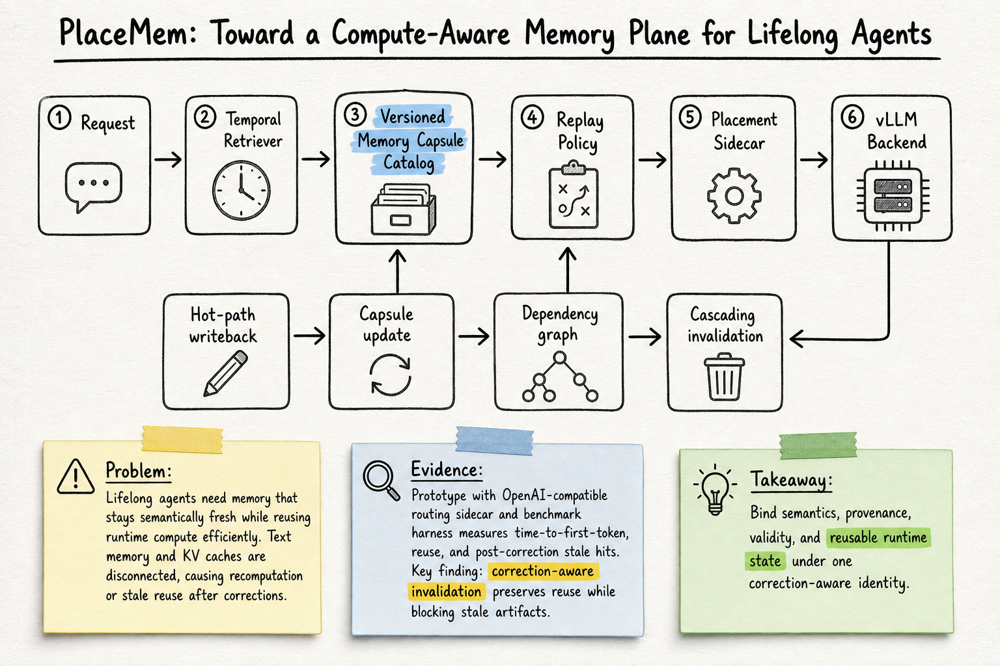

# Agent Memory — 2026-07-20

## 1. PlaceMem: Toward a Compute-Aware Memory Plane for Lifelong Agents

- **arXiv / Venue / 類型**: arXiv:2607.04089；preprint；systems position + prototype
- **Link**: https://arxiv.org/abs/2607.04089
- **查重**: `check_paper_seen.py 2607.04089` → `NOT_SEEN`
- **今日讀取來源**: arXiv abstract page 與 arXiv HTML v1 全文。

### 這篇在說什麼

PlaceMem 想補的是 agent memory 和 inference serving 之間的斷層。多數 agent memory paper 關心的是語意層：要記什麼 fact、怎麼 summarize、怎麼 retrieve、怎麼更新 preference 或 episodic trace。另一邊，serving system 關心的是 runtime 層：prefix cache、KV tensors、placement、batching、latency。作者的主張是，lifelong agents 會同時需要這兩層，而且兩層不能再互相看不見；否則系統不是重複 recompute 一樣的歷史，就是在使用者更正資訊後繼續重用 stale runtime state。

這篇提出的核心抽象是 memory capsule：一個 versioned object，把 semantic content、provenance、validity window、dependencies，以及可重用的 runtime artifacts 放在同一個 correction-aware identity 底下。這讓 memory retrieval 不只回答「哪段文字相關」，也能回答「哪個可重用 compute state 還有效、在哪個 node 上比較便宜、是否因為上游 fact 被修正而應該 invalidated」。這個角度把 memory governance、cache reuse 和 freshness / forgetting 合成同一個 systems problem。

### 主要貢獻

第一個貢獻是提出 compute-aware memory plane。作者認為 lifelong-agent memory 不應只是文字資料庫或 vector store，而應該是一個位於 agent memory 和 distributed inference backend 之間的 control plane，負責統一語意有效性、runtime reuse、locality 和 correction handling。

第二個貢獻是 memory capsules。capsule 不只存 surface text 和 metadata，也可命名 embeddings、KV cache segments、layer-frontier checkpoints 等 artifacts。雖然目前 prototype 完整支援的是 prompt-level text retrieval 和 KV-aware routing，layer-frontier replay 仍被明確列為 future engine integration agenda，但 capsule 這個 abstraction 已經把後續 replay integration 的 contract 定義出來。

第三個貢獻是 vLLM-first executable prototype。它包含 capsule schema、catalog、dependency graph、persistent state snapshots、concurrency-safe invalidation、OpenAI-compatible sidecar、typed metadata contract 和 benchmark harness。這讓論文不是純 position statement，而是至少展示 correction-aware control-plane behavior 可以跑在實際 serving-like 路徑上。

### 方法 / pipeline

PlaceMem 的 hot path 是：request 進來後，temporal retriever 先找相關記憶；capsule catalog 回傳 versioned capsules；replay policy 根據語意價值、reuse probability、saved compute、staleness risk、remote transfer cost、target latency 等因素排序；placement sidecar 再把選擇轉給 vLLM backend。另一條 writeback path 則處理 capsule update、dependency graph 和 cascading invalidation。

這裡最重要的設計是「修正」被當成 correctness primitive。當使用者或系統更正一個 fact，PlaceMem 不只更新文字列，而是沿著 dependency graph invalidates derived summaries、indexes、graph facts 和 reusable compute artifacts。這解決了很多 memory system 沒明講的問題：如果昨天的錯誤政策已經被摘要、索引、放進 prompt cache 或變成某段 reusable KV state，今天更新原始 fact 後，那些衍生物到底還能不能用？

Replay policy 的 utility function 也透露了 paper 的 framing：memory reuse 不是單純 cache hit，而是語意有效性和系統成本的 trade-off。這和一般 semantic cache / prefix cache 的差異在於，PlaceMem 會把 validity、provenance、staleness risk 和 locality 放進同一個控制決策，而不是只看相似度或 byte reuse。

### 實驗設計

作者做的是 pilot evaluation，而不是大規模 production GPU benchmark。第一組是 48-turn pilot trace，涵蓋 customer-support history、coding-agent repository loops、research-agent fact revision。比較條件包含 prompt-only、text-only retrieval、runtime reuse without semantic invalidation，以及 full PlaceMem。指標包括 mean time-to-first-token、replay reuse rate、post-correction stale-hit counts、invalidation overhead。

結果的重點是：runtime-only reuse 和 full PlaceMem 都能保留 latency benefit，但沒有 semantic invalidation 的 reuse 會出現 post-correction stale hits；full PlaceMem 則透過 cascading invalidation 消除 stale reuse，同時保留控制面上的速度優勢。作者另外用 real vLLM backend（LiquidAI/LFM2.5-230M）做 correction-follow probe，測 post-correction query 是否拿到 corrected identifier，而不是 stale one。這不是測模型一般能力，而是隔離 control plane 是否把正確 summary 送進模型。

限制也要說清楚：部分 TTFT 數字是用 replay-mode-sensitive streaming mock 隔離 control-plane / sidecar routing overhead，不能直接解讀成 production GPU prefill savings；layer-frontier replay 也還不是已完成 engine feature。這篇目前最強的是 systems abstraction 和 correction-aware prototype，而不是完整 serving stack benchmark。

### かに讀後判斷

我覺得 PlaceMem 很值得 Morris 點開，因為它把最近 agent memory 討論中幾條線接起來：memory system 不只要 retrieve 得準，也要知道什麼時候不該再 retrieve；不只要能 forget，也要能把 derived artifacts 一起忘掉；不只要在語意上有效，也要在 serving latency 上划算。這和前面看過的 `Are We Ready For An Agent-Native Memory System?` 不同：那篇偏 memory architecture / workload evaluation；PlaceMem 更偏 memory–inference boundary 的 systems design。

深讀時建議先看 Section 2 的四個 systems properties：unified identity、freshness-aware reuse、locality-aware execution、cascading forgetting；再看 Section 3 的 capsule / replay / invalidation architecture；最後看 Section 5，確認哪些結果是 mock backend、哪些是 real vLLM probe。對 OpenClaw 這類長期 agent 來說，這篇最可轉用的不是它的 vLLM 細節，而是 capsule 思維：每個記憶都應該帶 provenance、validity、dependency 和 invalidation path，否則 memory 越多，越容易把舊錯誤變成高速錯誤。
