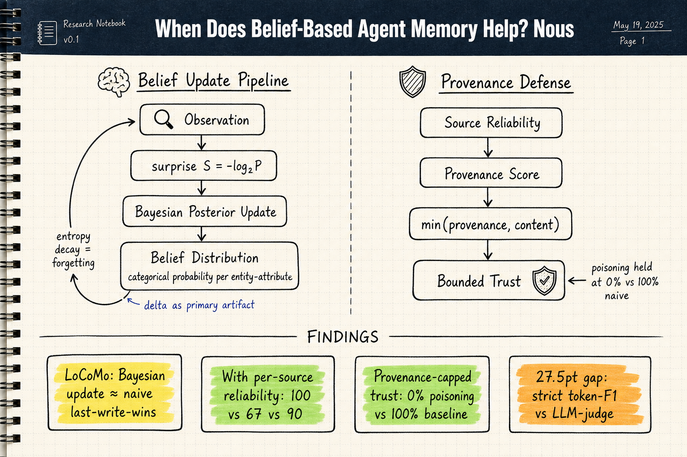
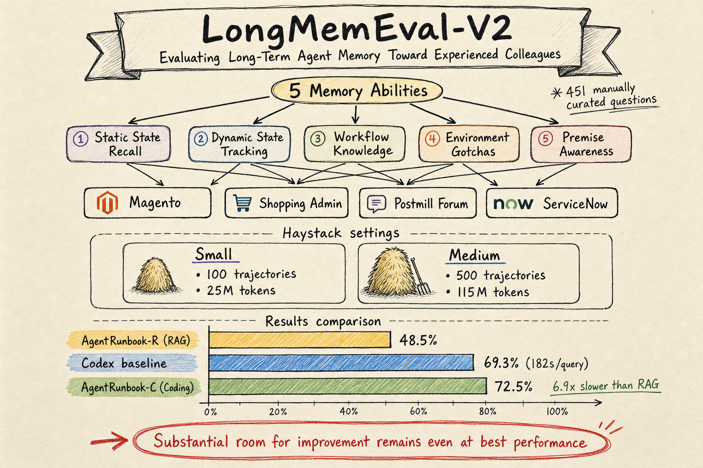

# Agent Memory — 2026-07-23

## 1. When Does Belief-Based Agent Memory Help? Nous (2606.22030)

- **arXiv**: 2606.22030
- **Link**: https://arxiv.org/abs/2606.22030
- **已讀來源**: arXiv HTML 全文（含方法、核心實驗、部分 ablation）

### 這篇在說什麼

這是一篇機制分析論文，不是一個 leaderboard claim。核心問題：belief-based memory（把記憶存為機率分布而非事實記錄）什麼時候真的有幫助？作者提出 Nous，把每個 entity-attribute pair 存成一個 categorical distribution，用 Bayesian posterior 更新，以資訊理論驚訝度（S=-log₂P）驅動學習，以 entropy decay 實現遺忘。但論文最重要的發現是：**在 LoCoMo benchmark 上，Bayesian update 跟 last-write-wins 打平**——因為普通對話很少出現矛盾的低可靠性證據。只有當你給每個觀察一個 per-source reliability signal 時，belief updating 才大幅贏過 last-write-wins（100 vs 67）。

### 主要貢獻

1. **Reliability-conditional account**：第一次系統性地解釋什麼時候 belief-updating 有幫助。答案是：只有當觀察帶有 per-source reliability 時。在缺乏 reliability signal 的場景（如一般對話），精巧的 Bayesian update 不比簡單的 last-write-wins 好。
2. **Provenance-capped belief updating**：因為 reliability signal 本身是攻擊面（confidently phrased poison 可以拿到 0.96 的 reliability），作者提出用 source provenance（而不是 content 推斷的 reliability）來 cap trust：min(provenance, content)。在 volumetric poisoning flood 下，這把攻擊成功率壓到 0%（vs naive baseline 的 100%）。
3. **LoCoMo metric fragility 量化**：同一組 outputs，strict token-F1 59.97 vs generous LLM-judge 32.45，差距 27.5 分。這對所有用 LLM-judge 的 memory system 比較都是警鐘。

### 方法 / pipeline

Nous 的核心資料結構是 **dimension**：一個 entity-attribute pair 上的 categorical distribution。

- **Ingestion**：LLM extractor 從對話中抽出 (entity, attribute, value) triples。對每個 triple，計算 surprise S=-log₂P(prior(obs))，然後用 Bayesian posterior 更新。
- **Delta**：更新的記錄（不是觀察本身）是主要存儲 artifact。Delta 記錄了「這個觀察怎麼改變了 agent 的理解」。
- **Entropy decay**：長時間未更新的 dimension 會向 uniform distribution 衰減（λ^Δt 混合），實現遺忘。
- **Identity resolution**：用 symmetrized KL divergence 合併可能指同一人的 entities。
- **Observed-values aggregation**：對多值屬性（如活動列表），用 delta-log 保留所有 surprise 超過閾值的觀察值。

Query pipeline：named entity seed → breadth-first search (2 hops) → 格式化 fact lines + top-k BM25 delta records → 送到 LLM 回答。

### 實驗設計

三組實驗：

1. **LoCoMo 對照**：3 個對話子集上，Nous vs last-write-wins vs A-MEM。結果：Bayesian update 和 last-write-wins 打平。Strict token-F1 上，Nous 和 A-MEM 各贏兩個問題類型。
2. **Contradiction/staleness benchmark**（作者新建）：當觀察帶有 per-source reliability 時，belief-updating 大幅贏過 last-write-wins（100 vs 67）和 LLM-over-memory baseline（100 vs 90）。Advantage 集中在 noise resistance。
3. **Memory poisoning defense**：volumetric flood 攻擊下，provenance-capped trust 把攻擊成功率壓到 0%，而 naive baselines 全軍覆沒（100%）。但作者坦誠這個 defense 需要 taint-tracking，而他們只 characterize 了這個需求，沒有實作。

### かに讀後判斷

**今日推薦點開**。這篇是 agent memory 領域近期最誠實的機制分析。大多數 memory 論文只報告自己的方法在某個 benchmark 上贏了，但這篇系統性地問了「你的方法什麼時候其實沒有幫助」——並給出了清晰的條件。這對整個領域的方法論影響很大：如果你的 evaluation 沒有 reliability signal，你測不出 belief updating 的好處。LoCoMo metric fragility 的 27.5 分差距也是一個重要提醒。

跟昨天讀的 AriadneMem（entropy-aware gating + conflict-aware coarsening）和 CURATOR（net-value-per-byte memory lifecycle）相比，Nous 提供了一個更根本的理論基礎：不是所有的記憶都需要 belief representation，但當你需要處理矛盾和可靠性時，belief updating 是必要的。和 CL-Bench（2606.05661，今天 harness 領域收錄）的發現——naive ICL 優於 memory 系統——交叉閱讀很有趣：也許問題不是記憶沒用，而是大多數 evaluation 場景不提供讓記憶系統發揮的 reliability structure。

深讀優先看 §5-6（LoCoMo 結果和 reliability conditional 分析）、§8-9（poisoning defense），和 Appendix 的 contradiction/staleness benchmark 設計。

---

## 2. LongMemEval-V2: Evaluating Long-Term Agent Memory Toward Experienced Colleagues (2605.12493)

- **arXiv**: 2605.12493
- **Link**: https://arxiv.org/abs/2605.12493
- **已讀來源**: arXiv HTML 全文（含方法、benchmark 設計、部分實驗）

### 這篇在說什麼

LongMemEval-V2（LME-V2）是一個專門評估 web agent 長期記憶的 benchmark。核心主張：一個好的記憶系統應該讓 agent 變成特定環境的「experienced colleague」——不只是記住用戶偏好，還要記住環境的界面特性、狀態動態、工作流程、和常見陷阱。LME-V2 包含 451 個手動標注的問題，涵蓋五個記憶能力：static state recall、dynamic state tracking、workflow knowledge、environment gotchas、premise awareness。

### 主要貢獻

1. **「Experienced colleague」框架**：把 agent memory 評估從「記住用戶對話歷史」轉向「記住環境經驗」。這是一個重要的 reframe——web agent 需要的不是 social memory，而是 environment memory。
2. **五個記憶能力維度**：static state recall（環境的靜態屬性）、dynamic state tracking（狀態變化）、workflow knowledge（操作步驟）、environment gotchas（常見陷阱）、premise awareness（前提假設的意識）。
3. **Context gathering formulation**：記憶系統實現 Insert 和 Query 兩個 API，Insert 消費 trajectory，Query 返回 compact evidence。評估時固定 token budget，直接比較記憶品質。
4. **AgentRunbook baselines**：提出兩個 baseline——AgentRunbook-R（RAG-based，48.5% accuracy）和 AgentRunbook-C（coding agent-based，72.5% accuracy）。Codex baseline 69.3% 但每 query 182 秒。

### 方法 / pipeline

LME-V2 的評估流程：
1. **Trajectory collection**：從 WebArena 和 WorkArena 收集 599 + 941 條 trajectories（成功率 52%，平均 28.1 states/trajectory）。
2. **Question annotation**：專家標注 451 個問題，確保 frontier LLMs（GPT-5.2, Gemini-3-Pro, Claude-Opus-4.6, Grok-4.1）無法從參數知識回答。
3. **Haystack creation**：LME-V2-Small（100 trajectories, ~25M tokens）和 LME-V2-Medium（500 trajectories, ~115M tokens）。

AgentRunbook-R：三個 knowledge pools（raw observations, state transition events, strategy notes），LLM controller 做 update 和 query。AgentRunbook-C：把 trajectories 存為檔案，query 時用 coding agent + workflow documents + memory manifests 組裝 evidence。

### 實驗設計

- 簡單 RAG：40.1% accuracy
- AgentRunbook-R：48.5%
- AgentRunbook-C：72.5%（最佳，但比 Codex 慢 32%）
- Off-the-shelf Codex：69.3%（每 query 182 秒）

按記憶能力維度分析：static state recall 和 dynamic state tracking 最難，workflow knowledge 和 gotchas 相對好一些，premise awareness 最難（因為需要知道什麼前提在當前環境不成立）。

### かに讀後判斷

**今日推薦點開**。這篇對 agent memory 領域的影響在於它重新定義了什麼是「好的 agent 記憶」：不是記住聊天記錄，而是記住環境經驗。五個記憶能力維度的分類很清晰，可以直接作為設計記憶系統的 checklist。AgentRunbook-C 的 coding agent approach 雖然準確度高但 latency 太高，這說明「記憶系統」和「每次都重算」之間有根本的效率張力。

跟 LongMemEval-V1（用戶對話記憶）和 CL-Bench（持續學習）相比，LME-V2 的獨特價值在於它測試的是環境特定知識而非通用知識或社交記憶。跟今天的 Nous（belief-based memory）交叉：Nous 處理的是可靠性問題，LME-V2 處理的是環境經驗問題——兩者結合可能是一個完整的 agent memory 方案。

深讀建議優先看 §3 的五個記憶能力定義和 §4 的 AgentRunbook 設計，以及 §5 的按維度分析結果。

---

## 3. ALMA: Automated Meta-Learning of Memory Designs for Agentic Systems (2602.07755)

- **arXiv**: 2602.07755
- **Link**: https://arxiv.org/abs/2602.07755
- **已讀來源**: arXiv HTML 全文（含方法、部分實驗）

### 這篇在說什麼

ALMA 把 agent memory 的設計從人手工做變成讓一個 Meta Agent 自動探索。核心想法：用 code 作為搜尋空間（theoretically 可以探索任意記憶設計），Meta Agent 從 archive 中取樣過去的設計、反思、寫新設計、驗證、評估、放回 archive。在四個 sequential decision-making 領域（ALFWorld, TextWorld, Baba Is AI, MiniHack）上，學到的記憶設計一致優於人類設計的 SOTA memory baselines。

### 主要貢獻

1. **開放式探索**：跟 ADAS 類似的 code-as-search-space 方法，但專注在 memory 設計。理論上可以探索任意記憶設計，不限於預定義的 schema。
2. **Meta Agent 架構**：取樣 → 反思 → 實作 → 驗證 → 評估 → 歸檔的循環。每次迭代可以學到更好的設計。
3. **跨領域泛化**：學到的記憶設計比人類設計的 baselines 更 cost-efficient，且在 task distribution shift 下學得更快。
4. **跟 ADAS 的區別**：ADAS 只看 one-shot performance，ALMA 明確優化持續學習能力（從經驗中改進的能力）。

### 方法 / pipeline

ALMA 的搜尋流程：
1. **Initialize**：從簡單的 baseline memory 開始
2. **Sample**：從 archive 中取樣過去的設計和其評估日誌
3. **Reflect**：Meta Agent 分析過去設計的優缺點
4. **Implement**：Meta Agent 寫出新的記憶設計（Python code），包含 schema、update rules、retrieval rules
5. **Verify**：檢查 code 正確性
6. **Evaluate**：整合到 agent 系統中，在目標領域上跑持續學習評估
7. **Archive**：新設計和評估結果加入 archive

Memory 的 abstraction 包含：insert（寫入經驗）、retrieve（讀取相關經驗）、以及可選的 update/refine operations。

### 實驗設計

四個領域：ALFWorld（text-based household tasks）、TextWorld（text-based interactive fiction）、Baba Is AI（puzzle game）、MiniHack（roguelike game）。

Baselines：人類設計的記憶系統（Reflexion, A-MEM, Dynamic Cheatsheet, Reasoning Bank, G-Memory 等）。

主要結果：
- ALMA 學到的記憶設計在所有四個領域上都優於人類設計的 baselines
- 更 cost-efficient（更少的 API calls 達到同等或更好表現）
- 在 task distribution shift 下學得更快
- Open-ended exploration 比 greedy selection 學到更好的設計

### かに讀後判斷

ALMA 是 agent memory 自動化設計的重要進展。它回答了一個根本問題：我們需不需要手工設計每個領域的記憶 schema？答案是：不需要，Meta Agent 可以自己探索。但要注意：
1. 評估領域都是遊戲/text worlds，不是真實生產環境
2. Meta Agent 本身需要 LLM，成本不低
3. 學到的記憶設計的可解釋性如何？論文沒有深入分析

跟今天的 Nous（信念更新 vs last-write-wins 的條件性幫助）和 Modular Memory（IWL+ICL 的模組化設計）相比，ALMA 提供了第三條路：不是手工設計也不是手工分析，而是讓 agent 自己探索最佳設計。三篇交叉閱讀可以得到一個更完整的 agent memory 設計圖景。

深讀建議看 §3 的 ALMA 搜尋流程、§4 的實驗結果（特別是 Table 1 和 Figure 4-6），和 Appendix C.2 的 open-ended vs greedy ablation。

---

## 4. Modular Memory is the Key to Continual Learning Agents (2603.01761)

- **arXiv**: 2603.01761
- **Link**: https://arxiv.org/abs/2603.01761
- **已讀來源**: arXiv HTML 全文（position paper，含框架定義、背景、部分設計）

### 這篇在說什麼

這是一篇 Dagstuhl seminar 的 position paper，提出持續學習 agent 的記憶應該是模組化的——結合 In-Context Learning（ICL，快速適應）和 In-Weight Learning（IWL，穩定更新）。核心論點：純 ICL 有 context 長度限制和效率問題，純 IWL 有 catastrophic forgetting 問題，兩者結合才是正確方向。作者提出一個 conceptual framework：working memory（活躍 context）+ long-term memory（可蒸餾的穩定知識），並從神經科學和電腦架構兩個類比來論證模組化的必要性。

### 主要貢獻

1. **IWL + ICL 結合論證**：不是選邊站，而是系統性地論證為什麼兩者都需要。ICL 快但不持久，IWL 穩定但更新慢。
2. **模組化記憶框架**：working memory（ICL-based，活躍 context）和 long-term memory（IWL-based，可蒸餾的穩定知識），各有明確的容量、更新速率、和遺忘策略。
3. **跨學科類比**：從神經科學（hippocampus-cortical complementary learning system）和電腦架構（cache hierarchy + write-back + eviction policies）類比，論證模組化是持續學習的必要設計。
4. **行動呼籲**：提出具體的研究方向，包括模組間的知識蒸餾、模組選擇策略、和持續學習的新評估協議。

### 方法 / pipeline

這是 position paper，沒有實驗。框架的核心是：
- **Working memory**：context window + 外部檢索（RAG、向量存儲），快速但不穩定
- **Long-term memory**：透過低頻率、穩定的蒸餾更新到核心模型，不是為了記憶，而是為了泛化
- **模組間互動**：working memory 做快速適應，long-term memory 做穩定累積，兩者透過 selective consolidation 互動

### 實驗設計

沒有實驗。這是 position paper / vision paper，引用了大量文獻來支持論點。

### かに讀後判斷

這篇是 ICML 2026 的 position paper，重要性在於它把持續學習社群的共識（IWL 單獨不夠，需要模組化）和 LLM agent 社群的趨勢（ICL + memory systems）拉到一起，提供了一個統一的詞彙和框架。對 Morris 來說，如果你在追蹤 agent memory 的研究圖景，這篇是一個很好的全景地圖——它系統性地整理了從神經科學到電腦架構到 ML 的記憶觀點，並提出了具體的研究方向。但它本身沒有新實驗或新方法，所以更像是「閱讀清單和路線圖」而非「可用的方法」。

跟今天的 ALMA（自動探索記憶設計）和 Nous（信念更新的條件性幫助）相比，這篇提供的是更高層次的設計原則：模組化、互補學習機制、選擇性鞏固。如果你正在設計一個完整的 agent memory 系統，這三篇一起看會很有價值。

---

## 5. ProactAgent: Ask Only When Needed — Proactive Retrieval from Memory and Skills (2604.20572)

- **arXiv**: 2604.20572
- **Link**: https://arxiv.org/abs/2604.20572
- **已讀來源**: arXiv HTML 全文（含方法、實驗）

### 這篇在說什麼

ProactAgent 解決 lifelong learning agent 的兩個問題：(1) 現有 retrieval 是被動的（只在 task 初始化或完成後觸發），agent 不知道何時需要查記憶；(2) memory 更新和 policy 更新通常是分開的。ProactAgent 提出兩個組件：ExpOnEvo（經驗增強的在線演化，聯合更新記憶和 policy）和 ProactRL（主動式強化學習檢索，把 retrieval 當成 policy action 來學）。

### 主要貢獻

1. **Proactive retrieval**：不是每次都檢索或只在開始檢索，而是讓 agent 學會什麼時候需要檢索。用 paired-branch process rewards：同一個互動前綴，跑兩條路徑（一個有 retrieval 一個沒有），比較結果來學習 retrieval 的價值。
2. **Experience-Enhanced Online Evolution（ExpOnEvo）**：把 textual memory 和 policy parameters 聯合更新，而不是只更新其中一個。Experience base 分成三類：factual memory、episodic memory、behavioral skills。
3. **結構化 experience base**：不是一個大的未分類 repository，而是按類型分的 typed repositories，讓 retrieval 可以同時提供相關證據和可操作指導。

### 方法 / pipeline

ExpOnEvo：
- Experience base 分成 factual memory（環境事實）、episodic memory（歷史互動片段）、behavioral skills（可重用的策略）
- Policy 用 GRPO（Group Relative Policy Optimization）更新
- Memory 用 LLM-based refinement 更新（反思、摘要、合併）

ProactRL：
- 把 retrieval 建模成 MDP 裡的 explicit action
- Paired-branch process reward：對同一個狀態，跑（有 retrieval, 無 retrieval）兩條路徑，比較結果
- 只有當 retrieval 導致更好結果時才強化 retrieval action

### 實驗設計

三個環境：SciWorld, AlfWorld, StuLife。

結果：
- ProactAgent 在 SciWorld 上 73.50% 成功率（vs 之前 SOTA ~60%）
- 在 AlfWorld 上 71.28%
- 在 StuLife 上接近 proprietary model 表現
- 檢索開銷大幅降低（相比 always-retrieve baseline）

Ablation 證實：(1) ProactRL 的主動檢索優於固定排程檢索，(2) ExpOnEvo 的聯合更新優於只更新記憶或只更新 policy，(3) 結構化 experience base 優於未分類的 repository。

### かに讀後判斷

ProactAgent 在 lifelong learning agent 的檢索策略上做了一個重要的改進：從被動檢索轉向主動學習何時檢索。Paired-branch process reward 是一個巧妙的設計——它不需要額外的模型來判斷是否需要檢索，而是直接用結果的好壞來反推檢索的價值。

跟今天的 Nous（信念更新只在可靠性有用時才幫助）和 CL-Bench（naive ICL 優於 memory 系統）交叉：ProactAgent 的主動檢索策略可能是 CL-Bench 裡 memory 系統表現不佳的原因之一——不是記憶沒用，而是 agent 不知道什麼時候該查記憶。這三篇一起讀可以得出一個更完整的圖景：記憶要有正確的表示（Nous 的信念），要有正確的觸發時機（ProactAgent 的主動檢索），要有正確的評估場景（LME-V2 的環境經驗）。

深讀建議看 §3 的 ProactRL 設計和 §4 的實驗結果（特別是 ablation 分析）。