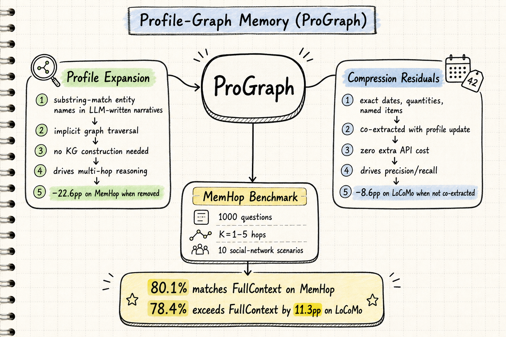

# Agent Memory — 2026-07-25

## 1. Profile-Graph Memory for LLM Agents: Implicit Cross-Entity Traversal through Narrative Profiles (2607.19359)

- **arXiv**: 2607.19359
- **Link**: https://arxiv.org/abs/2607.19359
- **已讀來源**: arXiv HTML 全文（含方法、benchmark 設計、ablation、部分實驗）

### 這篇在說什麼

長期記憶是 LLM agent 跨 session 互動的基礎，但現有 benchmark 幾乎只測 single-hop 精確召回——問一個日期、一個數量、一個偏好。現實中很多有價值的 agent 行為需要多跳關聯推理：「Alice 的室友會彈什麼樂器？」需要走 Alice → Bob → piano 的實體鏈。現有三種 memory 範式各有失敗模式：atomic-fact stores 缺乏關聯（embedding 被 "Alice" + "instrument" 主導，找到 "Alice practices guitar" 而錯過跨實體鏈）；graph-RAG 方法在寫入時就 commit 了邊的結構，一條錯誤的邊會破壞所有依賴它的多跳查詢；concept-profile 方法把精確資訊壓縮掉了。ProGraph 的核心洞察是：LLM 寫的 profile 敘述裡自然包含實體名（"Alice lives with her roommate Bob, who is a multi-instrumentalist"），不需要額外的關係抽取或圖建構步驟——只要在 retrieval 時做 substring match 拉出鄰居實體的 profile 就好。

### 主要貢獻

1. **MemHop benchmark**：1,000 個多跳問題，hop depth K=1–5，10 個社交網路場景，每個問題有 per-hop 證據標注。這填補了 conversational × multi-hop 的空白——LoCoMo 和 LongMemEval 主要測 single-hop precision recall，HotpotQA/MuSiQue 是靜態語料的。
2. **Profile-Graph Memory 架構**：兩層記憶——profile expansion（substring-match 實體名做隱式圖遍歷）+ compression residuals（和 profile 在同一次 LLM call 中抽出的精確事實）。寫入只需要 1+E 次 LLM call（E = 每個 session 的實體數），和 profile-only 一樣；residual 只多幾十到幾百 token。讀取時三個純 embedding 階段（profile retrieval → relevance-gated expansion → residual-augmented context assembly）+ 一次 answer-generation call。
3. **機制特化 ablation**：profile expansion 移除時 MemHop -22.6pp（多跳推理崩潰），compression residuals 不抽取時 LoCoMo -8.6pp（精確召回下降）。兩者在對方的 benchmark 上 cross-effect < 3pp。這說明兩個機制是正交的、各自不可替代的。

### 方法 / pipeline

**寫入路徑**（單次 LLM call）：
- Entity identification：LLM 從 session 中抽出實體名，用 name registry 匹配既有實體。
- Profile + residual co-extraction：對每個實體，一次 LLM call 產生更新後的 profile 和 7 類 compression residuals（exact dates, numbers/quantities, proper names, identity markers, enumerated lists, cross-entity facts, state transitions）。關鍵設計：residuals 不是通用 fact extraction，而是「profile 會壓縮掉什麼」——自然地與 profile 互補。

**讀取路徑**（三個純 embedding 階段 + 一次 LLM call）：
1. Profile retrieval：query embedding 檢索 top-k entity profiles。
2. Relevance-gated expansion：掃描每個 retrieved profile 中的實體名（substring match），拉出對應的 profiles 和 residuals，用 query embedding 做 relevance gating。
3. Residual-augmented context assembly：把相關 residuals 加入 context，然後送 LLM 生成答案。

**MemHop benchmark 設計**：
- 10 個社交網路場景，每個 4-5 個角色、7-8 個關係類型。
- 從 underlying social graph 採樣 K+1 實體鏈，生成 K-hop 問題。
- Per-hop decomposition 和 gold evidence 是程式生成的（不是 LLM 生成），保證標注品質。
- 五輪自動驗證：structural integrity, evidence grounding, answer consistency, textual quality, deduplication。

### 實驗設計

- MemHop（n=1,000）和 LoCoMo（n=1,986）雙 benchmark。
- 所有系統用 GPT-4o-mini 做 LLM calls，all-MiniLM-L6-v2 做 embeddings。
- Baselines：Oracle（gold evidence），FullContext（全部對話），Mem0，A-Mem，HippoRAG，RAG。
- ProGraph 在 MemHop 上 80.1%（匹配 FullContext），在 LoCoMo 上 78.4%（超過 FullContext 11.3pp）。
- Ablation：全格線消融（profile expansion, compression residuals, expansion+residuals 的所有組合）顯示兩個機制正交且不可替代。

### かに讀後判斷

**今日推薦點開**。這篇對 agent memory 領域有三個重要意義：（1）它填補了 multi-hop memory evaluation 的空白，MemHop 是第一個系統性的 conversational × multi-hop benchmark；（2）它的核心設計洞察——不需要建圖，LLM profile 裡自然包含實體名——既簡潔又有原則性；（3）ablation 乾淨地分離了多跳和精確度兩個正交機制，這對後續工作有方法論意義。

和之前讀的 Nous（belief updating 只在有 reliability signal 時有幫助）相比，ProGraph 解決了一個不同但相鄰的問題：Nous 問的是「記憶什麼時候有幫助」，ProGraph 問的是「多跳推理需要什麼記憶結構」。和 HippoRAG 的對比尤其有趣：HippoRAG 在 MemHop 上只有 57.2%（vs RAG 的 55.9%），因為 explicit KG construction 在 noisy dialogue 上會放大錯誤。ProGraph 用 substring match 避免了這個問題。

深讀優先看 §3（ProGraph 架構）、§4（MemHop 設計）、§5.2（機制特化 ablation）。

---

## 2. CMI-Mem: Toward Generalizable Long-Term Memory Management via CMI-Augmented Reinforcement Learning (2607.20553)

- **arXiv**: 2607.20553
- **Link**: https://arxiv.org/abs/2607.20553
- **已讀來源**: arXiv HTML 全文（含方法、核心架構、部分實驗）

### 這篇在說什麼

現有 Memory Manager 大多依賴 LLM-judged synthetic QA pairs 來評估記憶價值，使得記憶的好壞取決於抽樣的問題和下游 reader——這是 QA-only reward 的分佈偏見。CMI-Mem 提出用 reinforcement learning 訓練一個輕量級 memory manager，用 hybrid reward 結合 QA correctness（外在獎勵）和 Conditional Mutual Information（內在獎勵）。CMI 衡量的是新觀察相對於現有記憶的資訊增量，不需要抽樣問題，因此補足而非取代 QA grounding。

### 主要貢獻

1. **Action-conditioned CMI reward**：在每個 memory operation 計算 I(C_t; m_t^new | M_{t-1}^{local})，衡量新片段相對於當前記憶的資訊增量。CMI 是 per-operation 的，提供比 session-level QA reward 更密集的學習信號。
2. **Structured multi-dimensional memory architecture**：四個認知激勵的 memory slots（Core, Episodic, Semantic, Procedural），每個 slot 有獨立的 type-specific agent 共享一個 policy π_θ。Emitted fragments 同時作為 retrieval indices。
3. **Hybrid reward 的互補性**：Ablation 顯示 CMI alone 缺乏 outcome anchor，QA alone 有分佈偏見，CMI+QA 最強。在 cross-benchmark transfer 上優於 QA-only baseline。

### 方法 / pipeline

Memory state M_t 分成四個 slots（Core, Episodic, Semantic, Procedural），每個 slot 有獨立的 agent（共享 policy π_θ）。每個 agent 觀察 dialogue context + top-k 相關 entries，emit action a_t^τ 和 candidate fragment m_t^{new,τ}。

CMI reward 的計算方式：r_t^{CMI} = I(C_t; m_t^{new} | M_{t-1}^{local})，通過 embedding space 的 residual projection 估計，用 Gaussian function 做 reward shaping。

Training 用 GRPO-based RL，在 LongMemEval 上 rollout，混合 CMI reward 和 session-level QA signal（mixing weight α）。

### 實驗設計

三個 benchmark：LongMemEval（長上下文召回）、LoCoMo-like cross-session reasoning、selective forgetting。
主要結果：CMI+QA 在 transfer across memory-use scenarios 上優於 QA-only，且訓練更高效（per-operation signal vs session-level）。

### かに讀後判斷

和 ProGraph 的正交機制特化相比，CMI-Mem 走了另一條路：ProGraph 用架構設計（profile expansion + compression residuals）分離多跳和精確度功能，CMI-Mem 用 reward design（CMI + QA）分離內在資訊量和外在效用。兩者都是「不同 memory 功能需要不同評估維度」的實例。值得交叉閱讀。

深讀優先看 §3（CMI reward 定義和計算）和 §5（ablation 和 transfer 結果）。目前只從 HTML 前段和 abstract 確認了核心方法，完整實驗數據需要看全文。

---

## 3. EAR: Exploratory and Assimilating Reflection — Reflective Recall Cycle for Long-term Memory (2607.17879)

- **arXiv**: 2607.17879
- **Link**: https://arxiv.org/abs/2607.17879
- **已讀來源**: arXiv abstract + landing page（僅 abstract 層級快速掃描）

### 這篇在說什麼

現有 memory retrieval 方法缺乏適應性和取樣效率，難以從異構記憶庫中檢索正確的記憶混合。EAR（Exploratory-Assimilating Reflection）結合兩個機制：Exploratory Reflection 用迭代搜尋 bootstraps retrieval 並收集有用經驗；Assimilating Reflection 用 Experience Buffer 重播這些經驗來更高效地精煉 global reranker。在兩個長期對話 benchmark 上，EAR 比 baseline retriever 提升最多 17.9%。

### 主要貢獻

1. **Exploratory Reflection**：迭代搜尋 bootstraps retrieval，每次搜尋收集成功/失敗的經驗。
2. **Assimilating Reflection**：從 Experience Buffer 重播經驗來精煉 reranker，比只用即時 reward 的方法更 sample-efficient。
3. **Robustness to noisy feedback**：EAR 對噪音反饋有韌性。

### 方法 / pipeline

雙循環架構：外循環（Exploratory）迭代搜尋 + 收集經驗，內循環（Assimilating）從 Experience Buffer 重播經驗來更新 reranker。

### 實驗設計

兩個長期對話 benchmark，retrieval 提升 17.9%。對 noisy feedback 有韌性。目前只能從 abstract 確認，缺少完整的實驗細節。

### かに讀後判斷

EAR 的 Experience Buffer + reranker 精煉機制和 CMI-Mem 的 per-operation reward 有互補性——前者改善 retrieval 品質，後者改善寫入決策。和 ProGraph 的 substring-match traversal 相比，EAR 更專注於檢索策略的迭代改進，而 ProGraph 專注於記憶結構的設計。三篇放在一起讀，可以看到 memory 系統的三個正交維度：結構（ProGraph）、寫入決策（CMI-Mem）、檢索策略（EAR）。

目前只讀到 abstract，需要全文確認實驗設計細節和 benchmark 比較。

---

## 4. Beyond Memory Leaderboards: Evaluating Scientific Memory as Budgeted Context Restoration (2607.16848)

- **arXiv**: 2607.16848
- **Link**: https://arxiv.org/abs/2607.16848
- **已讀來源**: arXiv HTML 全文前段（含 benchmark 設計、系統比較、部分結果）

### 這篇在說什麼

目前 memory benchmark 大多評估對話記憶或簡短摘要，但研究 agent 需要從完整科學論文中還原證據。作者提出兩個全文科學記憶 benchmark（Paim: 81 papers, 66 questions; PTr: 252 papers, 98 questions），並評估 8 個 memory/retrieval 系統。核心發現：memory leaderboard 在沒有固定 retrieval budget 的情況下不可解釋——Graphiti 在 Paim 上大勝只因為它每個 query 檢索 2.6M characters 的 context。當 budget 固定在 B≈30K 時，Simple RAG ≈ Theoria ≈ Mem0 >> Graphiti KG output。另外，sparse-dense hybrid 是最大的單一干預。

### 主要貢獻

1. **兩個全文科學記憶 benchmark**（Paim + PTr）with audited rubrics。
2. **Budget-and-modality retrieval protocol**：固定 retrieval budget B 和 modality M（dense vs. dense+BM25），在同一個 synthesis model 下比較。
3. **Multi-judge LLM calibration + 112 blinded human SxS votes**：LLM judge ranking Spearman ρ∈[0.90,0.97]；human side-by-side 和 LLM judge 高度一致。
4. **Theoria**：三層科學記憶系統（community/theory layers），在特定難度等級上 competitive with 最強 baselines。

### 方法 / pipeline

Context-restoration protocol：固定 B（每個 query 返回的 character 數）和 M（dense vs. hybrid），在同一個 synthesis model 下比較不同 memory 系統。

Theoria 的三層架構：community layer（跨論文的社群/趨勢）、theory layer（具體理論/方法），加上 fine-grained retrieval。

### 實驗設計

8 個系統（Simple RAG, Mem0, HippoRAG, Graphiti, Cognee, Hindsight, Theoria, no-retrieval baseline）+ hybrid BM25 variants for 3 of them。

核心結果：
- Paim 上 Graphiti 大勝，但用的是 2.6M chars/query。Budget 固定後 Simple RAG ≈ Theoria ≈ Mem0 >> Graphiti KG。
- PTr 上，named entities  lexical distinctive，structured memory (Theoria, Mem0) 在 dense retrieval 下領先 Simple RAG。
- Sparse-dense hybrid 是最大的單一干預，significantly improving scores for many systems。
- LLM judge ranking reliable (ρ 0.90-0.97)，human SxS 和 LLM judge 一致。

### かに讀後判斷

這篇對整個 memory evaluation 領域有方法論意義：「unconstrained leaderboard 不可解釋」這個結論和昨天的 Belief Divergence 論文形成呼應——後者說 harness 是實驗變量，前者說 retrieval budget 是實驗變量。兩者都在說同一件事：沒有控制實驗條件的 leaderboard 數字沒有意義。

Theoria 的 community/theory layers 設計和 ProGraph 的 profile expansion 有結構相似性——都是用某種「摘要 + 細節」的雙層結構。但 Theoria 是面向科學論文的，ProGraph 是面向對話記憶的。

深讀優先看 §6（budget sweeps 和結果）和 §7（qualitative analysis）。

---

## 5. The Chronos Vulnerability: A Taxonomy of Temporal Persistence and Memory-Based Deception in Agentic AI (2607.19433)

- **arXiv**: 2607.19433
- **Link**: https://arxiv.org/abs/2607.19433
- **已讀來源**: arXiv HTML 全文前段（含 threat model, taxonomy, defense landscape）

### 這篇在說什麼

從 stateless generative model 到 stateful agent 的架構演進引入了一種新的安全威脅：Chronos Vulnerability——攻擊者可以透過記憶注入讓惡意 payload 在 agent 的信念系統中長期潛伏，直到被觸發。這篇提出了一個 taxonomy 覆蓋 MINJA（Memory Injection Attack）、sleeper agent、session smuggling 三類攻擊，並介紹了 Dynamics Blindness（agent 無法預見行動的時間後果）的概念。論文提出了 defense-in-depth landscape：AgentDoG（trajectory guardrails）、Agent-C（formal temporal verification via FOL/SMT）、A-MemGuard（immunological memory consensus）、GPU TEE + Zero-Trust memory。

### 主要貢獻

1. **Chronos Vulnerability formalization**：把 temporal persistence-based attacks 從 session-oriented prompt injection 中分離出來，定義了 BDI stack 上的攻擊面。
2. **Dynamics Blindness**：在 World of Workflows benchmark 上，frontier models 的 constrained TSR 從 22-38.7% 崩塌到 2-4.7%（87.6% relative drop），量化了 agent 無法預見 cascading consequences 的問題。
3. **Defense landscape**：系統性地整理了從 trajectory guardrails 到 formal verification 到 immunological memory consensus 到 hardware-anchored trust 的多層防禦。

### 方法 / pipeline

這是一篇 position/taxonomy paper，沒有單一方法 pipeline。核心方法是 threat model formalization（grey-box attacker with query access and context injection capability）和 cross-benchmark analysis。

### 實驗設計

WoW benchmark 上的 performance decay 分析（Table IV），顯示 frontier models 在 constrained enterprise workflows 上的 TSR 崩塌。EchoLeak (CVE-2025-32711) 作為案例研究。

### かに讀後判斷

這篇對 agent memory 的安全層面有重要意義。和 Nous 的 provenance-capped belief updating 直接相關——Nous 提出用 source provenance cap trust，Chronos Vulnerability 則系統性地列出了為什麼需要這樣的 defense。和 ProGraph 的 compression residuals 也有關聯：residuals 是精確的、可審計的原子事實，這使得 memory injection 更容易偵測（和 A-MemGuard 的 consensus validation 互補）。

深讀優先看 §III（MINJA taxonomy）、§V（Dynamics Blindness analysis）、§VI（defense landscape）。