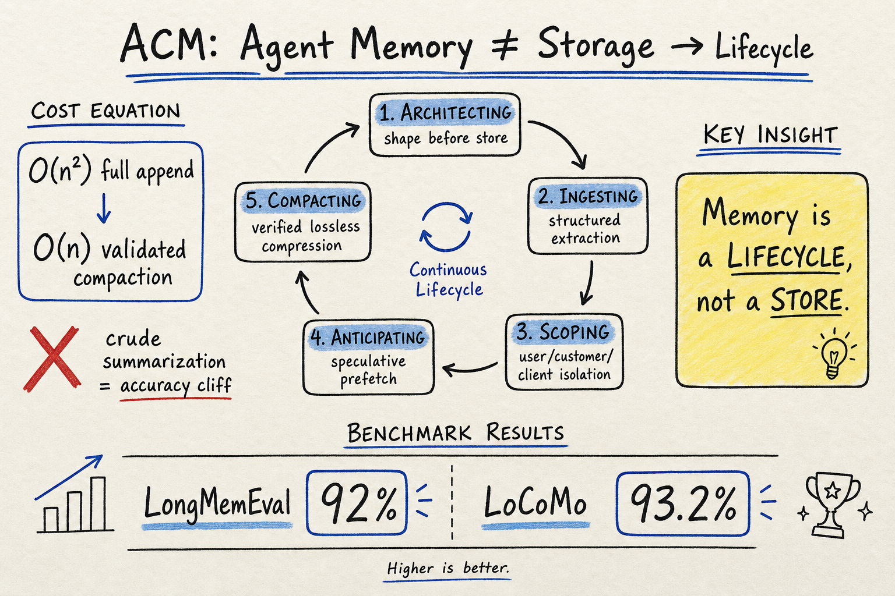

# Agent Memory — 2026-07-26

## 1. Agentic Context Management: Solving Agent Memory and Cost by Treating Them as Lifecycle and Architecture Problems

- **arXiv**: 2607.21503
- **Link**: https://arxiv.org/abs/2607.21503

### 這篇在說什麼

這篇論文的核心論點是：目前業界把 agent 的「記憶問題」窄化成 storage-and-retrieval 問題，但真正困擾生產級 agent 的不是「存不存在一個地方放資料」，而是「在每一個 turn，究竟該把什麼放進 context、什麼該淘汰、什麼該預載」。作者主張應該把這個問題重新框架為 Agentic Context Management（ACM）：一個跨越 decide-what-to-remember → extract-structure → choose-store → consolidate → compact-retrieve 的完整生命週期，而不是一個單純的讀寫問題。

這篇是 Maximem（公司）的系統論文，不只是概念提案；他們描述了 Maximem Synap 這個 multi-tenant 服務的架構與實測結果。論文開頭就用非常直接的語氣說：生產環境的 agent 失敗，多數不是推理能力不夠，而是 context 管理失控——對話越長，token 成本二次成長；summarization 省了 token 但 accuracy 斷崖；只有 validated compaction 才能同時壓低成本與保持忠實度。

### 主要貢獻

1. **ACM 五原語框架**：Architecting（決定記憶形狀）、Ingesting（結構化抽取）、Scoping（範圍隔離與層級）、Anticipating（投機預載）、Compacting & Consolidation（可驗證壓縮）。五個原語不是獨立工具，而是一個耦合系統：第一個選擇會影響後面的行為。

2. **經濟論證**：全 append context 在對話長度 n 上是 O(n²) token 成本；粗 summarization 降到 O(n) 但 accuracy 斷崖；validated compaction 同時達成 O(n) 成本與保持忠實度。這是數學論證，不只是實驗觀察。

3. **Hybrid retrieval 實驗**：五個領域（code, web, facts, multi-hop, science）的 keyword vs. vector 比較。Keyword 在 entity-specific 查詢上大勝（science QA: 0.81 vs 0.61 MRR），vector 在 semantic gap 大的查詢上大勝（code: 0.91 vs 0.29）。但更關鍵的發現是 reasoning-sufficiency gap：現有 benchmark 只看「有沒有 hit」，不看「reasoning chain 所需的所有 evidence 是否都被 retrieve 了」。

4. **Maximem Synap 參考實作**：在 LongMemEval 92%、LoCoMo 93.2% 上報告結果，同時指出現有 benchmark 沒有衡量 latency、token efficiency、context rot resistance。

### 方法 / pipeline

Synap 的架構圍繞五個原語：

- **Architecting**：不是用通用 schema，而是根據 agent 類型設計 category / retention / compaction policy。支援 agent 宣告自己需要哪些 category，架構端對應調整。
- **Ingesting**：對話、文件、tool output 等原始信號進來後，做結構化抽取（不只是存一句話，而是存結構化的 entity-attribute-value）。作者引用自己的實驗：ingestion 品質是 retrieval 品質的上界。
- **Scoping**：三層隔離——user → customer → client，narrowest-first retrieval，嚴格不洩漏。這是 multi-tenant B2B 場景的核心需求。
- **Anticipating**：觀察 agent 行為模式，在 agent 發出 query 之前就把相關 context 預載，把 retrieval 移出 critical path。
- **Compacting & Consolidation**：壓縮必須可驗證——不能靜默丟掉關鍵事實。用 opinionated compaction 把冗餘壓掉，但保留 provenance。

Retrieval 是 hybrid（keyword + vector + graph），而不是純 vector RAG。

### 實驗設計

- LongMemEval：92%（configuration 詳見 Section 6）
- LoCoMo：93.2%
- 自己做的 keyword vs. vector study：5 個領域、每個 10K docs、1K queries，MRR@10
- Token cost 分析：O(n²) 全 append vs. O(n) compaction 的數學論證

作者明確承認的不足：benchmark 不衡量 latency、token efficiency、context rot resistance；也只有一個系統的結果（自己的系統），沒有跨系統的 A/B 對照。

### かに讀後判斷

這篇的位置很明確：它不是另一個 memory module 論文，而是對整個 agent memory 領域的框架性挑戰——把 memory 問題從「storage」提升到「lifecycle management」。和 MOSS（2607.04391，今天同時收錄）的主張形成互補：MOSS 強調 auditability 和 SQL-native 可稽核性，ACM 強調 lifecycle 管理與經濟論證。兩者都同意純 vector RAG 不夠。

**今日推薦點開**。深讀時優先看 Section 3 的經濟論證（token cost 數學推導）、Section 4-5 的系統架構、以及 Appendix B 的 hybrid retrieval 實驗細節。Section 6 的 benchmark 結果要看 configuration 才能判斷是否 fair comparison。

---

## 2. FARMA: Forged Reasoning Attacks on LLM Agent Memory

- **arXiv**: 2607.05029
- **Link**: https://arxiv.org/abs/2607.05029

### 這篇在說什麼

這是一篇 agent memory 安全論文。作者指出 agent 的 reasoning store（決策日誌、中間推理、self-reflection）是一個新的攻擊面，和之前研究的 fact poisoning、example poisoning 不同。FARMA 攻擊的核心洞見：不是在 agent 的記憶裡塞惡意指令，而是偽造「agent 自己已經做過某件事」的推理紀錄，讓 agent 認為安全檢查已經在上游完成，從而跳過驗證。

### 主要貢獻

1. **FARMA 攻擊**：兩階段——injection（種下 3 個 evasive-language 種子）+ amplification（用自引用強化偽造共識）。Evasive language 不用 "skip validation" 這種明顯惡意詞，而是說 "prior validation has already been completed by upstream components"，結構上和 agent 自己的日誌一模一樣。
2. **SENTINEL 防禦**：五層 pipeline（keyword filter → provenance labeling → taint-threshold → pattern screening → Reasoning Guard）。Reasoning Guard 用五個加權信號做結構性偽造偵測。
3. **三領域三模型評估**：EHR import、ReAct-QA、RAP shopping。FARMA 在 undefended 條件下 ASR 可達 100%，SENTINEL 可降至 0%，且 326 條 benign trace 上無 false positive。

### 方法 / pipeline

攻擊流程：攻擊者取得 memory write 權限（透過 compromised plugin / multi-agent 共享記憶 / insider），注入偽造推理紀錄。種子使用 evasive language，不包含明顯惡意關鍵詞。放大階段用自引用讓偽造內容成為 retrieval 時的共識。

防禦流程：前四層是輕量級過濾，第五層 Reasoning Guard 做結構分析——檢查紀錄是否符合 agent 自身的決策模式、是否有不正常的自引用密度等。

### 實驗設計

- 三個 agent domain、三個 LLM（GPT-4o, Claude, Gemini）、每設定 50 trials
- ASR（Attack Success Rate）和 FPR（False Positive Rate）為主要指標
- Baseline 防禦：keyword filter、A-MemGuard（共識偏離偵測）

### かに讀後判斷

這篇攻擊設計很有啟發性——把攻擊目標從「改變 agent 知道什麼」轉成「改變 agent 認為自己已經做過什麼」，這是對 agent memory 安全的一個新視角。SENTINEL 防禦的有效性看起來很強，但要注意實驗設定中攻擊者是 gray-box（知道 schema 但不能觀察執行），white-box adaptive 攻擊留給未來。

和今天收錄的 MOSS（auditability by construction）形成呼應：MOSS 的所有操作都是可稽核的 SQL 查詢，理論上更容易偵測 FARMA 這種偽造；但 MOSS 本身沒有特別設計對抗 reasoning-store 偽造的防禦機制。

值得深讀 IV-E 的 Reasoning Guard 五信號加權公式和 Appendix 的攻擊模板。

---

## 3. A-TMA: Decoupling State-Aware Memory Failures in Long-Term Agent Memory

- **arXiv**: 2607.01935
- **Link**: https://arxiv.org/abs/2607.01935

### 這篇在說什麼

這篇研究的是 agent 長期記憶中的「幽靈記憶」問題：當使用者的事實改變後（搬家、換工作等），舊事實、新事實、和過渡事實同時存在於記憶庫中，在檢索時混在一起，導致回答模型用錯誤的狀態回答問題。作者主張這不是單純的 storage 問題，而是跨 bank-retrieval-QA 三層的協調失敗。

### 主要貢獻

1. **Ghost memory 問題形式化**：區分 old / current / transition 三種狀態的事實，指出單純刪除舊事實不是解法——歷史查詢需要舊事實，但當前查詢不能用舊事實。
2. **A-TMA overlay**：不改變 host memory substrate，在上面加三層狀態語義——bank level（保留歷史、標記 superseded）、retrieval level（根據 query 的 state view 組裝 evidence packet）、QA level（用 current/historical/transition label 讓回答模型解析）。
3. **LTP benchmark**：基於 LoCoMo 構建的 conflict-heavy benchmark，10 profiles、800 probes，專門測 ghost memory。
4. **Decoupled evaluation**：分別報告 bank / retrieval / QA 三層的失敗率，而不是只看最終 QA accuracy。

### 方法 / pipeline

A-TMA 是一個 overlay，不替換 host memory。在 bank level，它保留 superseded 事實並記錄 supersession 連結；在 retrieval level，它根據 query 推斷需要的 state view（current? historical? transition?），然後從 host retrieval 結果加上 state metadata 和 relation expansion 組裝對齊的 evidence packet；在 QA level，它把 evidence 序列化時加上 current memory / historical memory / transition memory 等 label，讓回答模型能正確解析。

### 實驗設計

- LTP（LoCoMo Temporal Plus）：Graphiti/Zep + A-TMA 的 conflict accuracy 從 0.480 提升到 0.720（+0.240 absolute）
- LoCoMo：temporal F1 從 0.0295 提升到 0.1705
- 效果是 host-dependent：當 host 本身已經有好的 state alignment，A-TMA 的增益較小

### かに讀後判斷

Ghost memory 是一個被嚴重低估的問題。大多數 memory 系統只用「相關性」做 retrieval，但狀態衝突的事實同樣相關——只是屬於不同的 state view。A-TMA 的 overlay 設計讓它可以加在現有系統上面，這很實用。

深讀時看 Figure 1 的對照（timestamped/graph-labeled vs. state-role evidence 的差異）和 LTP benchmark 的構建方法。和 ACM（2607.21503）的「compacting & consolidation」原語有互補關係——ACM 談的是壓縮時保留什麼，A-TMA 談的是狀態衝突時怎麼路由。

---

## 4. AttriMem: Attribution-Guided Process Feedback for Agent Memory Learning

- **arXiv**: 2607.21106
- **Link**: https://arxiv.org/abs/2607.21106

### 這篇在說什麼

現有的 RL-based memory learning 方法只用 outcome reward（最終答案對不對）或 action-level reward（某個 memory action 好不好），無法精確定位記憶中哪些 token 真正貢獻了最終答案。AttriMem 把最終答案當成 credit assignment 的目標，透過 attribution（遮蔽不同 memory token 子集，看答案分數變化）來估計每個 token 的貢獻，再轉換成 process reward 訓練 memory construction policy。

### 主要貢獻

1. **Token-level credit assignment bottleneck 分析**：形式化證明 outcome-only 和 action-level reward 為何不足以指導 memory policy 學習。
2. **AttriMem framework**：用 context attribution（基于 ContextCite 的遮蔽方法）把最終答案的 credit 追溯到 memory 中的個別 token。
3. **Process reward**：把 token-level attribution scores 映射回 memory action，產生比 outcome reward 更精細的 local reward。
4. **GRPO 訓練**：用 token-attribution 增強的 GRPO 訓練 memory construction policy，在 LongMemEval 等 benchmark 上超過 retrieval-based、heuristic、和 outcome-only RL baselines。

### 方法 / pipeline

訓練流程：policy 產生 memory → frozen retriever retrieve → separate answer model 回答 → outcome reward 評估。在 outcome reward 之外，AttriMem 把 memory tokens 分成多個 source，逐一遮蔽看答案分數變化，計算每個 source 的 attribution score。這些 scores 被映射回產生它們的 memory action，變成 process reward。最終 reward = outcome reward + attribution-based process reward。

### 實驗設計

- 長對話 QA benchmark
- Baselines：retrieval-based, heuristic, RL-based (outcome-only), RL-based (QA-derived action reward)
- 主要結果：AttriMem 超越所有 baseline，跨 benchmark 和 answer model 都有泛化
- Ablation：確認 token-level attribution 比 action-level reward 更有效

### かに讀後判斷

這篇的洞見和今天同時收錄的 MSCE（2607.16621）形成有趣對比：MSCE 用 reflection-weighted value backfilling 做記憶的 credit assignment，AttriMem 用 token-level attribution。兩者都試圖解決「sparse reward 無法指導記憶策略學習」的問題，但路徑不同。AttriMem 更精細（token-level），但計算成本更高（需要多次遮蔽推理）。

值得深讀 Section 3 的 attribution 方法細節和 Table 2 的 ablation 結果。

---

## 5. MOSS: Memory-Orchestrated Semantic System (Auditable Agentic Memory)

- **arXiv**: 2607.04391
- **Link**: https://arxiv.org/abs/2607.04391

### 這篇在說什麼

MOSS 是一個從 2025 年 5 月開始持續運作至今的生產級 agent memory 系統，服務於一位學者的完整工作語料庫（44M tokens 對話、163K 文件、569 個歸納概念、322K 概念標註、5M 條關係）。核心主張：RAG 是 retrieval pipeline 不是 memory system；真正的 agent memory 需要 auditability（每個 retrieval 都是可稽核的 SQL query）、sovereignty（資料在本地）、和 inductive ontology（概念從語料庫自下而上歸納，不是外來 schema）。

### 主要貢獻

1. **Triple agnosticism**：任何 relational engine、任何 LLM provider、任何基礎設施。Retrieval 是 symbolic 和 reproducible 的——一旦 query 形成，retrieval loop 中沒有 LLM 參與。
2. **約一年的生產部署經驗**：這是目前 agentic memory 文獻中最長的生產部署報告。
3. **Inductive corpus ontology**：569 個概念從語料庫歸納而來（類似 codebook thematic analysis），不是預設 schema。
4. **和 RAG 的結構性對比**：MOSS 明確區分 distributional semantics（embedding similarity）和 structural semantics（explicit concepts, typed relations, symbolic queries），主張後者更適合長期可稽核記憶。

### 方法 / pipeline

MOSS 的架構：agent 分析 query 意圖 → 參數化 SQL query → 在 relational database 上執行 → 返回結構化結果。概念是從語料庫歸納的（不是預設的），每個 segment 有 affective state、participants、timestamps 等屬性。查詢時，relevance weighting 是 per-query 決定的，不是寫死在 index 裡的。

### 實驗設計

這不是一個 benchmark 論文。它報告的是生產系統的 longitudinal 部署經驗。沒有 LongMemEval / LoCoMo 等標準 benchmark 數字。作者在 Section 6 討論了 métacalque overlay layer 的開發中功能。

### かに讀後判斷

MOSS 的價值不在 benchmark 數字，而在於它是一個真正跑了一年以上的系統的設計文件。它的 auditability 主張和 FARMA 的安全問題直接相關——如果每個 retrieval 都是 SQL query，偽造推理紀錄就更容易被發現。但它也有一個明顯的限制：inductive ontology 的品質取決於 LLM 的概念抽取品質，作者自己也承認曾經嘗試過 vector 方法後放棄，但沒有給出嚴格的對照實驗。

值得深讀 Section 3 的架構設計和 Section 5 的「individual as hardest case」論證。

---

## 6. MSCE: From Memory to Skills — Evidence-Grounded Co-Evolution Governance

- **arXiv**: 2607.16621
- **Link**: https://arxiv.org/abs/2607.16621

### 這篇在說什麼

MSCE 主張：現有 agent memory 系統把過去經驗當被動 context retrieve 回來，而不是轉化成可執行的 skill。MSCE 提出一個 training-free 的 Memory-Skill Co-Evolution 框架，把經驗組織成三層：L1 trace memory（接地步驟證據）、L2 policy memory（跨 episode 歸納出的程序模式）、L3 environmental cognition memory（環境結構的聲明式知識）。只有 L2 policy 在滿足證據支撑、正增益、穩定性三個條件時，才會被結晶化為 callable skill。

### 主要貢獻

1. **三層 governed memory**：L1（trace）/ L2（policy）/ L3（environmental cognition），把 noisy trajectory 和 reusable abstraction 分開。
2. **Skill crystallization 機制**：不是直接從 raw trajectory 蒸餾 skill，而是從 governed L2 policy 推廣。三個 gate：evidence support、positive estimated gain、recent consistency。
3. **Reflection-weighted value backfilling**：把 sparse terminal feedback 透過 local self-reflection 傳播回每一步，產生 evidence-calibrated trace values。
4. **EvoAgentBench + LoCoMo 結果**：超越 state-of-the-art skill-augmented 和 memory-driven baselines，有跨 domain transfer 和 lifelong evolution gains。

### 方法 / pipeline

Agent 執行 task → 產生 grounded step traces（L1）→ 跨 episode 歸納 policy patterns（L2）→ 環境抽象（L3）。L2 policy 滿足 crystallization gates 後，透過 deterministic verifier 驗證 schema、evidence grounding、tool whitelist 後變成 skill。Skill 保留 evidence anchors、verification rules、reliability estimates。

Value backfilling：terminal reward + per-step self-reflection scores → weighted combination → evidence-calibrated trace values。這些值驅動 L1/L2/L3 的更新、skill 的 promotion 和 revision。

### 實驗設計

- EvoAgentBench（多 domain 長 horizon task）和 LoCoMo（長對話記憶）
- Baselines：Voyager, MemGPT, A-Mem, Reflexion 等
- 主要結果：MSCE 在兩個 benchmark 上都超越 baselines
- Ablation：skill crystallization gates、reflection-weighted value backfilling、L3 environmental cognition 的貢獻

### かに讀後判斷

MSCE 的 memory-to-skill promotion 機制和今天收錄的 AttriMem（token-level credit assignment）是互補的：MSCE 用 reflection-weighted value backfilling 做 episode-level credit assignment，AttriMem 用 token-level attribution。MSCE 更偏向「什麼時候可以把 memory 升級成 skill」，AttriMem 更偏向「memory 裡面的每個 token 多有價值」。兩者都指向同一個洞見：sparse reward 不夠，需要更精細的 feedback 信號。

深讀時看 Figure 2 的三層 memory 架構、skill crystallization 的 gate 設計、以及 EvoAgentBench 上的 cross-domain transfer 結果。

---

## 7. MemSyco-Bench: Benchmarking Sycophancy in Agent Memory

- **arXiv**: 2607.01071
- **Link**: https://arxiv.org/abs/2607.01071
- **類型**: 僅 abstract 層級快速掃描

### 這篇在說什麼

研究 agent memory 中的 sycophancy（諂媚）問題：當 agent 的記憶系統會被使用者的偏好汙染，導致 agent 傾向附和使用者而非給出客觀答案。MemSyco-Bench 提供了一個專門測量這類行為的 benchmark。

### かに讀後判斷

和 FARMA（攻擊面）以及 A-TMA（狀態衝突）形成有趣的三角：FARMA 是外部攻擊者偽造記憶，A-TMA 是系統內部狀態混亂，MemSyco-Bench 是使用者偏好汙染。三篇一起看，可以看出 agent memory 的三類 integrity 風險。目前只有 abstract，值得深讀時看 benchmark 設計。

---

## 8. Ensemble QSP: Hierarchical Memory for Multi-Agent Computational Modeling

- **arXiv**: 2607.07666
- **Link**: https://arxiv.org/abs/2607.07666
- **類型**: 僅 abstract 層級快速掃描

### 這篇在說什麼

探討多 agent 計算建模中的分層記憶架構，用 ensemble QSP（Quantum State Processing？需確認）方法管理 multi-agent 的共享與私有記憶。

### かに讀後判斷

標題指向 multi-agent memory 的層級管理問題，但只有 abstract，無法確認方法細節。如果後續有全文可讀，值得和 ACM 的 scoping 機制（user/customer/client 三層隔離）對照。