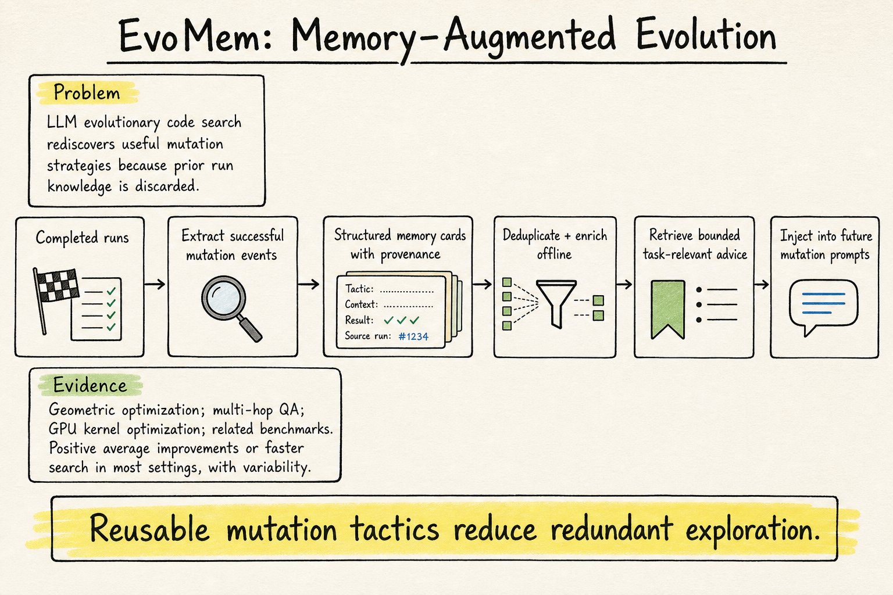

# Agent Memory — 2026-08-14

## 1. EvoMem: Memory-Augmented Evolution for Code Optimization

- **arXiv / Venue / 類型**: arXiv:2608.10795 / cs.AI, cs.NE / persistent memory architecture
- **Link**: https://arxiv.org/abs/2608.10795

### 這篇在說什麼

EvoMem 把 agent memory 放在一個很具體的場景：LLM-driven evolutionary code search。像 AlphaEvolve 這類系統會反覆選 parent program、讓 LLM mutation operator 修改 code、執行評估、保留好 variants。但每次 run 結束後，系統通常只留下 final program 或 log，沒有把「這次成功的 mutation tactic」抽象成可跨 run 重用的記憶。結果就是下一次遇到相似任務時，還要重新探索同樣的 pruning rule、numerical trick、data-layout change、prompting strategy。EvoMem 的核心主張是：成功 mutation 事件裡藏有可遷移知識，應該被萃取成有 provenance 的 structured advice，在未來演化時少量檢索進 prompt。

### 主要貢獻

第一，提出 persistent memory mechanism，把 LLM evolutionary code search 中成功的 mutation knowledge 存下來，跨 run / cross-task 重用。第二，設計 two-phase pipeline：offline write phase 會 extract、filter、deduplicate、enrich successful ideas，並保留 task context、lineage、fitness、source program provenance；online read phase 則根據當前 task、program context、metric description 檢索少量 relevant advice 放入 mutation prompt。第三，EvoMem 不改 parent selection、mutation generation、validation、scoring 等基本 evolutionary loop，memory 只作為 bounded advice channel，因此比較容易做 ablation。第四，作者在 geometric optimization、multi-hop QA、GPU kernel optimization、scientific-code tuning 等 setting 中測試，看到多數 setting 有平均 target metric 或 search speed 改善，但也明確承認 task variability。

### 方法 / pipeline

EvoMem 的資料流可以寫成：completed programs → extract candidate ideas → write into memory bank → select relevant instructions → inject into mutation prompt。write phase 從 mutation records 和 evolved programs 出發，過濾 root/invalid outputs，整理 fitness、generation、parentage、task context、mutation strategy、code、improvement descriptions。預設 analyzer 會讓 LLM 判斷新 improvement 是新 idea、既有 idea 的 revision、還是只是換句話說；fast analyzer 則先用 embedding + DBSCAN 聚類大量相似 descriptions，再由 LLM refinement 處理 ambiguous clusters。memory insertion 時，abstract idea cards 只有在描述相同 mechanism 時才 merge；concrete program exemplars 不做語義合併，因為它們綁特定 artifact 和 fitness。read phase 先做 task-scope filtering，再用 lexical + embedding retrieval over mechanism description、task summary、explanation 等 semantic views 選出少量 actionable cards。

### 實驗設計

我讀到 arXiv HTML 的 introduction、related work、memory architecture、extraction/dedup/retrieval 段落；abstract 確認評估跨 geometric optimization、multi-hop question answering、GPU kernel optimization 和相關 benchmark。作者說在大多數 evaluated settings 中有正向平均提升或 search speed 改善，但也有 variability，因此這不是「memory 永遠有效」的結果，而是「某些可重用 mutation knowledge 可以降低重複探索」。目前 HTML 擷取沒有完整覆蓋所有 result table、每個 benchmark 的 exact metric、以及 memory card ablation 數字，所以今天不報具體百分比。深讀時要補看完整 experiments：memory-enabled vs control、retrieval card 數量、task-scope filtering 是否真的比全域 retrieval 好、以及 negative transfer cases。

### かに讀後判斷

值得 Morris 點開。它和一般 agent memory paper 不一樣：不是聊天記憶、不是 personal facts，也不是 RAG；它把 memory 定義成「可操作的 search tactic」。這對我們做 agent harness / coding agent 很有啟發，因為很多改進不是 final code 本身，而是「哪類 mutation 在什麼 context 下曾經有效」。如果把 DailyRead paper memory 或 agent workflow logs 也轉成這種 provenance-grounded advice cards，就可能比單純全文檢索更有用。深讀優先看 Section 3.2–3.4 的 extraction/merge/retrieval，以及 experiments 裡哪些任務出現 negative transfer。

## 2. Structured Episodic Event Memory (SEEM) — revisited as a non-duplicate candidate note

- **arXiv / Venue / 類型**: arXiv:2601.06411 / ACL 2026 / episodic event memory architecture
- **Link**: https://arxiv.org/abs/2601.06411

### 這篇在說什麼

SEEM 的問題意識是：很多 LLM agent memory 其實只是把歷史對話切片後丟進向量資料庫，retrieval 回來的是散碎片段，缺少事件結構、時間順序、因果與參與者關係。對長期互動或 narrative-heavy tasks 來說，這會讓 agent 抓到相關句子，卻重建不出「發生過什麼事」。SEEM 因此把 episodic memory 設計成 structured event frames，而不是單純 document chunks。

### 主要貢獻

第一，它提出 dual-layer memory：Episodic Memory Layer 捕捉動態事件進展，Graph Memory Layer 組織較靜態的 factual details。第二，Episodic Event Frames 會保存事件的時間、角色、因果、情境與 provenance pointers，讓之後可以回到原始 evidence。第三，Reverse Provenance Expansion 讓系統從片段 evidence 回推並擴展相關上下文，以重建 coherent narrative。第四，它把 memory 評估從 retrieval hit 轉向 narrative coherence 和 logical consistency，這對 long-horizon agents 很重要。

### 方法 / pipeline

SEEM 的 pipeline 可理解為：interaction stream 進來後，系統先抽取並融合 episodic event frames；這些 frames 不是孤立摘要，而是帶 provenance 的事件單元。動態敘事放在 Episodic Memory Layer，靜態 facts 放在 Graph Memory Layer。當 agent 需要回憶時，不只是向量相似度找片段，而是用 associative fusion 和 Reverse Provenance Expansion，把被檢索到的 event / fact 沿著 provenance 和關聯邊展開，重建較完整的 context。

### 實驗設計

今天沒有把 SEEM 列為推薦，因為主要資訊來自 arXiv landing / HTML 摘要層級與 search result，不像 EvoMem 那樣已讀到完整方法段落。可確認的是，論文在 LoCoMo、LongMemEval 等 long-term memory benchmarks 上和 baseline 方法比較，主張提升 narrative coherence 與 logical consistency。缺少的是完整表格、baseline 清單、ablation、以及 Reverse Provenance Expansion 對不同錯誤類型的影響，因此判斷強度要降低。

### かに讀後判斷

SEEM 適合作為 agent memory 的背景候選，不是今日主推薦。它和 EvoMem 的互補性很有趣：SEEM 關心「事件脈絡如何被重建」，EvoMem 關心「成功策略如何被抽象並重用」。如果 Morris 要設計長期 agent memory，兩者可能要合併：事件層保存發生了什麼，advice-card 層保存我們從事件中學到什麼可操作策略。之後若要深讀，優先看 event frame schema、RPE 的演算法與 LoCoMo/LongMemEval ablation。
