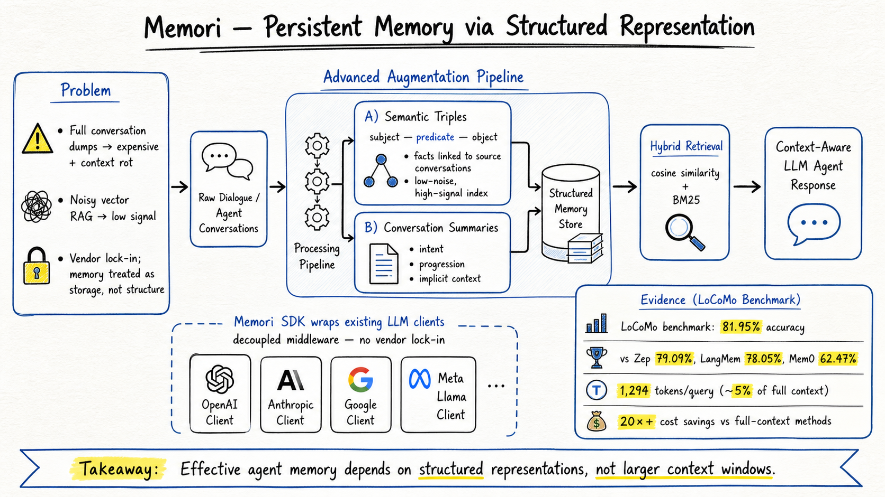

# Agent Memory — 2026-09-01

## 1. Memori: A Persistent Memory Layer for Efficient, Context-Aware LLM Agents

- **arXiv**: 2603.19935
- **Link**: https://arxiv.org/abs/2603.19935
- **Authors**: Luiz Antonio Buschetto Macarini et al. (MemoriLabs)
- **Submitted**: 2026-03-20
- **Code**: https://github.com/MemoriLabs/Memori

### 這篇在說什麼

這篇解決的是 agent memory 的一個很實際的問題：目前多數記憶系統要麼把整個對話歷史塞進 prompt（貴、慢、context rot），要麼用向量資料庫做 RAG（噪音高、缺乏結構），要麼綁定特定 vendor。Memori 的核心主張是：記憶不是儲存問題，是資料結構化問題。它把非結構化對話自動轉成語意三元組（semantic triples）+ 對話摘要的雙層記憶資產，大幅降低 token 用量同時維持高準確度。

### 主要貢獻

1. **LLM-agnostic 持久記憶層**：Memori 作為解耦的 middleware，透過輕量 SDK 包裝現有 LLM client，不需修改應用邏輯。
2. **Advanced Augmentation pipeline**：把原始對話自動解析為 semantic triples（subject–predicate–object）+ 對話摘要，建立可搜尋的雙層記憶結構。
3. **效率和準確度兼顧**：在 LoCoMo benchmark 上達 81.95% accuracy，用每 query 僅 1,294 tokens（~5% of full context），比競爭方案省 67% tokens，比 full-context 省 >20×。

### 方法 / pipeline

Memori 的架構分三層：

**1. Advanced Augmentation（背景記憶建立 pipeline）**
- **Semantic Extraction & Triple Generation**：掃描對話，提取具體事實、使用者偏好、約束條件、變動屬性，結構化為 semantic triples。每個 triple 連結到來源對話。好處：(a) 低噪音、高信號索引提升向量搜尋精度；(b) 作為壓縮層，大幅減少 token 用量。
- **Conversation Summarization**：triples 抓的是離散事實但失去脈絡。對話摘要補上敘事流——使用者整體意圖、對話時間進展、隱含任務脈絡。每個 triple 直接連結到所屬對話的摘要，確保事實不脫離背景。

**2. Retrieval**
- Hybrid search：cosine similarity + BM25 keyword matching。
- 嵌入模型：Gemma-300。
- 儲存：FAISS local index。

**3. Answer Generation**
- 檢索到的 triples + 對應摘要送給 GPT-4.1-mini 做回答。
- LLM-as-a-Judge（GPT-4.1-mini）做品質評估。

### 實驗設計

- **基準**：LoCoMo（Long Conversation Memory），挑戰跨長對話的狀態追蹤、時間推理、偏好提取。
- **比較對象**：Zep、LangMem、Mem0、Full-Context ceiling。
- **評估方式**：LLM-as-a-Judge，四個推理類別（Multi-Hop、Temporal、Open-Domain、Single-Hop）。
- **主結果**：
  - Memori 81.95% vs Zep 79.09% vs LangMem 78.05% vs Mem0 62.47% vs Full-Context 87.52%。
  - Single-Hop：Memori 87.87%（最強直接事實檢索）。
  - Token 效率：每 query 1,294 tokens vs full-context 的 ~25,000+ tokens。
- **限制**：adversarial 類別被排除（為公平比較其他發表結果）；評估依賴 LLM-as-a-Judge 而非 human evaluation；只測了 LoCoMo 一個基準。目前從全文已讀到 Section 3.8 的分類結果，後續 detailed analysis 需 PDF 確認。

### かに讀後判斷

**今日推薦點開**。Memori 的位置很明確：它是 agent memory 記憶結構化路線的最新實證。和之前的幾篇相比：
- vs AgeMem (2601.01885)：AgeMem 讓 agent 自主決定何時存/取/摘要/丟棄，是 policy-learned 管理；Memori 用固定 pipeline 做 structured extraction，是 data-structuring 管理。兩者互補而非競爭。
- vs Infini Memory (2606.10677)：Infini Memory 用主題文件做持久記憶，也走結構化路線但用文件而非 triples；Memori 的 triple + summary 雙層更精細。
- vs Mem0 (2504.19413)：Mem0 也是記憶系統，但 Memori 在 LoCoMo 上大幅超越 Mem0（81.95% vs 62.47%），主要差異在 Memori 的 Advanced Augmentation 把對話結構化做得更徹底。

Memori 的核心訊息很清楚：好的記憶不是更大的 context window，而是更好的資料結構化。這對 DailyRead 追蹤的 agent memory 領域來說是一個值得深讀的實證。

深讀時優先看：
- Advanced Augmentation pipeline 的完整規格：triples 和 summaries 的具體 schema
- Hybrid search 的實作細節：cosine + BM25 的權重怎麼調
- Figure 1 的完整架構圖
- 和 Mem0 / Zep / LangMem 的差異化分析（Table 1 的完整版本）
- Adversarial 類別為什麼被排除，排除後是否影響結論

---

## 2. HarnessEval-W: Agentifying the Evaluation of Visual Worlds

- **arXiv**: 2608.16859
- **Link**: https://arxiv.org/abs/2608.16859
- **Authors**: Weiliang Chen, Haowen Sun, Jun Gao, et al.
- **Submitted**: 2026-08-24

### 這篇在說什麼

這篇雖然主要歸在 harness engineering，但它的核心方法——把 harness paradigm 從 LLM ecosystem 搬到 world model benchmarking——和 agent memory 有間接關係：agent 記憶系統的評估本身也需要推理鏈，不只是 scalar score。HarnessEval-W 把評估 agent 化，讓 sub-agent 用診斷工具推理出每個 case 的分數，而非用固定 rubric 硬算。

### 主要貢獻

1. 把 harness paradigm 從 LLM agent 帶入 visual world model 的 benchmarking。
2. Agentified evaluation pipeline：不只評分，還產生可檢驗的推理鏈。
3. 分解評估問題為子問題，用專門 sub-agent + 診斷工具逐個推理。

### 方法 / pipeline

HarnessEval-W 不用固定 rubric，而是：解讀每個評估 case 的 context → 分解評估問題 → sub-agent 用診斷工具推理子問題 → 產生帶推理鏈的評分。

### 實驗設計

- **目標**：visual world model 的 rollout 評估（物理、因果、世界狀態正確性）。
- **目前能確認**：abstract 和 HTML 前段已讀，確認了 agentified evaluation 的核心設計；具體 benchmark 規模、sub-agent 配置、主結果數字需 PDF 確認。

### かに讀後判斷

值得收藏但非今日推薦。HarnessEval-W 把 harness 思路帶到 visual world model 評估是有意義的擴展，但它不是 agent memory 的直接貢獻。它對 agent memory 的間接啟示是：記憶系統的評估也需要類似的 agentified evaluation——不只看 retrieval accuracy，還要推理記憶為什麼在特定場景失敗。