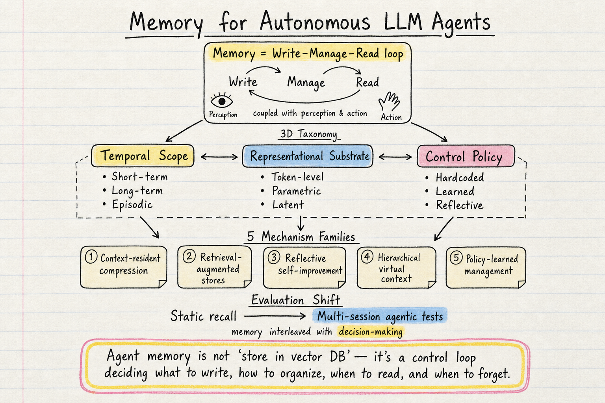
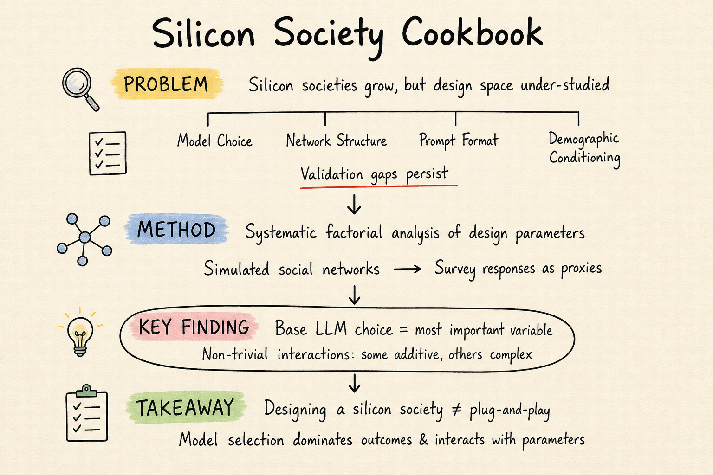

# DailyRead 2026-05-13

## 今日總覽

今天的共同主線是：**分解與量化**。Silicon sampling 方向用 factorial analysis 拆解設計空間、用 analytic flexibility 揭示可複現性危機；Harness engineering 方向把 harness 的貢獻量分解成四層，量化 LLM 的 residual role；Agent Memory 方向用 write–manage–read loop 和三維分類法把記憶從「向量庫」拆成控制迴路。

- **Silicon Sampling / Social Simulation**：今天兩篇新文都值得看。*The Silicon Society Cookbook* 用 factorial analysis 拆解設計空間，發現 base LLM 是最重要的變數；*The Threat of Analytic Flexibility* 用 252 個配置和 66 個替代配置證明 silicon sampling 的可複現性嚴重不足。
- **Harness Engineering**：今天最核心的是 Son et al. 的定量分解——把 harness 拆成四層，發現 declarative planning（零 LLM calls）就 carry 了 heavy lifting。另外 *The Last Harness You'll Ever Build* 提出自動化 harness 演化框架，MongoDB blog 給了六元件工程全景。
- **Agent Memory**：Du et al. 的 survey 是目前最完整的 agent memory 地圖，用 write–manage–read loop 和三維分類法組織文獻；ActMem 則用 causal graph + counterfactual reasoning 把記憶從「存取」推向「理解」。

## 今日推薦點開

### 1. How Much Heavy Lifting Can an Agent Harness Do?

這篇是 harness engineering 領域最直接回答核心問題的定量實驗：harness 到底 carry 多少？答案是 declarative planning（第二層）就 carry 了 heavy lifting，LLM 只在 4.3% 的 turns 啟動、效果有界且非單調。

如果只記一句話：**把 harness layers 做成 measurable 之後，LLM 的貢獻可以被量化為 residual，而不是被假設為中心。**

### 2. Memory for Autonomous LLM Agents: Mechanisms, Evaluation, and Emerging Frontiers

這篇是目前最完整的 agent memory survey。write–manage–read loop 的框架把記憶從「向量庫」拆成控制迴路，五個 mechanism families 的分類也很清晰。

如果只記一句話：**agent memory 不是「把東西存進向量庫」，而是跨互動決定寫什麼、如何整理、何時讀出、何時忘記的控制迴路。**

### 3. The Silicon Society Cookbook: Design Space of LLM-based Social Simulations

這篇做了 silicon sampling 方向少見的系統性 design-space analysis，核心發現是 base LLM 選擇是影響模擬結果最重要的單一變數，而且設計空間有 complex interactions。

如果只記一句話：**silicon society 的設計不是 plug-and-play；model selection dominates outcomes，且與其他參數有交互作用。**

## 各領域筆記

- [[silicon-sampling-social-simulation/2026-05-13]]
- [[harness-engineering/2026-05-13]]
- [[agent-memory/2026-05-13]]

## Search / Source Notes

- Search backend: SearXNG `http://192.168.1.18:8888/search?format=json`
- Raw search result: `raw/search-2026-05-13.json`
- Log: `logs/2026-05-13.log`