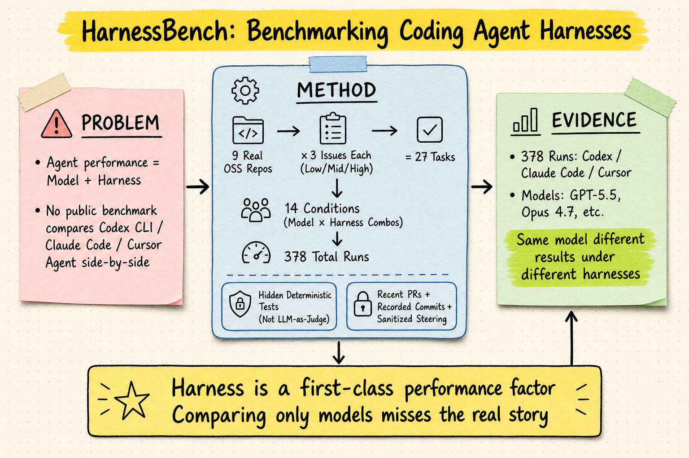
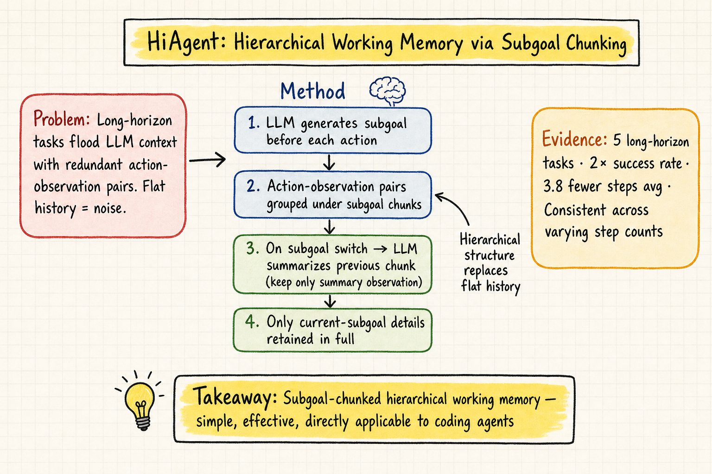
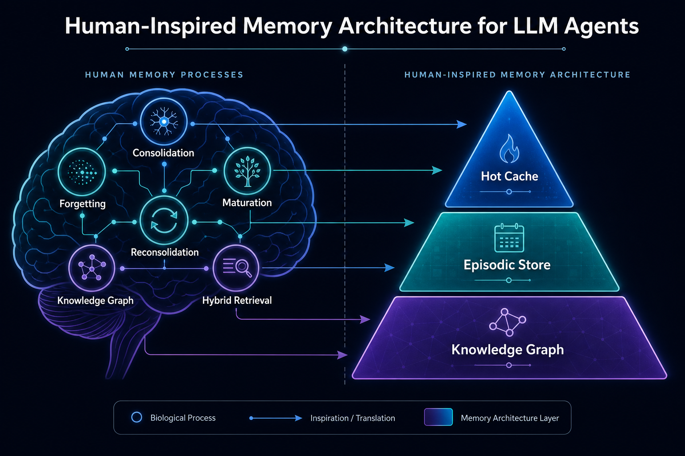
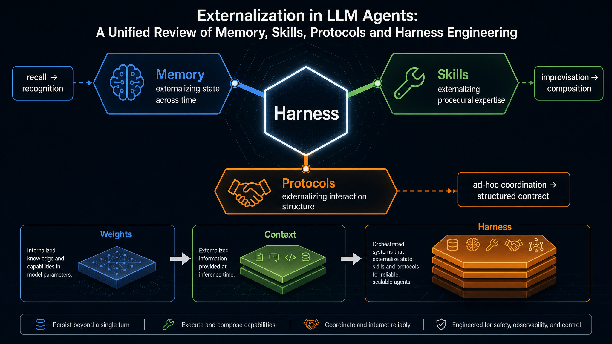

# DailyRead — 2026-05-14

## 今日推薦點開

### 🥇 The Collapse of Heterogeneity in Silicon Philosophers (arXiv 2604.23575)
- **Domain**: Silicon Sampling / Social Simulation
- **核心 takeaway**: LLM 模擬個體時，不只均值有偏，個體間的異質性會系統性坍縮——模型讓不同領域的判斷過度相關，產生「人工共識」
- **為什麼推薦**: 比「silicon sampling 有偏差」更深一層的發現，直接挑戰用 LLM 做意見模擬的基礎假設，對 alignment 和 social simulation 都是重要警示

### 🥈 HarnessBench: A Benchmark for Coding Agent Harnesses
- **Domain**: Harness Engineering
- **核心 takeaway**: 同一模型在不同 harness（Codex / Claude Code / Cursor）下表現差異顯著，harness 是性能決定因素
- **為什麼推薦**: 少數直接比較 production CLI harness 的公開基準，hidden deterministic test scoring，方法論值得參考

### 🥉 HiAgent: Hierarchical Working Memory Management (ACL 2025)
- **Domain**: Agent Memory
- **核心 takeaway**: 用 subgoal 當 chunk 做層級 working memory 管理，長任務成功率翻倍、步數減 3.8
- **為什麼推薦**: 方法簡潔、效果明確，subgoal-chunking 思路可直接借鑑

---

## Silicon Sampling / Social Simulation

1. **Mitigating Social Desirability Bias in Random Silicon Sampling** (2512.22725) — reformulated prompt 最有效減少 LLM 的社會期望偏差
2. **The Collapse of Heterogeneity in Silicon Philosophers** (2604.23575) — 🥇 今日推薦：LLM 會讓跨領域判斷過度相關，坍縮異質性
3. **Stochastic Parrots or Singing in Harmony?** (2603.00059) — 五個模型都傾向收斂到常規答案，人類真實資料反而成離群值

## Harness Engineering

1. **HarnessBench** — 🥈 今日推薦：首個直接比較 Codex/Claude Code/Cursor 的 harness 基準
2. **Workspace-Bench** (2605.03596) — 20K 檔案依賴的工作區任務基準，測 workspace learning

## Agent Memory

1. **HiAgent** (ACL 2025) — 🥉 今日推薦：subgoal-chunking 層級 working memory
2. **MemoryOS** (EMNLP 2025) — 三層記憶架構（short/mid/long-term），對話場景 F1 +48%
3. **RMM** (ACL 2025) — 雙向反思記憶管理（前瞻摘要 + 回顧 RL 檢索優化）

---

---

## 下午補充（15:20 cron）

### 🏅 Human-Inspired Memory Architecture for LLM Agents (arXiv 2605.08538)
- **Domain**: Agent Memory
- **核心 takeaway**: Microsoft 提出6種認知機制映射到 agent memory：sleep-phase consolidation、interference forgetting、engram maturation、reconsolidation、entity KG、hybrid retrieval。Dedup consolidation 達 97.2% precision / 58% store reduction，首次做 streaming M-tier evaluation
- **為什麼推薦**: 目前最完整的工程落地型 agent memory 論文，synthetic calibration 消除評估洩漏，每個機制都有具體參數設計

### 🏅 Externalization in LLM Agents (arXiv 2604.08224)
- **Domain**: Harness Engineering
- **核心 takeaway**: 用 cognitive artifacts 理論統一 memory/skills/protocols 三種外化形式，harness 是統一基礎設施層。核心轉換：回憶→辨識、即興→組合、隨意協調→結構化契約
- **為什麼推薦**: 目前最完整的 harness engineering 理論框架，和 HarnessBench 互補——一個比數字、一個給理論

### Agent Memory
4. **From Storage to Experience** (2605.06716, ACL 2026 Findings) — Storage→Reflection→Experience 三階段演化框架，統一 OS 工程派和認知科學派

### Harness Engineering
3. **ProgramBench** (2605.03546, Meta FAIR) — 200 task 測 agent 從零建構程式能力，0% task 完全解決，說明架構決策仍是 agent 瓶頸

### Silicon Sampling / Social Simulation
今日下午搜尋無強力新候選（2604.06663 已 SEEN），早上三篇仍為本日最佳。

---

## 查重狀態

所有今日候選均經 `check_paper_seen.py` 查重確認為 NOT_SEEN，無重複推薦。下午新增：2605.08538、2604.08224、2605.06716、2605.03546 均為 NOT_SEEN。