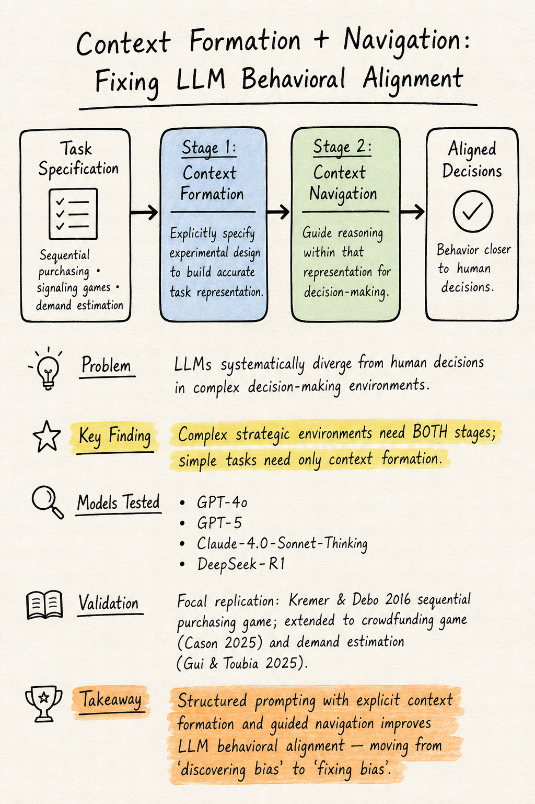
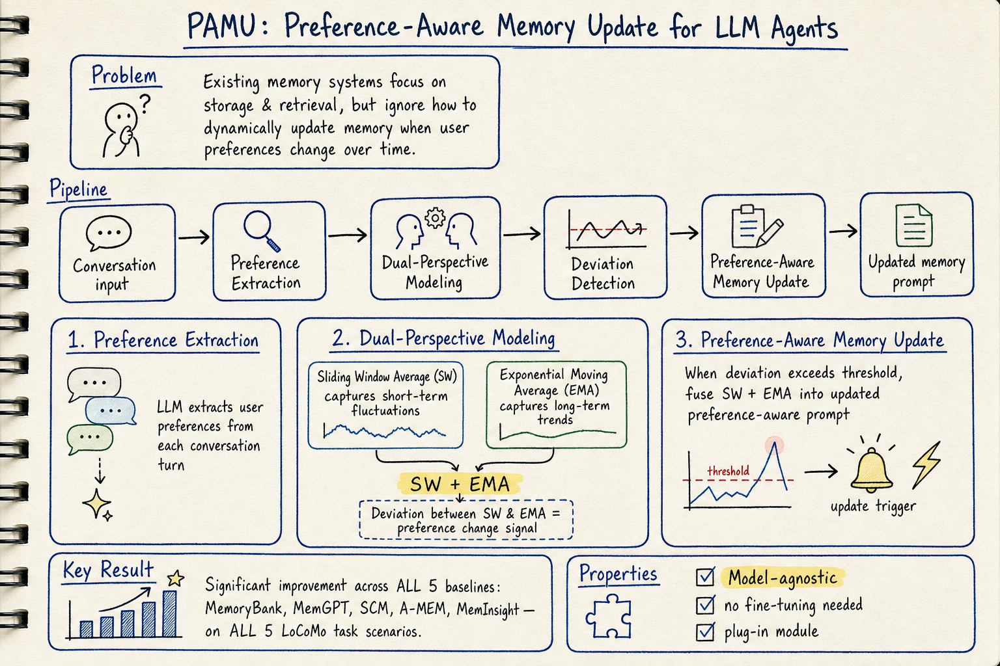
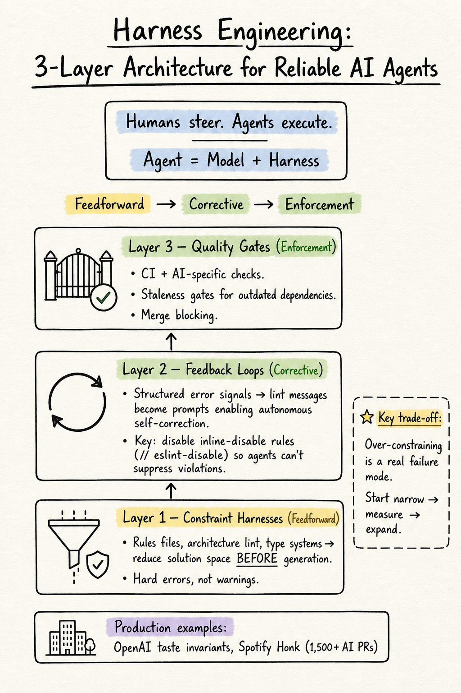

# DailyRead — 2026-05-15

## 今日推薦點開

### 🥇 Improving Behavioral Alignment in LLM Social Simulations via Context Formation and Navigation (arXiv 2601.01546)
- **Domain**: Silicon Sampling / Social Simulation
- **核心 takeaway**: 複雜決策環境中，LLM 需要兩階段校正——先理解任務情境（context formation），再在情境中導航推理（context navigation）。簡單任務只需 formation，策略互動任務兩者缺一不可
- **為什麼推薦**: 目前 silicon sampling 領域少數提出可操作修正框架的 paper，從「發現偏差」走向「修正偏差」

### 🥈 PAMU: Preference-Aware Memory Update for Long-Term LLM Agents (arXiv 2510.09720)
- **Domain**: Agent Memory
- **核心 takeaway**: 用 SW + EMA 雙視角建模用戶偏好變化，只在偵測到真正偏好偏移時才更新記憶。五個 baseline 上全面提升
- **為什麼推薦**: 方法簡潔、效果明確、model-agnostic，直接命中 memory updating 的研究缺口

### 🥉 Harness Engineering for AI Coding Agents (Augment Code Guide)
- **Domain**: Harness Engineering
- **核心 takeaway**: 三層架構——Constraint Harnesses (feedforward) → Feedback Loops (corrective) → Quality Gates (enforcement)。Lint messages 成為 prompts，inline-disable rules 應被禁用
- **為什麼推薦**: 目前最完整的 harness engineering 實戰參考，從定義到實作都有具體指引

---

## Silicon Sampling / Social Simulation

1. **Improving Behavioral Alignment in LLM Social Simulations** (2601.01546) — 🥇 今日推薦：兩階段 context formation + context navigation 框架，四個 SOTA 模型驗證
2. **ChatGPT is not A Man but Das Man** (2507.02919) — 結構一致性失敗 + 同質化現象，accuracy-optimization hypothesis 解釋 RLHF 模型的同質化根源
3. **Integrating LLM in Agent-Based Social Simulation** (2507.19364) — Position paper：Hybrid Constitutional Architectures，分層整合 ABM + SLM + LLM
4. **Evaluating LLMs as Synthetic Social Agents** (2509.26080) — 重新框定 LLM 為 quasi-predictive interpolator，四個 practical guardrails

## Harness Engineering

1. **Harness Engineering for AI Coding Agents** (Augment Code) — 🥉 今日推薦：最完整的三層架構實戰指南
   - 和前幾天的 HarnessBench（測基準）、Externalization in LLM Agents（理論框架）互補

## Agent Memory

1. **Rethinking Memory in LLM based Agents** (2505.00675) — Survey：六操作分類法（Consolidation、Updating、Indexing、Forgetting、Retrieval、Condensation），parametric vs. contextual 二分
2. **PAMU: Preference-Aware Memory Update** (2510.09720) — 🥈 今日推薦：SW + EMA 雙視角偏好更新，命中 memory updating 缺口

---

## 查重狀態

所有今日候選均經 `check_paper_seen.py` 查重確認為 NOT_SEEN：
- 2601.01546: NOT_SEEN
- 2507.02919: NOT_SEEN
- 2507.19364: NOT_SEEN
- 2509.26080: NOT_SEEN
- 2505.00675: NOT_SEEN
- 2510.09720: NOT_SEEN
- Augment Code harness engineering guide: NOT_SEEN