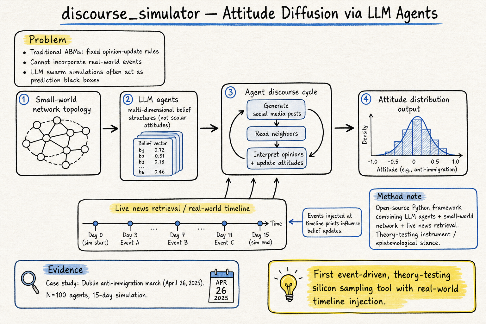
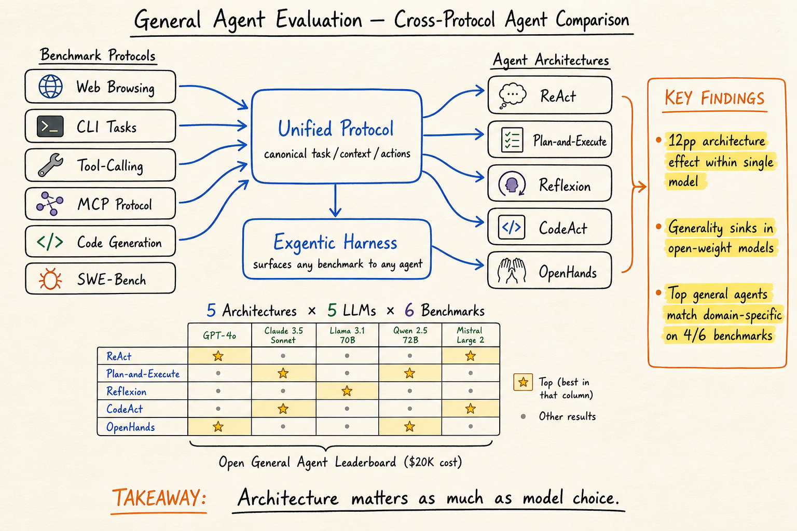

# DailyRead 2026-05-18

## 今日總覽

三個 domain 各有 2 篇新內容。Silicon Sampling 領域本日兩篇都是 framework paper：discourse_simulator 是開源態度擴散模擬工具，PolicySim 是 WWW'26 的平台政策主動評估沙盒。Harness Engineering 兩篇都跟 evaluation cost 與 cross-protocol 可比性有關：General Agent Evaluation 提出統一協議與 harness，首次讓不同 agent 架構能公平比較；Efficient Benchmarking 用 IRT 啟發的中等難度篩選把 eval 成本壓低 44–70%。Agent Memory 兩篇都做 hierarchical memory：Multi-Layered Memory Framework 分 working / episodic / semantic 三層加 adaptive gating；H-MEM 分四層加 positional index encoding，用 index-based routing 取代 exhaustive similarity search。

## 今日推薦點開

1. **discourse_simulator: LLM-Agent-based Social Simulation for Attitude Diffusion** — arXiv:2604.03898 — 開源 Python 框架，結合 LLM agent-based model 與 real-world event timeline 模擬輿論態度變化，是近期少見的「theory-testing instrument」定位 silicon sampling 工具。[→ 詳見 silicon-sampling 筆記](../silicon-sampling-social-simulation/2026-05-18.md)

   

2. **General Agent Evaluation** — arXiv:2602.22953 — 首次系統比較 tool-calling / MCP / code-gen / CLI 四類 agent 架構，提出 Unified Protocol + Exgentic harness + Open General Agent Leaderboard，直接回應 harness engineering 領域最核心的 cross-protocol 可比性問題。[→ 詳見 harness-engineering 筆記](../harness-engineering/2026-05-18.md)

   

---

## Silicon Sampling / Social Simulation

| # | Paper | Type | 推薦 |
|---|-------|------|------|
| 1 | discourse_simulator: LLM-Agent-based Social Simulation for Attitude Diffusion (2604.03898) | Framework / arXiv | ★ |
| 2 | PolicySim: An LLM-Based Agent Social Simulation Sandbox for Proactive Policy Optimization (2603.19649) | Conference (WWW'26) / arXiv | |

## Harness Engineering

| # | Paper | Type | 推薦 |
|---|-------|------|------|
| 1 | General Agent Evaluation (2602.22953) | arXiv | ★ |
| 2 | Efficient Benchmarking of AI Agents (2603.23749) | arXiv | |

## Agent Memory

| # | Paper | Type | 推薦 |
|---|-------|------|------|
| 1 | Multi-Layered Memory Architectures for LLM Agents (2603.29194) | arXiv | |
| 2 | Hierarchical Memory (H-MEM) for LLM Agents (2507.22925) | arXiv | |