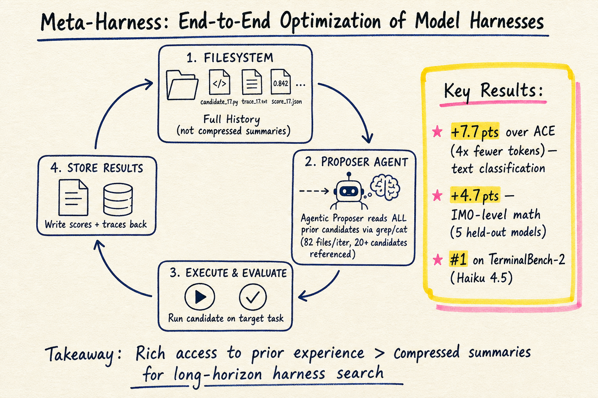
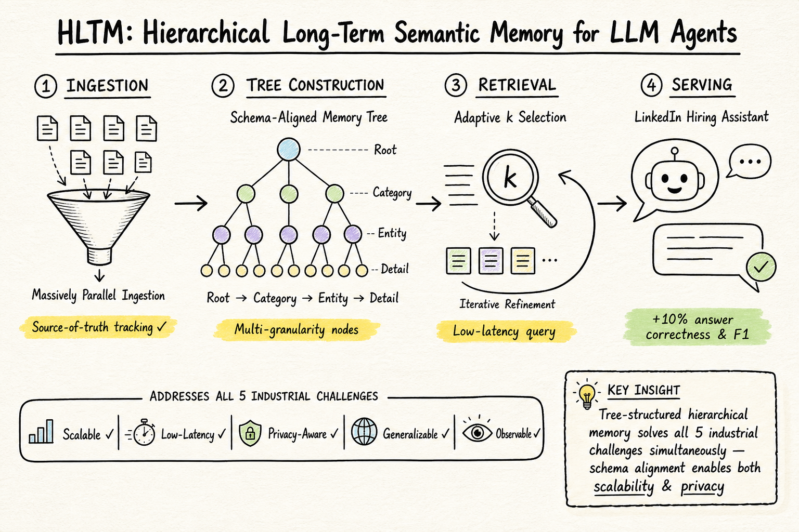

# DailyRead 2026-05-19

## 今日總覽

Silicon Sampling 領域本日兩篇：一篇是 data-driven silicon sociology，首次大規模觀察 in-the-wild agent 社會（Moltbook 15 萬 agent 的社群結構分析）；另一篇是 ACL 2026 的 LLM-based 道德演化模擬。Harness Engineering 本日兩篇都很有份量：一篇把範疇論引入 harness 形式化定義，提出 certificate-preservation 作為編譯正確性標準；另一篇是 MIT + Stanford 的 Meta-Harness，用 agentic proposer + filesystem 搜尋 harness 程式碼，在三個 benchmark 上打敗手工設計的 harness。Agent Memory 本日一篇：LinkedIn 的 HLTM，在生產環境部署的 hierarchical long-term semantic memory，answer correctness 和 retrieval F1 提升 10% 以上。

## 今日推薦點開

1. **Meta-Harness: End-to-End Optimization of Model Harnesses** — arXiv:2603.28052 — 用 agentic proposer + filesystem 搜尋 harness 程式碼，比 ACE 好 7.7 points（4x 更少 context tokens），TerminalBench-2 上超越所有 Haiku 4.5 harnesses。發現雙冪律衰減和 width vs depth 的 trade-off。MIT + Stanford 團隊，是近期 harness 自動化最重要的實務進展之一。[→ 詳見 harness-engineering 筆記](../harness-engineering/2026-05-19.md)

   

2. **Hierarchical Long-Term Semantic Memory (HLTM) for LinkedIn's Hiring Agent** — arXiv:2604.26197 — 第一個在生產環境部署的 hierarchical memory 框架，系統性解決了可擴展性、低延遲、隱私、泛化、可觀測五大工業挑戰。answer correctness 和 retrieval F1 提升 10%+。[→ 詳見 agent-memory 筆記](../agent-memory/2026-05-19.md)

   

---

## Silicon Sampling / Social Simulation

| # | Paper | Type | 推薦 |
|---|-------|------|------|
| 1 | Exploring Silicon-Based Societies: An Early Study of the Moltbook Agent Community (2602.02613) | arXiv | |
| 2 | Why Are We Moral? An LLM-based Agent Simulation Approach to Study Moral Evolution (2509.17703) | ACL 2026 / arXiv | |

## Harness Engineering

| # | Paper | Type | 推薦 |
|---|-------|------|------|
| 1 | Harness Engineering as Categorical Architecture (2605.12239) | arXiv | |
| 2 | Meta-Harness: End-to-End Optimization of Model Harnesses (2603.28052) | arXiv | ★ |

## Agent Memory

| # | Paper | Type | 推薦 |
|---|-------|------|------|
| 1 | Hierarchical Long-Term Semantic Memory (HLTM) for LinkedIn's Hiring Agent (2604.26197) | arXiv | ★ |