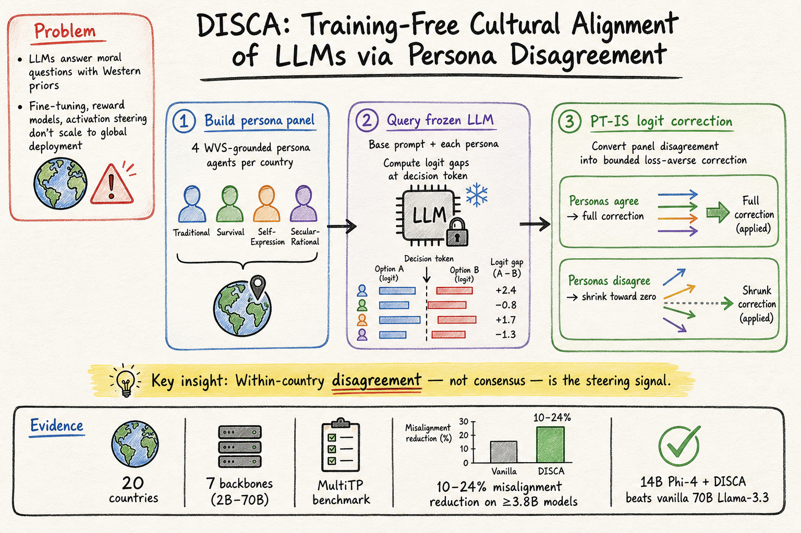
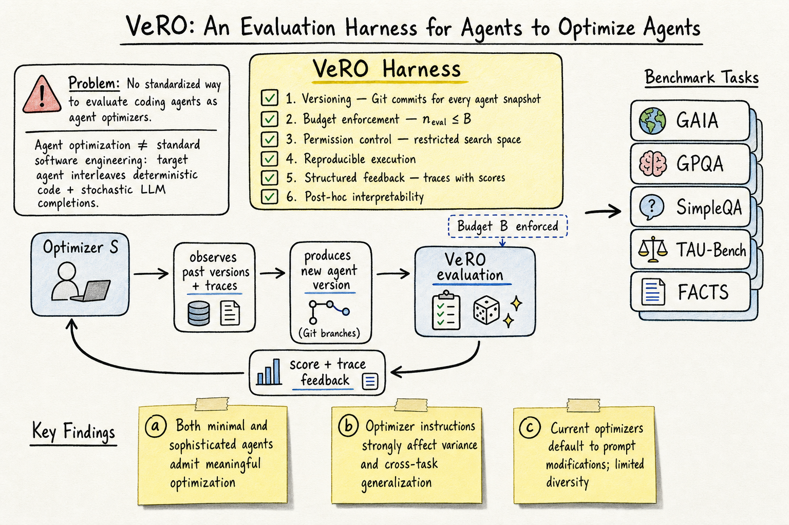

# DailyRead 2026-05-20

## 今日總覽

Silicon Sampling 領域本日三篇，都是圍繞 silicon sampling 的核心挑戰——如何讓 LLM 更準確地模擬跨文化人群的意見和行為：一篇用 value-based persona + calibration 縮窄 WEIRD 偏見（2605.16193），一篇用 persona disagreement 作為 inference-time 文化對齊信號（2605.10843 DISCA），一篇用 120K+ persona 組合測試 agent 能否預測社群媒體反應並發現不如簡單文本分類器（2604.19787）。Harness Engineering 本日一篇：VeRO 是 ICML 2026 接收的 agent optimization 評估 harness，形式化了 coding agent 作為 optimizer 的問題，提供了版本化快照、預算控制和結構化 traces。Agent Memory 本日一篇：SSGM 提出了演化記憶的治理框架，將記憶演化與治理解耦，提供了 30 個既有系統的完整分類表和四維失敗分類。

## 今日推薦點開

1. **DISCA: Training-Free Cultural Alignment of LLMs via Persona Disagreement** — arXiv:2605.10843 — 首個 training-free inference-time 文化對齊方法，只需 API logprobs 即可運作。14B Phi-4 + DISCA 的對齊度超過 vanilla 70B Llama-3.3。20 國 7 模型全面驗證。對 silicon sampling 和 LLM 部署公平性都有直接意義。[→ 詳見 silicon-sampling-social-simulation 筆記](../silicon-sampling-social-simulation/2026-05-20.md)

   

2. **VeRO: An Evaluation Harness for Agents to Optimize Agents** — arXiv:2602.22480 — ICML 2026 接收。形式化了 agent optimization 問題，提供了版本化快照 + 預算控制 + 結構化 traces 的完整評估 harness。發現當前 optimizers 默認集中在 prompt 修改，修改多樣性和影響力有限。與 Meta-Harness 和 AHE 形成完整光譜。[→ 詳見 harness-engineering 筆記](../harness-engineering/2026-05-20.md)

   

---

## Silicon Sampling / Social Simulation

| # | Paper | Type | 推薦 |
|---|-------|------|------|
| 1 | Improving Cross-Cultural Survey Simulation with Calibrated Value Personas (2605.16193) | arXiv / VALE 2026 workshop | |
| 2 | Training-Free Cultural Alignment of LLMs via Persona Disagreement / DISCA (2605.10843) | arXiv | ★ |
| 3 | LLM Agents Predict Social Media Reactions but Do Not Outperform Text Classifiers (2604.19787) | arXiv | |

## Harness Engineering

| # | Paper | Type | 推薦 |
|---|-------|------|------|
| 1 | VeRO: An Evaluation Harness for Agents to Optimize Agents (2602.22480) | ICML 2026 / arXiv | ★ |

## Agent Memory

| # | Paper | Type | 推薦 |
|---|-------|------|------|
| 1 | Governing Evolving Memory in LLM Agents: SSGM Framework (2603.11768) | arXiv | |