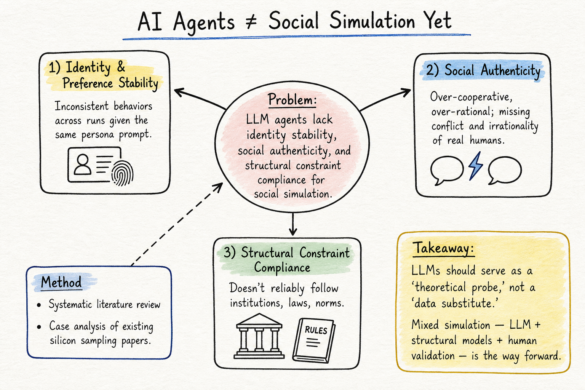
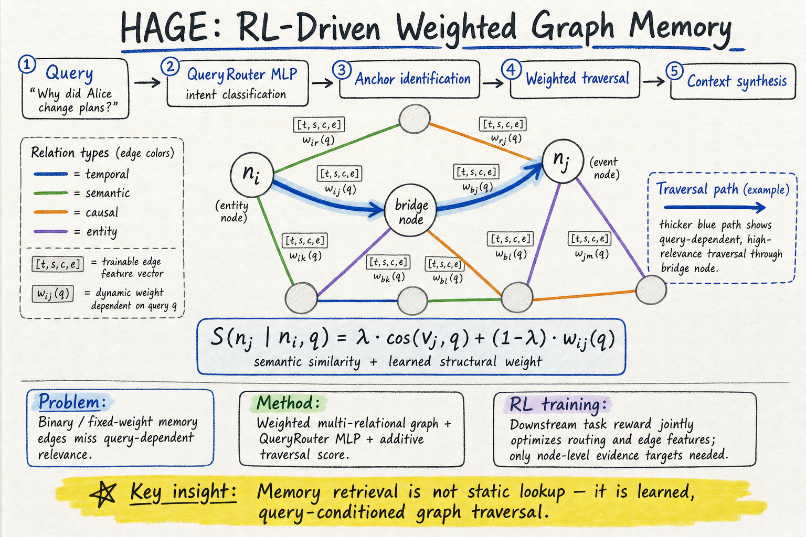
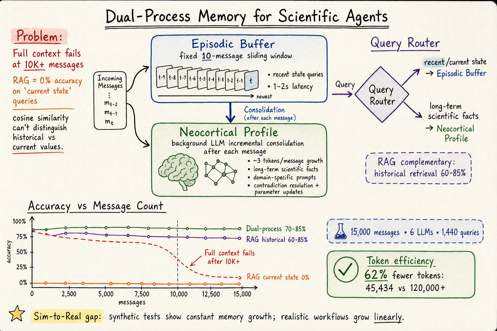

# DailyRead 2026-05-22

## 今日總覽

Silicon Sampling 領域一篇重要的「踩剎車」論文：AI Agents Alone Are Not Yet Sufficient for Social Simulation（2603.00113），系統性地分析了 LLM agent 在社會模擬中的三層不足——身份穩定性、社會真實性、結構性約束遵守——並建議把 LLM 當作「理論探針」而非「數據替代品」。Harness Engineering 領域今天的候選 TEBench（2605.06125）是藏語基準測試，更偏向低資源語言評估而非 agent harness，相關性偏低。Agent Memory 領域三篇強論文：HAGE（2605.09942）用 RL 學習記憶圖的查詢條件化遍歷策略；Episodic-Semantic Dual-Process Architecture（2605.17625）用 15,000 訊息的跨模型實驗證明 RAG 在「當前狀態」查詢上 0% 準確率，提出固定 episodic buffer + 增量 neocortical 整併的雙過程架構；ScrapMem（2605.03804）用光學遺忘做邊緣裝置上的多模態記憶壓縮。

## 今日推薦點開

1. **AI Agents Alone Are Not Yet Sufficient for Social Simulation** — arXiv:2603.00113 — ⚠️ 此論文已在 5/12 deepread，今日作為 follow-up 與 5/21 的 Distorted Perspectives 對照。三層 gap 框架（身份穩定性、社會真實性、結構性約束）+ 實證偏離發現 = 更完整的 silicon sampling 局限理解。[→ 詳見 silicon-sampling-social-simulation 筆記](../silicon-sampling-social-simulation/2026-05-22.md)

   

2. **HAGE: Harnessing Agentic Memory via RL-Driven Weighted Graph Evolution** — arXiv:2605.09942 — 把記憶檢索重新定義為查詢條件化的圖遍歷：每條邊有可訓練的關係特徵向量，RL-based QueryRouter 動態調整遍歷路徑。語義 + 結構的疊加分數讓橋節點不再被遺漏。和昨天 EvolveMem 的記憶自演化互補。[→ 詳見 agent-memory 筆記](../agent-memory/2026-05-22.md)

   

3. **Episodic-Semantic Memory Architecture for Long-Horizon Scientific Agents** — arXiv:2605.17625 — 15,000 訊息的跨模型實驗證明 RAG 在「當前狀態」查詢上 0% 準確率。雙過程架構（固定 10 則 episodic buffer + 增量 neocortical 整併）用 62% 更少 tokens 維持 70–85% 準確率。迄今最大規模的 agent memory 評估。[→ 詳見 agent-memory 筆記](../agent-memory/2026-05-22.md)

   

---

## Silicon Sampling / Social Simulation

| # | Paper | Type | 推薦 |
|---|-------|------|------|
| 1 | AI Agents Alone Are Not Yet Sufficient for Social Simulation (2603.00113) | arXiv / Position | ★ (follow-up) |

## Harness Engineering

| # | Paper | Type | 推薦 |
|---|-------|------|------|
| 1 | TEBench: Evaluating LLMs on Tibetan Language Understanding and Cultural Awareness (2605.06125) | arXiv / Benchmark | |

今日 harness engineering 領域沒有高相關性候選。TEBench 是低資源語言基準，和 agent harness / eval / workflow 的關聯較低。

## Agent Memory

| # | Paper | Type | 推薦 |
|---|-------|------|------|
| 1 | HAGE: Harnessing Agentic Memory via RL-Driven Weighted Graph Evolution (2605.09942) | arXiv / cs.CL | ★ |
| 2 | Episodic-Semantic Memory Architecture for Long-Horizon Scientific Agents (2605.17625) | arXiv / cs.AI | ★ |
| 3 | ScrapMem: A Bio-inspired Framework for On-device Personalized Agent Memory via Optical Forgetting (2605.03804) | arXiv / cs.CL | |
| 4 | Agent Memory Under Partial Observability (2605.05583) | arXiv / 一般收錄 | |