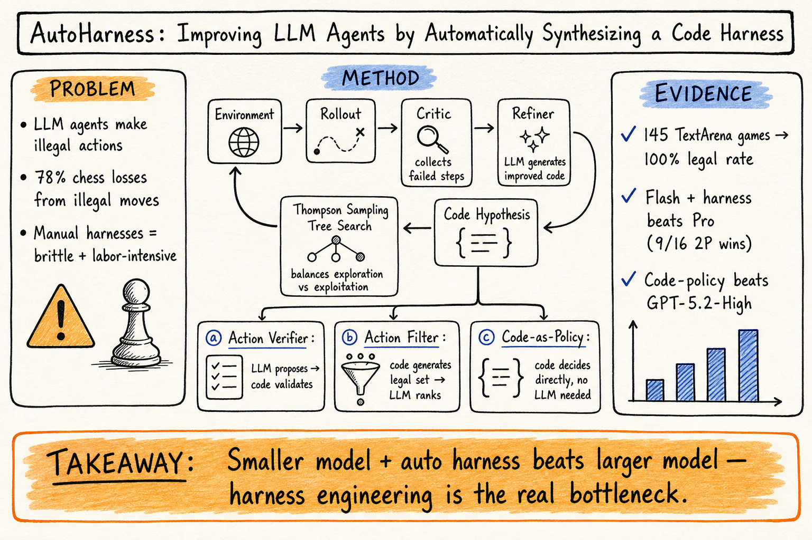
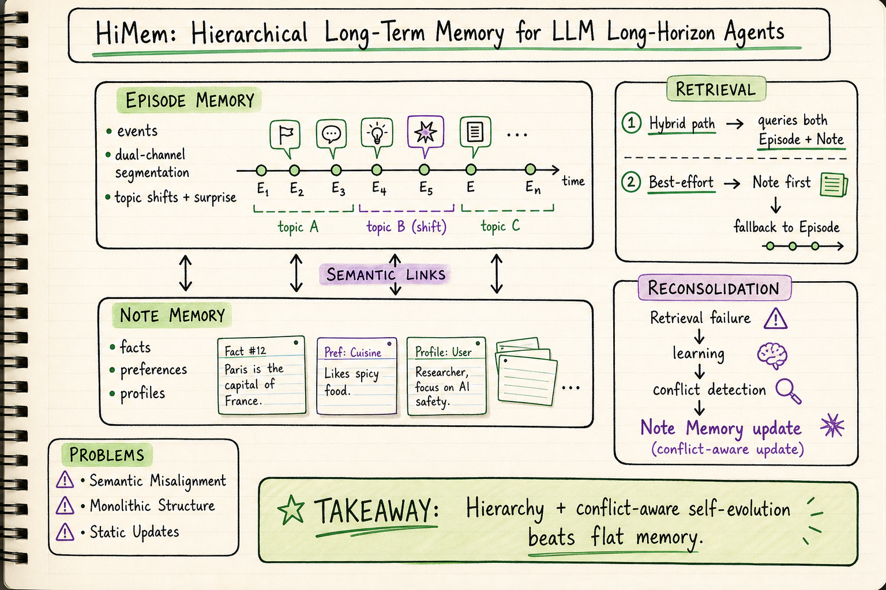

# DailyRead — 2026-06-09

## 今日推薦點開

1. **AutoHarness** (arXiv 2603.03329) — 讓 Gemini-2.5-Flash 自動合成 code harness，145 個 TextArena 遊戲全部達成 100% 合法動作率，小模型 + harness 打贏 Gemini-2.5-Pro 和 GPT-5.2-High。Harness engineering 目前最直接的實驗驗證。→ [Harness Engineering](../harness-engineering/2026-06-09.md)

2. **HiMem** (arXiv 2601.06377) — 雙層記憶架構（Episode Memory + Note Memory）+ 衝突感知再鞏固，認知理論驅動的 agent memory 設計。開源程式碼可直接使用。→ [Agent Memory](../agent-memory/2026-06-09.md)

## Silicon Sampling / Social Simulation

- **Too Open for Opinion?** (EACL 2026) — 主張開放式自由文本模擬才是 LLM 社會模擬的真正價值，挑戰封閉式選項的框架限制。Position paper，方向性參考。→ [Domain Note](../silicon-sampling-social-simulation/2026-06-09.md)

## Harness Engineering

- **AutoHarness** — 今日推薦，見上。
- **Agent Harness Engineering: A Survey** / **Agent Systems with Harness Engineering** (OpenReview) — 兩篇 survey，無法取得可讀全文，暫列候補。

## Agent Memory

- **HiMem** — 今日推薦，見上。
- **CraniMem** (arXiv 2603.15642) — 神經認知啟發的門控 + 有界記憶架構，在 clean/noisy 設定下都優於 Vanilla RAG 和 Mem0。
- **Distilling Feedback into Memory-as-a-Tool** (arXiv 2601.05960) — 把 test-time reasoning feedback 蒸餾成可檢索的檔案系統記憶，分攤推理成本。
- **MIRIX** (arXiv 2507.07957) — 六類記憶 + 多 agent 管理，支援多模態截圖理解。

