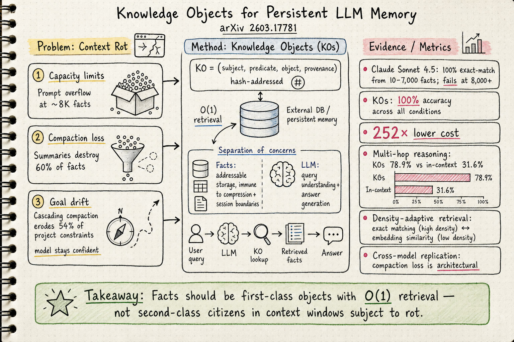
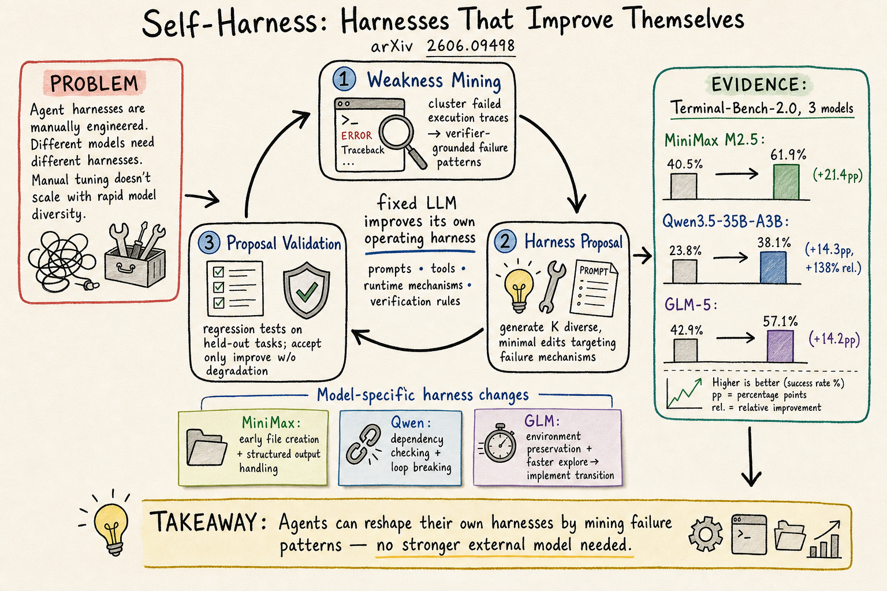
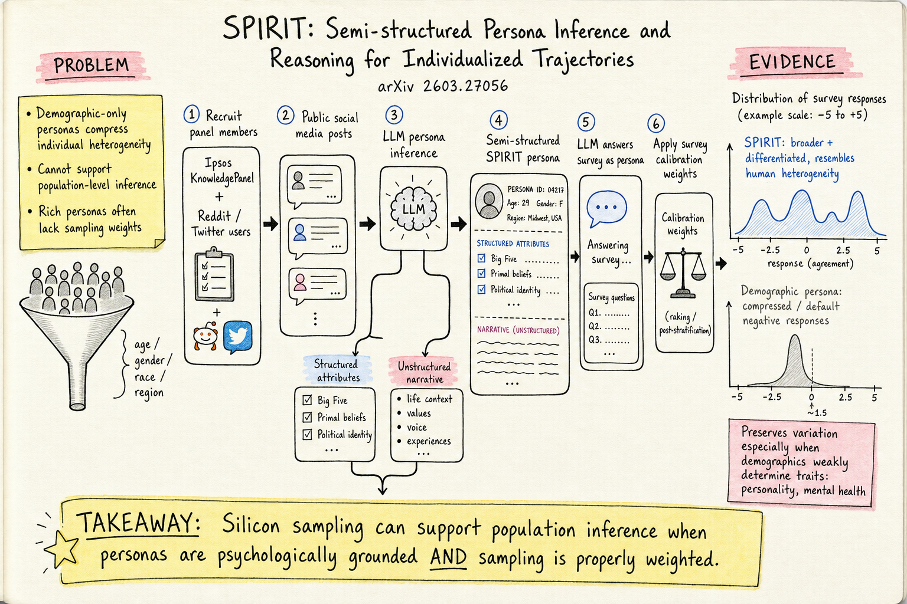

# DailyRead 2026-06-16

## 三個領域今日概覽

### Silicon Sampling / Social Simulation
- **SPIRIT**（2603.27056）：從社群媒體推斷半結構化人格，結合機率抽樣加權推論到美國人口。比 demographic persona 更好地恢復個體層級和人口層級的意見異質性。

### Harness Engineering
- **Self-Harness**（2606.09498）：LLM agent 自己分析失敗模式、提出 harness 修改、通過回歸測試後接受——不需要更強的外部模型。三個不同家族的模型都有一致提升（held-out 最高 +21.4pp）。
- **Agents' Last Exam (ALE)**（2606.05405）：250+ 產業專家合作、55 子領域、1000+ 任務的長視野 benchmark。最強配置在最難 tier < 1% pass rate。

### Agent Memory
- **Knowledge Objects**（2603.17781）：揭露 in-context memory 的三個致命問題（容量上限、壓縮損失 60%、目標漂移），提出 KO 作為離散 hash 定址元組，O(1) 查詢，100% 準確率，1/252 成本。多跳推理 78.9% vs. 31.6%。

---

## 今日推薦點開

1. 🧠 **Knowledge Objects** — agent memory 領域近期最系統性的「context rot」論證，直接指出 in-context memory 的三個生產失敗模式，KO 架構乾淨且有說服力。[arXiv](https://arxiv.org/abs/2603.17781)

2. ⚙️ **Self-Harness** — harness engineering 的新範式：agent 自己改自己的 harness。三階段迴圈（Weakness Mining → Proposal → Validation），三個模型家族都有一致提升。[arXiv](https://arxiv.org/abs/2606.09498)

3. 📊 **SPIRIT** — silicon sampling 終於認真處理「推論到母體」的問題：把調查方法論的機率抽樣加權帶進 LLM 模擬。[arXiv](https://arxiv.org/abs/2603.27056)

---

