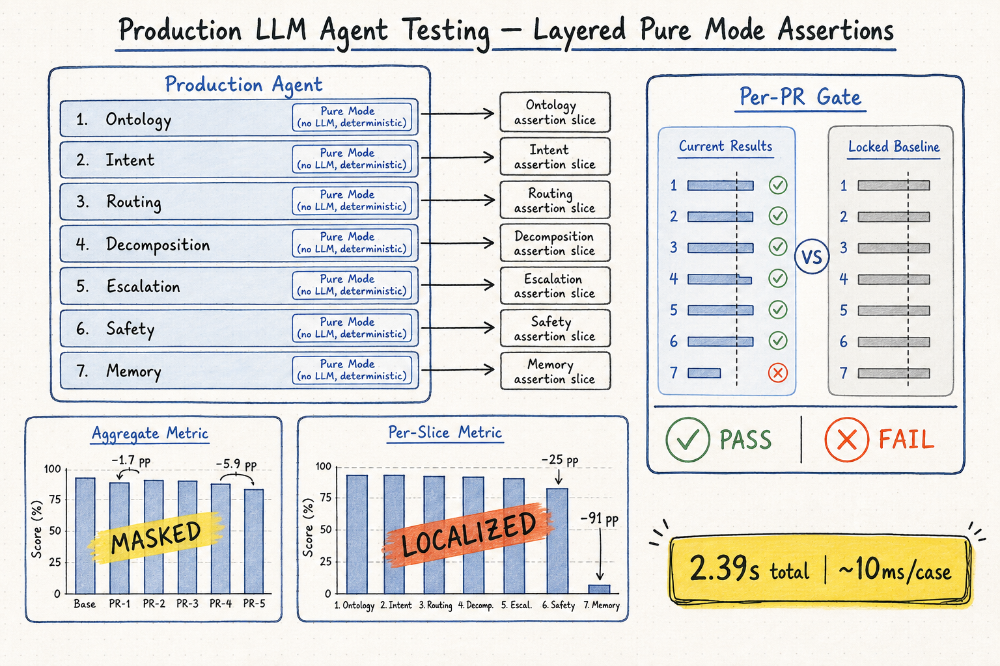
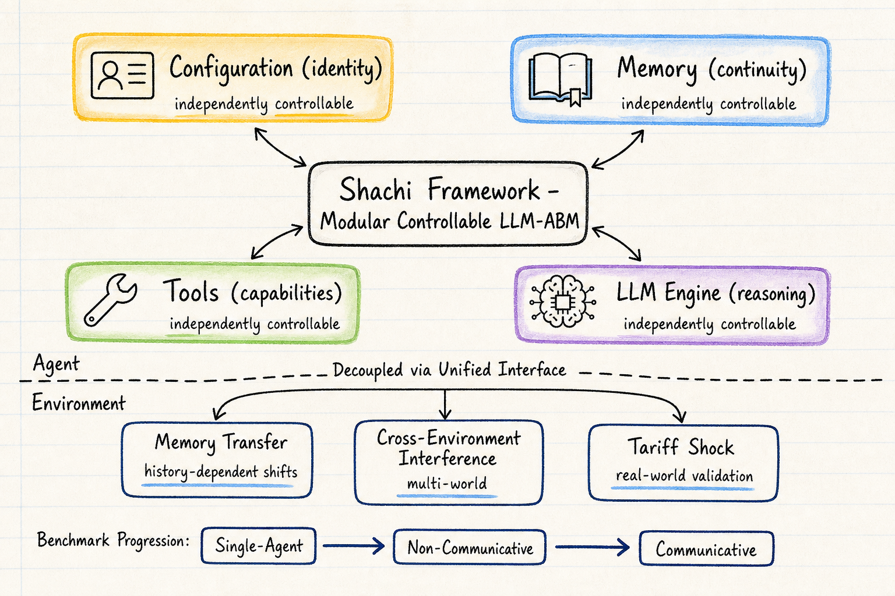
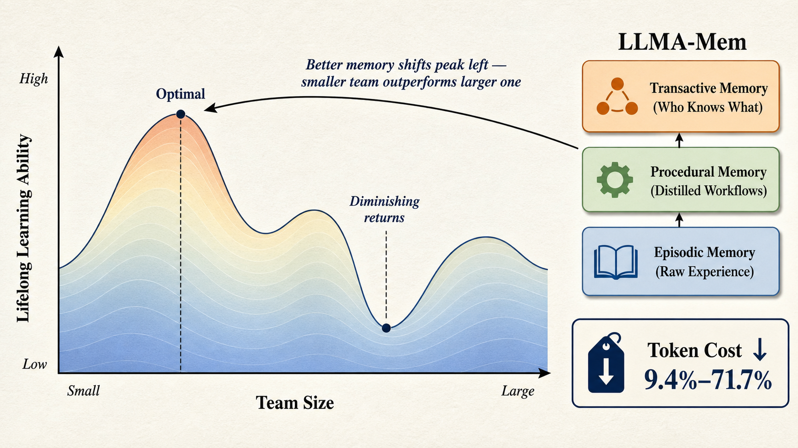

# DailyRead 2026-06-17

## 三個領域今日概覽

### Silicon Sampling / Social Simulation
- **Shachi**（2509.21862, ALIFE 2026）：模組化、可控的 LLM-ABM 框架。把 agent 認知解耦成 Configuration/Memory/Tools/LLM 四元件，支持跨環境攜帶、memory transfer、multi-world inhabitation。美國關稅衝擊 case study 方向上與真實數據一致。
- **Social Digital Twins**（2601.06111）：LLM 作為人口行為模擬的認知引擎 + 校正層映射到真實觀察指標。COVID-19 case study 比梯度提升 baseline 改善 20.7%。Domain-agnostic 架構。

### Harness Engineering
- **Layer-Isolated Test Harness**（2606.11686）：生產 ordering agent 分解成 23 個 layer slice，no-LLM pure-mode 2.39 秒跑完 CI。Regression injection 證明 aggregate masking——整體幾乎不動（−1.7 到 −5.9 pp），但對應 slice 崩潰（−25 到 −91 pp）。Cross-tenant 複製。
- **Martin Fowler: Harness Engineering for Coding Agent Users**：Feedforward/Feedback × Computational/Inferential 框架。三個調節類別（maintainability / architecture fitness / behaviour）。Harnessability 和 harness templates 概念。

### Agent Memory
- **LLMA-Mem**（2604.03295）：multi-agent + lifelong learning 聯合 scaling 視角。三層記憶（episodic → procedural → transactive）。Non-monotonic scaling：更大的 team 不一定更好，記憶支持更強時小 team 可超越大 team。Token 成本降低 9.4%–71.7%。
- **Continual Learning → Memory**（2604.27003, WIP）：(k,v) 框架分析外部記憶中的 continual learning。核心論點：外部記憶沒有解決 CL，只是重定位 bottleneck。Abstract procedural memories 比 raw trajectories 更可遷移；negative transfer 集中在 hard cases；stability-plasticity trade-off 在檢索層重現。

---

## 今日推薦點開

1. 🔬 **Layer-Isolated Test Harness**（2606.11686）— harness engineering 近期最紮實的工程論文。2.39 秒純確定性 CI，regression injection 證明 per-slice gate 能定位 aggregate 會遮蔽的退步。對生產環境跑 LLM agent 的團隊有直接參考價值。[arXiv](https://arxiv.org/abs/2606.11686)

2. 🌊 **Shachi**（2509.21862）— LLM-ABM 領域目前最認真處理方法論碎片化的框架。Decoupling 設計讓 agent 可跨環境攜帶、可做 perturbation study。Memory transfer 和 cross-environment interference 是新現象。[arXiv](https://arxiv.org/abs/2509.21862)

3. 🧠 **LLMA-Mem**（2604.03295）— agent memory 領域第一個把 team size 和 lifelong learning 放在同一個 scaling 空間裡的工作。Non-monotonic scaling 顛覆「加 agent 就能變好」的直覺。[arXiv](https://arxiv.org/abs/2604.03295)

---

