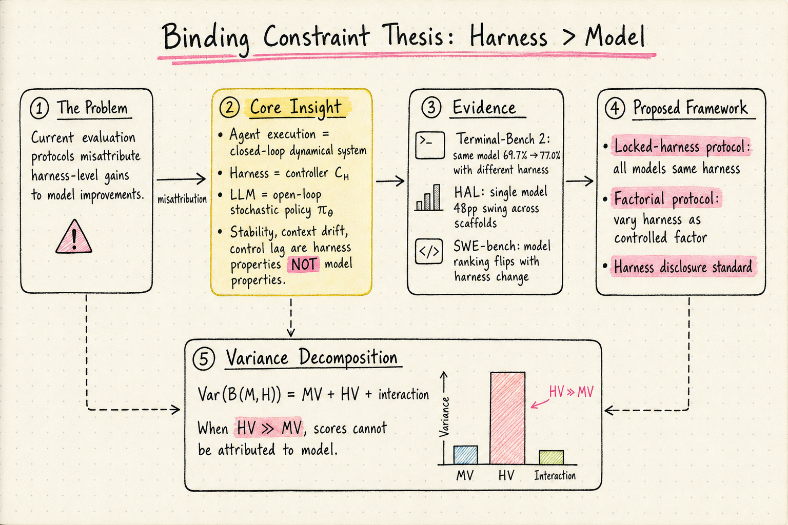
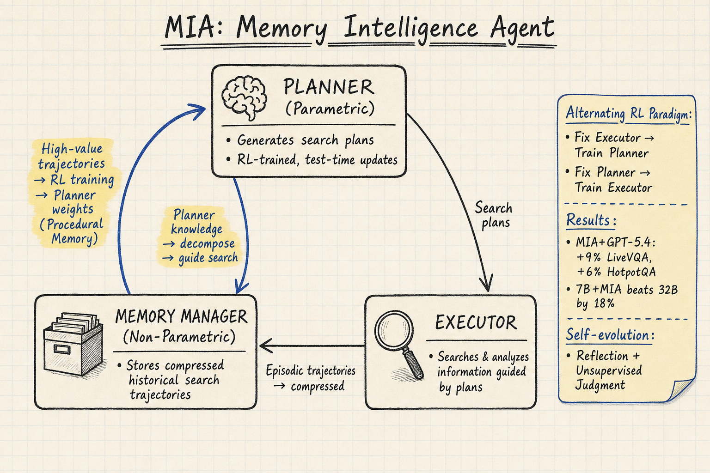
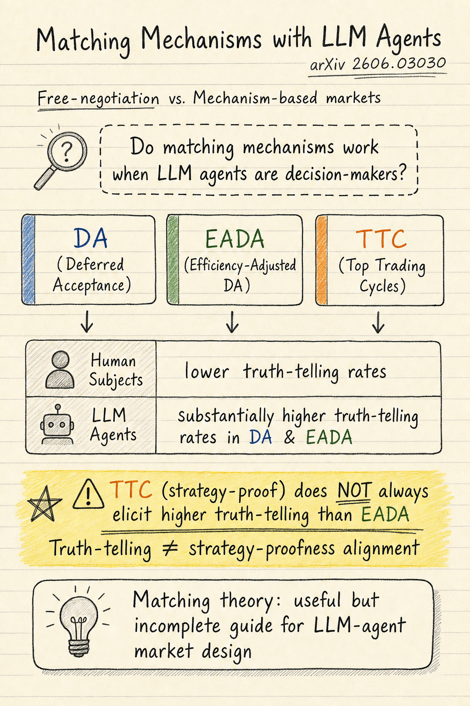

# DailyRead 2026-06-18

## 三個領域今日概覽

### Silicon Sampling / Social Simulation
- **Do Matching Mechanisms Work with LLM Agents?**（2606.03030）：首次系統性檢驗經典配對機制（DA、EADA、TTC）在 LLM agent 市場中的運作。發現 LLM agent 的 truth-telling rate 遠高於人類，且 strategy-proof 機制（TTC）不總是誘發更高的 truth-telling，挑戰了用 LLM 做制度模擬的有效性假設。

### Harness Engineering
- **Stop Comparing LLM Agents Without Disclosing the Harness**（2605.23950）：Position paper，提出 Binding Constraint Thesis——在 frontier model 區間，harness variance 遠大於 model variance。用控制理論形式化 harness 為閉環 controller，引用 Terminal-Bench 2（69.7%→77.0% 同模型換 harness）、HAL（單模型 48pp swing）、SWE-bench（scaffold 替換翻轉排名）等數據。提出 locked-harness 和 factorial 兩種評估協議。
- **A Unified Framework for LLM Agentic Capabilities**（2605.27898）：7 個 benchmark 統一成 instruction–tool–environment 格式，固定 ReAct scaffold，400K+ rollouts，統一效率指標和 failure attribution。工程整合導向，與 2605.23950 的理論挑戰互補。

### Agent Memory
- **MIA: Memory Intelligence Agent**（2604.04503）：Manager-Planner-Executor 三體架構，parametric ↔ non-parametric 雙向記憶轉換，alternating RL 訓練，test-time learning。MIA + GPT-5.4 在 LiveVQA 提升 9%；7B Executor + MIA 超越 32B baseline 18%。Agent memory 領域近期最紮實的工作之一。
- **LMEE-Bench & MemoryExplorer**（2601.10744, CVPR 2026）：首個 embodied memory 基準，統一多目標導航 + 記憶問答。246 物體類別、9000+ 目標、1982 軌跡。MemoryExplorer 用 RL fine-tuning MLLM 做 active memory querying。

---

## 今日推薦點開

1. 🔧 **Stop Comparing LLM Agents Without Disclosing the Harness**（2605.23950）— harness engineering 領域目前最強的理論 position paper。Binding Constraint Thesis 用控制理論把「harness 比模型重要」從實務觀察提升到可分析的形式化框架。Terminal-Bench、HAL、SWE-bench 的 harness variance 數據非常直接。[arXiv](https://arxiv.org/abs/2605.23950)

2. 🧠 **MIA: Memory Intelligence Agent**（2604.04503）— agent memory 領域近期最有意思的架構設計。parametric ↔ non-parametric 雙向轉換、test-time learning、alternating RL——不只是加 RAG，而是認真處理「記憶如何從經驗壓縮成策略」。[arXiv](https://arxiv.org/abs/2604.04503)

3. 🎲 **Do Matching Mechanisms Work with LLM Agents?**（2606.03030）— silicon sampling 領域的新角度：不測「LLM 能否重現人類態度」，而測「LLM agent 能否正確扮演機制設計中的參與者」。結論是有保留的——LLM agent 比「理想理性參與者」更誠實，但不總是遵循理論最適策略。[arXiv](https://arxiv.org/abs/2606.03030)

---

