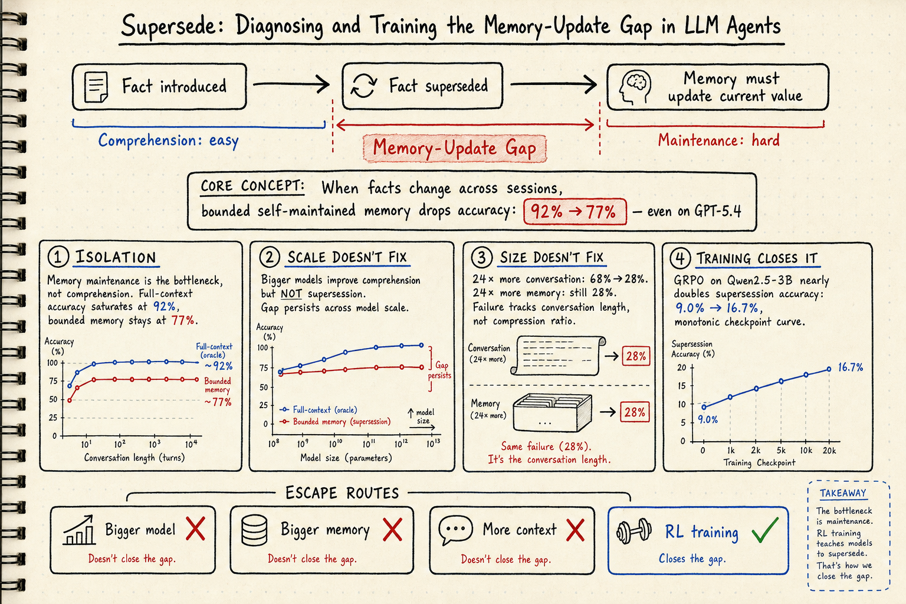
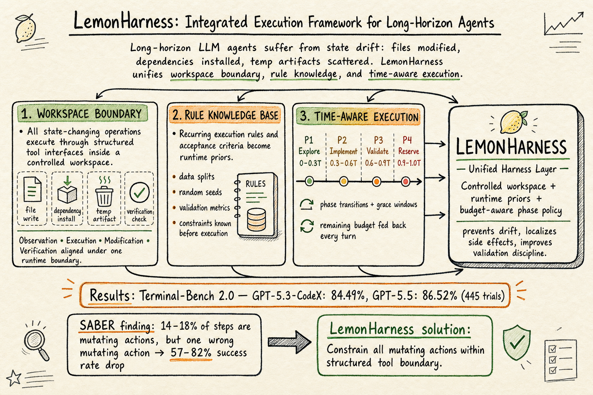

# DailyRead — 2026-07-01

## 三個 Domain 總覽

### Silicon Sampling / Social Simulation
今日無高品質新候選。近期的重要 paper（LLM-Based Social Simulations Require a Boundary、S-Researcher、Silicon Society Cookbook、Mitigating Social Desirability Bias 等）已在先前 DailyRead 中收錄。搜索覆蓋了 arXiv 及 SearXNG（SearXNG 當前不可用，以 web search 替代），未發現過去一週內有足夠深度且未讀的新 paper。

### Harness Engineering
LemonHarness 提出 long-horizon agent 的整合執行框架，把 workspace boundary、rule knowledge base、time-aware execution 三件事一起包進 harness 層，在 Terminal-Bench 2.0 上達到 84.5–86.5%。SkillJuror 首次用控制變因實驗證明 Agent Skill 的組織方式（Progressive Disclosure vs. Flat baseline）會改變 runtime 行為，且效果取決於 task type。

### Agent Memory
Supersede 診斷並訓練了 LLM agent 的「memory-update gap」：bounded memory 在 fact supersession 上的 accuracy 從 92% 掉到 77%，而且這個 gap 不被更大的模型或更大的 memory 修復——只有透過 RL 訓練才能縮小。Transformers Remember First, Forget Last 用認知心理學的 interference paradigm 證明 LLM 的 proactive interference 全面壓過 retroactive interference（d=1.73），和人類記憶完全相反。FORGE 展示 population broadcast 可以讓 self-evolving natural-language memory 在不更新權重的情況下 1.7–7.7× 改善 zero-shot return。

## 🦞 今日推薦點開

### 1. Supersede: Diagnosing and Training the Memory-Update Gap (2606.27472)
記憶更新的關鍵瓶頸不在理解，而在維護——更大的模型和更大的 memory 都修不了，但 RL 訓練可以。這是第一個把 temporal fact-currency 當成 reward signal 的可訓練環境。

### 2. LemonHarness: Integrated Execution Framework for Long-Horizon Agents (2606.24311)
把 workspace boundary、rule knowledge、time-aware execution 三件事統一在一個 harness 層，是 harness engineering 從「抽象概念」走向「工程實作」的重要一步。Terminal-Bench 2.0 上 84.5–86.5% 的結果很紮實。

