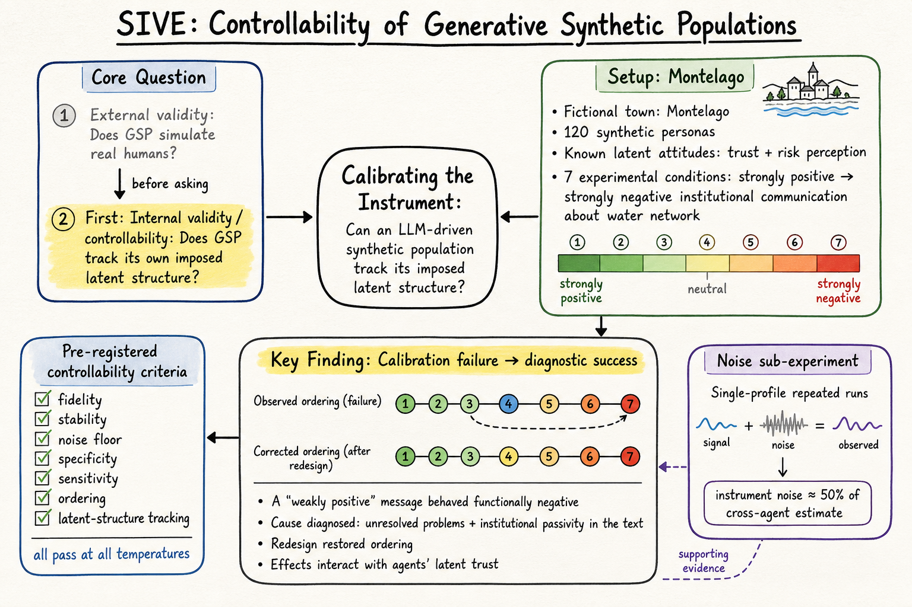
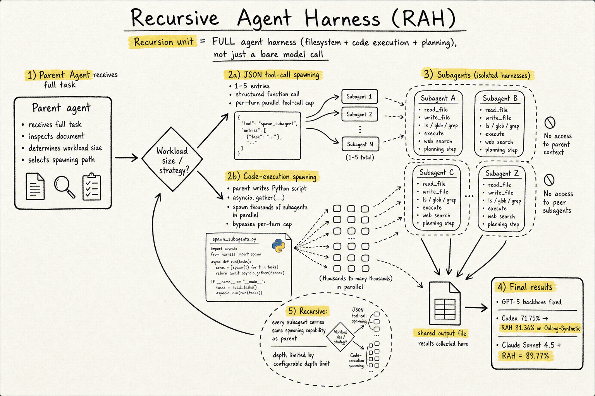
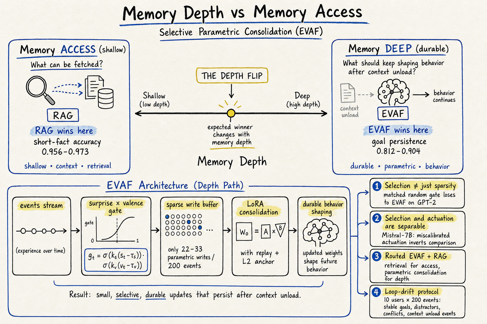

# DailyRead — 2026-07-03

## 三個 Domain 總覽

### Silicon Sampling / Social Simulation
兩篇重點。2607.00910 提出硅合成人口的「可控性」概念——在問 GSP 能不能模擬真人之前，先問它能不能追蹤自己內部施加的潛在結構，用虛構城鎮 Montelago 和七項預註冊準則做儀器校準實驗。2606.30085 把 silicon sampling 從政治態度延伸到文化品味，用三間公司的 LLM 模擬 SPPA 27 萬多人，發現硅樣本有系統性正向偏差、品味關聯結構崩潰、社會空間關聯被扭曲。兩篇加在一起告訴你：硅樣本不是簡單的「好用/不好用」，而是不同面向的忠實度差異很大。另外 2606.30801 用 1120 個 LLM agent 在 X 平台做黑箱審計，展示 GenAI agent 作為演算法稽核工具的新路徑。

### Harness Engineering
2606.13643 正式命名並系統評估 Recursive Agent Harness（RAH）——遞迴單位是完整 agent harness（工具 + 檔案系統 + 規劃）而不是裸 model call。在 GPT-5 backbone 固定下把 Codex baseline 從 71.75% 提到 81.36%，Claude Sonnet 4.5 下達到 89.77%，證明增益來自 harness 而非 model。另外 2606.11435 是一篇 agent skill 評估與演化的 survey，把演化分為四種範式（execution feedback、trajectory distillation、compression/augmentation、RL），分析六類 benchmark 的結構缺口。

### Agent Memory
2606.26806 提出「memory depth vs memory access」的區分： retrieval 解決的是「什麼能被取回」，但沒解決「什麼應該持續影響行為」。在 loop-drift protocol 下，EVAF（surprise × valence gated LoRA consolidation）在 goal persistence 和 post-unload recovery 遠超 RAG，但 shallow factual recall 仍是 RAG 勝——出現「深度翻轉」。選擇閘和驅動強度是可分離的兩個控制因子，Mistral-7B 上的錯誤校正會反轉比較結果。

## 🦞 今日推薦點開

### 1. Calibrating the Instrument: Controllability of an LLM-Driven Synthetic Population (2607.00910)
不是問「GSP 能不能模擬真人」，而是問更基本的問題：「GSP 能不能追蹤自己施加的結構？」——用虛構的 Montelago 城鎮和七項預註冊準則做儀器校準，發現一個設計為「弱正向」的訊息被儀器判讀為功能負向，追蹤到文字中的未解問題和不確定性。這篇把物理學家的儀器校準直覺帶進社會模擬。

### 2. Recursive Agent Harnesses (2606.13643)
命名並評估 RAH 模式：遞迴單位從裸 model call 升級為完整 harness（工具 + 檔案系統 + 規劃），用 code-execution spawning 打破 per-turn tool-call cap。GPT-5 backbone 固定下 Codex 71.75% → 81.36%，增益歸因於 harness。和 Anthropic dynamic workflows 同路線但提供受控評估。

### 3. Memory Depth, Not Memory Access: Selective Parametric Consolidation for Long-Running Language Agents (2606.26806)
RAG 解決「什麼能被取回」，但不解決「什麼應該持續影響行為」。EVAF 用 surprise × valence gate 只寫入行為相關事件到 LoRA，在 goal persistence 和 context-unload recovery 上遠超 RAG，但在 shallow factual recall 不如 RAG——出現「深度翻轉」。選擇和驅動是可分離控制因子。

