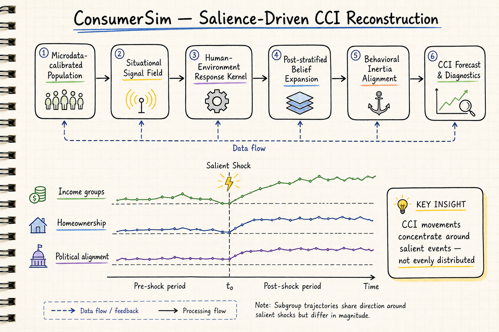
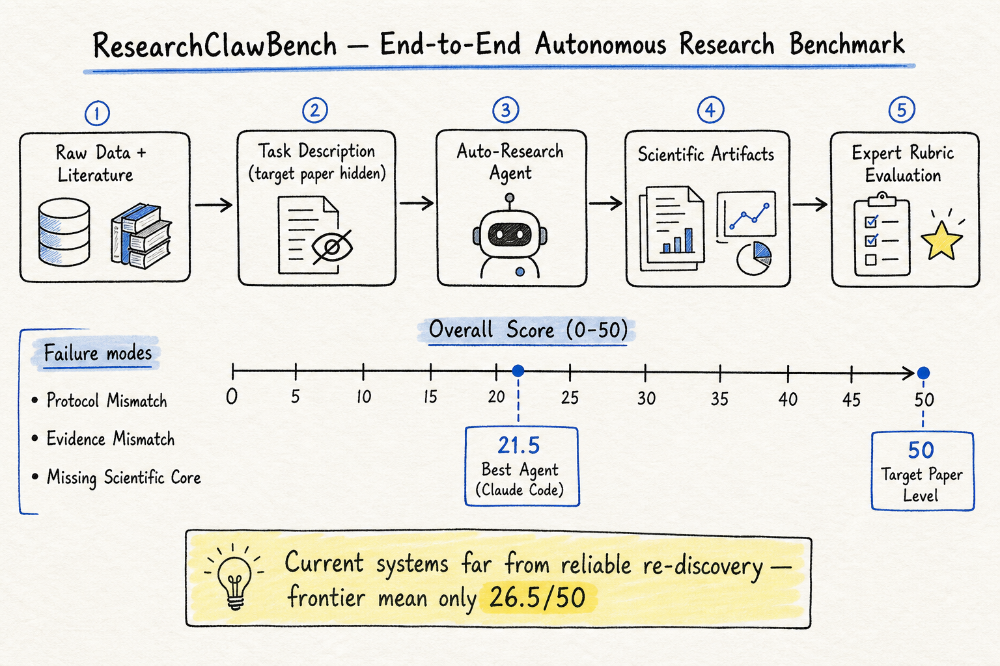
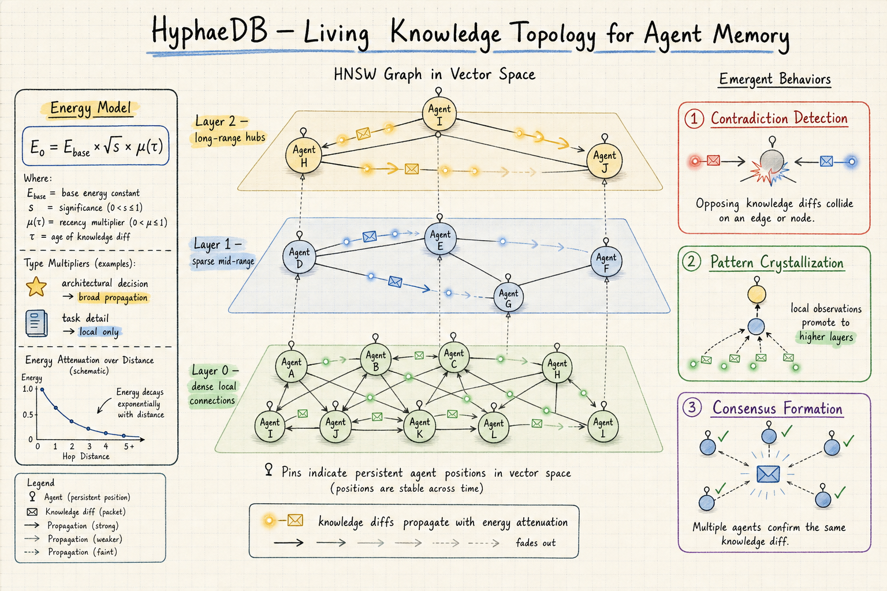

# DailyRead — 2026-07-04

## 三個 Domain 總覽

### Silicon Sampling / Social Simulation
三篇內容。ConsumerSim 把 CCI 從聚合時間序列重建為異質人口對結構化訊號場的反應過程，在美國/EU27/日本三個官方序列上都排第一，且能追蹤子群軌跡和訊號敏感度。「Is Lying an Emergent Behaviour」用永續性遊戲測試 LLM agent 的欺騙湧現，gaslighting 操縱（綠漂作為虛假因果模型）比結果更有意思。Ripple 白皮書設計了精細的 engagement probability model 和 relationship-weighted feeds，但缺乏公開驗證。

### Harness Engineering
ResearchClawBench 是第一個端到端自主科學研究基準：40 個真實論文任務、10 個領域、專家策劃的加權 rubric。最強自主 agent（Claude Code）只有 21.5/50，距離目標論文水平還有一倍多距離。ResearchHarness 讓原生 LLM 也能參與評估。錯誤集中在實驗協議不匹配、證據不匹配、缺失科學核心。

### Agent Memory
HyphaeDB 把 HNSW 從搜尋索引重新詮釋為多 agent 知識傳播的通訊結構——gossip protocol + 能量衰減 + 層級晉升讓知識自動流向需要它的 agent。AdMem 用三合一記憶（semantic/episodic/procedural）+ 雙層架構 + 多 agent（actor/memory/critic）解決程序性記憶的 credit assignment 和線上可擴展性。兩者互補：AdMem 是集中式單 agent 記憶管理，HyphaeDB 是去中心式多 agent 知識流動。

## 🦞 今日推薦點開

### 1. ConsumerSim: Uncovering Salience-Driven Dynamics in Consumer Confidence (2606.30395)
把 CCI 從「一條線」重建為「一群人對一群訊號的反應分布」，在美國/EU27/日本三個官方序列上排第一，高顯著性衝擊窗口優勢最明顯，且子群軌跡和訊號敏感度分析是傳統時間序列做不到的。

### 2. ResearchClawBench: A Benchmark for End-to-End Autonomous Scientific Research (2606.07591)
第一個從原始數據到完整研究成果的端到端自主研究基準。40 個真實論文任務 × 10 領域 × 專家加權 rubric。最強 agent 只拿到 21.5/50——離目標論文水平還很遠，但 rubric 設計為新發現留了空間。

### 3. HyphaeDB: A Living Knowledge Topology for Agent-First Memory (2606.28781)
把 HNSW 從搜尋索引變成通訊結構——agent 是節點，知識透過 gossip + 能量衰減沿語意鄰居傳播，矛盾檢測、模式結晶、共識形成從拓撲中自然湧現。第一個把 navigable small-world graph 用於多 agent 知識傳播的系統。

