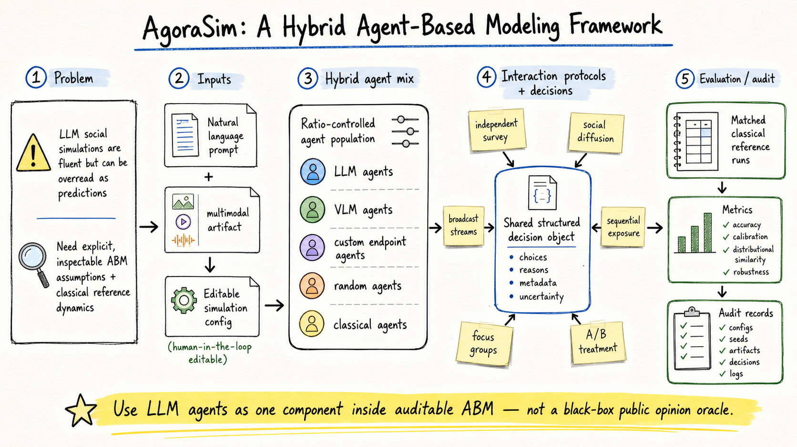
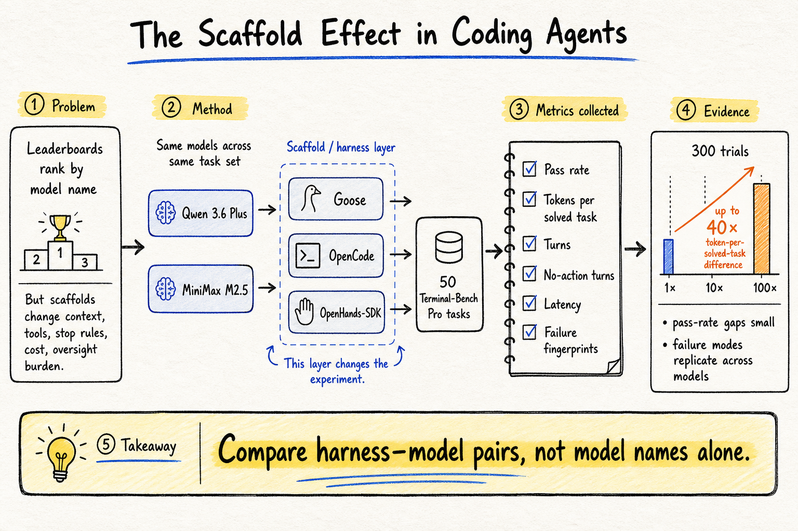
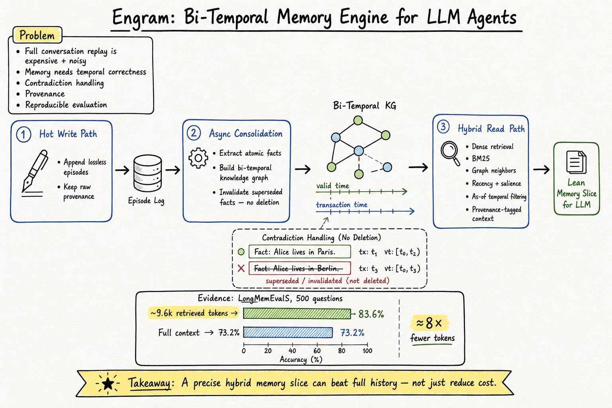

# DailyRead — 2026-07-28

今天三條線的共同主題是：不要只相信 agent / LLM 系統的表面輸出，要把「建模假設、harness 控制層、memory substrate」都攤開來比較。

## 今日推薦點開

### 1. AgoraSim: A Hybrid Agent-Based Modeling Framework

- **Domain**: Silicon Sampling / Social Simulation
- **Link**: https://arxiv.org/abs/2607.05999
- **為什麼點開**: 它把 LLM social simulation 放回可檢查的 ABM 框架：scenario 先轉成 editable configuration，再用 ratio-controlled LLM / VLM / custom / random / classical agents 混合執行，並與 matched classical reference dynamics 比較。這篇的價值不是宣稱 LLM 能準確預測民意，而是讓我們判斷 synthetic social reaction 到底是否只是簡單 diffusion / contagion / bounded-confidence dynamics 也能解釋。
- **對 Morris 的閱讀建議**: 優先看 System Design、Figure 1–3、shared structured decision object 與 classical reference dynamics；這會成為之後判斷 silicon sampling paper 是否有足夠方法論約束的好標準。

### 2. The Scaffold Effect in Coding Agents: Harness Choice as a Hidden Variable in Coding-Agent Evaluation

- **Domain**: Harness Engineering
- **Link**: https://arxiv.org/abs/2607.22585
- **為什麼點開**: 這篇把 coding-agent evaluation 的比較單位從 model name 改成 harness–model pair。固定模型、比較 Goose / OpenCode / OpenHands-SDK 後，作者發現 pass-rate 差距相對小，但 tokens per solved task 可差到 40×，而 failure fingerprints 還會跨模型複現。這對任何 agent leaderboard / local agent workflow 都是重要警訊。
- **對 Morris 的閱讀建議**: 優先看 Standardization Protocol、Metrics、Token Cost per Solved Task、failure category。很適合拿來設計 OpenClaw / Codex 類 agent 的 evaluation logging：不只記 solved，也要記 token cost、latency、no-action turns、failure mode。

### 3. A Bi-Temporal Memory Engine for LLM Agents Where a Lean Retrieved Context Beats the Full History

- **Domain**: Agent Memory
- **Link**: https://arxiv.org/abs/2606.09900
- **為什麼點開**: Engram 的重點不是「memory 比 full context 省」，而是 lean retrieved context 在 LongMemEvalS 上比 full-context baseline 更準：83.6% vs 73.2%，約 8× fewer tokens。它用 bi-temporal facts、provenance、supersession chain、hybrid facts + raw chunks read path，示範 agent memory 應該是可追溯、可處理矛盾、可重現評估的資料系統。
- **對 Morris 的閱讀建議**: 優先看 Figure 1、bi-temporal data model、cheap-then-escalate conflict resolution、LongMemEvalS ablations。這篇對 graph memory / paper memory 的 evaluation discipline 很有參考價值。

## 三個 domain 今日 headline

- **Silicon Sampling / Social Simulation**: AgoraSim 把 LLM agent 當成 ABM 裡可替換、可審計的一種 agent type，重點是和 classical reference dynamics 比較，而不是把 synthetic reaction 當民意預測。
- **Harness Engineering**: 今天兩篇都在拆 attribution problem：coding / pentesting agent 的成績不能只報模型或架構，要先建立 model-matched plain-agent baseline，並記錄 harness 帶來的 cost / latency / failure fingerprint。
- **Agent Memory**: 記憶系統正在從「存更多、檢索更準」走向 temporal correctness、conflict handling、query-time construction、reproducible benchmark；Engram、LazyMem、MOSAIC 分別代表 bi-temporal substrate、lazy query-time construction、structured conflict-aware graph 三條路線。

## 今日收錄

### Silicon Sampling / Social Simulation

- [AgoraSim: A Hybrid Agent-Based Modeling Framework](../silicon-sampling-social-simulation/2026-07-28.md#1-agorasim-a-hybrid-agent-based-modeling-framework)

### Harness Engineering

- [The Scaffold Effect in Coding Agents: Harness Choice as a Hidden Variable in Coding-Agent Evaluation](../harness-engineering/2026-07-28.md#1-the-scaffold-effect-in-coding-agents-harness-choice-as-a-hidden-variable-in-coding-agent-evaluation)
- [Baselines Before Architecture: Evaluating Coding Agents for Autonomous Penetration Testing](../harness-engineering/2026-07-28.md#2-baselines-before-architecture-evaluating-coding-agents-for-autonomous-penetration-testing)

### Agent Memory

- [A Bi-Temporal Memory Engine for LLM Agents Where a Lean Retrieved Context Beats the Full History](../agent-memory/2026-07-28.md#1-a-bi-temporal-memory-engine-for-llm-agents-where-a-lean-retrieved-context-beats-the-full-history)
- [LazyMem: Retrieve Broadly, Construct Selectively for Efficient Long-Term Agent Memory](../agent-memory/2026-07-28.md#2-lazymem-retrieve-broadly-construct-selectively-for-efficient-long-term-agent-memory)
- [Accurate and Efficient Long-Term Memory for LLM Agents (MOSAIC)](../agent-memory/2026-07-28.md#3-accurate-and-efficient-long-term-memory-for-llm-agents-mosaic)
