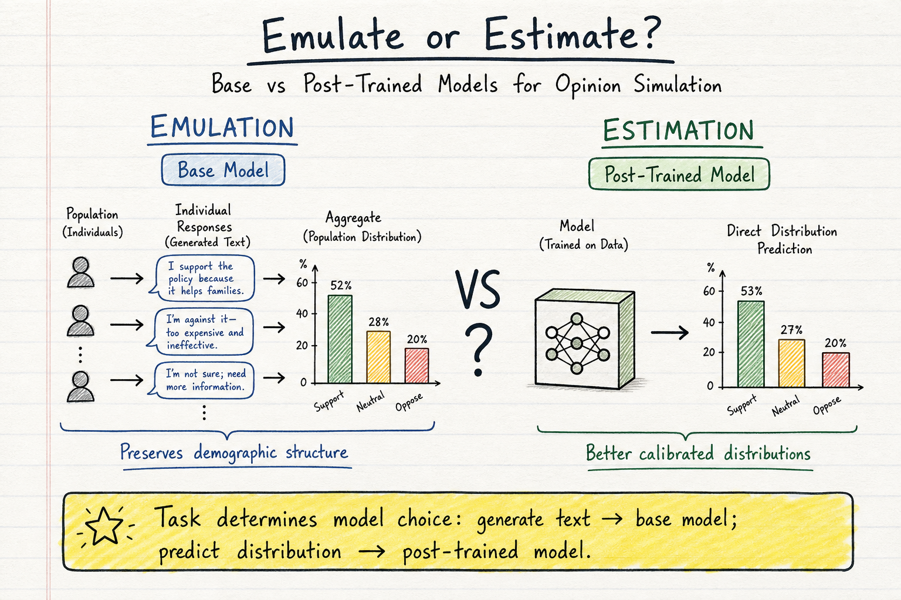
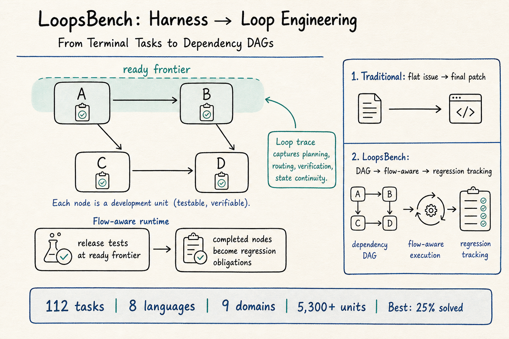
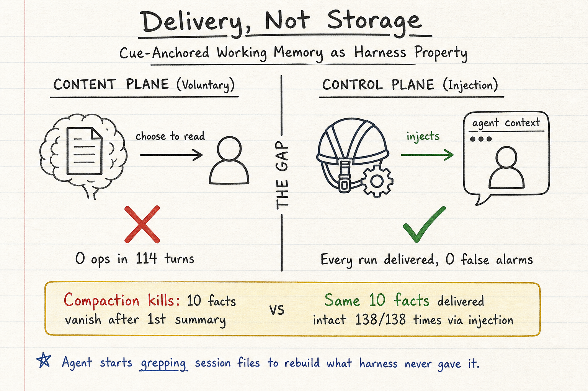

# DailyRead — 2026-08-08

今天三條線的共同主題是：不要只看系統的表面能力，要看支撐能力的基礎設施——是 emulation 還是 estimation、是 loop 還是 harness、是 delivery 還是 storage。

## 今日推薦點開

### 1. Emulate or Estimate? The Divergent Strengths of Base and Post-Trained Language Models for Opinion Simulation

- **Domain**: Silicon Sampling / Social Simulation
- **Link**: https://arxiv.org/abs/2608.03044
- **為什麼點開**: 這篇直接解決了 silicon sampling 領域一個持續的矛盾：為什麼有些研究說 LLM 模擬民意很準，有些說完全不行？答案是它們在做不同的任務——emulation（模擬個體再聚合成分佈）和 estimation（直接預測分佈）。Base model 在 emulation 上更強，post-trained model 在 estimation 上更強。這對之後所有 silicon sampling 實驗的模型選擇都有直接指導意義。
- **對 Morris 的閱讀建議**: 優先看 Section 3 Methodology（open-response evaluation flowchart）、Section 4 Results（demographic sensitivity 分析）、Figure 1–2。

### 2. LoopsBench: From Harness Engineering to Loop Engineering in Coding Agent Evaluation

- **Domain**: Harness Engineering
- **Link**: https://arxiv.org/abs/2608.00267
- **為什麼點開**: 這篇把 coding agent 評估的焦點從 harness（單次任務完成率）轉向 loop（長 horizon 的 dependency tracking、regression obligation、state continuity）。最強配置只解了 25% 的 task，regression events 在所有 loop profile 中都可見。這對理解 coding agent 在真實長期開發中的表現非常重要。
- **對 Morris 的閱讀建議**: 優先看 Figure 1（summary statistics and results）、Table 1（與其他基準的比較）、Section 2（construction pipeline）、Section 5（loop trace analysis）。

### 3. Delivery, Not Storage: Cue-Anchored Working Memory as a Harness Property for Coding Agents

- **Domain**: Agent Memory / Harness Engineering
- **Link**: https://arxiv.org/abs/2607.20972
- **為什麼點開**: 114 turns 中 0 次自願記憶操作——即使 store 已預植任務相關知識。相反，deterministic injection 每次都準確送達，0 false alarm。這篇用嚴謹的實驗證明了 agent memory 的可靠通道是 harness 自動送達，而不是 agent 主動查詢。對所有讓 agent 主動管理記憶的系統設計（MemGPT、A-MEM、Mem0 等）構成直接挑戰。
- **對 Morris 的閱讀建議**: 優先看 Section 2（two-tier design theory）、Section 3（cue-anchored memory model spec）、Section 5（所有實驗結果，特別是 decay probe）。

## 三個 domain 今日 headline

- **Silicon Sampling / Social Simulation**: Emulate or Estimate 區分了兩種 opinion simulation 模式——base model 擅長 emulation，post-trained model 擅長 estimation；MatrAIx 用 83 億 persona 做人口規模模擬用戶評估，但用的是 post-trained models，可能需要考慮 emulation 路線。
- **Harness Engineering**: LoopsBench 把評估單位從 terminal task 轉向 dependency DAG + regression obligation，最強配置只解 25%；Delivery, Not Storage 把記憶送達從 agent choice 轉向 harness property，deterministic injection 全面優於 voluntary lookup。
- **Agent Memory**: 從 Engram 的 bi-temporal 到 ChronoMem 的 version control + semantic rollback，再到 Delivery 的 cue-anchored deterministic injection 和 CoEvo-Mem 的 retrieval-memory co-evolution——agent memory 正在從「存更多、檢索更準」走向「正確送達、正確回滾、共同演化」。

## 今日收錄

### Silicon Sampling / Social Simulation

- [Emulate or Estimate? The Divergent Strengths of Base and Post-Trained Language Models for Opinion Simulation](../silicon-sampling-social-simulation/2026-08-08.md#1-emulate-or-estimate-the-divergent-strengths-of-base-and-post-trained-language-models-for-opinion-simulation)
- [Simulating the World with 8.3 Billion Persona Agents (MatrAIx)](../silicon-sampling-social-simulation/2026-08-08.md#2-simulating-the-world-with-83-billion-persona-agents-matraix)

### Harness Engineering

- [LoopsBench: From Harness Engineering to Loop Engineering in Coding Agent Evaluation](../harness-engineering/2026-08-08.md#1-loopsbench-from-harness-engineering-to-loop-engineering-in-coding-agent-evaluation)
- [Delivery, Not Storage: Cue-Anchored Working Memory as a Harness Property for Coding Agents](../harness-engineering/2026-08-08.md#2-delivery-not-storage-cue-anchored-working-memory-as-a-harness-property-for-coding-agents)

### Agent Memory

- [Delivery, Not Storage: Cue-Anchored Working Memory as a Harness Property for Coding Agents](../agent-memory/2026-08-08.md#1-delivery-not-storage-cue-anchored-working-memory-as-a-harness-property-for-coding-agents)
- [CoEvo-Mem: Co-Evolving Retrieval Policy and Memory Bank for LLM Agents](../agent-memory/2026-08-08.md#2-coevo-mem-co-evolving-retrieval-policy-and-memory-bank-for-llm-agents)
- [ChronoMem: Version Control and Semantic Rollback for LLM Agent Memory](../agent-memory/2026-08-08.md#3-chronomem-version-control-and-semantic-rollback-for-llm-agent-memory)