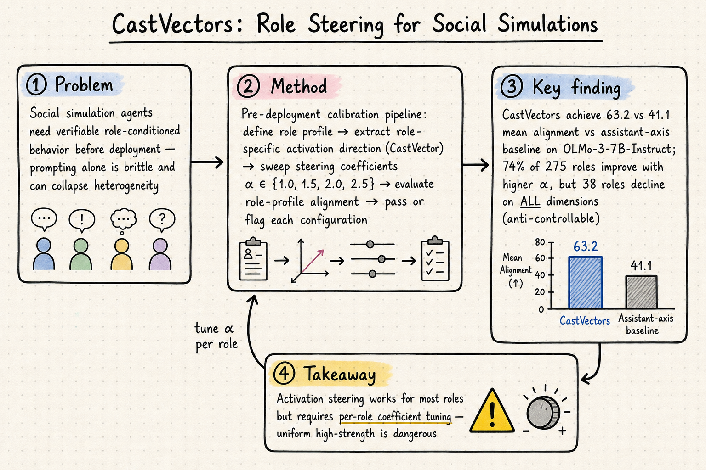
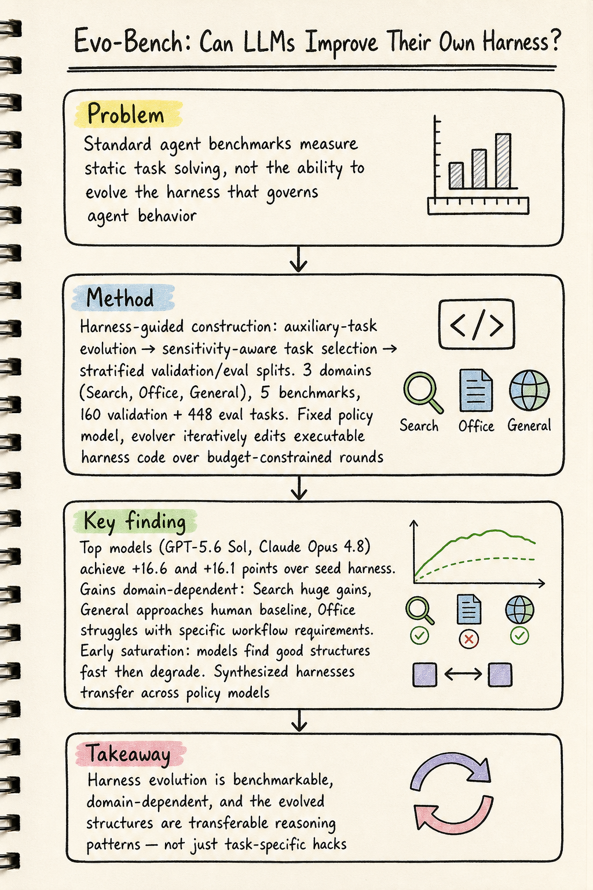
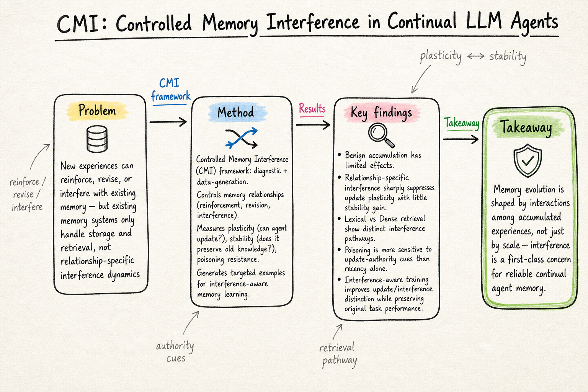

# DailyRead — 2026-08-13

今天的共同主題是「讓隱性結構變顯性」：CastVectors 把角色行為的 steering 變成可量化、可篩選的工程流程；Evo-Bench 把 harness 演化能力從「感覺有進步」變成有嚴格 benchmark 可測的指標；CMI 把 memory interference 從「可能會出問題」變成有 diagnostic framework 可分析的現象。三者都在把之前只能靠直覺判斷的東西，變成有方法論支撐的工程問題。

## 今日推薦點開

### 1. CastVectors: Role Steering of Language Models for Social Simulations

- **Domain**: Silicon Sampling / Social Simulation
- **Link**: https://arxiv.org/abs/2608.00023
- **為什麼點開**: Silicon simulation 的角色行為一直很難校準——prompt-based conditioning 太脆弱、heterogeneity 容易塌縮。CastVectors 用 activation steering 加上 pre-deployment screening，在 275 個角色上實測，發現 74% 角色隨 steering 改善但有 38 個角色反而變差。這是把「模型內部行為校正」帶入 social simulation 的第一步，比純 prompt 方法更可量化也更誠實。
- **對 Morris 的閱讀建議**: 優先看 Section 3（完整 pipeline）、Section 5（per-role failure analysis + anti-controllable 角色分類）、Figure 1（workflow 概覽）。

### 2. Evo-Bench: Can Language Models Improve Agent Harness?

- **Domain**: Harness Engineering
- **Link**: https://arxiv.org/abs/2608.09096
- **為什麼點開**: 這是第一個系統性測量「LLM 能不能自己改進 harness」的 benchmark。GPT-5.6 Sol 達到 +16.6 點增益，接近 human baseline。但 domain 差異巨大：Search 巨增、General 可超越手寫、Office 困難。Early saturation 現象（模型快速找到好結構然後退化）和 harness 的跨 model transferability 都是重要發現。
- **對 Morris 的閱讀建議**: 優先看 Section 3（benchmark construction — harness sensitivity filter）、Section 5（temporal analysis + early saturation + cross-policy transfer）、Table 1（主結果）。

### 3. CMI: Controlled Memory Interference in Continual LLM Agents

- **Domain**: Agent Memory
- **Link**: https://arxiv.org/abs/2608.07622
- **為什麼點開**: Agent memory 從「怎麼存取」轉向「怎麼演化」的關鍵一步。CMI 指出新經驗可以 reinforce、revise、或 interfere 既有記憶，而現有系統只處理 storage 和 retrieval，不管 interference。Lexical 和 Dense retrieval 有不同的干擾路徑，poisoning 對 authority 比 recency 更敏感。Interference-aware training 可以改善 update/interference 區分同時保留原始性能。
- **對 Morris 的閱讀建議**: 優先看 interference pathway 分析（Lexical vs Dense）、interference-aware training 的效果、和與 baseline memory systems 的比較。

## 三個 domain 今日 headline

- **Silicon Sampling / Social Simulation**: CastVectors 用 activation steering 做角色校正，在 275 角色上實測發現 steering 對大多數角色有效但有 38 個 anti-controllable 角色——per-role 係數選擇是必要的，uniform steering 不安全。
- **Harness Engineering**: Evo-Bench 第一個測 LLM harness 演化能力的 benchmark，top models 接近 human baseline 但 domain 差異巨大；PMCoder 把 planning 和 memory 做雙向耦合，在 SWE-bench Verified 上比 baseline 多解 25 cases。
- **Agent Memory**: CMI 把 memory interference 從隱性問題變成可診斷的框架——interference 壓低 plasticity 卻不增加 stability，Lexical/Dense 有不同干擾路徑；MemPrism 用 task-conditioned relational view 動態構建 working memory。

## 今日收錄

### Silicon Sampling / Social Simulation

- [CastVectors: Role Steering of Language Models for Social Simulations](../silicon-sampling-social-simulation/2026-08-13.md#1-castvectors-role-steering-of-language-models-for-social-simulations)

### Harness Engineering

- [Evo-Bench: Can Language Models Improve Agent Harness?](../harness-engineering/2026-08-13.md#1-evo-bench-can-language-models-improve-agent-harness)
- [PMCoder: Coupling Planning with Episodic Memory in LLM Agents for Software Issue Resolution](../harness-engineering/2026-08-13.md#2-pmcoder-coupling-planning-with-episodic-memory-in-llm-agents-for-software-issue-resolution)

### Agent Memory

- [CMI: Controlled Memory Interference in Continual LLM Agents](../agent-memory/2026-08-13.md#1-cmi-controlled-memory-interference-in-continual-llm-agents)
- [MemPrism: Task-Conditioned Relational Memory Views for Long-Horizon Agents](../agent-memory/2026-08-13.md#2-memprism-task-conditioned-relational-memory-views-for-long-horizon-agents)
- [PMCoder (memory 視角)](../agent-memory/2026-08-13.md#3-pmcoder-coupling-planning-with-episodic-memory-in-llm-agents-for-software-issue-resolution)