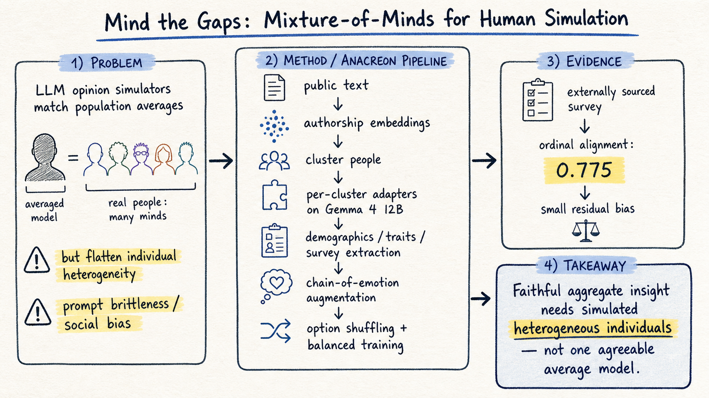

# DailyRead — 2026-08-14

今天的共同主題是「把 agent / simulator 的外部結構做成可評估、可重用的系統」。Silicon sampling 這邊，Anacreon 和 Emulate-or-Estimate 都在提醒我們：人類模擬不能只看平均分布，還要分清楚個體生成與分布估計。Harness engineering 這邊，HarnessOpt-Bench 和 Rethinking Harness Evolution 都在把自動 harness 改進拉回嚴格評估：held-out test、trusted execution、budget matching 缺一不可。Agent memory 這邊，EvoMem 則把 memory 從「存資料」推向「保存可重用策略」。

## 今日推薦點開

### 1. Mind the Gaps: Mixture-of-Minds for Human Simulation

- **Domain**: Silicon Sampling / Social Simulation
- **Link**: https://arxiv.org/abs/2608.06115
- **為什麼點開**: 這篇正面處理 silicon sampling 最麻煩的個體異質性問題。Anacreon 不再讓單一 LLM 靠 persona prompt 模擬所有人，而是用 authorship embedding 分群、per-cluster adapters、chain-of-emotion augmentation、選項 shuffle 與正負平衡來降低 prompt brittleness 和 positive bias。它在外部 survey 上回報 ordinal alignment 0.775，是從 aggregate alignment 走向 individual-level fidelity 的明確訊號。
- **對 Morris 的閱讀建議**: 優先看 Figure 1 pipeline、authorship embedding / clustering、chain-of-emotion augmentation，以及 results 裡 0.775 alignment 的 baseline 與 residual bias 分析。

### 2. HarnessOpt-Bench: Evaluating LLMs at Harness Optimization

- **Domain**: Harness Engineering
- **Link**: https://arxiv.org/abs/2608.06301
- **為什麼點開**: 這篇把 harness optimization 變成一個有 hidden test、trusted execution、budget metering、candidate versioning 的正式 benchmark。它的重點不是「某個 agent 又變強了」，而是建立一個能分辨 optimizer model、coding harness、seed regime 與 stochastic evaluation noise 的 protocol。對任何想做自動改 prompts/tools/control-flow/memory 的 agent workflow 都很有參考價值。
- **對 Morris 的閱讀建議**: 優先看 Figure 1 trusted execution、Section 3 formal setup、budget / normalized gain 定義、Table 1 主結果，以及 search trajectory analysis。

### 3. EvoMem: Memory-Augmented Evolution for Code Optimization

- **Domain**: Agent Memory
- **Link**: https://arxiv.org/abs/2608.10795
- **為什麼點開**: EvoMem 把 memory 做成「成功 mutation 策略的 persistent advice bank」。LLM evolutionary code search 過去每個 run 都重新探索；EvoMem 則在 run 後抽取成功 mutation events、存成有 provenance 的 structured cards，之後依 task / program context 檢索少量 advice 進 mutation prompt。這比一般 RAG memory 更接近 agent workflow improvement 的可操作記憶。
- **對 Morris 的閱讀建議**: 優先看 Section 3.2–3.4 的 extraction、dedup、retrieval 設計，再看 experiments 裡哪些任務有 positive transfer、哪些出現 variability 或 negative transfer。

## 三個 domain 今日 headline

- **Silicon Sampling / Social Simulation**: 最新方向明顯從「人口平均像不像」轉向「個體異質性如何保留」；Anacreon 用 mixture-of-minds 訓練個體群集，Emulate-or-Estimate 則提醒 base model 與 post-trained model 分別適合不同 simulation 任務。
- **Harness Engineering**: HarnessOpt-Bench 和 Rethinking Harness Evolution 形成一正一反的評估框架：自動 harness 優化必須有 held-out partition、budget matching、trusted boundary，否則容易把 test-time search 誤認成可泛化 harness 改進。
- **Agent Memory**: EvoMem 把 memory 從「歷史資料檢索」推向「成功策略重用」；SEEM 則從另一側提醒長期記憶需要事件框架與 provenance expansion，而不只是 chunk retrieval。

## 今日收錄

### Silicon Sampling / Social Simulation

- [Mind the Gaps: Mixture-of-Minds for Human Simulation](../silicon-sampling-social-simulation/2026-08-14.md#1-mind-the-gaps-mixture-of-minds-for-human-simulation)
- [Emulate or Estimate? The Divergent Strengths of Base and Post-Trained Language Models for Opinion Simulation](../silicon-sampling-social-simulation/2026-08-14.md#2-emulate-or-estimate-the-divergent-strengths-of-base-and-post-trained-language-models-for-opinion-simulation)

### Harness Engineering

- [HarnessOpt-Bench: Evaluating LLMs at Harness Optimization](../harness-engineering/2026-08-14.md#1-harnessopt-bench-evaluating-llms-at-harness-optimization)
- [Rethinking the Evaluation of Harness Evolution for Agents](../harness-engineering/2026-08-14.md#2-rethinking-the-evaluation-of-harness-evolution-for-agents)

### Agent Memory

- [EvoMem: Memory-Augmented Evolution for Code Optimization](../agent-memory/2026-08-14.md#1-evomem-memory-augmented-evolution-for-code-optimization)
- [Structured Episodic Event Memory (SEEM) — revisited as a non-duplicate candidate note](../agent-memory/2026-08-14.md#2-structured-episodic-event-memory-seem--revisited-as-a-non-duplicate-candidate-note)
