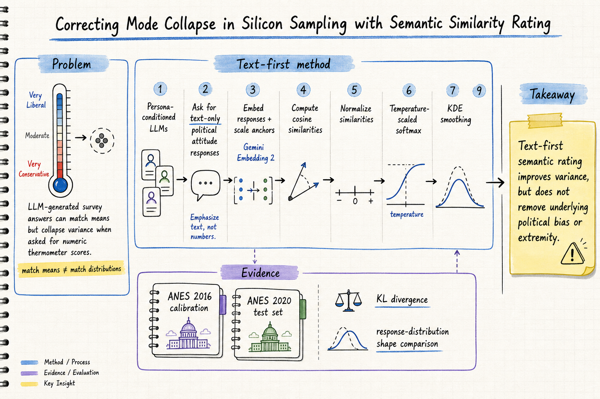
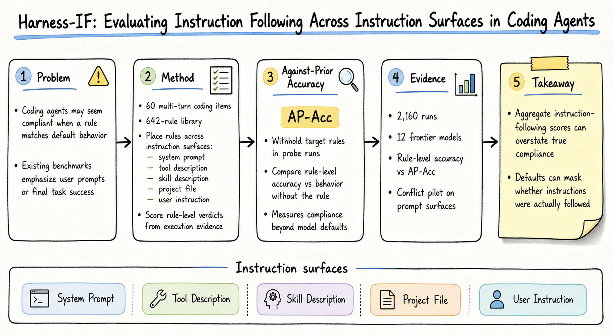
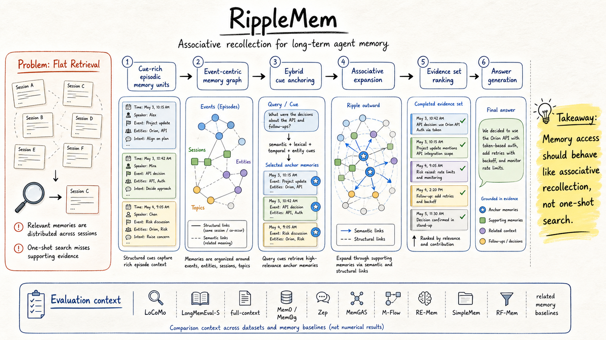

# DailyRead — 2026-08-15

今天三個 domain 都有可讀全文級材料的新候選；已在挑選前用本地 paper memory 查重，今日推薦皆為 `NOT_SEEN`。SearXNG 入口本次連線逾時，已改用 arXiv API 補搜尋並記錄在 log。

## 三個 domain headline

- **Silicon Sampling / Social Simulation**: 今天的重點是 mode collapse 的具體修正：不要讓 LLM 直接吐 survey 數字，而是先生成文字態度，再用 semantic similarity 映射回分布。
- **Harness Engineering**: Harness-IF 把 coding agent 的 instruction-following 拆到不同 instruction surfaces，並用 AP-Acc 檢查 agent 是否真的違反預設行為而遵守規則。
- **Agent Memory**: RippleMem 把 long-term memory retrieval 改寫成 associative recollection：先找 anchor，再沿語意與結構關聯補齊分散證據。

## 今日推薦點開

### 1. Correcting Mode Collapse in Silicon Sampling with Semantic Similarity Rating

- **Domain**: Silicon Sampling / Social Simulation
- **Link**: https://arxiv.org/abs/2607.28550v1
- **推薦理由**: 這篇對準 silicon sampling 最常見的「均值像、分布不像」問題，提出 text-first SSR pipeline。值得看的是它把 mode collapse 拆成輸出介面問題，而不是只靠 prompt 或抽樣溫度補救。

### 2. Harness-IF: Evaluating Instruction Following Across Instruction Surfaces in Coding Agents

- **Domain**: Harness Engineering
- **Link**: https://arxiv.org/abs/2608.11727v1
- **推薦理由**: 這篇很適合拿來改進 agent harness regression test。它不只看 final task success，而是逐條 rule scoring，並用 Against-Prior Accuracy 區分「真的遵守」和「本來就會這樣做」。

### 3. RippleMem: From Isolated Retrieval to Associative Recollection for Long-Term Agent Memory

- **Domain**: Agent Memory
- **Link**: https://arxiv.org/abs/2608.13334v1
- **推薦理由**: 這篇把 agent memory 的 read path 講得很清楚：相關證據常分散在多段 episode 中，因此 retrieval 應該從 isolated search 變成 anchor-based recollection。適合和 transactional / source-supported memory 方向一起看。

## 詳細 domain notes

- [Silicon Sampling / Social Simulation](../silicon-sampling-social-simulation/2026-08-15.md)
- [Harness Engineering](../harness-engineering/2026-08-15.md)
- [Agent Memory](../agent-memory/2026-08-15.md)
