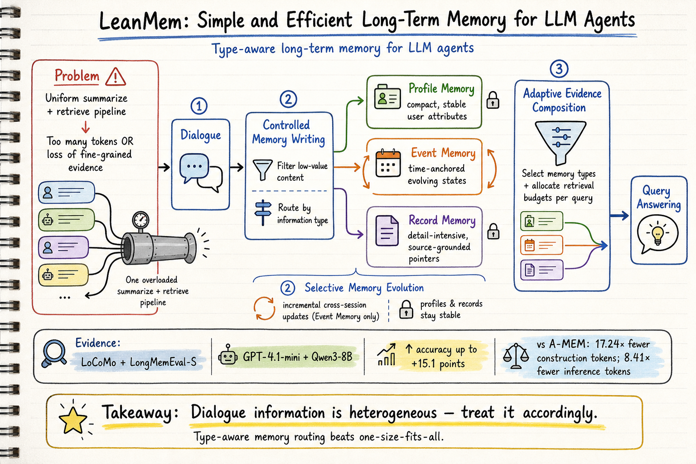
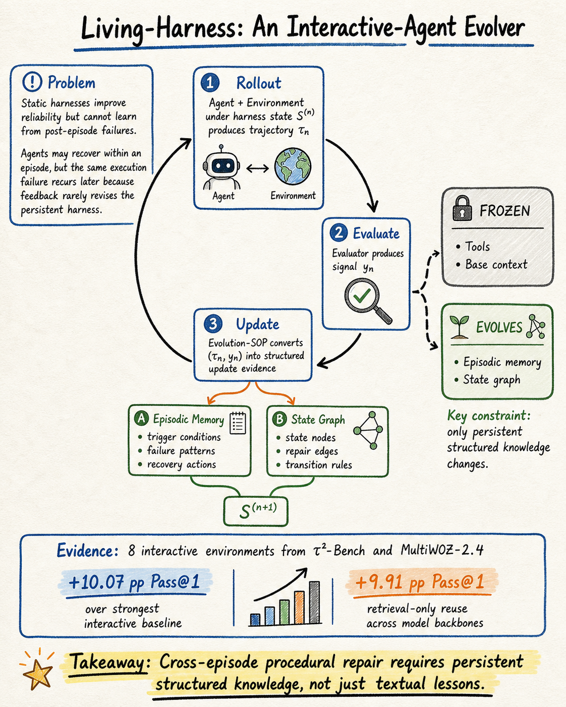
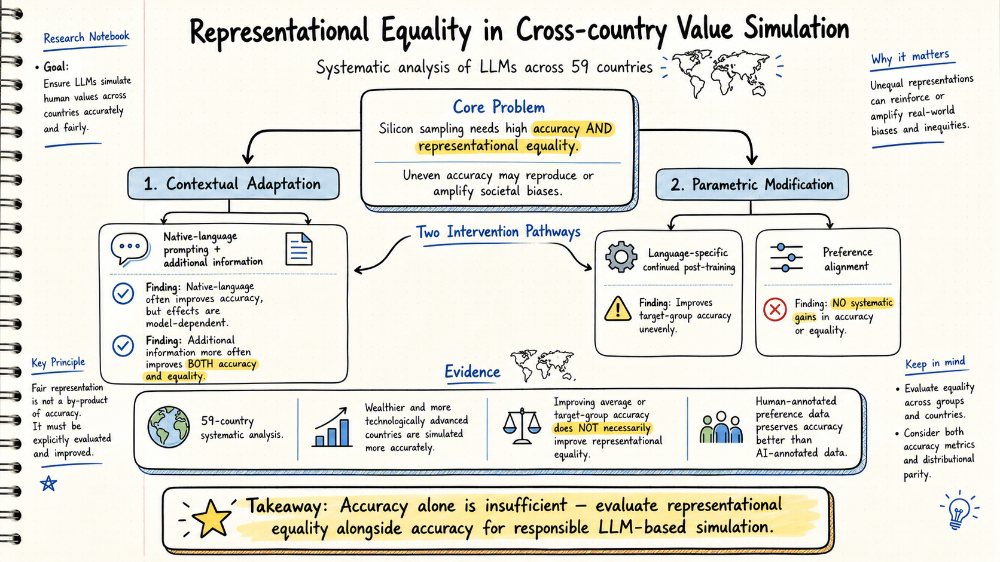

# DailyRead — 2026-08-21

今天 silicon sampling 有一篇重要的代表性平等論文、harness engineering 有一篇 Living-Harness 自演化框架和一篇 MerchantBench 長期一致性基準、agent memory 有一篇 LeanMem 輕量記憶框架和一篇個人化長期互動框架。

## 三個 domain headline

- **Silicon Sampling / Social Simulation**: Representational Equality in Cross-country Value Simulation 正式提出了「代表性平等」概念，系統性分析 59 國的 LLM 價值模擬準確度不平等，發現富裕國家被模擬得更準確，且改善平均準確度不代表改善代表性平等。已獲 Computational Linguistics 接受。
- **Harness Engineering**: Living-Harness 提出 rollout–evaluate–update 框架，把互動軌跡和評估信號轉為持久程序性修復；MerchantBench 引入 365 天電商模擬基準，評估 agent 的長期一致性。
- **Agent Memory**: LeanMem 提出按資訊壓縮性/時序性/忠實度需求分類對話內容的輕量記憶框架，在 LoCoMo 和 LongMemEval-S 上以最低成本達到最高準確度。

## 今日推薦點開

### 1. LeanMem: Simple and Efficient Long-Term Memory for LLM Agents

- **Domain**: Agent Memory
- **Link**: https://arxiv.org/abs/2608.03463
- **推薦理由**: LeanMem 對 agent memory 做了一個很基本但一直被忽略的觀察 — 對話內容的壓縮性、時序性和忠實度需求不同，不應該用統一 pipeline 處理。三型記憶（profile / event / record）加上 adaptive evidence composition，讓它在 LoCoMo 和 LongMemEval-S 上以最低建構成本和推理 token 達到最強基線之上 15.1 分的改進。這篇和 MEM1（8/20 推薦）形成有趣的對比：MEM1 用 RL 內化記憶，LeanMem 用外部結構化記憶但更精細地分類和檢索。

### 2. Living-Harness: An Interactive-Agent Evolver

- **Domain**: Harness Engineering
- **Link**: https://arxiv.org/abs/2607.26598
- **推薦理由**: 這篇直接處理 harness engineering 的核心問題 — 靜態 harness 在部署後無法從失敗中學習。Living-Harness 把每個完成軌跡和評估信號轉成 episodic memory + state graph 的持久程序性修復，同時凍結 tools 和 base context 避免累積損壞。在 τ²-Bench 和 MultiWOZ-2.4 衍生的八個環境上，比最強互動基線提升 10+ 百分點。和 Evo-Bench（8/13 推薦）形成互補：Evo-Bench 測 harness evolution 能力，Living-Harness 提出具體 evolution 機制。

### 3. Representational Equality in Cross-country Value Simulation

- **Domain**: Silicon Sampling / Social Simulation
- **Link**: https://arxiv.org/abs/2608.08058
- **推薦理由**: 這篇把 silicon sampling 的公平性問題從「平均準確度」拉到「代表性平等」的層次。系統性分析 59 國的 LLM 價值模擬，發現富裕和技術先進國家的模擬準確度系統性更高。兩條干預路徑（contextual adaptation 和 parametric modification）都無法保證改善代表性平等，即使平均準確度提升。這對 silicon sampling 社群的「只要平均準確度夠高就好」假設是一個重要修正。

## 詳細 domain notes

- [Silicon Sampling / Social Simulation](../silicon-sampling-social-simulation/2026-08-21.md)
- [Harness Engineering](../harness-engineering/2026-08-21.md)
- [Agent Memory](../agent-memory/2026-08-21.md)